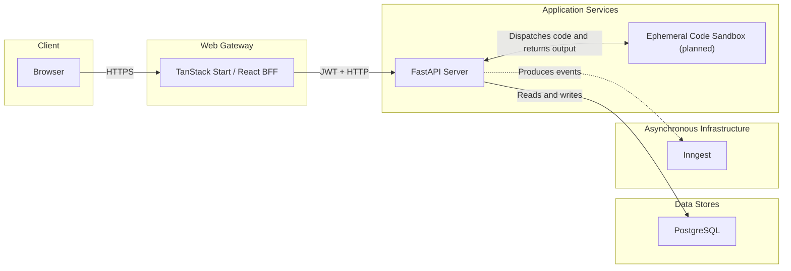

# Shifu Architecture and Technology Stack

This document describes Shifu's architecture and technology decisions. Package
manifests and lockfiles remain the source of truth for exact dependency versions.

## System overview

```text
Browser
   ↓
Web — TanStack Start / React
   ├── UI and routing
   ├── authentication and BFF
   ├── server-state cache
   ├── skill graph
   └── Mentor streaming over SSE
   │
   │ HTTPS + JWT
   ↓
Server — FastAPI
   ├── Identity
   ├── Curriculum
   ├── Learning
   ├── Intelligence
   │   ├── agentic workflows with Agno
   │   └── classical NLP
   ├── Gamification
   └── Shared
       ├── PostgreSQL
       ├── Inngest
       └── isolated code execution
```

The browser communicates with the TanStack Start application. The TanStack Start server
will act as a backend for frontend (BFF) for authentication and operations that should
not expose API details to the browser. The BFF will call FastAPI with a JWT verifiable
through JWKS. FastAPI will enforce authorization and domain rules inside the modules
that own them.

### System architecture diagram



Solid edges represent synchronous request, persistence, and sandbox execution paths.
Dotted edges represent asynchronous boundaries. The sandbox is shown as planned
infrastructure and is not currently provided by Docker Compose.

## Repository organization

```text
shifu/
├── apps/
│   ├── web/
│   │   ├── package.json
│   │   ├── pnpm-lock.yaml
│   │   └── src/
│   └── server/
│       ├── pyproject.toml
│       ├── uv.lock
│       └── src/
│           ├── main.py
│           └── shifu/
│               ├── composition/
│               ├── shared/
│               ├── identity/
│               ├── curriculum/
│               ├── learning/
│               ├── intelligence/
│               └── gamification/
├── packages/
└── documentation/
    ├── architecture.md
    ├── modules.md
    └── rules/
```

Each application owns its environment and dependency management:

- `apps/web` uses Node.js, pnpm, `package.json`, and `pnpm-lock.yaml`;
- `apps/server` uses Python, uv, `pyproject.toml`, `uv.lock`, and a local `.venv`;
- installed dependencies, virtual environments, caches, and build artifacts are not
  versioned;
- lockfiles are versioned to make installations reproducible;
- `packages` is reserved for independently reusable packages with explicit public APIs.

## Web application

### Current stack

| Area | Technology |
|---|---|
| Language | TypeScript 6 |
| UI | React 19 |
| Framework | TanStack Start |
| Routing | TanStack Router |
| Runtime | Node.js 24 |
| Package manager | pnpm |
| Styling | Tailwind CSS 4 |
| Validation | Zod 4 |
| HTTP client | Axios |
| Icons | Lucide React |
| Linting and formatting | Biome |
| Type checking | `tsc --noEmit` |

### Application capabilities

| Area | Technology or decision |
|---|---|
| UI primitives | shadcn/ui |
| Server state and cache | TanStack Query |
| Forms | TanStack Form |
| Authentication | Better Auth in TanStack Start |
| Skill graph | React Flow |
| Automatic graph layout | ELK.js |
| Code editor | Monaco Editor or CodeMirror; decision pending |
| Mentor streaming | Server-Sent Events (SSE) |
| Unit tests | Vitest |
| Component tests | React Testing Library |
| End-to-end tests | Playwright |
| Quality analysis | SonarQube project `Shifu Web` |

### Responsibilities

The web application owns presentation, accessibility, navigation, and interaction
state. It consumes remote data through explicit contracts. Business rules and official
learning decisions do not belong in routes, components, pages, or browser-side hooks.

The BFF owns the authentication session, protects credentials, and translates the
authenticated identity into the token accepted by FastAPI. It does not replace API
authorization and does not take ownership of business-module rules.

### Web application composition

The application is composed from the outside in:

```text
src/router.tsx
   ↓ registers
generated route tree
   ↓ selects
src/routes/__root.tsx
   ↓ renders
RootLayout
   ├── document head and scripts
   └── RestContextProvider
       └── AppLayout
           └── active route page
```

- `src/router.tsx` creates the TanStack Router from generated route metadata and owns
  router-wide behavior such as scroll restoration and preload defaults.
- `src/routes/__root.tsx` owns document metadata, global styles, and selection of the
  root shell. It must not contain feature behavior.
- `RootLayout` owns document-level composition and provider ordering.
- `RestContextProvider` creates stable REST dependencies at the application boundary.
- `AppLayout` owns the shared application shell and renders the active route content.
- Feature routes select pages and translate route state into page props.

Providers are composed at the narrowest common boundary that needs them. A provider
must expose application semantics through a typed context instead of leaking a
third-party client throughout the component tree.

### Web layers and dependency direction

```text
Routes
  ↓
Feature UI
  ↓
Shared application hooks and contexts
  ↓
REST services and mappers
  ↓
REST client
  ↓
FastAPI

Core contracts ← implemented by adapters and consumed by upper layers
```

#### Routes — `src/routes`

Routes are thin application adapters. They may:

- declare TanStack Router paths and route metadata;
- validate path and search parameters;
- apply authentication or authorization middleware;
- read route state and pass it to a page;
- translate page callbacks into navigation.

Routes must not own reusable UI, business rules, remote-data orchestration, or complex
interaction state. Canonical internal paths belong in `src/constants/routes.ts`.
Generated route metadata is not edited manually.

#### Feature UI — `src/ui/<module>`

Feature-owned UI is grouped by the business module that owns the experience:

```text
src/ui/<module>/
├── hooks/
└── widgets/
    ├── components/
    ├── layouts/
    └── pages/
```

Pages compose a feature experience. Components render focused pieces of that
experience. Layouts own reusable composition within the feature. Stateful widgets
keep their interaction behavior in a colocated `use-<widget>.ts` hook so rendering and
behavior remain separately understandable and testable.

Feature UI may depend on its own module contracts and `ui/shared`. It must not import
another module's internal widget, adapter, or implementation detail. Cross-module
interaction happens through explicit shared contracts, identifiers, or application
composition.

#### Shared UI and application composition — `src/ui/shared`

Shared UI contains application-wide elements rather than business behavior:

- `contexts` composes dependencies and exposes typed application services;
- `hooks` provides stable access to contexts and reusable application semantics;
- `styles` owns global styles and theme integration;
- `widgets/components` contains reusable application components;
- `widgets/layouts` contains application shells and shared layouts.

Shared UI must not become a home for module-specific rules. A component is shared only
when it has a stable, module-neutral responsibility.

#### Core contracts — `src/core`

Core contracts describe stable interfaces and response structures used by the web
application. They remain independent of React, TanStack Router, Axios, and visual
components. Infrastructure adapters implement these contracts; UI code consumes the
contracts without depending on adapter details.

As reusable business contracts grow, they may move into dedicated packages under
`packages`, provided that the package has a clear owner and public API.

#### REST adapters — `src/rest`

The REST layer converts application operations into HTTP calls:

```text
src/rest/
├── axios/       shared transport implementation
├── errors/      normalized transport failures
├── mappers/     API JSON to application structures
└── services/    module-oriented API operations
```

`AxiosRestClient` is the transport adapter. Module services receive a REST client as a
dependency and expose operations in application language. Mappers keep wire formats
from leaking into UI state. HTTP status handling and transport-error normalization stay
inside this boundary.

The UI must not instantiate Axios clients directly. Composition creates adapters and
services once, then exposes them through typed contexts.

#### Constants and environment boundaries — `src/constants`

Route paths, browser-safe environment values, and other stable application constants
live under `src/constants`. Environment values are validated when they enter the
application. Secrets and server-only configuration must never be exposed through
browser environment variables.

### Expected feature flow

```text
Route
  → Page widget
  → Colocated widget hook
  → Query or action hook
  → Module service from context
  → REST client
  → FastAPI endpoint
```

Read hooks return remote state through TanStack Query. Action hooks execute mutations
and invalidate the smallest stable query-key prefix affected by the change. Widgets
handle presentation and user feedback; adapters handle transport; FastAPI and the
owning domain module make authoritative business decisions.

## Server application

### Current stack

| Area | Technology |
|---|---|
| Language | Python 3.13 |
| HTTP framework | FastAPI |
| Project management | uv |
| HTTP validation and schemas | Pydantic v2 |
| API contract | OpenAPI generated by FastAPI |

### Application capabilities

| Area | Technology or decision |
|---|---|
| Database | PostgreSQL |
| ORM | SQLAlchemy 2 |
| Migrations | Alembic |
| PostgreSQL driver | psycopg 3 |
| BFF-to-API authentication | JWT validated through JWKS |
| Authorization | FastAPI and domain rules |
| Asynchronous processing | Inngest |
| Agentic workflows | Agno |
| Classical NLP | NLTK |
| Text representation and search | TF-IDF with scikit-learn |
| Text similarity | Cosine similarity |
| Intent classification | Logistic Regression or SVM |
| Activity execution | Isolated Python sandbox |
| Tests | pytest |
| Route tests | FastAPI `TestClient` |
| Infrastructure tests | Testcontainers |
| Coverage | pytest-cov |
| Linting and formatting | Ruff |
| Type checking | Pyright |
| Quality analysis | SonarQube project `Shifu API` |

### Server composition and layers

`src/main.py` exposes the application created in `shifu.app`. The composition layer
registers every module router. Each module may evolve through the following layers:

```text
<module>/
├── core/
│   ├── domain/
│   │   ├── entities/
│   │   ├── structures/
│   │   ├── errors/
│   │   └── events/
│   ├── interfaces/
│   └── use_cases/
├── rest/
│   ├── controllers/
│   ├── schemas/
│   └── router.py
├── database/
│   └── sqlalchemy/
│       ├── models/
│       ├── mappers/
│       └── repositories/
├── messaging/
│   ├── brokers/
│   └── jobs/
└── providers/
```

The module core does not depend on FastAPI, SQLAlchemy, Inngest, or other adapters.
Controllers translate HTTP transport into use-case calls. Repositories, brokers, and
providers implement interfaces defined by the core or by explicit shared contracts.

### Agentic workflow composition

Agno is the orchestration framework for generative AI workflows owned by Intelligence.
Its `Agent`, `Team`, and `Workflow` primitives are infrastructure details behind typed
core protocols:

```text
FastAPI controller or Inngest job
  ↓
Intelligence use case
  ↓ workflow protocol
Agno workflow adapter
  ├── Agent — model, instructions, and bounded tools
  ├── Team — coordinated specialist agents when collaboration is required
  └── Workflow — explicit, repeatable sequencing and branching
  ↓ validated output
Intelligence use case
  ↓
Owning module validates and applies any state change
```

Agno implementations live under
`apps/server/src/shifu/intelligence/ai/generative/agno`. Agents receive only the
minimum authorized context and tools required for the workflow. Tools expose typed
application operations; they do not provide direct access to SQLAlchemy, credentials,
another module's private repository, or unrestricted code execution.

Agno may orchestrate prompting, tool use, specialist agents, review loops, and
structured output. It does not own authorization, business transitions, persistence
policy, official Learning results, Curriculum content, or Gamification state. Every
machine-consumed result is validated through Pydantic or a domain DTO before it crosses
the workflow boundary.

FastAPI invokes workflows that must participate in the current request or SSE stream.
Inngest invokes durable, retryable, or long-running workflows. Model providers,
credentials, quotas, timeouts, retry limits, and token limits remain provider
configuration rather than agent-selected values.

## Module boundaries

Modules are business boundaries, not only directories. Each module owns its rules,
use cases, persistence, endpoints, and user experience.

- **Identity**: account, access, session, basic profile, status, and time zone.
- **Curriculum**: official content, skills, competencies, materials, activities, and
  evaluation rules.
- **Learning**: objectives, diagnostics, attempts, evaluations, progress, mastery,
  recommendations, and individual history.
- **Gamification**: XP, level, streak, calendar, achievements, and rewards.
- **Intelligence**: Mentor and Goal Planner, without authority to change official
  Learning or Gamification state.
- **Shared**: reusable technical infrastructure without business rules.

Modules exchange identifiers, explicit contracts, and business events. A module must
not import another module's internal entities, database models, repositories, or
implementation details.

### Business dependencies

```text
Identity ───────→ Learning
    ├───────────→ Intelligence
    └───────────→ Gamification

Curriculum ─────→ Learning
    └───────────→ Intelligence

Learning ───────→ Intelligence
    └───────────→ Gamification

Gamification ───→ Intelligence
Intelligence ───→ Learning
```

The arrows represent identity, content, context, proposals, or confirmed facts. They
do not transfer authority between modules. `documentation/modules.md` defines the
complete ownership and dependency model.

## Synchronous and asynchronous processing

Operations that require an immediate response remain in FastAPI's HTTP flow. Inngest
will handle work that can happen after the response, including:

- sending email;
- scheduled tasks;
- NLP data reindexing;
- secondary or long-running processing;
- asynchronous effects between modules.

Jobs receive stable events or contracts. They do not access another module's internal
details and must be idempotent when execution can be retried.

## Code execution

FastAPI will orchestrate programming activities but will never execute user-submitted
code inside the API process.

```text
Web
 ↓
FastAPI
 ↓
Execution orchestrator
 ↓
Ephemeral sandbox
├── Python
├── timeout
├── limited CPU
├── limited memory
├── isolated filesystem
└── blocked network
```

The application distinguishes two flows with different effects:

```text
Run
├── executes the code
├── returns stdout and stderr
└── does not change progress

Submit
├── runs official tests
├── produces an official evaluation
├── updates Learning state
└── may emit confirmed facts for Gamification
```

The sandbox must be disposable and unable to access secrets, the database, the host
filesystem, or the network. Time, CPU, memory, and output-size limits must be enforced
outside the process that executes user code.

## Quality

```text
Web
├── Biome
├── TypeScript / tsc
├── Vitest
├── React Testing Library
├── Playwright
└── SonarQube / Shifu Web

Server
├── Ruff
├── Pyright
├── pytest
├── FastAPI TestClient
├── Testcontainers
├── pytest-cov
└── SonarQube / Shifu API
```

A single SonarQube instance may host `Shifu Web` and `Shifu API` while keeping their
analysis and quality gates independent.

## Pending decisions

- choose Monaco Editor or CodeMirror for coding activities;
- select the concrete sandbox technology and isolation infrastructure;
- define Inngest event contracts and idempotency strategy;
- define PostgreSQL persistence, migration, and connection lifecycle conventions;
- define JWT/JWKS issuance, audience, expiration, and key rotation;
- define operational limits for SSE, AI usage, and code execution.
