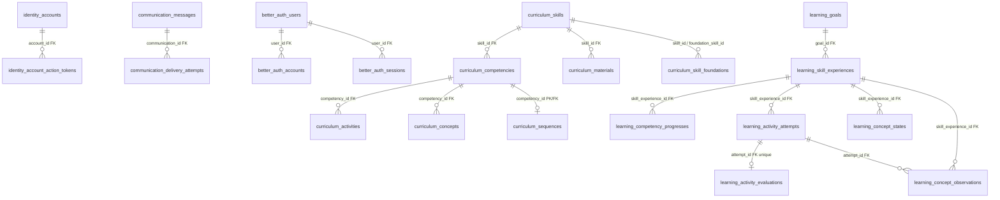

# Modelagem do Banco de Dados

## Visão Geral

O schema persistido do Shifu é definido pelos models SQLAlchemy em
`apps/server/src/shifu/**/database/sqlalchemy/models/` e pelas migrations em
`apps/server/migrations/versions/`. O banco relacional é PostgreSQL.

- Os IDs de domínio são, em geral, `string(26)`. Better Auth usa texto sem tamanho
  fixo; IDs de execução diagnóstica e chaves de submissão usam `string(36)`.
- `Model` é somente a base declarativa do SQLAlchemy. Não adiciona colunas
  automaticamente: cada model declara seus timestamps e demais campos.
- Muitos vínculos entre módulos são IDs sem `ForeignKey` física, para preservar
  as fronteiras de ownership.
- `identity_accounts` e `better_auth_users` têm papéis diferentes e não possuem
  FK entre si: Identity persiste a conta de domínio; Better Auth, usuários e
  sessões da autenticação web.
- Há persistência para Identity, Communication, Curriculum, Learning,
  Intelligence (sessões do Goal Planner) e Shared. Gamification não tem model
  SQLAlchemy persistido no código atual.
- Campos JSON guardam estruturas e listas, inclusive referências a IDs que não
  têm necessariamente integridade referencial no banco.

## Diagrama ER

O diagrama mostra as FKs físicas. IDs escalares sem FK e listas de IDs em JSON
estão descritos como relações lógicas nas seções seguintes.

## Descrição das Tabelas

### Identity

#### `identity_accounts`

Conta de domínio do produto. O e-mail é único entre contas não removidas por um
índice parcial (`deleted_at IS NULL`), permitindo preservar contas removidas.

| Campo | Tipo | Descrição |
|---|---|---|
| `id` | string(26) | Chave primária |
| `display_name` | string(160) | Nome exibido |
| `email` | string(320) | E-mail da conta |
| `password_hash` | string(255) | Hash de senha |
| `status` | string(40) | Estado da conta |
| `access_version` | integer | Versão para invalidar acessos/sessões |
| `time_zone` | string(64) \| null | Fuso horário |
| `created_at`, `updated_at` | timestamp com fuso | Criação e atualização |
| `confirmed_at`, `deleted_at` | timestamp com fuso \| null | Confirmação e remoção lógica |
| `deletion_reason` | string(64) \| null | Motivo da remoção |

#### `identity_account_action_tokens`

Tokens de confirmação e recuperação. `token_hash` é único; um índice parcial
cobre `pending_handle_hash` quando não nulo. `communication_id` é uma referência
lógica para Communication, sem FK entre módulos.

| Campo | Tipo | Descrição |
|---|---|---|
| `id` | string(26) | Chave primária |
| `account_id` | string(26) | FK para `identity_accounts.id`, cascade delete |
| `type`, `status` | string(40) | Tipo e estado do token |
| `token_hash` | string(255) | Hash único |
| `issued_at`, `expires_at`, `updated_at` | timestamp com fuso | Emissão, expiração e atualização |
| `used_at`, `invalidated_at` | timestamp com fuso \| null | Uso/invalidação |
| `communication_id` | string(26) | ID lógico da mensagem relacionada |
| `pending_handle_hash` | string(64) \| null | Hash temporário do fluxo pendente |
| `delivery_status` | string(40) \| null | Estado de entrega conhecido |

### Communication

#### `communication_messages`

Fila durável de mensagens transacionais. Destinatário, conta, conteúdo e dados do
provedor podem ser apagados durante a redação de dados pessoais. `idempotency_key`
é único; há índice parcial único por `identity_confirmation_id` e índice por
estado/próxima tentativa.

| Campo | Tipo | Descrição |
|---|---|---|
| `id` | string(26) | Chave primária |
| `account_id` | string(26) \| null | ID lógico de Identity |
| `type`, `channel`, `status` | string | Tipo, canal e estado |
| `recipient_email` | string(320) \| null | E-mail destinatário |
| `recipient_name` | string(160) \| null | Nome destinatário |
| `content`, `encrypted_content` | JSON \| null | Conteúdo simples ou envelope criptografado |
| `idempotency_key` | string(255) | Chave única |
| `created_at`, `updated_at` | timestamp com fuso | Criação e atualização |
| `sent_at`, `failed_at`, `next_attempt_at` | timestamp com fuso \| null | Datas de envio, falha e nova tentativa |
| `failure_code` | string(120) \| null | Código de falha |
| `provider_message_id` | string(255) \| null | ID retornado pelo provedor |
| `attempt_count` | integer | Número de tentativas |
| `identity_confirmation_id` | string(26) \| null | ID lógico do token em Identity |
| `redacted_at` | timestamp com fuso \| null | Momento da redação |

#### `communication_delivery_attempts`

Histórico de tentativas. Há FK com cascade para a mensagem e unicidade em
(`communication_id`, `attempt_number`).

| Campo | Tipo | Descrição |
|---|---|---|
| `id` | string(26) | Chave primária |
| `communication_id` | string(26) | FK para `communication_messages.id` |
| `attempt_number` | integer | Número da tentativa |
| `status` | string(40) | Resultado |
| `attempted_at` | timestamp com fuso | Início |
| `completed_at` | timestamp com fuso \| null | Conclusão |
| `provider_message_id` | string(255) \| null | ID no provedor |
| `failure_code` | string(120) \| null | Código de falha |

### Curriculum

#### `curriculum_skills`

Catálogo de Habilidades. `name` é único.

| Campo | Tipo | Descrição |
|---|---|---|
| `id` | string(26) | Chave primária |
| `name` | string(160) | Nome único |
| `description` | string(4000) | Descrição |

#### `curriculum_competencies`

Competências ordenadas dentro de uma Habilidade. `skill_id` tem FK com cascade e
há índice por (`skill_id`, `position`).

| Campo | Tipo | Descrição |
|---|---|---|
| `id` | string(26) | Chave primária |
| `skill_id` | string(26) | FK para `curriculum_skills.id` |
| `name` | string(160) | Nome |
| `description` | string(4000) | Descrição |
| `position` | integer | Posição na Habilidade |

#### `curriculum_concepts`

Conceitos de uma Competência. A posição é única dentro da competência e deve ser
maior ou igual a 1. `prerequisite_ids` é uma lista JSON.

| Campo | Tipo | Descrição |
|---|---|---|
| `id` | string(26) | Chave primária |
| `competency_id` | string(26) | FK para `curriculum_competencies.id`, cascade delete |
| `name` | string(160) | Nome |
| `description` | string(4000) | Descrição |
| `position` | integer | Posição única no pai, mínimo 1 |
| `observation_criteria` | string(4000) | Critérios de observação |
| `prerequisite_ids` | JSON | IDs dos pré-requisitos |

#### `curriculum_activities`

Atividades avaliativas de uma Competência. Perguntas, regra de avaliação e
conceitos requeridos são estruturas JSON.

| Campo | Tipo | Descrição |
|---|---|---|
| `id` | string(26) | Chave primária |
| `competency_id` | string(26) | FK para `curriculum_competencies.id`, cascade delete |
| `activity_type`, `difficulty` | string(40) | Tipo e dificuldade |
| `title` | string(240) | Título |
| `objective` | string(4000) | Objetivo pedagógico |
| `questions` | JSON | Perguntas |
| `evaluation_rule` | JSON | Regra oficial de avaliação |
| `required_concept_ids` | JSON | IDs de conceitos requeridos |

#### `curriculum_materials`

Materiais de apoio pertencentes a uma Habilidade. `concept_ids` é JSON, não uma
tabela relacional de associação.

| Campo | Tipo | Descrição |
|---|---|---|
| `id` | string(26) | Chave primária |
| `skill_id` | string(26) | FK para `curriculum_skills.id`, cascade delete |
| `title` | string(240) | Título |
| `content` | string(20000) | Conteúdo textual |
| `material_type` | string(40) | Tipo do material |
| `concept_ids` | JSON | IDs de conceitos relacionados |

#### `curriculum_sequences`

Sequência oficial de itens para uma Competência. `competency_id` é PK e FK,
portanto há no máximo uma sequência por competência.

| Campo | Tipo | Descrição |
|---|---|---|
| `competency_id` | string(26) | PK/FK para `curriculum_competencies.id` |
| `items` | JSON | Itens ordenados |

#### `curriculum_skill_foundations`

Relação autorreferente N:N de Habilidades fundamentais. As duas colunas são PK e
FK para `curriculum_skills.id`, com cascade delete.

| Campo | Tipo | Descrição |
|---|---|---|
| `skill_id` | string(26) | Habilidade que declara a fundação; PK/FK |
| `foundation_skill_id` | string(26) | Habilidade necessária; PK/FK |

### Learning

#### `learning_goals`

Objetivo de aprendizagem pertencente logicamente a uma conta. `account_id` não
tem FK para Identity; há índice para consulta por conta.

| Campo | Tipo | Descrição |
|---|---|---|
| `id` | string(26) | Chave primária |
| `account_id` | string(26) | ID lógico da conta dona |
| `title` | string(240) | Título |
| `description` | string(4000) | Descrição |
| `created_at`, `updated_at` | timestamp com fuso | Criação e atualização |

#### `learning_skill_experiences`

Experiência de uma Habilidade em um Objetivo. A mesma Habilidade em objetivos
diferentes possui progresso independente. Há unicidade em (`goal_id`, `skill_id`);
`skill_id` e `recommended_concept_id` são referências lógicas a Curriculum.

| Campo | Tipo | Descrição |
|---|---|---|
| `id` | string(26) | Chave primária |
| `goal_id` | string(26) | FK para `learning_goals.id`, cascade delete |
| `skill_id` | string(26) | ID lógico de `curriculum_skills` |
| `inclusion_reason` | string(2000) \| null | Razão da inclusão |
| `status` | string(40) | Estado da experiência |
| `created_at`, `updated_at` | timestamp com fuso | Criação e atualização |
| `started_at`, `completed_at` | timestamp com fuso \| null | Início e conclusão |
| `completion_summary` | JSON \| null | Resumo da conclusão |
| `recommended_concept_id` | string(26) \| null | ID lógico do próximo conceito |
| `diagnostic_run_id` | string(36) \| null | ID da execução diagnóstica |

#### `learning_competency_progresses`

Progresso de Competência dentro da experiência. Há unicidade por
(`skill_experience_id`, `competency_id`); `competency_id` é lógico, sem FK.

| Campo | Tipo | Descrição |
|---|---|---|
| `id` | string(26) | Chave primária |
| `skill_experience_id` | string(26) | FK para experiência, cascade delete |
| `competency_id` | string(26) | ID lógico de Curriculum |
| `content_released` | boolean | Conteúdo liberado |
| `initial_progress`, `current_progress` | numeric(20,12) \| null | Progresso inicial e atual |
| `hard_activity_score` | numeric(5,2) \| null | Pontuação de confirmação, limitada a 0–100 |
| `status` | string(40) \| null | Estado |
| `mastered_at` | timestamp com fuso \| null | Momento de domínio |
| `coverage_complete` | boolean | Cobertura completa, default false |
| `verification_cause` | string(32) \| null | Causa da verificação |
| `verification_concept_id` | string(26) \| null | ID lógico do conceito verificado |
| `created_at`, `updated_at` | timestamp com fuso | Criação e atualização |

#### `learning_activity_attempts`

Tentativa submetida. Mantém snapshot de correção quando disponível e chave
idempotente opcional, única por experiência quando não nula. Competência e
atividade são referências lógicas a Curriculum.

| Campo | Tipo | Descrição |
|---|---|---|
| `id` | string(26) | Chave primária |
| `skill_experience_id` | string(26) | FK para experiência, cascade delete |
| `competency_id`, `activity_id` | string(26) | IDs lógicos de Curriculum |
| `kind` | string(40) | Tipo da tentativa |
| `answers` | JSON | Respostas submetidas |
| `submitted_at` | timestamp com fuso | Submissão |
| `submission_key` | string(36) \| null | Chave idempotente |
| `grading_snapshot` | JSON \| null | Snapshot dos dados de correção |
| `diagnostic_run_id` | string(36) \| null | Execução diagnóstica |

#### `learning_activity_evaluations`

Avaliação oficial. `attempt_id` é FK com cascade e único, permitindo no máximo
uma avaliação por tentativa.

| Campo | Tipo | Descrição |
|---|---|---|
| `id` | string(26) | Chave primária |
| `attempt_id` | string(26) | FK única para `learning_activity_attempts.id` |
| `status` | string(40) | Estado da avaliação |
| `parts` | JSON | Componentes/feedback |
| `started_at`, `completed_at` | timestamp com fuso | Início e conclusão |
| `score` | numeric(5,2) \| null | Nota |
| `failure_code` | string(120) \| null | Código de falha |
| `effect_applied_at` | timestamp com fuso \| null | Aplicação dos efeitos no progresso |
| `run_id` | string(26) \| null | Identificador de execução assíncrona |
| `progress_before`, `progress_after` | numeric(5,2) \| null | Snapshot do progresso |
| `status_before`, `status_after` | string(40) \| null | Snapshot dos estados |

#### `learning_concept_states`

Estado agregado por conceito e experiência. A PK composta é
(`skill_experience_id`, `concept_id`); os IDs de conceito e competência são
referências lógicas a Curriculum. Os valores de progresso são limitados a 0–100.

| Campo | Tipo | Descrição |
|---|---|---|
| `skill_experience_id` | string(26) | PK/FK para experiência, cascade delete |
| `concept_id` | string(26) | Parte da PK; ID lógico de Curriculum |
| `competency_id` | string(26) | ID lógico de Curriculum |
| `initial_progress`, `current_progress` | numeric(20,12) \| null | Progresso inicial e atual |
| `observed_difficulties` | JSON | Dificuldades observadas |
| `distinct_activity_ids` | JSON | Atividades distintas observadas |
| `hard_confirmation`, `evidence_verification` | boolean | Sinais de confirmação |
| `inconclusive_activity_ids` | JSON | Atividades inconclusivas |
| `current_contributions` | JSON | Contribuições para o progresso |
| `updated_at` | timestamp com fuso | Atualização |

#### `learning_concept_observations`

Observações por conceito derivadas de uma tentativa. A PK composta é
(`attempt_id`, `concept_id`); as FKs para tentativa e experiência usam cascade.

| Campo | Tipo | Descrição |
|---|---|---|
| `attempt_id` | string(26) | PK/FK para tentativa |
| `concept_id` | string(26) | Parte da PK; ID lógico de Curriculum |
| `skill_experience_id` | string(26) | FK para experiência |
| `competency_id`, `activity_id` | string(26) | IDs lógicos de Curriculum |
| `difficulty` | string(16) | Dificuldade avaliada |
| `first_submitted_at`, `submitted_at`, `completed_at` | timestamp com fuso | Marcos temporais |
| `question_scores` | JSON | Pontuações por pergunta |
| `diagnostic` | boolean | Observação diagnóstica |

### Intelligence

#### `intelligence_planning_sessions`

Sessões persistidas do Goal Planner. `account_id` é uma referência lógica para
Identity. Os models atuais não definem tabela SQLAlchemy para sessões do Mentor.

| Campo | Tipo | Descrição |
|---|---|---|
| `id` | string(26) | Chave primária |
| `account_id` | string(26) | ID lógico da conta |
| `initial_intent` | string(4000) | Intenção inicial |
| `created_at` | timestamp com fuso | Criação |

### Shared: Better Auth

Estas tabelas servem à autenticação web e não substituem `identity_accounts`.

#### `better_auth_users`

| Campo | Tipo | Descrição |
|---|---|---|
| `id` | text | Chave primária |
| `name`, `email` | text | Nome e e-mail; e-mail único |
| `email_verified` | boolean | Verificação, default false |
| `image` | text \| null | Imagem opcional |
| `created_at`, `updated_at` | timestamp com fuso | Defaults no banco |

#### `better_auth_accounts`

Contas de provedores associadas a um usuário. (`provider_id`, `account_id`) é
único; `user_id` é indexado.

| Campo | Tipo | Descrição |
|---|---|---|
| `id` | text | Chave primária |
| `account_id`, `provider_id`, `user_id` | text | Conta, provedor e usuário |
| `access_token`, `refresh_token`, `id_token`, `scope`, `password` | text \| null | Dados opcionais do provedor |
| `access_token_expires_at`, `refresh_token_expires_at` | timestamp com fuso \| null | Validade de tokens |
| `created_at`, `updated_at` | timestamp com fuso | Defaults no banco |

`user_id` é FK com cascade para `better_auth_users.id`.

#### `better_auth_sessions`

| Campo | Tipo | Descrição |
|---|---|---|
| `id` | text | Chave primária |
| `token` | text | Token único |
| `user_id` | text | FK com cascade para `better_auth_users.id` |
| `access_version` | integer | Versão de acesso, mínimo 1 |
| `expires_at` | timestamp com fuso | Expiração |
| `ip_address`, `user_agent` | text \| null | Metadados opcionais |
| `created_at`, `updated_at` | timestamp com fuso | Defaults no banco |

Há índices em `user_id` e `expires_at`.

#### `better_auth_verifications`

| Campo | Tipo | Descrição |
|---|---|---|
| `id` | text | Chave primária |
| `identifier` | text | Identificador único |
| `value` | text | Valor/token |
| `expires_at` | timestamp com fuso | Expiração; indexada |
| `created_at`, `updated_at` | timestamp com fuso | Defaults no banco |

#### `better_auth_jwks`

| Campo | Tipo | Descrição |
|---|---|---|
| `id` | text | Chave primária |
| `public_key`, `private_key` | text | Par de chaves |
| `created_at` | timestamp com fuso | Default no banco |
| `expires_at` | timestamp com fuso \| null | Expiração opcional, indexada |

#### `better_auth_rate_limits`

| Campo | Tipo | Descrição |
|---|---|---|
| `id` | text | Chave primária |
| `key` | text | Chave única de rate limit |
| `count` | integer | Contador não negativo |
| `last_request` | bigint | Epoch em ms, default calculado no banco |

### Shared: Outbox de eventos

#### `events`

Outbox persistente de eventos. `status` aceita `pending`, `publishing`, `failed`,
`published` ou `terminal`; `attempts` não pode ser negativo. Há índices para
disponibilidade, reservas e publicação.

| Campo | Tipo | Descrição |
|---|---|---|
| `id` | string(26) | Chave primária |
| `name` | string(160) | Nome do evento |
| `payload` | JSONB | Payload serializado |
| `status` | string(16) | Estado, default `pending` |
| `attempts` | integer | Tentativas, default 0 |
| `available_at` | timestamp com fuso | Próxima disponibilidade |
| `reserved_by` | string(160) \| null | Worker responsável pela reserva |
| `reservation_expires_at` | timestamp com fuso \| null | Expiração da reserva |
| `last_error_code` | string(80) \| null | Último erro |
| `created_at`, `updated_at` | timestamp com fuso | Defaults no banco |
| `published_at` | timestamp com fuso \| null | Momento de publicação |

## Relacionamentos

| Relação | Cardinalidade | Observação |
|---|---|---|
| `identity_accounts` → `identity_account_action_tokens` | 1:N | FK física; cascade delete |
| `communication_messages` → `communication_delivery_attempts` | 1:N | FK física; única por número de tentativa |
| `better_auth_users` → `better_auth_accounts` | 1:N | FK física; cascade delete |
| `better_auth_users` → `better_auth_sessions` | 1:N | FK física; cascade delete |
| `curriculum_skills` → competências e materiais | 1:N | FKs físicas; cascade delete |
| `curriculum_skills` ↔ `curriculum_skills` | N:N | `curriculum_skill_foundations`, duas FKs autorreferentes |
| `curriculum_competencies` → atividades e conceitos | 1:N | FKs físicas; cascade delete |
| `curriculum_competencies` → `curriculum_sequences` | 1:0..1 | `competency_id` é PK/FK |
| `learning_goals` → `learning_skill_experiences` | 1:N | FK física; cascade delete |
| experiências → progresso, tentativas e estados de conceito | 1:N | FKs físicas quando indicadas acima |
| `learning_activity_attempts` → `learning_activity_evaluations` | 1:0..1 | FK física única |
| `learning_activity_attempts` → `learning_concept_observations` | 1:N | FK física; PK da observação inclui conceito |
| contas → Learning, Intelligence e Communication | 1:N lógico | IDs sem FK entre módulos |
| Curriculum → referências em Learning/JSON | N:N lógico | IDs escalares ou arrays JSON sem constraint relacional |
| tokens de Identity → mensagens de Communication | N:1 lógico | `communication_id` sem FK entre módulos |

## Observações Importantes

- `created_at` e `updated_at` não são herdados de `Model`. Cada tabela os declara
  quando necessário; algumas, como estados e observações de conceito, têm somente
  `updated_at` ou timestamps específicos.
- A ausência de FK entre módulos é intencional. Exemplos: `learning_goals.account_id`,
  `intelligence_planning_sessions.account_id`, `learning_skill_experiences.skill_id`
  e IDs de competências/atividades/conceitos em Learning.
- `identity_accounts` e `better_auth_users` não são cópias intercambiáveis. A
  primeira é a conta autoritativa de domínio; a segunda pertence ao adaptador
  Better Auth.
- `learning_activity_evaluations.attempt_id` é único. Estados de conceito usam
  PK composta por experiência/conceito; observações usam tentativa/conceito.
- Pré-requisitos, IDs de conceitos requeridos, sequências e outros conjuntos são
  JSON, não tabelas de associação com integridade referencial.
- `communication_messages` aceita campos pessoais nulos para suportar redação
  dos dados associados à conta e ao conteúdo da mensagem.
- Gamification não possui model SQLAlchemy no schema atual. Isso descreve a
  persistência implementada hoje, não uma decisão de que o módulo nunca terá
  persistência.
- Constraints, defaults, índices e FKs aqui resumem os models atuais. Para saber
  o schema de uma instalação específica, também é necessário considerar as
  migrations efetivamente aplicadas.
