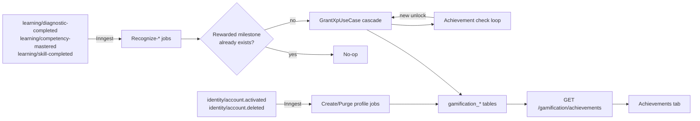

# 1. Context and scope

## Objective and source

Deliver SHIFU-79: a fixed achievement catalog that recognizes learning milestones
and awards XP automatically, plus an authenticated "Conquistas" tab where the
learner sees obtained and locked achievements. Source: Jira `SHIFU-79` (Dev Task
under Story `SHIFU-50`, Epic `SHIFU-30`). Canonical PRD: [Shifu — PRD —
Gamification](https://joaogoliveiragarcia.atlassian.net/wiki/spaces/Shifu/pages/82903042/Shifu+PRD+Gamification),
content ID `82903042`, version 3, retrieved 2026-10-05. Owning module: **Gamification**.
Delivery mode: **complete** (new persisted module, cross-module event
consumption, concurrency/idempotency risk, design-backed UI, multiple layers).

## Current behavior and product gap

`apps/server/src/shifu/gamification` contains only empty package skeletons
(`core/domain/{entities,structures,enums,errors,events}`, `core/interfaces`,
`core/use_cases`, `database/sqlalchemy/{models,mappers,repositories}`,
`messaging/{brokers,jobs}`, `providers`, `rest/{controllers,schemas}`); its
router is registered in `app.py` but returns no routes
(`gamification/rest/router.py`). `apps/web/src/ui/gamification/widgets/pages/
gamification-page/index.tsx` is a static page with hardcoded level/XP/streak
numbers and three hardcoded achievement cards; it is not connected to any
backend. No learner has a real Gamification profile, XP ledger, level, or
achievement record anywhere in the system.

Jira's description assumes "objetos de domínio já criados" (domain objects
already created). That premise does not hold: sibling Dev Tasks that would
supply those objects — `SHIFU-82` (profile + level calculation, RP-01/RP-04)
and `SHIFU-80` (practice calendar + streak calculation, RP-05/RP-06) — are
both still `A fazer` (not started), as are `SHIFU-81` (XP ledger/History tab,
RP-08) and `SHIFU-84` (activity XP grants, RP-02). This Spec resolves that gap
explicitly (see **Product decisions and assumptions** below) rather than
blocking on those tickets or silently assuming their output exists.

## Scope and product alignment

| Area | In scope | Out of scope |
| --- | --- | --- |
| Gamification profile | Minimal profile (`total_xp`, `level`) created on account activation; `max_streak_days` column reserved with a default so the achievement engine can read it, but no code in this delivery computes it | Practice calendar, current streak, day-of-practice recognition (RP-05/RP-06 — `SHIFU-80`) |
| XP sources | XP for diagnostic completion (per diagnosed Competência), first Competência mastery, first Habilidade completion (RP-03); XP for unlocked achievements (RP-07) | XP proportional to Activity score (RP-02 — `SHIFU-84`); a general-purpose XP History tab (RP-08 — `SHIFU-81`) |
| Achievement catalog | All 12 fixed catalog entries (RP-07), including the 3 Sequência entries, defined in code | Adding/editing achievements at runtime (explicitly out of PRD scope) |
| Achievement recognition | Diagnóstico, Domínio, Conclusão and Nível families reachable this delivery; cascading XP→level→achievement→XP until stable; retroactive historical date; reconciliation when the catalog gains an entry later | Sequência family stays defined but **unreachable** until `SHIFU-80` populates `max_streak_days` |
| Achievements UI | `/gamification` route renders the real Conquistas list (T33): grouped by family, obtained-with-date, locked-with-criterion-and-progress, historical (retired-but-held); a minimal real level/XP header replaces the mocked one | Calendar (T32), full level/XP overview ring (T31), XP History tab (T34), reward celebration modal (RP-09 — tracked by `SHIFU-115`), Mentor query (RP-10) |
| Account lifecycle | Profile created on `identity/account.activated`; all Gamification rows for an account deleted on `identity/account.deleted` | Exercising a real, user-triggered account-deletion flow end-to-end — Identity does not yet emit `AccountDeletedEvent` from any use case (see assumption below) |
| Resilience | Idempotent recognition under at-least-once Inngest delivery (RP-11), using the existing shared transactional-outbox relay | New messaging infrastructure (reused as-is) |

| Source requirement | Delivery | Notes |
| --- | --- | --- |
| RP-01 | partial | Single global profile created eagerly on account activation; initial state (0 XP, level 1); full area/summary UI deferred to `SHIFU-82` |
| RP-03 | partial | Diagnostic, mastery and first-completion XP delivered; Activity-score XP (RP-02) stays with `SHIFU-84` |
| RP-04 | partial | Level formula and ratchet delivered; dedicated level UI (anel de nível) deferred to `SHIFU-82` |
| RP-05 | deferred | `max_streak_days` column exists; no producer populates it in this delivery (`SHIFU-80`) |
| RP-06 | deferred | Calendar UI not built (`SHIFU-80`) |
| RP-07 | partial | Catalog, recognition engine, cascade, retroactive reconciliation and Achievements tab delivered for Diagnóstico/Domínio/Conclusão/Nível; Sequência defined but unreachable until `SHIFU-80` |
| RP-08 | partial | Only the minimal dedup/history facts needed to prevent duplicate recognition (rewarded milestones, achievement unlocks, XP grant rows); the learner-facing History tab is `SHIFU-81` |
| RP-09 | deferred | Explicitly excluded by Jira; tracked by `SHIFU-115` |
| RP-10 | deferred | Not required by this ticket |
| RP-11 | full | Recognition survives Gamification downtime and duplicate delivery without blocking Learning or duplicating effects |
| RP-12 | partial | Consumer-side purge implemented against the existing `identity/account.deleted` contract; no Identity use case currently publishes it (see assumption) |
| RP-13 | full (for the delivered surface) | Achievements tab is responsive, pt-BR, keyboard-operable, with explicit loading/empty/error states |

## Product decisions and assumptions

- **Narrow-foundation scope (user-confirmed):** this Spec builds the minimum
  Gamification foundation (profile, level, XP ledger) itself instead of
  blocking on `SHIFU-80`/`SHIFU-82`/`SHIFU-84`/`SHIFU-81`. Those tickets will
  later extend the same tables (e.g., `SHIFU-80` populates `max_streak_days`;
  `SHIFU-84` adds an `ACTIVITY` XP origin) rather than replace them.
- **Diagnostic XP count source:** RP-03 requires 20 XP per Competência
  diagnosed, but `DiagnosticCompletedEvent`'s payload does not carry that
  count. Resolved by reading it from the existing shared
  `CurriculumContentProvider.get_skill_content(skill_id).competencies` (the
  same shared port Learning's own jobs already consume) instead of changing
  Learning's event payload — no cross-module modification required.
- **Dedup/counting key is Curriculum identity, not Learning experience
  identity:** RP-08 says Gamification tracks "quais Habilidades" / "quais
  Competências" were rewarded — i.e., keyed by `skill_id`/`competency_id`
  (global curriculum identity), not `skill_experience_id`. This matches RP-07's
  "Habilidades e Competências únicas por usuário, independentemente do
  Objetivo" and is used for the Diagnóstico, Domínio and Conclusão family
  counts.
- **Account-deletion producer does not exist yet:** `identity/account.deleted`
  is a declared, stable event contract
  (`identity/core/domain/events/account_deleted_event.py`) but no Identity use
  case currently emits it. This delivery implements the Gamification-side
  consumer against that stable contract and validates it at the unit/job level
  with directly published test events; a real end-to-end deletion flow through
  product UI is blocked on Identity's own deletion delivery and is recorded as
  an accepted external dependency, not a defect in this Spec.
- **No cross-module account-status pull for Learning-fact jobs:** rather than
  adding a new shared "is this account active" provider, the three
  Learning-fact recognition use cases silently no-op when no profile exists
  for the account (never activated yet, or already purged after deletion).
  Accepted risk: a Learning event that is causally reordered ahead of
  `identity/account.activated` for the same account would be dropped instead
  of recognized; both events flow through the same single-broker outbox drain
  in commit order, making this race theoretical rather than observed.
- **Achievement catalog is code, not a database table:** the PRD describes it
  as fixed and explicitly excludes runtime administration. A versioned catalog
  change ships as a code change; "retiring" an entry means removing it from
  the code constant while its `AchievementUnlock` rows remain, which already
  satisfies "retired items stay visible only to holders, as historical."
- **Level is a stored ratchet, not a pure read-time function:** RP-04 requires
  that a future change to the level curve never lowers an already-reached
  level. `GamificationProfile.level` is persisted and only ever increases
  (`max(current_level, compute_level(total_xp))`).

# 2. Implementation Contract

| ID | RP/JN coverage | Required behavior |
| --- | --- | --- |
| RF-01 | RP-01 | Creating (activating) an account creates exactly one Gamification profile for that account, with `total_xp = 0`, `level = 1`. Creation is idempotent under duplicate delivery. |
| RF-02 | RP-03 | Completing a Habilidade's full diagnostic for the first time grants `20 × (number of Competências in that Habilidade)` XP, exactly once per account and Habilidade (`skill_id`), regardless of which Objetivo it was diagnosed in. |
| RF-03 | RP-03 | A Competência being mastered for the first time by an account grants 50 XP, exactly once per account and Competência (`competency_id`), independent of Objetivo; losing and regaining mastery does not grant it again. |
| RF-04 | RP-03 | A Habilidade being completed for the first time by an account grants 100 XP, exactly once per account and Habilidade (`skill_id`), independent of Objetivo. |
| RF-05 | RP-04 | The account's level is the largest `L ≥ 1` such that `50 × L × (L − 1) ≤ total_xp`, and the stored level never decreases even if `total_xp` is unchanged and the formula constant changes later. |
| RF-06 | RP-07 | The fixed catalog of 12 achievements (name, family, criterion, XP) matches the PRD table exactly and is evaluated by Diagnóstico-count, Domínio-count, Conclusão-count, Nível and Sequência (`max_streak_days`) criteria. |
| RF-07 | RP-07 | An achievement is granted at most once per account. Granting it awards its XP, which can itself trigger a level-up or another achievement; the engine keeps evaluating until no further milestone applies in the same operation. |
| RF-08 | RP-07, JN-05, JN-08 | An achievement's recorded unlock date is the date its criterion was first satisfied, even when recognized later (retroactive evaluation, late-arriving fact, or a catalog entry added after the fact already existed in the account's history). |
| RF-09 | RP-07, RP-08, JN-12 | Removing an Objetivo or Habilidade in Learning never revokes XP, levels or achievements already granted to the account. |
| RF-10 | RP-11, JN-11 | A Learning fact that arrives while Gamification was unavailable, or that is redelivered, is recognized exactly once with no duplicated XP, achievement or milestone record. |
| RF-11 | RP-12, JN-13 | Once an account is deleted, all its Gamification profile, XP ledger, achievement-unlock and rewarded-milestone rows are removed, and no further Learning fact for that account produces any Gamification effect. |
| RF-12 | RP-07, RP-13, JN-01 | The authenticated learner can view every catalog achievement, each shown as obtained (with date), locked (with criterion and numeric progress when derivable), or historical (retired from the catalog, shown only to an account that already holds it). |
| RF-13 | RP-01, RP-13 | The Achievements tab shows the account's current level and total XP using real data, in desktop and mobile, in pt-BR, with explicit loading, empty and error states and no keyboard traps. |

| ID | RF coverage | Requirement | Given | When | Then | Expected evidence |
| --- | --- | --- | --- | --- | --- | --- |
| CA-01 | RF-01 | Profile created once per account | An `identity/account.activated` event for a new account | The Gamification job processes it | Exactly one `gamification_profiles` row exists with `total_xp=0`, `level=1` | `test_create_gamification_profile_use_case.py`; `test_create_profile_on_account_activated_job.py` |
| CA-02 | RF-01 | Duplicate activation is a no-op | A profile already exists for the account | The same event is redelivered | No second row is created and no error is raised | `test_create_gamification_profile_use_case.py` (idempotency case) |
| CA-03 | RF-02 | Diagnostic XP uses the real Competência count | A Habilidade with 3 Competências whose diagnostic just completed for the first time | `learning/diagnostic-completed` is processed | The account's `total_xp` increases by exactly 60 and a `DIAGNOSTIC_COMPLETED` milestone row exists for that `skill_id` | `test_recognize_diagnostic_completed_use_case.py`; `test_recognize_diagnostic_completed_job.py` |
| CA-04 | RF-02 | Diagnostic XP is not repeated across Objetivos | The same Habilidade (`skill_id`) was already diagnosed-rewarded for this account under a different Objetivo | A new diagnostic completion for that same `skill_id` arrives | No additional XP is granted | `test_recognize_diagnostic_completed_use_case.py` |
| CA-05 | RF-03 | First mastery grants 50 XP once | A Competência reaches `MASTERED` for the first time for this account | `learning/competency-mastered` is processed | `total_xp` increases by 50 and a `COMPETENCY_MASTERED` milestone exists for that `competency_id` | `test_recognize_competency_mastered_use_case.py` |
| CA-06 | RF-03 | Re-mastery after loss does not repeat XP | The Competência was already mastery-rewarded, then lost mastery, then re-mastered | `learning/competency-mastered` fires again | No additional XP is granted | `test_recognize_competency_mastered_use_case.py` |
| CA-07 | RF-04 | First Habilidade completion grants 100 XP once | A Habilidade (`skill_id`) completes for the first time for this account | `learning/skill-completed` is processed | `total_xp` increases by 100 and a `SKILL_COMPLETED` milestone exists | `test_recognize_skill_completed_use_case.py` |
| CA-08 | RF-05 | Level follows the formula and never regresses | `total_xp` crosses 300 (level 3 threshold) in one grant | The profile is updated | `level` becomes 3; a subsequent grant that keeps `total_xp` above 300 never sets `level` below 3 | `test_grant_xp_use_case.py` |
| CA-09 | RF-07 | Cascade grants every newly eligible achievement and stops when stable | A single XP grant pushes the account past a level threshold and a count threshold simultaneously | `GrantXpUseCase` executes | Both achievements are unlocked, their XP is added, and a further pass grants nothing new | `test_grant_xp_use_case.py` (cascade case) |
| CA-10 | RF-07 | Each achievement grants once | An achievement is already unlocked for the account | A fact that would again satisfy its criterion is processed | No duplicate `gamification_achievement_unlocks` row is created and no extra XP is granted | `test_grant_xp_use_case.py` |
| CA-11 | RF-08 | Historical unlock date on retroactive recognition | A late-arriving `learning/competency-mastered` event proves the criterion was met on an earlier date | The event is processed now | `unlocked_at` records the original date; `granted_at` records now | `test_grant_xp_use_case.py` |
| CA-12 | RF-09 | Removing a Habilidade preserves rewards | An account already holds XP and an achievement derived from a since-removed Habilidade | `ListAchievementsUseCase` runs | The achievement and XP remain exactly as granted | `test_list_achievements_use_case.py` |
| CA-13 | RF-10 | Duplicate event delivery is idempotent | `learning/skill-completed` for the same `skill_id` is delivered twice | Both deliveries are processed | `total_xp` increases by 100 only once; the second delivery raises no error | `test_recognize_skill_completed_job.py` (duplicate-delivery case) |
| CA-14 | RF-11 | Account deletion purges all Gamification data | An account with a profile, XP grants and an achievement unlock | `identity/account.deleted` is processed | All four Gamification tables have no row for that `account_id` | `test_delete_gamification_profile_use_case.py`; `test_purge_profile_on_account_deleted_job.py` |
| CA-15 | RF-11 | No effect after deletion | An account was deleted (no profile row remains) | A Learning fact event for that account arrives afterward | No row is created or updated in any Gamification table | `test_recognize_skill_completed_use_case.py` (missing-profile case) |
| CA-16 | RF-12 | Achievements list shows all three states correctly | An account holds 2 of 12 achievements and the catalog has no retired entries | `GET /gamification/achievements` is called | Response has 12 entries: 2 `obtained` with dates, 10 `locked` with criterion and progress where derivable | `test_list_achievements_use_case.py`; `test_list_achievements_controller.py`; VM-01 |
| CA-17 | RF-12 | Retired catalog entries stay visible only to holders | An `AchievementUnlock` row exists whose code is no longer in the current code catalog | `ListAchievementsUseCase` runs for that account vs. an account that never held it | The holder sees it marked `historical`; the other account does not see it at all | `test_list_achievements_use_case.py` |
| CA-18 | RF-13 | Achievements tab renders real profile and catalog data responsively | An authenticated learner with a populated profile | They open `/gamification` on desktop and on a narrow viewport | Level, XP and achievement cards render from real data, grouped by family, with pt-BR labels and no console/network errors | `gamification-page.test.tsx`; `apps/web/tests/gamification/gamification-page.test.ts`; VM-01, VM-02 |
| CA-19 | RF-13 | Loading, empty and error states are explicit | The achievements request is pending, returns no catalog data, or fails | The page renders | A skeleton, an empty-state message, or a recoverable error with retry is shown respectively — never a blank page | `gamification-page.test.tsx` |

## Cross-cutting restrictions

- No endpoint or use case in this Spec may mutate Learning state, Curriculum
  content, or any value owned by another module; Gamification only reads
  `CurriculumContentProvider` and reacts to Learning/Identity events.
- No use case may grant XP, an achievement, or a milestone record for an
  account that has no `gamification_profiles` row (see account-lifecycle
  assumption above).
- All persisted writes for one triggering event (profile row, XP grant rows,
  achievement-unlock rows, milestone rows, level update) happen inside one
  `GamificationDatabase.transaction()` call; no partial cascade state is ever
  committed.

# 3. Technical Contract

## Current technical state

| Evidence | Current responsibility | Gap |
| --- | --- | --- |
| `apps/server/src/shifu/gamification/**/__init__.py` | Empty package skeletons for every layer | No domain, persistence, REST or messaging code exists |
| `apps/server/src/shifu/gamification/rest/router.py` | Registers an empty `/gamification` `APIRouter` | No controller is registered |
| `apps/server/src/shifu/app.py:60` | Includes `GamificationRouter.register()` | No `gamification_database`, no job registrar entry, no `app.state.gamification_database` |
| `apps/web/src/ui/gamification/widgets/pages/gamification-page/index.tsx` | Renders hardcoded level/XP/streak/achievement mock data | Not wired to any REST service or query hook |
| `apps/web/src/routes/gamification/index.tsx`, `apps/web/src/constants/routes.ts:13` | Route `/gamification` already registered and protected by `requireAuthMiddleware` | No change needed; reused as-is |
| `apps/web/tests/gamification/gamification-page.test.ts` | Already asserts the current mock page's `ModulePageHeader` heading (`'Cada passo merece ser visto.'`) and the authenticated/redirect boundary | Must be extended (not replaced) to also assert real achievement/profile content, while the existing heading and redirect assertions keep passing unchanged |
| `apps/server/src/shifu/learning/core/domain/events/{diagnostic_completed_event,competency_mastered_event,skill_completed_event}.py` | Learning already emits these three events through the shared outbox on real state transitions (`evaluate_choice_activity_use_case.py:430,536,567`) | Not yet consumed by any module |
| `apps/server/src/shifu/identity/core/domain/events/{account_activated_event,account_deleted_event}.py` | `AccountActivatedEvent` is emitted (`confirm_account_use_case.py:135`); `AccountDeletedEvent` is declared but never emitted by any Identity use case | Gamification can safely consume `account.activated` now; the `account.deleted` consumer is implemented against a contract with no current producer |
| `apps/server/src/shifu/shared/core/interfaces/curriculum_content_provider.py` | Already exposes `get_skill_content(skill_id).competencies`, consumed today by Learning's own jobs | Reusable as-is to compute diagnostic XP without touching Learning |

## Solution and runtime flow

Two producers feed Gamification, both through the existing shared
transactional-outbox + `InngestBroker` relay (`shared/messaging/inngest/
inngest_broker.py`) — no new messaging infrastructure is introduced:

- **Identity** publishes `identity/account.activated` and
  `identity/account.deleted`.
- **Learning** publishes `learning/diagnostic-completed`,
  `learning/competency-mastered`, `learning/skill-completed`.

Each is handled by one Gamification-owned Inngest job that normalizes the
payload, opens one `GamificationDatabase.transaction()`, and executes exactly
one core use case synchronously inside a worker thread (mirroring
`learning_inngest_messaging.py`'s `asyncio.to_thread` pattern). The three
Learning-fact use cases (`RecognizeDiagnosticCompletedUseCase`,
`RecognizeCompetencyMasteredUseCase`, `RecognizeSkillCompletedUseCase`) each:

1. return early (no-op) if no profile exists for the account;
2. attempt to insert a `RewardedMilestone` row under its unique
   `(account_id, milestone_type, reference_id)` constraint — a conflict means
   this fact was already rewarded, so the use case stops;
3. on successful insert, delegate the XP amount and origin to the shared
   `GrantXpUseCase`.

`GrantXpUseCase(account_id, amount, origin, origin_reference, occurred_at)` is
the single cascade orchestrator (RF-07/CA-09/CA-10/CA-11):

1. insert an `XpGrant` row and add `amount` to the profile's `total_xp`;
2. recompute `level = max(profile.level, compute_level(total_xp))` and persist
   it if it grew;
3. loop: evaluate every catalog `AchievementDefinition` not yet unlocked for
   this account against the account's current counters (diagnostic/mastery/
   completion counts from `RewardedMilestonesRepository`, `level` from the
   profile, `max_streak_days` from the profile); for every newly satisfied
   definition, insert an `AchievementUnlock` row (`unlocked_at` = `occurred_at`
   for the triggering fact, or now for a same-pass achievement) and
   recursively apply its `xp_reward` through step 1–3;
4. stop when one full pass unlocks nothing new.

`CreateGamificationProfileUseCase` and `DeleteGamificationProfileUseCase` are
simple, each doing one idempotent insert-or-skip / delete-everything operation
in their own transaction.

`ListAchievementsUseCase` is the only REST-facing use case: it loads the
profile, the four counters, and merges the current code catalog with any
`AchievementUnlock` rows whose code is absent from that catalog (retired,
shown as `historical` only to the holder).



| Boundary | Producer | Consumer | Canonical contract | Mapping/guarantees | Failure ownership |
| --- | --- | --- | --- | --- | --- |
| Inngest event | Identity use cases | Gamification jobs | `AccountActivatedEvent`/`AccountDeletedEvent` (`identity/core/domain/events`) | At-least-once delivery via shared outbox; consumer idempotent on `account_id` | Job retries (finite); profile insert/delete is naturally idempotent |
| Inngest event | Learning use cases | Gamification jobs | `DiagnosticCompletedEvent`/`CompetencyMasteredEvent`/`SkillCompletedEvent` (`learning/core/domain/events`) | At-least-once delivery; consumer idempotent via `RewardedMilestone` unique constraint | Job retries (finite); duplicate delivery is a safe no-op |
| Provider call | Curriculum (`DatabaseCurriculumContentProvider`) | `RecognizeDiagnosticCompletedUseCase` | `CurriculumContentProvider.get_skill_content` (`shared/core/interfaces`) | Synchronous read, returns `None` if the skill is unknown (treated as 0 competencies / no-op) | Caller (use case) |
| HTTP | `ListAchievementsController` | `apps/web` `gamification-service.ts` | `GET /gamification/achievements` (this Spec) | JSON object with `level`/`totalXp`/`xpForNextLevel` plus the `achievements` array, camelCase fields, auth required | `AppErrorHandler` for transport errors |

## Affected layer contracts

### Domain

| Path | Change | Declaration/operation | Contract and guarantees | Dependencies/consumers | Generation/tests |
| --- | --- | --- | --- | --- | --- |
| `gamification/core/domain/entities/gamification_profile.py` | Create | `GamificationProfile` (`@entity`): `id: str` (the account identifier), `total_xp: int`, `level: int`, `max_streak_days: int`, `created_at: datetime`, `updated_at: datetime`; `classmethod create(account_id, *, now)` sets `id=account_id`; `apply_xp(amount: int, *, now) -> int` returns the new level, enforcing `level` only ever increases | `entity`'s `__eq__`/`__hash__`/mutation guard hard-code a literal `id` attribute (`shared/core/domain/entities/entity.py`); the profile's `id` *is* the account identifier, so no separate `account_id` field is declared on the entity | Used by all use cases below; the mapper translates `model.account_id` (table PK) ↔ `entity.id` | Exercised via use-case tests |
| `gamification/core/domain/entities/xp_grant.py` | Create | `XpGrant` (`@frozen_entity`): `id, account_id, amount: int, origin: XpOrigin, origin_reference: str \| None, occurred_at: datetime, granted_at: datetime` | Immutable historical ledger row | `XpGrantsRepository.add` | Use-case tests |
| `gamification/core/domain/entities/achievement_unlock.py` | Create | `AchievementUnlock` (`@frozen_entity`): `id, account_id, achievement_code: str, unlocked_at: datetime, granted_at: datetime` | Immutable; one row per `(account_id, achievement_code)` | `AchievementUnlocksRepository` | Use-case tests |
| `gamification/core/domain/entities/rewarded_milestone.py` | Create | `RewardedMilestone` (`@frozen_entity`): `id, account_id, milestone_type: MilestoneType, reference_id: str, rewarded_at: datetime` | Immutable; one row per `(account_id, milestone_type, reference_id)` | `RewardedMilestonesRepository` | Use-case tests |
| `gamification/core/domain/enums/xp_origin.py` | Create | `XpOrigin(StrEnum)`: `DIAGNOSTIC`, `COMPETENCY_MASTERY`, `SKILL_COMPLETION`, `ACHIEVEMENT` | Reserved for future `ACTIVITY` member (`SHIFU-84`) without migration of existing rows | `XpGrant`, `GrantXpUseCase` | Use-case tests |
| `gamification/core/domain/enums/milestone_type.py` | Create | `MilestoneType(StrEnum)`: `DIAGNOSTIC_COMPLETED`, `COMPETENCY_MASTERED`, `SKILL_COMPLETED` | — | `RewardedMilestone`, recognition use cases | Use-case tests |
| `gamification/core/domain/enums/achievement_family.py` | Create | `AchievementFamily(StrEnum)`: `DIAGNOSTICO`, `DOMINIO`, `CONCLUSAO`, `SEQUENCIA`, `NIVEL` | — | `AchievementDefinition` | Use-case tests |
| `gamification/core/domain/enums/achievement_criterion_type.py` | Create | `AchievementCriterionType(StrEnum)`: `DIAGNOSTIC_COUNT`, `COMPETENCY_MASTERY_COUNT`, `SKILL_COMPLETION_COUNT`, `LEVEL`, `STREAK` | — | `AchievementDefinition`, `GrantXpUseCase` | Use-case tests |
| `gamification/core/domain/structures/achievement_definition.py` | Create | `AchievementDefinition` (`@structure`): `code: str, family: AchievementFamily, name: str, description: str, criterion_type: AchievementCriterionType, criterion_threshold: int, criterion_label: str, xp_reward: int` | Immutable catalog row | `achievement_catalog.py` | Use-case tests |
| `gamification/core/domain/structures/achievement_view.py` | Create | `AchievementView` (`@structure`): `code, family, name, description, criterion_label, xp_reward, state: Literal['obtained','locked','historical'], unlocked_at: datetime \| None, progress_current: int \| None, progress_target: int \| None` | Read-only DTO, one of two fields returned by `ListAchievementsUseCase` | `ListAchievementsController` | Use-case tests |
| `gamification/core/domain/structures/achievements_overview.py` | Create | `AchievementsOverview` (`@structure`): `level: int, total_xp: int, xp_for_next_level: int, achievements: tuple[AchievementView, ...]` | Read-only DTO bundling the profile summary RF-13 requires alongside the catalog, so the Achievements tab needs exactly one request | `ListAchievementsController` | Use-case tests |
| `gamification/core/domain/achievement_catalog.py` | Create | `ACHIEVEMENT_CATALOG: tuple[AchievementDefinition, ...]` — module-level constant with the 12 PRD rows (documented exception to "one structure class per file": this module holds fixed data, not a class) | Fixed product catalog; changing it is a code change, never a runtime action | `GrantXpUseCase`, `ListAchievementsUseCase` | Use-case tests assert against this constant |
| `gamification/core/domain/leveling.py` | Create | `compute_level(total_xp: int) -> int` and `xp_required_for_level(level: int) -> int` — both implementing `XP necessário = 50 × L × (L − 1)` | No I/O; deterministic | `GamificationProfile.apply_xp`; `ListAchievementsUseCase` (for `xp_for_next_level = xp_required_for_level(level + 1) - total_xp`) | Use-case tests |

### Use cases

| Path | Change | Declaration/operation | Contract and guarantees | Dependencies/consumers | Generation/tests |
| --- | --- | --- | --- | --- | --- |
| `gamification/core/use_cases/create_gamification_profile_use_case.py` | Create | `CreateGamificationProfileUseCase(database).execute(account_id, *, now)` | Idempotent insert; no-op if a profile already exists | `create_profile_on_account_activated_job.py` | `tests/gamification/core/use_cases/test_create_gamification_profile_use_case.py` |
| `gamification/core/use_cases/delete_gamification_profile_use_case.py` | Create | `DeleteGamificationProfileUseCase(database).execute(account_id)` | Finds the profile by `account_id`; if found, removes it and calls `remove_many_by_account_id` on the other three repositories in one transaction; no-op if no profile exists | `purge_profile_on_account_deleted_job.py` | `test_delete_gamification_profile_use_case.py` |
| `gamification/core/use_cases/grant_xp_use_case.py` | Create | `GrantXpUseCase(database).execute(account_id, amount, origin, origin_reference, *, occurred_at, now)` | Applies XP, updates level (ratchet), evaluates and grants newly eligible achievements in a stabilizing loop, recursing through itself for achievement XP; never grants the same achievement twice | `Recognize*UseCase`s | `test_grant_xp_use_case.py` |
| `gamification/core/use_cases/recognize_diagnostic_completed_use_case.py` | Create | `RecognizeDiagnosticCompletedUseCase(database, curriculum_content_provider).execute(account_id, skill_id, *, now)` | No-op without a profile or unknown skill; idempotent via `RewardedMilestone`; grants `20 × competency_count` through `GrantXpUseCase` | `recognize_diagnostic_completed_job.py` | `test_recognize_diagnostic_completed_use_case.py` |
| `gamification/core/use_cases/recognize_competency_mastered_use_case.py` | Create | `RecognizeCompetencyMasteredUseCase(database).execute(account_id, competency_id, *, now)` | No-op without a profile; idempotent; grants 50 XP through `GrantXpUseCase` | `recognize_competency_mastered_job.py` | `test_recognize_competency_mastered_use_case.py` |
| `gamification/core/use_cases/recognize_skill_completed_use_case.py` | Create | `RecognizeSkillCompletedUseCase(database).execute(account_id, skill_id, *, now)` | No-op without a profile; idempotent; grants 100 XP through `GrantXpUseCase` | `recognize_skill_completed_job.py` | `test_recognize_skill_completed_use_case.py` |
| `gamification/core/use_cases/list_achievements_use_case.py` | Create | `ListAchievementsUseCase(database).execute(account_id) -> AchievementsOverview` | Merges current catalog with held-but-retired unlocks; computes progress for locked entries; reads the profile for `level`/`total_xp` and derives `xp_for_next_level` via `leveling.xp_required_for_level` — the single data source RF-13's real level/XP display needs | `ListAchievementsController` | `test_list_achievements_use_case.py` |

### Interfaces

| Path | Change | Declaration/operation | Contract and guarantees | Dependencies/consumers | Generation/tests |
| --- | --- | --- | --- | --- | --- |
| `gamification/core/interfaces/gamification_database.py` | Create | `GamificationDatabaseRepositories` (`@structure`: `profiles, xp_grants, achievement_unlocks, rewarded_milestones, events`); `GamificationDatabase(Protocol)` with `transaction() -> AbstractContextManager[GamificationDatabaseRepositories]` | Sole transaction owner for every Gamification use case, mirroring `LearningDatabase` | All use cases | Exercised via use-case + job tests |
| `gamification/core/interfaces/gamification_profiles_repository.py` | Create | `GamificationProfilesRepository(Protocol)`: `find_by_account_id(account_id) -> GamificationProfile \| None`, `add(profile) -> None`, `update(profile) -> None`, `remove(profile: GamificationProfile) -> None` | `remove` takes the entity, matching `GoalsRepository`/`SkillExperiencesRepository` convention, not a bare id | Sqlalchemy implementation | Use-case tests (autospec) |
| `gamification/core/interfaces/xp_grants_repository.py` | Create | `XpGrantsRepository(Protocol)`: `add(grant) -> None`, `remove_many_by_account_id(account_id) -> None` | `remove_all` is reserved by convention for a bare, unscoped test/seed wipe; this is an account-scoped bulk delete and uses a distinct name | Sqlalchemy implementation | Use-case tests (autospec) |
| `gamification/core/interfaces/achievement_unlocks_repository.py` | Create | `AchievementUnlocksRepository(Protocol)`: `find_many_by_account_id(account_id) -> tuple[AchievementUnlock, ...]`, `add(unlock) -> None`, `remove_many_by_account_id(account_id) -> None` | Same `remove_many_by_account_id` naming rationale as above | Sqlalchemy implementation | Use-case tests (autospec) |
| `gamification/core/interfaces/rewarded_milestones_repository.py` | Create | `RewardedMilestonesRepository(Protocol)`: `count_by_account_id_and_type(account_id, milestone_type) -> int`, `try_add(milestone) -> bool` (returns `False` on unique-constraint conflict instead of raising), `remove_many_by_account_id(account_id) -> None` | `try_add` is the sole idempotency gate for Learning-fact recognition | Sqlalchemy implementation | Use-case tests (autospec) |

### Database

| Path | Change | Declaration/operation | Contract and guarantees | Dependencies/consumers | Generation/tests |
| --- | --- | --- | --- | --- | --- |
| `gamification/database/sqlalchemy/models/gamification_profile_model.py` | Create | `GamificationProfileModel` → table `gamification_profiles` | PK `account_id` | Mapper, repository | Controller/job integration tests |
| `gamification/database/sqlalchemy/models/xp_grant_model.py` | Create | `XpGrantModel` → table `gamification_xp_grants` | PK `id`; index on `account_id` | Mapper, repository | Controller/job integration tests |
| `gamification/database/sqlalchemy/models/achievement_unlock_model.py` | Create | `AchievementUnlockModel` → table `gamification_achievement_unlocks` | PK `id`; unique `(account_id, achievement_code)`; index on `account_id` | Mapper, repository | Controller/job integration tests |
| `gamification/database/sqlalchemy/models/rewarded_milestone_model.py` | Create | `RewardedMilestoneModel` → table `gamification_rewarded_milestones` | PK `id`; unique `(account_id, milestone_type, reference_id)`; index on `account_id` | Mapper, repository | Controller/job integration tests |
| `gamification/database/sqlalchemy/mappers/{gamification_profile,xp_grant,achievement_unlock,rewarded_milestone}_mapper.py` | Create | `to_entity`/`to_model` static methods, one file per entity | No ORM model crosses the adapter boundary | Repositories | Covered through repository/use-case boundary |
| `gamification/database/sqlalchemy/repositories/{gamification_profiles,xp_grants,achievement_unlocks,rewarded_milestones}_repository.py` | Create | `Sqlalchemy<Name>Repository(session)` implementing the matching core Protocol | One class per file, session injected and private | `SqlalchemyGamificationDatabase` | Job/controller integration tests |
| `gamification/database/sqlalchemy/gamification_database.py` | Create | `SqlalchemyGamificationDatabase(engine, id_provider)` implementing `GamificationDatabase`; `transaction()` opens a session, builds `GamificationDatabaseRepositories` (including the shared `EventsRepository`), commits on normal exit, rolls back on exception | Sole transaction owner, mirroring `SqlalchemyLearningDatabase` | `app.py`, jobs, controller | Job/controller integration tests |
| `apps/server/migrations/versions/<new_revision>_create_gamification_tables.py` | Create | Alembic revision creating the four tables above | `down_revision` = current head at implementation time (add a merge migration first if multiple heads exist, per repository convention); Columns/Indexes/Constraints exactly as specified in the Database rows above; no data migration needed (new tables) | Builder generates via `alembic revision --autogenerate` then hand-verifies | Exercised as the migration path by controller/job integration fixtures |

### REST

| Path | Change | Declaration/operation | Contract and guarantees | Dependencies/consumers | Generation/tests |
| --- | --- | --- | --- | --- | --- |
| `gamification/rest/controllers/list_achievements_controller.py` | Create | `ListAchievementsController.handle(router)` registers `GET /achievements` → `response_model=Response` (`status_code=200`); `Response` fields `level, totalXp (alias), xpForNextLevel (alias), achievements: tuple[AchievementResponse, ...]`; `AchievementResponse` fields `code, family, name, description, criterionLabel (alias), xpReward (alias), state, unlockedAt (alias), progressCurrent (alias), progressTarget (alias)`, all constructed field-by-field from the returned `AchievementsOverview` inside the route handler (matching `get_goal_controller.py`'s precedent; no `TypeAdapter`) | Auth via `Depends(AuthenticationPipe.get_authenticated_user)`; database via `Depends(GamificationPipe.get_database)`; calls `ListAchievementsUseCase(database).execute(user.account_id)`. **Correction (recorded `ACH-1`):** the original Contract omitted profile data entirely, leaving `ProfileSummaryCard` (Design Contract) with no sanctioned data source despite RF-13 requiring real level/XP on this page; this single endpoint now serves both so the page needs exactly one request | `GamificationRouter` | `tests/gamification/server/controllers/test_list_achievements_controller.py` |
| `gamification/rest/router.py` | Modify | `GamificationRouter.register()` now also calls `ListAchievementsController.handle(router)` | Router still created fresh per call, safe under repeated `FastAPIApp.register()` | `app.py:60` (unchanged) | Controller test |
| `gamification/pipes/gamification_pipe.py` | Create | `GamificationPipe.get_database(request) -> GamificationDatabase` reading `request.app.state.gamification_database` | Mirrors `LearningPipe` | Controller | Controller test |
| `apps/server/rest-client/gamification/gamification.rest` | Create | `@baseUrl`, `@accessToken` vars + one labeled `GET {{baseUrl}}/gamification/achievements` request with `Authorization: Bearer {{accessToken}}` | Matches `rest-client/learning/learning.rest` format; no secrets | Manual verification | — |

### Messaging

| Path | Change | Declaration/operation | Contract and guarantees | Dependencies/consumers | Generation/tests |
| --- | --- | --- | --- | --- | --- |
| `gamification/messaging/inngest/gamification_inngest_messaging.py` | Create | `GamificationInngestMessaging.register_jobs(inngest, *, gamification_database, curriculum_content_provider, clock_provider) -> list[Function[object]]` | Returns one `Function` per job below; no `serve` call, no client creation | `app.py` | Exercised through job integration tests |
| `gamification/messaging/inngest/jobs/create_profile_on_account_activated_job.py` | Create | `CreateProfileOnAccountActivatedJob`; `FUNCTION_ID='gamification-create-profile-on-account-activated'`; `_EVENT_NAME='identity/account.activated'`; `retries=3` | Validates its own local `_Payload` (declared in this job module, mirroring but **not importing** Identity's `AccountActivatedPayload` — matching `cancel_communication_job.py`'s cross-module isolation and respecting `tach.toml`'s `shifu.gamification → shifu.shared`-only dependency) via a strict Pydantic model; runs `CreateGamificationProfileUseCase` inside `asyncio.to_thread` + `gamification_database.transaction()` | Registrar | `tests/messaging/inngest/jobs/gamification/test_create_profile_on_account_activated_job.py` |
| `gamification/messaging/inngest/jobs/purge_profile_on_account_deleted_job.py` | Create | `PurgeProfileOnAccountDeletedJob`; `FUNCTION_ID='gamification-purge-profile-on-account-deleted'`; `_EVENT_NAME='identity/account.deleted'`; `retries=3` | Validates its own local `_Payload` (same isolation as above); runs `DeleteGamificationProfileUseCase` | Registrar | `test_purge_profile_on_account_deleted_job.py` |
| `gamification/messaging/inngest/jobs/recognize_diagnostic_completed_job.py` | Create | `RecognizeDiagnosticCompletedJob`; `FUNCTION_ID='gamification-recognize-diagnostic-completed'`; `_EVENT_NAME='learning/diagnostic-completed'`; `retries=3` | Validates its own local `_Payload` (mirroring, not importing, Learning's `DiagnosticCompletedPayload`); runs `RecognizeDiagnosticCompletedUseCase` | Registrar | `test_recognize_diagnostic_completed_job.py` |
| `gamification/messaging/inngest/jobs/recognize_competency_mastered_job.py` | Create | `RecognizeCompetencyMasteredJob`; `_EVENT_NAME='learning/competency-mastered'`; `retries=3` | Validates its own local `_Payload`; runs `RecognizeCompetencyMasteredUseCase` | Registrar | `test_recognize_competency_mastered_job.py` |
| `gamification/messaging/inngest/jobs/recognize_skill_completed_job.py` | Create | `RecognizeSkillCompletedJob`; `_EVENT_NAME='learning/skill-completed'`; `retries=3` | Validates its own local `_Payload`; runs `RecognizeSkillCompletedUseCase` | Registrar | `test_recognize_skill_completed_job.py` |
| `gamification/messaging/jobs/__init__.py`, `gamification/messaging/brokers/__init__.py` | Remove | — | Unused empty skeleton subpackages; the real convention is `gamification/messaging/inngest/jobs/**`, matching `learning/messaging/inngest/jobs/**` | — | — |

### Composition

| Path | Change | Declaration/operation | Contract and guarantees | Dependencies/consumers | Generation/tests |
| --- | --- | --- | --- | --- | --- |
| `apps/server/src/shifu/app.py` | Modify | Add `gamification_database = SqlalchemyGamificationDatabase(engine=database_engine, id_provider=id_provider)` beside the existing module databases; add one more `job_group_registrars` entry calling `GamificationInngestMessaging.register_jobs(inngest, gamification_database=gamification_database, curriculum_content_provider=curriculum_content_provider, clock_provider=clock_provider)`; add `app.state.gamification_database = gamification_database` | `curriculum_content_provider` is already constructed earlier in this same function (line 93) and reused as-is | `GamificationPipe`, jobs | Exercised through controller/job integration tests that boot the real app |

## Technical decisions

| Decision | Chosen approach | Alternative considered | Reason | Accepted trade-off |
| --- | --- | --- | --- | --- |
| Diagnostic XP competency count | Read via existing `CurriculumContentProvider.get_skill_content` | Add a `competencies_diagnosed_count` field to `DiagnosticCompletedEvent`'s payload | Zero cross-module modification; reuses a port Learning already consumes the same way | One extra synchronous read per diagnostic-completion job run |
| Idempotency mechanism | DB unique constraint + `try_add` returning `bool` | Event-ID dedup table keyed by Inngest event ID | RP-08 explicitly requires tracking "which Habilidade/Competência" was rewarded, not just "which event was processed"; also naturally doubles as the achievement counter | One table serves both idempotency and counting, but cannot answer "how much XP was this Activity's max" (future `SHIFU-84` need) — deferred to that ticket's own table |
| Level storage | Persisted ratchet (`max(current, computed)`) | Pure read-time computation from `total_xp` | RP-04 requires that a future curve change never lowers an already-reached level | One extra write path (level can only be recomputed by code that already touches the profile row) |
| Achievement catalog storage | Code constant (`ACHIEVEMENT_CATALOG` tuple) | Database table with seed data | PRD explicitly excludes runtime catalog administration; a DB table would need unused CRUD/admin surface | Changing the catalog requires a deploy, which matches the product's stated model |
| Sequência family in this delivery | Keep catalog rows, leave `max_streak_days` unpopulated | Build minimal streak tracking inside this Spec too | Streak day-boundary/backfill logic is a materially separate, PRD-significant capability (RP-05/RP-06) that duplicates `SHIFU-80`'s entire scope | Sequência achievements are unreachable until `SHIFU-80` ships; documented in scope table |

# 4. Validation Contract

| Test file | Test type | Target | Coverage goal |
| --- | --- | --- | --- |
| `apps/server/tests/gamification/core/use_cases/test_create_gamification_profile_use_case.py` | unit | `CreateGamificationProfileUseCase` | CA-01, CA-02 |
| `apps/server/tests/gamification/core/use_cases/test_delete_gamification_profile_use_case.py` | unit | `DeleteGamificationProfileUseCase` | CA-14 |
| `apps/server/tests/gamification/core/use_cases/test_grant_xp_use_case.py` | unit | `GrantXpUseCase` | CA-08, CA-09, CA-10, CA-11 |
| `apps/server/tests/gamification/core/use_cases/test_recognize_diagnostic_completed_use_case.py` | unit | `RecognizeDiagnosticCompletedUseCase` | CA-03, CA-04, CA-15 |
| `apps/server/tests/gamification/core/use_cases/test_recognize_competency_mastered_use_case.py` | unit | `RecognizeCompetencyMasteredUseCase` | CA-05, CA-06 |
| `apps/server/tests/gamification/core/use_cases/test_recognize_skill_completed_use_case.py` | unit | `RecognizeSkillCompletedUseCase` | CA-07 |
| `apps/server/tests/gamification/core/use_cases/test_list_achievements_use_case.py` | unit | `ListAchievementsUseCase` | CA-12, CA-16, CA-17 |
| `apps/server/tests/gamification/server/controllers/test_list_achievements_controller.py` | integration | `GET /gamification/achievements` | CA-16 |
| `apps/server/tests/messaging/inngest/jobs/gamification/test_create_profile_on_account_activated_job.py` | integration (real Inngest) | `CreateProfileOnAccountActivatedJob` | CA-01 |
| `apps/server/tests/messaging/inngest/jobs/gamification/test_purge_profile_on_account_deleted_job.py` | integration (real Inngest) | `PurgeProfileOnAccountDeletedJob` | CA-14 |
| `apps/server/tests/messaging/inngest/jobs/gamification/test_recognize_diagnostic_completed_job.py` | integration (real Inngest) | `RecognizeDiagnosticCompletedJob` | CA-03, CA-13 |
| `apps/server/tests/messaging/inngest/jobs/gamification/test_recognize_competency_mastered_job.py` | integration (real Inngest) | `RecognizeCompetencyMasteredJob` | CA-05 |
| `apps/server/tests/messaging/inngest/jobs/gamification/test_recognize_skill_completed_job.py` | integration (real Inngest) | `RecognizeSkillCompletedJob` | CA-07, CA-13 |
| `apps/web/src/ui/gamification/widgets/pages/gamification-page/tests/gamification-page.test.tsx` | component | `GamificationPage` | CA-16, CA-18, CA-19 |
| `apps/web/src/ui/gamification/widgets/pages/gamification-page/tests/use-gamification-page.test.ts` | hook | `useGamificationPage` | CA-18, CA-19 |
| `apps/web/tests/gamification/gamification-page.test.ts` | Playwright route integration | `/gamification` route | CA-18, VM-01, VM-02 |

| Test file | Test case | Description | Assertions |
| --- | --- | --- | --- |
| `test_grant_xp_use_case.py` | `test_should_unlock_level_and_count_achievements_in_the_same_cascade` | A grant crosses both a level threshold and a Diagnóstico-count threshold at once | Both `AchievementUnlock` rows created; `total_xp` includes both achievements' XP; `achievement_unlocks.add` not called a third time on the stabilizing pass |
| `test_list_achievements_use_case.py` | `test_should_mark_unknown_catalog_code_as_historical_only_for_holder` | An `AchievementUnlock` row references a code absent from `ACHIEVEMENT_CATALOG` | For the holder: one `historical` entry with no catalog metadata beyond the stored code; for another account: entry absent entirely |
| `test_recognize_diagnostic_completed_job.py` | `test_should_grant_xp_once_under_duplicate_event_delivery` | Same `DiagnosticCompletedEvent` payload sent twice through the real Inngest runtime | `gamification_xp_grants` has exactly one row for that `skill_id`; no error surfaces from the second delivery |

| Acceptance | Automated boundary | Manual scenario | Evidence target |
| --- | --- | --- | --- |
| CA-01 | `test_create_gamification_profile_use_case.py`; `test_create_profile_on_account_activated_job.py` | — | `evaluation.md` |
| CA-02 | `test_create_gamification_profile_use_case.py` | — | `evaluation.md` |
| CA-03 | `test_recognize_diagnostic_completed_use_case.py`; `test_recognize_diagnostic_completed_job.py` | — | `evaluation.md` |
| CA-04 | `test_recognize_diagnostic_completed_use_case.py` | — | `evaluation.md` |
| CA-05 | `test_recognize_competency_mastered_use_case.py` | — | `evaluation.md` |
| CA-06 | `test_recognize_competency_mastered_use_case.py` | — | `evaluation.md` |
| CA-07 | `test_recognize_skill_completed_use_case.py` | — | `evaluation.md` |
| CA-08 | `test_grant_xp_use_case.py` | — | `evaluation.md` |
| CA-09 | `test_grant_xp_use_case.py` | — | `evaluation.md` |
| CA-10 | `test_grant_xp_use_case.py` | — | `evaluation.md` |
| CA-11 | `test_grant_xp_use_case.py` | — | `evaluation.md` |
| CA-12 | `test_list_achievements_use_case.py` | — | `evaluation.md` |
| CA-13 | `test_recognize_diagnostic_completed_job.py`, `test_recognize_skill_completed_job.py` | — | `evaluation.md` |
| CA-14 | `test_delete_gamification_profile_use_case.py`; `test_purge_profile_on_account_deleted_job.py` | — | `evaluation.md` |
| CA-15 | `test_recognize_skill_completed_use_case.py` | — | `evaluation.md` |
| CA-16 | `test_list_achievements_use_case.py`; `test_list_achievements_controller.py` | VM-01 | `evaluation.md` |
| CA-17 | `test_list_achievements_use_case.py` | — | `evaluation.md` |
| CA-18 | `gamification-page.test.tsx` | VM-01, VM-02 | `evaluation.md` |
| CA-19 | `gamification-page.test.tsx` | — | `evaluation.md` |

**VM-01 — Achievements tab, desktop, obtained and locked states**
Mapped: CA-16, CA-18. Preconditions: local stack up (`docker compose up -d`), seeded account with at least one unlocked achievement (`student.seed@shifu.com`, or an account advanced far enough via the diagnostic/mastery flow). Starting route: `/gamification`, viewport `1280×800`.

1. Sign in and navigate to `/gamification`.
2. Observe the level/XP header shows real values (not the previous mock numbers).
3. Observe the achievement grid grouped by family (Diagnóstico, Domínio, Conclusão, Sequência, Nível).
4. Confirm at least one obtained card shows its unlock date; confirm locked cards show their criterion text and numeric progress when derivable (e.g., "2 de 5 diagnósticos").
5. Tab through the grid with keyboard only; confirm visible focus order and no trap.
6. Inspect the Network tab: exactly one `GET /gamification/achievements` call, `200`, no console errors.

Cleanup: none (read-only).

**VM-02 — Achievements tab, mobile viewport**
Mapped: CA-18. Same preconditions. Viewport `375×812`.

1. Navigate to `/gamification`.
2. Confirm the header and achievement grid reflow to single-column without clipped text or horizontal scroll.
3. Confirm the page container still uses the shared `max-w-7xl` shell per `documentation/design.md`/`ui-layer-rules.md`.

Cleanup: none.

```bash
pnpm --filter web check:lint
pnpm --filter web check:architecture
pnpm --filter web check:types
pnpm --filter web test:unit
pnpm --filter web test:integration
pnpm --filter web build

cd apps/server
uv run poe check:lint
uv run poe check:architecture
uv run poe check:types
uv run poe test:unit
uv run poe test:integration
uv run poe test:jobs
uv run poe build
```

No repository-wide coverage-percentage or spec-implementation command exists;
none is invented here.

## Design Contract

No Pencil MCP session was available while authoring this Spec, so no fresh
screenshot was captured. `documentation/design.md` §6.5 **T33 — Conquistas**
(grouped by family; obtained-with-date; locked-with-criterion-and-progress;
retired items visible only to holders) and the design tokens in §3 (Latão hue
for all Gamification numerals, `--control-border`/non-color state cues, serif
numeric display) are the accepted design authority for this delivery. This is
a documented visual assumption, not a required-and-missing screenshot: the
textual spec is unambiguous about every state this Spec implements.

| Reference | Source/node | Route/surface/state | Viewport | Screenshot | Visible inventory | Interaction/state coverage | Ambiguities/exclusions | Validation target |
| --- | --- | --- | --- | --- | --- | --- | --- | --- |
| T33 — Conquistas | `documentation/design.md` §6.5 (prose + catalog table); Jira references Pencil node "SDoRM" in `design/shifu.pen`, not captured this session | `/gamification` | 1280×800; 375×812 | none (text authority only) | Family grouping heading, achievement card (icon/medal, name, description, criterion+progress or date), level/XP header | obtained / locked-with-progress / historical | Exact medal iconography and anel-de-nível visual treatment (T31, out of this slice) left to implementation within existing design tokens | CA-16, CA-18; VM-01, VM-02 |

Recommended follow-up (not blocking this delivery): capture a live Pencil
screenshot of node "SDoRM" once Pencil MCP access is available, and reconcile
it against the implemented cards before `SHIFU-82`/`SHIFU-80` extend this
page with the overview ring and calendar.

### Widget hierarchy

| Widget | Kind | Parent/entry | Direct children | Public contract | Behavior owner |
| --- | --- | --- | --- | --- | --- |
| `GamificationPage` | Page | `routes/gamification/index.tsx` (unchanged) | `ModulePageHeader` (unchanged, same `title`/`description`/`eyebrow` props as today), `ProfileSummaryCard`, `AchievementFamilySection` (×5) | none (route-level) | `useGamificationPage` |
| `ProfileSummaryCard` | Component | `GamificationPage` | — | `ProfileSummaryCardProps { level: number; totalXp: number; xpForNextLevel: number }` | pure renderer |
| `AchievementFamilySection` | Component | `GamificationPage` | `AchievementCard` (×N) | `AchievementFamilySectionProps { family: AchievementFamily; achievements: Achievement[] }` | pure renderer |
| `AchievementCard` | Component | `AchievementFamilySection` | — | `AchievementCardProps { achievement: Achievement }` | pure renderer |

`ModulePageHeader` is retained unchanged specifically because
`apps/web/tests/gamification/gamification-page.test.ts` already asserts its
exact rendered heading (`'Cada passo merece ser visto.'`); only the content
below it (previously hardcoded level/XP/streak/achievement mock data) is
replaced with real composition.

### Expected widget file tree

```text
apps/web/src/ui/gamification/widgets/pages/gamification-page/
├── index.tsx                         # Modify — keep ModulePageHeader, replace mock body
├── use-gamification-page.ts          # Create — derives header + grouped family view model
├── use-achievements-query.ts         # Create — TanStack Query hook calling getAchievements
├── profile-summary-card/
│   └── index.tsx                     # Create — pure renderer
├── achievement-family-section/
│   └── index.tsx                     # Create — pure renderer
├── achievement-card/
│   └── index.tsx                     # Create — pure renderer
└── tests/
    ├── gamification-page.test.tsx    # Create
    └── use-gamification-page.test.ts # Create
```

`profile-summary-card`, `achievement-family-section` and `achievement-card`
are internal, pure prop-to-markup renderers with no colocated hook and no
dedicated test file (per `widget-testing-rules.md`, they are exercised through
`gamification-page.test.tsx`'s real composition). `use-achievements-query.ts`
is a query hook and receives no dedicated test file.

### Web supporting paths

The browser-side `RestContext` (`apps/web/src/ui/shared/contexts/rest-context`)
exposes only a bare `restClient` today and has no consumers anywhere in
`apps/web/src/ui`; it is **not** the real authenticated-fetch path and stays
unmodified. Every existing authenticated read (e.g. Learning's goal detail)
instead uses a server-side `createServerFn` that resolves the session's access
token via `getBetterAuthProvider().getCurrentAccess(getRequest())` — required
because FastAPI's `AuthenticationPipe` only accepts an `Authorization: Bearer`
header, never a cookie — and calls a `provision/<module>/<name>-provider.ts`
class that in turn calls the module's REST service with that token. This
delivery follows that exact precedent (mirroring `provision/learning/
get-goal-detail.ts` and `provision/learning/goal-detail-provider.ts`):

| Path | Change | Declaration/operation | Contract and guarantees | Dependencies/consumers | Generation/tests |
| --- | --- | --- | --- | --- | --- |
| `apps/web/src/core/gamification/achievement.ts` | Create | `Achievement` type and `AchievementState`/`AchievementFamily` unions, mirroring the server's `AchievementView` shape in camelCase | Framework-independent contract | `gamification-service.ts`, provider, query hook | Exercised via consuming widget test |
| `apps/web/src/core/gamification/achievements-overview.ts` | Create | `AchievementsOverview` type: `{ level: number; totalXp: number; xpForNextLevel: number; achievements: Achievement[] }`, mirroring the server's `AchievementsOverview`/`Response` shape. **Correction (`ACH-1`):** added because the Design Contract's `ProfileSummaryCard` needs real `level`/`totalXp`/`xpForNextLevel` and this single endpoint is now their only sanctioned source | Framework-independent contract | `gamification-service.ts`, provider, query hook, `use-gamification-page.ts` | Exercised via consuming widget test |
| `apps/web/src/rest/services/gamification-service.ts` | Create | `GamificationService(restClient) -> { listAchievements(accessToken: string): Promise<AchievementsOverview> }` | PascalCase factory returning a plain object, per `rest-layer-rules.md`; calls `restClient.get('/gamification/achievements', { headers: { Authorization: 'Bearer ${accessToken}' } })`, matching every method in `learning-service.ts` | `AchievementsProvider` | REST services own no dedicated test file; exercised via the consuming route/provider boundary |
| `apps/web/src/provision/gamification/achievements-provider.ts` | Create | `AchievementsProvider()` constructs `GamificationService(AxiosRestClient(BetterAuthConfig().identityURL, { withCredentials: false }))` and exposes `getAchievements(accessToken: string): Promise<AchievementsOverview>` | Mirrors `GoalDetailProvider` exactly | `get-achievements.ts` | Infrastructure providers own no dedicated test file (`widget-testing-rules.md`) |
| `apps/web/src/provision/gamification/get-achievements.ts` | Create | `createServerFn({ method: 'GET' }).handler(async () => ...)` resolves `getBetterAuthProvider().getCurrentAccess(getRequest())`; returns `{ kind: 'success'; overview: AchievementsOverview }` or `{ kind: 'unauthorized' \| 'forbidden' \| 'unavailable'; statusCode? }` | Mirrors `get-goal-detail.ts`'s result-kind shape and `AuthError`/`RestError` handling | `use-achievements-query.ts` | Exercised via the page/route integration boundary |

# 5. Documentation alignment and revision history

| Document | Authority for | State | Required change/confirmation |
| --- | --- | --- | --- |
| [PRD — Gamification](https://joaogoliveiragarcia.atlassian.net/wiki/spaces/Shifu/pages/82903042/Shifu+PRD+Gamification), content ID `82903042`, version 3 | Product requirements RP-01…RP-13, JN-01…JN-13 | confirmed | Read complete page 2026-10-05 (version 3, last edited 2026-10-04); re-verified unchanged at conclude-spec preflight 2026-10-07; no PRD change needed |
| `documentation/modules.md` | Gamification/Learning/Identity ownership and dependency direction | confirmed | No change; this Spec only consumes existing cross-module contracts (events, `CurriculumContentProvider`) |
| `documentation/architecture.md` | Server/web layering, module boundaries | confirmed | No change |
| `documentation/design.md` §6.5 T33, §3 tokens | Achievements tab visual authority | confirmed | No change; used as the Design Contract source in the absence of a live Pencil capture |
| Jira `SHIFU-79` | Delivery scope and acceptance intent | confirmed | Scope narrowed per the authority conflict recorded in **Product decisions and assumptions**; no Jira edit made |

| Rule | Applies to | Evaluated revision |
| --- | --- | --- |
| `documentation/rules/core-layer-rules.md` | `gamification/core/**` | 2026-10-05 |
| `documentation/rules/database-layer-rules.md` | `gamification/database/**`, migrations | 2026-10-05 |
| `documentation/rules/rest-layer-rules.md` | `gamification/rest/**`, `apps/web/src/rest/services/gamification-service.ts` | 2026-10-05 |
| `documentation/rules/controllers-testing-rules.md` | `tests/gamification/server/controllers/**` | 2026-10-05 |
| `documentation/rules/use-case-testing-rules.md` | `tests/gamification/core/use_cases/**` | 2026-10-05 |
| `documentation/rules/messaging-layer-rules.md` | `gamification/messaging/**` | 2026-10-05 |
| `documentation/rules/jobs-testing-rules.md` | `tests/messaging/inngest/jobs/gamification/**` | 2026-10-05 |
| `documentation/rules/ui-layer-rules.md` | `apps/web/src/ui/gamification/**`, rest-context | 2026-10-05 |
| `documentation/rules/widget-testing-rules.md` | `gamification-page` tests, `apps/web/tests/gamification/**` | 2026-10-05 |
| `documentation/rules/python-conventions-rules.md` | all new Python modules | 2026-10-05 |

| Revision | Date | Material change | Reason |
| --- | --- | --- | --- |
| 1 | 2026-10-05 | Created Contract: achievement catalog, recognition engine, Achievements tab, minimal profile/XP/level foundation | SHIFU-79, narrowed-scope approach confirmed by the user after the authority conflict (empty Gamification module vs. Jira's "domain objects already created" premise) was surfaced |

## Outcome

Delivered and concluded 2026-10-07 at this revision (1), Plan-backed via
[`plan.md`](./plan.md) (phases F1–F6, all `completed`). Full validation
evidence, five resolved findings (`ACH-1`–`ACH-5`) and the final conformance
record are in [`evaluation.md`](./evaluation.md), status `completed`. Delivered:
RF-01–RF-13 and all 19 `CA-*`, covering the Diagnóstico/Domínio/Conclusão/Nível
achievement families end-to-end (catalog, cascading recognition with
retroactive backdating, Achievements tab) plus the minimal profile/XP/level
foundation. Explicitly deferred per the narrowed-scope decision: Sequência
achievements (blocked on `SHIFU-80`'s streak data), the practice calendar
(`SHIFU-80`), activity-score XP and the XP History tab (`SHIFU-84`/`SHIFU-81`),
and the reward celebration modal (`SHIFU-115`).
