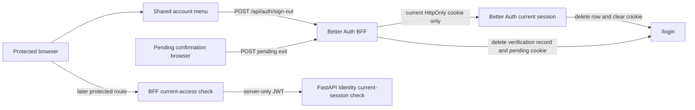

# 1. Context and scope

## Objective and source

Deliver `SHIFU-69` for the Identity module: an accessible account menu in the
shared authenticated web shell and a safe way for an individual learner to end
only the current browser session. Product authority was retrieved completely at
`2026-09-24T01:50:53Z` from the canonical [Identity PRD](https://joaogoliveiragarcia.atlassian.net/wiki/spaces/Shifu/pages/83001345/Shifu+PRD+Identity),
content ID `83001345`, version `1`. This is a **complete** Spec because the
slice crosses the TanStack Start shell, BFF session boundary, Better Auth
session persistence, protected-route hydration, responsive UI and browser
authorization behavior.

| Authority | URL or reference | Content/version | Selected coverage |
| --- | --- | --- | --- |
| Identity PRD | [Shifu - PRD - Identity](https://joaogoliveiragarcia.atlassian.net/wiki/spaces/Shifu/pages/83001345/Shifu+PRD+Identity) | `83001345`, version `1` | `RP-03`, `RP-10`; `JN-07` |
| Delivery issue | [SHIFU-69](https://joaogoliveiragarcia.atlassian.net/browse/SHIFU-69) | Retrieved 2026-09-24 | Account menu and current-session logout |
| Design | `design/shifu.pen` | Nodes `h7fGzC`, `x9zS2`, `sFInu` | Shared desktop header and open account-menu state |

## Current behavior and product gap

`AppLayout` exposes an inert desktop account trigger and has no corresponding
account action in its mobile header. The BFF validates a Better Auth session
against Identity for protected access, but `requireAuthMiddleware` discards that
safe current-access projection. `CookieSessionAuthProvider` and `AuthContext`
offer sign-in and pending-confirmation operations only. Better Auth already owns
the current browser session, including the built-in `POST /api/auth/sign-out`
operation, but the application does not expose or validate it as a user journey.
The pending-confirmation route and page are absent, so a pending account has no
implemented surface for the required restricted exit action.

## Scope and product alignment

| Area | In scope | Out of scope |
| --- | --- | --- |
| Account menu | Current display name/e-mail, disabled `Sua conta`, functional `Sair`, desktop and mobile access | Profile page, profile editing, e-mail changes and account settings navigation |
| Current session | Delete and clear only the initiating Better Auth session, redirect to Entrar and prevent restoration from reload/history | Sign out all devices, session/device lists, server-owned session revocation or JWT revocation |
| Pending confirmation | Preserve the approved standalone `Sair`, clear its pending cookie/verification record and navigate to Entrar | Rendering the full authenticated account menu for a pending account |
| Identity authorization | Continue FastAPI current-account checks for protected access | Altering Identity account status, access version or FastAPI session contracts |
| Experience | Keyboard, assistive technology, non-color status, narrow viewport, loading and retry states | Light theme, localization other than pt-BR or unrelated shell redesign |

| Source requirement | Delivery | Notes |
| --- | --- | --- |
| Identity `RP-03`, `JN-07` | partial | Delivers only ordinary current-device logout; all-device logout remains deferred. |
| Identity `RP-10` | full for this slice | Covers responsive, keyboard, focus, assistive feedback and non-color state communication. |

## Product decisions and assumptions

| Concern | Accepted contract |
| --- | --- |
| Session owner | Better Auth in the TanStack Start BFF owns browser-session creation, deletion and cookie clearing. FastAPI remains the authoritative current-account authorization boundary and receives only BFF-issued short-lived JWTs. |
| Current logout | The browser calls Better Auth `POST /api/auth/sign-out`; it deletes the current session row and clears the current session cookie. No FastAPI logout operation, migration or Identity business mutation is added. |
| JWT lifetime | A JWT minted before sign-out may remain valid until its existing five-minute expiry. It is never browser-readable, and the ended Better Auth session cannot mint another token. |
| Account identity display | Use the BFF's authenticated technical projection for the current display name and e-mail. The projection is synchronized from canonical Identity profile data at sign-in/confirmation; this delivery does not implement profile updates. |
| Pending exit | Use a BFF-owned endpoint to remove only the opaque pending verification record and cookie; return the browser to Entrar. It is not a Better Auth authenticated session and must never create or delete one. |
| Design deviation | `Sua conta` remains visible but disabled, non-navigating and absent from sequential focus as required by SHIFU-69. Its active Pencil chevron/affordance is intentionally omitted and recorded in the handoff. |
| Failure | If logout cannot be confirmed, retain the existing session and menu, explain the failure in pt-BR without technical details, and allow explicit retry. No automatic retry occurs. |

# 2. Implementation Contract

## Functional requirements

| ID | RP/JN/source coverage | Required behavior |
| --- | --- | --- |
| `RF-01` | `RP-03`, `RP-10`; SHIFU-69 | Present the account trigger and menu in every authenticated desktop and mobile application shell, with the current session's display name and e-mail. |
| `RF-02` | `RP-03`, `RP-10`; SHIFU-69 | Make the account menu operable by pointer, keyboard and assistive technology: expose trigger state, close on Escape and outside pointer interaction, retain a coherent focus path, and communicate controls in pt-BR. |
| `RF-03` | `RP-03`; SHIFU-69 | Keep `Sua conta` visible, disabled, non-navigating and outside sequential keyboard focus; make `Sair` the only functional menu action. |
| `RF-04` | `RP-03`, `JN-07`; SHIFU-69 | On explicit sign-out, terminate only the initiating current Better Auth browser session and clear its cookie without affecting another concurrent session of the same account. |
| `RF-05` | `RP-03`, `RP-10`; SHIFU-69 | During current-session logout, show understandable progress and prevent concurrent requests; after success, navigate to Entrar and ensure reload or browser history cannot restore the ended protected access. |
| `RF-06` | `RP-03`, `RP-10`; SHIFU-69 | On logout failure, preserve the current authenticated state, expose an announced recoverable pt-BR message that is not color-only, and permit retry. |
| `RF-07` | `RP-03`, `RP-10`, `JN-07`; SHIFU-69 | Let a pending-confirmation browser use its standalone `Sair` action to remove its opaque pending context and return to Entrar without creating or invalidating an authenticated session. |

## Acceptance criteria

| ID | RF coverage | Requirement | Given | When | Then | Expected evidence |
| --- | --- | --- | --- | --- | --- | --- |
| `CA-01` | `RF-01` | Current account summary | An authenticated learner opens any protected area | The shared layout renders at desktop or mobile width | The account trigger is available; its opened menu shows the current display name and e-mail without exposing an access token or other session secret | Layout/widget and route tests; `VM-01` |
| `CA-02` | `RF-01`, `RF-02` | Accessible menu lifecycle | The authenticated account trigger is available | The learner opens, traverses and dismisses it by pointer and keyboard | Trigger expanded state is correct; Escape and outside click close the menu; keyboard focus remains visible and Escape returns focus to the trigger; controls have clear pt-BR names | Widget/hook and Playwright layout tests; `VM-01` |
| `CA-03` | `RF-03` | Single functional action | The menu is open | The learner traverses its contents | `Sua conta` is visible with disabled semantics, no navigation and no tab stop; `Sair` is the only enabled action | Widget and Playwright tests; `VM-01` |
| `CA-04` | `RF-04`, `RF-05` | Current session ends | One browser holds a valid active session and another browser holds a concurrent session for the same account | The first browser chooses `Sair` and the request succeeds | Only the first session row/cookie is removed, that browser reaches `/login`, reload/history cannot regain protected access, and the second browser remains authorized | Better Auth handler integration and protected-route browser tests; `VM-02` |
| `CA-05` | `RF-05`, `RF-06` | Pending and recoverable logout feedback | The learner activates `Sair` | The request is pending, succeeds or fails | Pending text/progress is visible and duplicate activation is ignored; success redirects to Entrar; failure retains the session, focuses or announces an understandable error, and enables retry | Widget/hook and route tests; `VM-01`, `VM-02` |
| `CA-06` | `RF-07` | Pending-context exit | A pending-confirmation browser has an opaque pending context | The learner chooses standalone `Sair` | The verification record and pending cookie are removed, the URL becomes `/login`, and no Better Auth session is created, removed or disclosed | BFF handler, pending-page widget and route tests; `VM-03` |
| `CA-07` | `RF-04` to `RF-07` | Session and privacy boundary | Current-session and pending exits are exercised | Cookies, browser storage, BFF responses and protected-route requests are inspected | Passwords, JWTs, session tokens, pending identifiers, e-mail beyond the intentionally displayed account summary, and provider details are absent from URLs, browser storage, JavaScript-readable cookies and messages | Negative handler assertions and manual inspection; `VM-02`, `VM-03` |

## Cross-cutting restrictions

| Concern | Contract |
| --- | --- |
| Authorization | Identity rejection of the BFF JWT/current account remains a protected-route rejection that deletes the BFF session and redirects to Entrar. The existing sign-in contract's transient Identity-unavailability fallback remains unchanged by this slice; it permits the existing Better Auth technical projection only for unavailable/rate-limited/5xx Identity responses, never for a known authorization rejection. |
| Session isolation | Sign-out uses the requesting browser's HttpOnly session cookie only. It must not accept a session ID/account ID in its body, URL or client state. |
| Browser storage | Do not store e-mail, account ID, session token, pending identifier, JWT or logout state in `localStorage`, `sessionStorage`, URL parameters or JavaScript-readable cookies. |
| Logging and errors | Do not log cookies, session tokens, bearer values, pending identifiers, credential bodies or provider errors. User-visible failure copy remains safe and generic. |
| Concurrency | A menu instance permits one active logout request. Better Auth deletion is scoped to the current session; repeated browser requests after success are harmless and do not affect another session. |

## Design Contract

The required design authority and saved images are in [design/handoff.md](./design/handoff.md). Use existing dark-only Shifu tokens, Instrument Serif for brand, DM Sans for menu text, existing focus language and the shared Icon boundary. The `Sua conta` design deviation is approved in this Spec and must not be silently reverted to an interactive link.

# 3. Technical Contract

## Current technical state

| Evidence | Current responsibility | Gap |
| --- | --- | --- |
| `apps/web/src/provision/auth/better-auth/better-auth-provider.ts` | Better Auth database session, signed cookie, BFF-issued JWT and current Identity validation | No public application sign-out operation; rejected-session deletion does not clear the browser cookie. |
| `apps/web/src/provision/auth/cookie-session-auth-provider.ts` | Browser-safe sign-in and pending-confirmation requests | No current-session logout or pending-context exit operation. |
| `apps/web/src/middlewares/require-auth-middleware.ts` | Resolves current protected access | Discards display name/e-mail data needed by the shared shell. |
| `apps/web/src/ui/shared/widgets/layouts/root-layout` and `app-layout` | Composes authenticated shell and headers | Does not receive current account information or render account-menu behavior. |
| `apps/web/src/constants/routes.ts` | Declares `/pending-confirmation` as a public path | No route/page, generated route-tree entry or pending-exit test boundary exists. |
| `apps/server/src/shifu/identity/rest/controllers/get_current_session_controller.py` | Validates BFF JWT and supplies canonical account status/name/time zone | No change is required: FastAPI does not own Better Auth browser sessions. |

## Solution and runtime flow



`ServerAuthenticatedAccess` remains server-only and contains the current Identity
result plus the access token used by BFF-only operations. Route middleware maps it
to a separate serializable `LayoutAccount` of `{ displayName, email }`; no account
ID, time zone or token crosses the matched-route hydration boundary. The root shell
obtains `LayoutAccount` from the matched context and passes it to `AppLayout`, which
owns the shared account-menu widget. The widget owns open/close state and delegates
asynchronous exit to `AuthContext`; the cookie-session provider owns fetch/response
validation and navigation remains at the widget boundary.

Better Auth's built-in sign-out operation receives only the browser cookie, deletes
only its matching session and clears the associated cookie. A small custom BFF
pending-exit endpoint deletes the opaque verification record when one exists and
always expires the pending cookie. Neither operation calls FastAPI or starts a
transaction outside Better Auth's own persistence boundary.

| Boundary | Producer | Consumer | Canonical contract | Mapping/guarantees | Failure ownership |
| --- | --- | --- | --- | --- | --- |
| Protected access projection | `getCurrentAccess` -> route middleware | root shell, `AppLayout` | `ServerAuthenticatedAccess` -> `LayoutAccount { displayName, email }` | The token-bearing result stays server-only; middleware serializes only the layout projection derived from the Better Auth technical user after existing Identity authorization | Known authorization rejection deletes the session/redirects; transient unavailability follows the existing sign-in fallback policy. |
| Current logout | Better Auth `POST /api/auth/sign-out` | `CookieSessionAuthProvider.signOut` | Empty same-origin request -> successful empty response/cookie expiry | Current cookie selects one session; Better Auth deletes that session and expires cookie | Browser adapter maps network/non-success to safe recoverable `AuthError`; widget retains state. |
| Pending exit | BFF `POST /api/auth/pending-confirmation/sign-out` endpoint | `CookieSessionAuthProvider.exitPendingConfirmation` | Empty same-origin request -> `200 {}` and pending-cookie expiry; unavailable persistence -> safe `503` | Deletes only the matching opaque verification value if present and clears `shifu-pending-flow`; it does not read or delete a Better Auth session | BFF success is idempotent; browser adapter maps unavailable/invalid response safely. |

## UI

| Widget | Kind | Parent/entry | Direct children | Public contract | Behavior owner |
| --- | --- | --- | --- | --- | --- |
| `RootLayout` | Layout | root route shell | providers, `AppLayout` | Reads current matched access for protected shell composition | Existing root-layout hook plus route context consumption |
| `AppLayout` | Layout | `RootLayout` | desktop header, mobile header, account menu, content, bottom navigation | Receives authenticated account summary | Existing `useAppLayout` plus menu callback coordination |
| `AccountMenu` | Internal shared widget | `AppLayout` | trigger, summary, disabled row, logout action, alert | Receives display name/e-mail; reports state only through accessible DOM | `useAccountMenu` |
| `PendingConfirmationPage` | Page | `/pending-confirmation` | resend controls and standalone exit | Offers pending-context exit | `usePendingConfirmationPage` |

```text
apps/web/src/ui/shared/widgets/layouts/app-layout/
├── account-menu/
│   ├── index.tsx
│   ├── use-account-menu.ts
│   └── tests/
│       ├── account-menu.test.tsx
│       └── use-account-menu.test.ts
├── desktop-header/
│   ├── index.tsx
│   └── tests/desktop-header.test.tsx
├── mobile-header/
│   ├── index.tsx
│   ├── use-mobile-header.ts
│   └── tests/mobile-header.test.tsx
├── index.tsx
└── tests/app-layout.test.tsx
```

| Path | Change | Declaration/operation | Contract and guarantees | Dependencies/consumers | Generation/tests |
| --- | --- | --- | --- | --- | --- |
| `apps/web/src/provision/auth/better-auth/better-auth-provider.ts` | Modify | `ServerAuthenticatedAccess`, `LayoutAccount`, current session deletion, pending-exit endpoint | Keep the access token in server-only access; expose only layout-safe display name/e-mail through middleware; clear the rejected-session cookie; register `POST /pending-confirmation/sign-out` with `200 {}`/safe `503` and idempotent pending-context cleanup without touching Better Auth sessions | Middleware and cookie provider | Handler integration tests |
| `apps/web/src/provision/auth/cookie-session-auth-provider.ts` | Modify | `signOut`, `exitPendingConfirmation` | Same-origin POSTs, safe response validation and `AuthError` mapping; no browser secret persistence | Auth context and widgets | Auth-context/pending/account-menu tests |
| `apps/web/src/ui/shared/contexts/auth-context/types/auth-context-value.ts` | Modify | `AuthContextValue` | Exposes the new browser-safe operations only | Shared widgets/pages | Context test |
| `apps/web/src/middlewares/require-auth-middleware.ts` | Modify | `requireAuthMiddleware` | Maps server-only access to `LayoutAccount` rather than `undefined`; never returns a token | Every protected route and root shell | Route integration coverage |
| `apps/web/src/middlewares/enter-main-page-middleware.ts` | Modify | `enterMainPageMiddleware` | Publishes the existing entry event with server-only access, then returns only `LayoutAccount` | Root route | Existing main-page behavior remains covered |
| `apps/web/src/ui/shared/widgets/layouts/root-layout/index.tsx` | Modify | `RootLayout` | Reads current match context only for protected shell, passes account summary to `AppLayout` | App layout | Layout test |
| `apps/web/src/ui/shared/widgets/layouts/app-layout/index.tsx` | Modify | `AppLayout` | Composes one shared `AccountMenu` into desktop and mobile headers | Headers and protected pages | App-layout test |
| `apps/web/src/ui/shared/widgets/layouts/app-layout/account-menu/index.tsx` | Create | `AccountMenu` | Semantic trigger/menu, summary, disabled account row, only enabled logout action, alert and pending copy | `useAccountMenu`, shared Icon/Button | Component test |
| `apps/web/src/ui/shared/widgets/layouts/app-layout/account-menu/use-account-menu.ts` | Create | `useAccountMenu` | Owns menu lifecycle, outside/Escape cleanup, focus restoration, one in-flight logout and safe retry feedback | Auth context, navigation wrapper | Hook test |
| `apps/web/src/ui/shared/widgets/layouts/app-layout/desktop-header/index.tsx` | Modify | `DesktopHeader` | Hosts supplied account menu instead of inert fallback when authenticated | App layout | `AppLayout` component/browser test |
| `apps/web/src/ui/shared/widgets/layouts/app-layout/mobile-header/index.tsx` | Modify | `MobileHeader` | Makes account menu available alongside mobile navigation without interaction collision | App layout | `AppLayout` component/browser test |
| `apps/web/src/ui/shared/widgets/components/icon/index.tsx` | Modify | `IconName`, icon map | Adds required account/logout icons through the shared icon boundary | Account menu | Existing icon suite |
| `apps/web/src/routes/pending-confirmation/index.tsx` | Create | pending-confirmation route | Declares the canonical public `/pending-confirmation/` route and composes the page without protected middleware | `ROUTES.pendingConfirmation`, root shell | Generate `routeTree.gen.ts`; route test |
| `apps/web/src/routeTree.gen.ts` | Generate | TanStack generated route metadata | Registers the created pending-confirmation route; never edit manually | Route source | `pnpm --filter web generate-routes` |
| `apps/web/src/ui/identity/widgets/pages/pending-confirmation-page/index.tsx` | Create | standalone `Sair` control | Renders pending confirmation/resend state plus standalone exit; it calls the exit operation and cannot leave opaque context behind | Pending page hook | Page component/route test |
| `apps/web/src/ui/identity/widgets/pages/pending-confirmation-page/use-pending-confirmation-page.ts` | Create | pending exit state/handler | Owns pending status/resend/exit progress, safe failure and navigation to login | Auth context/navigation | Page component/route tests |
| `apps/web/tests/shared/app-layout.test.ts` | Modify | `AppLayout` browser suite | Covers account menu desktop/mobile lifecycle, keyboard/focus, sign-out request/redirect and post-logout denial using mocked route transport | Shared Playwright fixture | `CA-01` to `CA-05` browser coverage |
| `apps/web/tests/identity/sign-in-auth-handler.test.ts` | Modify | Better Auth handler suite | Adds real current-session deletion/cookie expiry and concurrent-session preservation | PostgreSQL and registered BFF handler | `CA-04`, `CA-07` |
| `apps/web/tests/identity/register-confirmation-auth-handler.test.ts` | Create | Pending-context handler suite | Covers pending verification/cookie cleanup and no-session assertion | PostgreSQL and registered BFF handler | `CA-06`, `CA-07` |
| `apps/web/tests/routes/identity/pending-confirmation.index.test.tsx` | Create | Pending route suite | Covers standalone exit request, redirect, failure/retry and narrow viewport | Mocked route transport | `CA-06` |

## Technical decisions

| Decision | Chosen approach | Alternative considered | Reason | Accepted trade-off |
| --- | --- | --- | --- | --- |
| Session revocation | Better Auth built-in current-session sign-out | New FastAPI logout endpoint and server-side Better Auth session repository | Better Auth owns the session/cookie lifecycle; FastAPI owns account authorization, not browser session persistence | A preexisting server-only JWT can remain valid for five minutes. |
| Pending exit | Dedicated BFF pending-context cleanup endpoint | Treating pending exit as a navigation link only | Pending context is server-backed and must be cleared, while it is not an authenticated session | Adds one BFF endpoint but no Identity/FastAPI contract. |
| Account profile source | Better Auth technical projection after existing Identity validation | Extending FastAPI `/identity/session` with e-mail | The profile is already synchronized at the session boundary and the slice excludes profile mutation | A future profile-editing slice must synchronize the projection or change this contract. |

# 4. Validation Contract

## Automated coverage

| Test file | Test type | Target | Coverage goal |
| --- | --- | --- | --- |
| `apps/web/src/ui/shared/widgets/layouts/app-layout/account-menu/tests/account-menu.test.tsx` | component | `AccountMenu` | Semantic menu rendering, disabled row, loading/error/success visual states and accessible action wiring with mocked owning hook. |
| `apps/web/src/ui/shared/widgets/layouts/app-layout/account-menu/tests/use-account-menu.test.ts` | hook | `useAccountMenu` | Open/close, Escape/focus restore, outside interaction, duplicate guard, success navigation and recoverable failure. |
| `apps/web/src/ui/shared/widgets/layouts/app-layout/tests/app-layout.test.tsx` | component | `AppLayout` composition | Desktop/mobile account-menu placement and account projection wiring. |
| `apps/web/src/ui/shared/contexts/auth-context/tests/use-auth-context-provider.test.ts` | hook | Auth context provider | Composes extended browser-safe auth surface once. |
| `apps/web/src/ui/identity/widgets/pages/pending-confirmation-page/tests/pending-confirmation-page.test.tsx` | component | Pending confirmation page | Standalone exit progress/failure/success rendering and action wiring with the page owning hook mocked. |
| `apps/web/tests/shared/app-layout.test.ts` | Playwright route/layout | Shared protected layout | Desktop `1440 x 900`, mobile `390 x 844`, keyboard/focus, outside click, sign-out request, redirect and protected-history denial using mocked transport. |
| `apps/web/tests/identity/sign-in-auth-handler.test.ts` | BFF handler integration | Registered Better Auth sign-out | Current cookie/session deletion, expired cookie and concurrent-session preservation against PostgreSQL. |
| `apps/web/tests/identity/register-confirmation-auth-handler.test.ts` | BFF handler integration | Pending exit endpoint | Pending verification/cookie removal and absence of Better Auth session effect. |
| `apps/web/tests/routes/identity/pending-confirmation.index.test.tsx` | Playwright route | Pending standalone exit | Request, URL, success/failure recovery and narrow viewport using mocked transport. |

| Acceptance | Automated boundary | Manual scenario | Evidence target |
| --- | --- | --- | --- |
| `CA-01` | Account-menu/layout component and shared Playwright suite | `VM-01` | Evaluation acceptance matrix and screenshots |
| `CA-02` | Account-menu hook/component and shared Playwright suite | `VM-01` | Evaluation focus/keyboard evidence |
| `CA-03` | Account-menu component and shared Playwright suite | `VM-01` | Evaluation accessibility evidence |
| `CA-04` | Better Auth handler and shared Playwright suite | `VM-02` | Evaluation cookie/session and protected-route evidence |
| `CA-05` | Account-menu hook/component and shared Playwright suite | `VM-01`, `VM-02` | Evaluation state/recovery evidence |
| `CA-06` | Pending handler/page/route suites | `VM-03` | Evaluation pending cleanup evidence |
| `CA-07` | Handler negative assertions and browser inspection | `VM-02`, `VM-03` | Evaluation privacy checklist |

## Manual validation

### VM-01 - Account-menu interaction and accessibility

1. Start web and required local services, confirm the web root and `GET /health` respond, and establish an active test session.
2. At `1440 x 900`, open a protected page, compare it to `design/references/sFInu.png`, open the account menu and compare it to `x9zS2.png`.
3. Verify current display name/e-mail, disabled `Sua conta`, enabled `Sair`, no horizontal clipping and no console/network errors.
4. Navigate with Tab and Shift+Tab; open the menu from the trigger; use Escape and verify visible focus returns to the trigger; reopen and close by clicking outside.
5. At `390 x 844`, repeat opening, focus, Escape and outside interaction. Capture fresh screenshots for both viewports.

### VM-02 - Current-session logout isolation

1. Create two authenticated browser contexts for one active account, then open a protected route in both.
2. In the first context, choose `Sair`; observe `Saindo...`, one same-origin sign-out request, successful navigation to `/login`, cookie expiry and no failed request/console error.
3. Reload and navigate backward/forward in the first context; protected content must redirect to Entrar.
4. Refresh a protected route in the second context; it must remain authorized.
5. Inspect browser storage, URLs, cookies, DOM and network data for prohibited secrets. Capture the post-logout desktop screenshot.

### VM-03 - Pending-context exit

1. Establish a pending-confirmation context and open `/pending-confirmation` at `390 x 844`.
2. Activate standalone `Sair`; verify progress, one same-origin pending-exit request and final URL `/login`.
3. Reopen `/pending-confirmation`; confirm no context restores the previous pending state and no authenticated session exists.
4. Force a safe unavailable response, verify recovery message and retry behavior, then inspect console/failed requests and capture a screenshot.

## Commands

| Command | Purpose |
| --- | --- |
| `pnpm --filter web generate-routes` | Synchronize route metadata only if route files change. |
| `pnpm --filter web check:lint` | Biome validation for web source/tests. |
| `pnpm --filter web check:architecture` | Validate web dependency direction. |
| `pnpm --filter web check:types` | Strict TypeScript checking. |
| `pnpm --filter web test:unit` | Run widget, hook and context tests. |
| `pnpm --filter web test:integration` | Run Playwright layout, route and BFF-handler integration suites. |
| `pnpm --filter web build` | Build the TanStack Start application. |

The server test gates are not applicable because this approved slice adds no
FastAPI, Identity core, persistence, migration or server-composition change.

# 5. Documentation alignment and revision history

| Document | Authority for | State | Required change/confirmation |
| --- | --- | --- | --- |
| `documentation/sdd.md` | Artifact lifecycle and traceability | confirmed | This complete Spec records PRD ID/version/retrieval time, `RP-*`/`JN-*`, Rule Pack, validation and revision history. |
| `documentation/modules.md` | Identity ownership | confirmed | Identity owns account/session behavior; BFF technical session handling does not transfer business authority. |
| `documentation/architecture.md` | BFF/FastAPI boundary | confirmed | BFF owns authentication session; FastAPI continues authorization. No API logout endpoint is introduced. |
| `documentation/design.md` | Shared UI, responsive/accessibility and tokens | confirmed | Existing Dojo editorial system applies; disabled account-row divergence is feature-local and recorded in handoff. |
| `documentation/tooling.md` | Executable commands | confirmed | Web commands above exist; server commands are outside this frontend/BFF scope. |
| `documentation/features/identity/account-menu-logout/design/handoff.md` | Saved Pencil implementation/visual authority | created | This repository's established feature-local handoff convention is permitted by the create-Spec prompt; it contains node inventory, exports, deviation and runtime validation requirements. |

| Rule | Applies to | Evaluated revision |
| --- | --- | --- |
| `documentation/rules/typescript-conventions-rules.md` | Web source/tests | `9873dbc` |
| `documentation/rules/ui-layer-rules.md` | Shared widgets, context, auth provision and navigation | `9873dbc` |
| `documentation/rules/web-app-routing-rules.md` | Protected route context and browser suites | `9873dbc` |
| `documentation/rules/widget-testing-rules.md` | Widget/hook/layout/handler test placement | `9873dbc` |
| `documentation/rules/provision-layer-rules.md` | Better Auth provision boundary | `9873dbc` |

| Revision | Date | Material change | Reason |
| --- | --- | --- | --- |
| 1 | 2026-09-24 | Created draft account-menu and current-session logout Contract | SHIFU-69, Identity PRD version 1 and approved technical/design decisions |
| 2 | 2026-09-24 | Separated server-only and hydrated account projections; specified pending-exit HTTP contract; moved header coverage to `AppLayout` | Independent Spec Reviewer compatibility corrections |
| 3 | 2026-09-24 | Classified absent pending-confirmation route, page and test boundaries as Create, and route tree as Generate | Current-worktree verification resolved the Spec Reviewer path finding |
