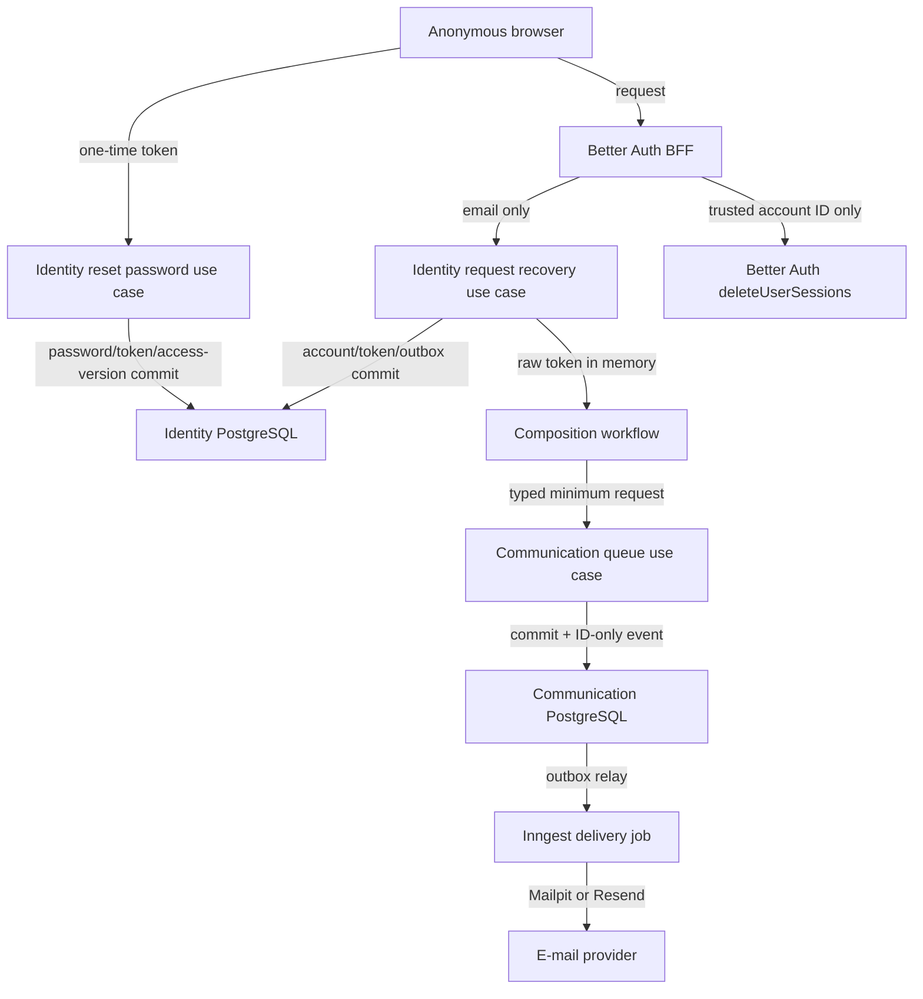

# 1. Context and scope

## Objective and source

Deliver `SHIFU-63`: an anonymous learner can request a password-recovery e-mail,
use a one-time link to choose a new password, and then enter again. Identity owns
account eligibility, recovery tokens, cooldown, password mutation, and access
invalidation. Communication owns the controlled recovery-message catalog,
composition, delivery, retries, and known delivery state.

This is a **complete** Spec: it changes public routes and BFF handlers, Identity
and Communication contracts, PostgreSQL schema, a generated e-mail asset, Inngest
jobs, Better Auth session handling, and responsive accessible UI.

Product authority was retrieved completely at `2026-09-25T15:11:02-03:00`.

| Authority | URL | Content/version | Selected coverage |
| --- | --- | --- | --- |
| Identity PRD | [Shifu — PRD — Identity](https://joaogoliveiragarcia.atlassian.net/wiki/spaces/Shifu/pages/83001345/Shifu+PRD+Identity) | `83001345`, version `1` | `RP-04`, `RP-10`, `JN-04` |
| Communication PRD | [Shifu — PRD — Communication](https://joaogoliveiragarcia.atlassian.net/wiki/spaces/Shifu/pages/86114306/Shifu+PRD+Communication) | `86114306`, version `1` | `RP-01` through `RP-07`, `JN-02` through `JN-05` |
| Delivery issue | [SHIFU-63](https://joaogoliveiragarcia.atlassian.net/browse/SHIFU-63) | updated `2026-09-25T13:29:03.978-0300` | Full-stack password recovery and reset |

## Current behavior and product gap

The repository has a registration-confirmation flow with opaque pending context,
hashed `AccountActionToken` persistence, Communication queueing/delivery, Mailpit
and Resend providers, and Better Auth technical sessions. `AccountActionTokenType`
already contains `PASSWORD_RECOVERY`, and the `Account` entity can invalidate old
access through `access_version`.

There are no recovery controllers, BFF endpoints, `/forgot-password` or
`/reset-password` route files, recovery widgets, recovery use cases, or recovery
template. Communication currently couples its correlation, delivery status, and
cancellation contracts to `identity_confirmation_id`; its renderer accepts only an
account-confirmation template and requires `display_name`.

## Scope and product alignment

| Area | In scope | Out of scope |
| --- | --- | --- |
| Recovery request | Generic e-mail submission, active/pending eligibility, 60-second accepted-request cooldown, opaque real/decoy status and safe retry | Account enumeration, account creation, confirmation resend |
| Reset | One-use one-hour link, valid/expired/used/invalid outcomes, eight-character password plus confirmation, password replacement and redirected sign-in | Authenticated password change, current-session retention, password-policy expansion |
| Sessions | Increment `access_version`, delete Better Auth sessions by trusted account ID, clear the current cookie | User-initiated device/session management |
| Communication | Recovery message catalog entry, minimum values, generated template, asynchronous idempotent delivery, expiry-aware retries and known failure reporting | New channel, provider, or public sender API |
| Shared contract | Generalize confirmation-only action-token correlation used by registration confirmation and recovery | Rebuilding SHIFU-61 delivery infrastructure |
| Experience | Pencil-aligned public desktop/mobile pages, keyboard, focus, announcements and non-color-only feedback | New visual language, themes, localization beyond pt-BR |

| Source requirement | Delivery | Notes |
| --- | --- | --- |
| Identity `RP-04`, `JN-04` | full | Covers request, token, reset, session invalidation and pending-confirmation preservation. |
| Identity `RP-10` | full for this slice | Covers responsive and accessible recovery surfaces. |
| Communication `RP-01` through `RP-07` | full for password recovery | Covers the authorized request, catalog, e-mail delivery, retry, idempotency, state and privacy. |
| Communication `JN-02` through `JN-05` | full for password recovery | Covers delivery, temporary/permanent failure, explicit reissue and technical replay. |

## Product decisions and assumptions

| Concern | Accepted contract |
| --- | --- |
| Public URLs | Request remains at `/forgot-password`; a successful submission replaces its form with generic status. The recovery action URL is `/reset-password?token=<token>`. |
| Eligibility and privacy | Only active and pending-confirmation accounts can receive a message. Deleted and unknown e-mails create no token or Communication request. Every public request gets an indistinguishable accepted result and an opaque real or decoy BFF context. |
| Context lifetime | The opaque recovery context lasts exactly one hour. It contains no browser-readable e-mail, account ID, raw token, link, or eligibility result. |
| Recovery token | Generate at least 256 bits of cryptographic entropy, persist only a SHA-256 hash, expire exactly one hour after issue, and allow one successful use. A later accepted request invalidates unused earlier recovery tokens. |
| Cooldown and retry | Eligible accepted requests have a rolling 60-second interval. Delivery status is generic; a terminal delivery failure permits a new request through the same opaque context. Retries must not begin or send after the recovery token expires. |
| Password and account state | Require a new password of at least eight characters and a matching confirmation. A successful reset preserves `PENDING_CONFIRMATION` rather than confirming the account. |
| Session revocation | Reset advances `access_version`; the BFF deletes all Better Auth sessions for the trusted account ID and clears its current cookie. A physical-delete failure remains operational work, while the version check safely rejects old sessions. |
| Message data | The recovery template receives only `action_url` and `expires_at`, with no display name. Raw values are encrypted in Communication persistence, never placed in logs or Inngest payloads. |
| Cross-module correlation | Replace the confirmation-specific `identity_confirmation_id` contract with `identity_action_token_id` through a forward migration. Confirmation and recovery retain one unique, typed action-token correlation. |

# 2. Implementation Contract

## Functional requirements

| ID | RP/JN/source coverage | Required behavior |
| --- | --- | --- |
| `RF-01` | Identity `RP-04`, `RP-10`, `JN-04`; SHIFU-63 | Present a public pt-BR recovery request at `/forgot-password` with a labeled e-mail field, client/server validation that preserves valid input, and generic feedback that never reveals account eligibility. |
| `RF-02` | Identity `RP-04`, Communication `RP-01`, `JN-02` | For an active or pending account outside the accepted-request cooldown, issue a replacement one-hour recovery token, invalidate older pending recovery tokens, and queue exactly one typed Communication request. Unknown or deleted e-mails make no Identity or Communication mutation. |
| `RF-03` | Identity `RP-04`, Communication `RP-03` to `RP-06` | Keep the post-request state in `/forgot-password` through a one-hour opaque real/decoy context. It exposes only generic ready, cooldown, and delivery-issue states, permits recovery from a terminal delivery issue, and never leaks e-mail, account status, token, or provider detail. |
| `RF-04` | Communication `RP-01` to `RP-07`, `JN-02` to `JN-05` | Compose a controlled Portuguese password-recovery e-mail that identifies Shifu, explains the action, states one-hour validity, and provides one accessible reset action. Deliver asynchronously, idempotently and without exposing secret content in diagnostics. |
| `RF-05` | Identity `RP-04`, `RP-10`, `JN-04` | Capture the reset token from `/reset-password`, remove it from the settled browser URL, and distinguish valid, expired, used, invalid, and unavailable states with their approved recovery paths. |
| `RF-06` | Identity `RP-04`, `JN-04` | On a valid reset, validate a new eight-character password and matching confirmation, replace the account password, consume the submitted token once, invalidate pending recovery siblings, and preserve pending confirmation status when applicable. |
| `RF-07` | Identity `RP-03`, `RP-04`, `JN-04` | After a successful reset, invalidate all existing access through `access_version`, remove Better Auth sessions for that account, clear the current browser session, inform the user that access ended, and route to sign-in. |
| `RF-08` | Identity `RP-10`; SHIFU-63 | Make request, status, reset and recovery actions responsive, keyboard-operable, focus-visible, announced to assistive technology, and understandable without color alone. |

## Acceptance criteria

| ID | RF coverage | Requirement | Given | When | Then | Expected evidence |
| --- | --- | --- | --- | --- | --- | --- |
| `CA-01` | `RF-01`, `RF-08` | Public request form | An anonymous learner opens `/forgot-password` at desktop or narrow mobile width | They navigate and submit malformed input | The page uses the supplied visual language, has a labeled e-mail input and clear error, preserves valid input, exposes keyboard focus, and has no clipping or horizontal overflow | Widget/route tests and `VM-01` |
| `CA-02` | `RF-01` to `RF-03` | Private request outcome | The address belongs to an active, pending, deleted, or no account | The same request is submitted | Browser status/body/navigation and visible generic message are indistinguishable; only active/pending accounts create one token/request, while deleted/unknown create none | Use-case, controller, handler and route tests |
| `CA-03` | `RF-02`, `RF-03` | Cooldown and replacement | An eligible account requests recovery twice within 60 seconds, then after 60 seconds | The requests settle, including concurrent accepted attempts | The first accepted request creates one one-hour token/request; the cooldown creates none; the next accepted request invalidates prior unused recovery tokens and creates one replacement; visible output remains generic | Use-case concurrency, controller and `VM-02` |
| `CA-04` | `RF-03`, `RF-04` | Recovery delivery state | A real or decoy opaque recovery context exists | Status is loaded or delivery reaches a terminal failure | The browser sees only generic ready/cooldown/delivery-issue feedback. A failure offers a new generic attempt; no provider result, account, or e-mail is disclosed | Handler/route tests, real job test and `VM-03` |
| `CA-05` | `RF-04` | Transactional e-mail | A valid recovery request has committed | Communication processes it locally | Mailpit receives one pt-BR Shifu recovery message with one reset action and one-hour validity; template values, URL/token and body are absent from logs/events | Package checks, real Inngest/Mailpit test and `VM-04` |
| `CA-06` | `RF-04` | Retry and idempotency | The same request/event is replayed, or the provider returns temporary/permanent failure | Communication settles each processing attempt | A replay produces at most one effective send; temporary failure retries only while the linked token remains valid; permanent/exhausted/expired delivery produces a known safe state and no password/account mutation | Communication use-case and real job tests |
| `CA-07` | `RF-05`, `RF-08` | Reset link outcomes | A reset token is valid, expired, already used, invalidated, malformed, or unknown | `/reset-password` resolves it | The token is removed from the URL before the settled state; valid permits the form, expired offers a new request, and used/invalid offer sign-in or a new request without account detail | Use-case/controller/widget/route tests and `VM-05` |
| `CA-08` | `RF-06`, `RF-07` | Successful reset and access invalidation | A valid recovery token belongs to an active or pending account with existing Better Auth sessions | A matching valid password/confirmation is submitted | Password and token state change atomically; all pending recovery tokens become unusable; old sessions reject through new access version and are removed by account ID; current cookie clears; user reaches sign-in and pending account remains pending | Use-case, controller, auth-handler integration and `VM-06` |
| `CA-09` | `RF-06`, `RF-08` | Reset validation and failure safety | The token is valid but password is short/mismatched, or Identity/BFF is unavailable | Submission settles | The page shows understandable field or generic recovery feedback, never changes password/sessions for validation failure, prevents duplicate submit, and keeps the user recoverable | Widget, controller, handler and route tests |

## Cross-cutting restrictions

| Concern | Contract |
| --- | --- |
| Browser secrets | Never store raw tokens, e-mail, account IDs, Communication IDs, passwords, or opaque-context payloads in browser-readable storage. Capture and remove `token` from the URL before remote settlement. |
| Authorization | Public browser operations reach Identity only through same-origin Better Auth BFF endpoints. Identity requires the existing BFF secret and never accepts a browser-supplied account ID for recovery, reset, or session revocation. |
| Transactions | Identity owns the account/token/outbox transaction. Communication owns its request/attempt/outbox transaction. Better Auth session deletion happens after the committed reset; no distributed transaction is implied. |
| Concurrency | Lock token/account rows for issue, cooldown, invalidation and use. Database constraints and stable Communication IDs prevent duplicate official state. |
| Privacy and logs | Passwords, hashes, raw token, full action URL, encrypted content, e-mail body, cookies, authorization headers and provider credentials must not appear in logs, job payloads, or public responses. |
| Failure recovery | A Communication or session-deletion failure does not roll back a committed reset. `access_version` is the immediate security boundary; delayed physical session cleanup is observable operational recovery. |

## Design Contract

`design/shifu.pen` is the visual source. The following frames were inspected at
`1440 x 900`, exported at Pencil scale `1`, and recorded in
[`design/handoff.md`](./design/handoff.md). Pencil reported no clipping or
overflow. This removes the design-evidence blocker; this Spec remains `draft`
until the registration-confirmation correlation amendment is reviewed.

| Reference | Source/node | Route/surface/state | Viewport | Screenshot | Visible inventory | Interaction/state coverage | Ambiguities/exclusions | Validation target |
| --- | --- | --- | --- | --- | --- | --- | --- | --- |
| Request | Pencil `CGmXc` | `/forgot-password`, default and derived generic-status states | 1440 x 900 | [`CGmXc.png`](./design/CGmXc.png) | Public shell, e-mail form, primary request action and entry navigation | Validation, submitting, generic accepted/cooldown/delivery-issue/retry | Status states are approved derived states on the same route | `CA-01` to `CA-04`, `VM-01` to `VM-03` |
| Reset | Pencil `VcFmX` | `/reset-password`, valid form and success states | 1440 x 900 | [`VcFmX.png`](./design/VcFmX.png) | Public shell, password/confirmation inputs, primary action | Valid, validation, submitting, success and pending-confirmation explanation | Mobile states are derived from this frame | `CA-07` to `CA-09`, `VM-05`, `VM-06` |
| Link outcomes | Pencil `lfk5T` | `/reset-password`, expired, used and invalid | 1440 x 900 | [`lfk5T.png`](./design/lfk5T.png) | Textual status, icon reinforcement and one recovery action | URL cleanup, focus and navigation by outcome | No extra account disclosure or session continuation | `CA-07`, `VM-05` |

The implementation uses the existing dark-only Dojo editorial tokens, Instrument
Serif headings, DM Sans controls, textual and icon-supported status, 44 px mobile
targets and two-pixel focus treatment. Runtime-only countdown/status updates must
respect `prefers-reduced-motion`. Narrow validation covers `375 x 812`; short mobile
validation covers `375 x 667` with scroll rather than clipped actions.

# 3. Technical Contract

## Current technical state

| Evidence | Current responsibility | Gap |
| --- | --- | --- |
| `apps/server/src/shifu/identity/core/domain/entities/account.py` | Normalizes e-mail and invalidates existing access through `access_version` | No password-recovery state transition or reset orchestration. |
| `apps/server/src/shifu/identity/core/domain/entities/account_action_token.py` | Stores hashed action tokens and supports use/invalidate | Delivery/status methods and public correlation are confirmation-specific. |
| `apps/server/src/shifu/identity/core/interfaces/account_action_tokens_repository.py` | Provides lock-aware hash, latest and pending-token lookups | Its extended protocol is confirmation-named even though recovery uses the same aggregate. |
| `apps/server/src/shifu/composition/registration_confirmation_workflow.py` | Translates confirmation into Communication queueing | No recovery workflow; it composes confirmation-specific correlation and recipient name. |
| `apps/server/src/shifu/communication/core/use_cases/deliver_communication_use_case.py` | Delivers five attempts with `1, 5, 15, 60` minute delays | It does not stop an action message whose linked token has expired. |
| `apps/server/src/shifu/communication/core/domain/structures/message_template_values.py` | Requires name, URL and expiry for confirmation | Recovery must use only URL and expiry. |
| `apps/server/src/shifu/communication/providers/email/template/generated_email_message_renderer.py` | Loads only `account-confirmation` generated artifacts | No type-to-template catalog mapping. |
| `apps/web/src/provision/auth/better-auth/better-auth-provider.ts` | Owns BFF endpoints, signed opaque pending context and technical sessions | No recovery context/endpoints; no all-session deletion after reset. |
| `apps/web/src/constants/routes.ts` | Declares `/forgot-password` as public link destination | No reset route constant and neither public route file exists. |
| `apps/server/migrations/versions/d7f4e9a1c2b3_add_registration_confirmation_delivery.py` | Introduced `identity_confirmation_id` and its partial unique index | Historical migration must be preserved; a forward migration must generalize the column/index and persist delivery expiry. |

## Solution and runtime flow



Identity normalizes the submitted e-mail, uses a locked active-or-pending lookup,
and either returns a decoy handle with no mutation or commits one recovery token and
its stable Communication ID. The raw token exists only until composition constructs
the action URL. After the separate Communication queue transaction returns, the
request/retry use case opens a new Identity transaction to record `queued` or
`delivery_unavailable` against the action token. The BFF stores the real/decoy handle
in its own one-hour signed HttpOnly recovery context and exposes only generic status to
the browser.

Communication receives a stable request ID, generic action-token correlation,
recipient e-mail, recovery type, action URL and expiry. It encrypts retryable values,
publishes only IDs through the outbox, and refuses a provider attempt when the action
has expired or its next retry would reach expiry. Token invalidation from a reissue,
reset, confirmation, or account expiry emits one neutral cancellation event in the
Identity transaction; Communication cancels a pending/retrying matching request as an
idempotent no-op when the queue never committed. Identity consumes known status by the
correlation only.

Reset locks the token by hash and its account in one Identity transaction, validates
the token is pending/recovery/unexpired, updates the Argon2id password hash, uses the
token, invalidates recovery siblings, and advances access version. It returns the
trusted account ID only to the BFF. The BFF calls Better Auth's internal
`deleteUserSessions(accountId)` capability and clears the current session cookie. If
that physical cleanup fails, the BFF writes the fixed non-secret operational event
`password_reset_session_cleanup_failed` without account, token, cookie, or provider
data, then returns the reset success result without restoring old access; session JWT
validation rejects the prior `access_version`.

## Boundary contracts

| Boundary | Producer | Consumer | Canonical contract | Mapping/guarantees | Failure ownership |
| --- | --- | --- | --- | --- | --- |
| Request endpoint | BFF | Identity | `POST /identity/password-recovery-requests` with `{email}` → `202 {recovery_handle,is_decoy}` | `recovery_handle` is 256-bit base64url and only the BFF persists it. A decoy has the same shape. | Identity owns eligibility/cooldown; BFF owns public generic response. |
| Recovery status/retry | BFF | Identity | `POST /identity/password-recoveries/status` and `/retry` with `{recovery_handle}` | Returns only `ready|cooldown|delivery_issue` and `retry_after_seconds`; unknown/expired/decoy stays generic. | Identity owns status/reissue; UI owns neutral presentation. |
| Reset-link status endpoint | BFF | Identity | `POST /identity/password-reset-links/status` with `{token}` → `200 {result:"valid"|"expired"|"used"|"invalid"}` | Non-mutating BFF-only resolution of a syntactically valid link before form rendering; no account, e-mail, or token metadata crosses the browser response. | Identity owns token state; BFF owns URL cleanup and generic presentation. |
| Reset endpoint | BFF | Identity | `POST /identity/password-resets` with `{token,password}` → `200 {result:"reset",account_id,requires_email_confirmation}` or `200 {result:"expired"|"used"|"invalid"}` | `account_id` never crosses the browser response. Missing/malformed client token is `invalid` without API call. | Identity owns token/password state; BFF owns cookie/session cleanup. |
| Identity-to-Communication | Identity composition result | Communication queue | `CommunicationRequest` with `communication_id`, `identity_action_token_id`, recipient e-mail, recovery type, action URL and expiry | No Identity entity/model import in Communication. Action URL is encrypted before Communication commit. | Queue failure preserves Identity state and becomes safe delivery issue. |
| Communication status event | Communication job | Identity job | `{communication_id,identity_action_token_id,state:"delivered"|"temporary_failure"|"permanent_failure"|"exhausted"|"cancelled"|"expired"}` | Stable ID-only event; consumer validates the pair and never imports Communication core. `expired` records that delivery was suppressed because the action token can no longer be used. | Communication owns provider/retry classification; Identity owns user-visible recovery state. |
| Queue outcome reconciliation | Recovery request/retry use case | Identity action-token status operation | `queued|delivery_unavailable` result returned by the output port | Runs only after the queue transaction settles and records the safe status in a second Identity transaction; it cannot roll back issued token/account state. | Identity owns generic user status and later cancellation. |
| Action-token cancellation | Identity use case/outbox | Communication cancellation job | `{communication_id,identity_action_token_id,reason:"confirmed"|"reissued"|"expired"|"reset"}` | Produced for superseded/consumed/expired action tokens in the same Identity transaction; Communication stops pending/retrying delivery and makes duplicates no-ops. | Identity owns the reason; Communication owns cancellation state. |
| Session revocation | Reset BFF handler | Better Auth internal adapter | `deleteUserSessions(accountId)` after successful Identity reset | Deletes all technical session rows for the trusted account; response clears current cookie even if no cookie was present. | BFF owns deletion attempt/operational reporting; access version remains security authority. |

## Affected layer contracts

### apps/server — Identity

| Path | Change | Declaration/operation | Contract and guarantees | Dependencies/consumers | Generation/tests |
| --- | --- | --- | --- | --- | --- |
| `apps/server/src/shifu/identity/core/domain/entities/account.py` | Modify | `replace_password` transition | Replaces only the supplied Argon2id hash and advances `access_version` without changing active/pending status. | Reset use case | Use-case/controller coverage |
| `apps/server/src/shifu/identity/core/domain/entities/account_action_token.py` | Modify | Generic action-token correlation, delivery and recovery-context transitions | Replaces confirmation-only guards/names; supports one-hour recovery use, generic status recording and opaque recovery-handle hash without exposing a secret. | Recovery and existing confirmation flows | Use-case coverage |
| `apps/server/src/shifu/identity/core/domain/enums/account_confirmation_delivery_status.py` | Remove | Confirmation-specific delivery enum | Replaced by action-token-neutral delivery status with identical accepted state semantics. | Token/entity/repository consumers | Update all consumers |
| `apps/server/src/shifu/identity/core/domain/enums/account_action_token_delivery_status.py` | Create | `AccountActionTokenDeliveryStatus` | Typed `queued`, `delivered`, `temporary_failure`, `permanent_failure`, `exhausted`, `cancelled`, `expired` values for either action-token type. | Token and recovery status use case | Use-case coverage |
| `apps/server/src/shifu/identity/core/domain/enums/account_confirmation_cancellation_reason.py` | Remove | Confirmation-specific cancellation enum | Replaced by an action-token-neutral reason enum containing `confirmed`, `reissued`, `expired` and `reset`. | Existing confirmation/recovery cancellation producers | Update all consumers |
| `apps/server/src/shifu/identity/core/domain/enums/account_action_token_cancellation_reason.py` | Create | `AccountActionTokenCancellationReason` | Controls cancellation semantics for confirmation and recovery without leaking message content. | Cancellation event/use cases | Use-case/job coverage |
| `apps/server/src/shifu/identity/core/domain/structures/password_recovery.py` | Create | Request, opaque-context, status and reset result structures | Carries normalized e-mail internally; BFF-facing result contains only the opaque handle/decoy or safe discriminator. | Controllers/use cases/composition | Unit/controller coverage |
| `apps/server/src/shifu/identity/core/interfaces/account_action_tokens_repository.py` | Modify | Rename extended protocol and generic lock operations | Rename `ConfirmationAccountActionTokensRepository` to action-token-neutral contract; preserve locked hash/latest/pending queries for both types. | SQLAlchemy implementation/use cases | Architecture/type checks |
| `apps/server/src/shifu/identity/core/interfaces/password_recovery_delivery_gateway.py` | Create | Identity-owned output port | Accepts a typed recovery delivery request and returns a safe queued/unavailable result without Communication imports. | Request/retry use cases; composition | Use-case/controller coverage |
| `apps/server/src/shifu/identity/core/use_cases/request_password_recovery_use_case.py` | Create | `RequestPasswordRecoveryUseCase.execute` | Locks eligible account, applies cooldown, invalidates pending recovery tokens, creates token/handle/correlation, commits then requests queueing; unknown/deleted results are decoys with no mutation. | Database, clock, ID, token/hash and gateway ports | Unit/concurrency coverage |
| `apps/server/src/shifu/identity/core/use_cases/get_password_recovery_status_use_case.py` | Create | `GetPasswordRecoveryStatusUseCase.execute` | Resolves a real or unknown handle to the generic status vocabulary and never returns account identity. | Token repository | Unit/controller coverage |
| `apps/server/src/shifu/identity/core/use_cases/retry_password_recovery_use_case.py` | Create | `RetryPasswordRecoveryUseCase.execute` | Uses only opaque context, enforces cooldown and creates a replacement recovery request only when a terminal delivery issue is eligible. | Request use case/ports | Unit/concurrency coverage |
| `apps/server/src/shifu/identity/core/use_cases/reset_password_use_case.py` | Create | `ResetPasswordUseCase.execute` | Locks and consumes one valid recovery token, updates password, invalidates siblings and returns BFF-only account/session facts atomically. | Account/token repositories, clock/hash provider | Unit/concurrency coverage |
| `apps/server/src/shifu/identity/core/use_cases/resolve_password_reset_link_use_case.py` | Create | `ResolvePasswordResetLinkUseCase.execute` | Resolves a submitted recovery token without mutation to the safe `valid`, `expired`, `used`, or `invalid` vocabulary. | Token repository and clock provider | Use-case/controller coverage |
| `apps/server/src/shifu/identity/core/use_cases/record_communication_delivery_state_use_case.py` | Modify | Generic action-token delivery-status recording | Renames confirmation-only declarations and records `queued`, unavailable, delivery, expiry and cancellation states only for the matched correlation. | Request/retry use cases and status job | Unit/job coverage |
| `apps/server/src/shifu/identity/core/domain/events/account_confirmation_cancelled.py` | Remove | Confirmation-specific cancellation event | Replaced by a generic ID-only action-token cancellation event. | Existing event consumers | Update all producers/consumers |
| `apps/server/src/shifu/identity/core/domain/events/account_action_token_cancelled.py` | Create | `AccountActionTokenCancelledEvent` | Publishes the immutable communication/action-token pair and controlled reason from the owning Identity transaction. | Communication cancellation job | Job coverage |
| `apps/server/src/shifu/identity/core/use_cases/confirm_account_use_case.py`, `resend_email_confirmation_use_case.py`, `expire_unconfirmed_accounts_use_case.py`, `request_password_recovery_use_case.py`, `retry_password_recovery_use_case.py`, `reset_password_use_case.py` | Modify | Cancellation and post-queue outcome producers | Emit generic cancellation for every superseded/consumed/expired token and reconcile `queued|delivery_unavailable` after the output-port result. | Identity outbox/Communication job | Use-case/controller/job coverage |
| `apps/server/src/shifu/identity/rest/controllers/request_password_recovery_controller.py` | Create | `POST /identity/password-recovery-requests` | BFF-authenticated public-flow adapter with `202` response model. | Request use case | Controller and REST-client parity |
| `apps/server/src/shifu/identity/rest/controllers/get_password_recovery_status_controller.py` | Create | `POST /identity/password-recoveries/status` | Returns only safe generic state and retry seconds. | Status use case | Controller coverage |
| `apps/server/src/shifu/identity/rest/controllers/retry_password_recovery_controller.py` | Create | `POST /identity/password-recoveries/retry` | Reissues only through a valid opaque context; never accepts account/e-mail from browser. | Retry use case | Controller coverage |
| `apps/server/src/shifu/identity/rest/controllers/reset_password_controller.py` | Create | `POST /identity/password-resets` | Transport-validates token/password; returns exact reset-link discriminator and BFF-only reset metadata. | Reset use case | Controller and REST-client parity |
| `apps/server/src/shifu/identity/rest/controllers/resolve_password_reset_link_controller.py` | Create | `POST /identity/password-reset-links/status` | BFF-authenticated, non-mutating transport adapter that returns only the safe reset-link discriminator. | Reset-link resolver use case | Controller and REST-client parity |
| `apps/server/src/shifu/identity/rest/router.py` and `apps/server/src/shifu/identity/pipes/identity_pipe.py` | Modify | Route registration and dependency factories | Register each route once; construct recovery gateway and reuse core-only provider protocols. | FastAPI composition | Controller coverage |
| `apps/server/src/shifu/identity/database/sqlalchemy/models/account_action_token_model.py`, `mappers/account_action_token_mapper.py`, `repositories/account_action_tokens_repository.py` | Modify | Recovery context/status persistence and locking | Map the resulting schema, locked e-mail/type queries, handle lookup, invalidation and generic action-token identifier. Repositories do not commit. | Identity database transaction | PostgreSQL controller/job coverage |
| `apps/server/migrations/versions/<new>_generalize_identity_action_token_delivery.py` | Create | Forward migration | Renames the Communication correlation column/index to `identity_action_token_id`, adds a non-secret `expires_at` timestamp for delivery cutoff, preserves rows and provides reviewed upgrade behavior. Do not change `d7f4e9a1c2b3`; its irreversible downgrade precedent applies after deployed confirmation rows exist. | Existing confirmation and new recovery records | Disposable migration preservation test |
| `apps/server/rest-client/identity/identity.rest` | Modify | Five labeled recovery requests | Adds non-secret examples for every new Identity controller route. | Manual REST parity | Artifact review |

### apps/server — Communication and composition

| Path | Change | Declaration/operation | Contract and guarantees | Dependencies/consumers | Generation/tests |
| --- | --- | --- | --- | --- | --- |
| `apps/server/src/shifu/communication/core/domain/structures/communication_request.py`, `message_template_values.py` | Modify | Generic correlation and discriminated message values | Rename to `identity_action_token_id`; confirmation retains name/URL/expiry and recovery accepts only URL/expiry. Reject missing/extra values for a catalog type. | Queue, renderer, workflows | Use-case coverage |
| `apps/server/src/shifu/communication/core/domain/entities/communication.py`, `database/sqlalchemy/models/communication_model.py`, `mappers/communication_mapper.py`, `repositories/communications_repository.py` | Modify | Generic correlation and delivery expiry | Persist/map the action-token ID and expiry; cancellation and status events use the generic name. | Queue/delivery/cancellation | PostgreSQL/job coverage |
| `apps/server/src/shifu/communication/core/domain/events/communication_delivery_state_changed.py` and cancellation events | Modify | ID-only serialized payloads | Replace confirmation-specific field names without recipient, content or action URL. | Identity jobs and existing confirmation flow | Job coverage |
| `apps/server/src/shifu/communication/core/use_cases/deliver_communication_use_case.py` | Modify | Expiry-aware attempt preparation/settlement | Do not render/send an expired action. Do not schedule a retry at or after expiry; settle the request in a known non-delivery state and publish generic status. | Delivery job/provider | Unit and real job coverage |
| `apps/server/src/shifu/communication/core/use_cases/cancel_communication_use_case.py`, `messaging/inngest/jobs/cancel_communication_job.py`, `messaging/inngest/communication_inngest_messaging.py` | Modify | Generic action-token cancellation consumption/registration | Validates the neutral cancellation payload and stops the matched pending/retrying request without importing Identity core; registrar returns the updated job set once. | Identity cancellation event/shared registrar | Real job coverage |
| `apps/server/src/shifu/communication/providers/email/template/generated_email_message_renderer.py` | Modify | Type-to-generated-template catalog | Chooses confirmation or recovery artifact, checks the exact placeholder set, and escapes only declared values. | Delivery use case | Package/server checks |
| `apps/server/src/shifu/composition/registration_confirmation_workflow.py` | Modify | Generic correlation consumers | Update confirmation queueing to the neutral contract so existing behavior remains intact. | SHIFU-61 integration | Existing regression coverage |
| `apps/server/src/shifu/composition/password_recovery_workflow.py` | Create | `PasswordRecoveryWorkflow` | Builds `/reset-password?token=...`, queues `PASSWORD_RECOVERY`, supplies no recipient name, and maps queue failure to Identity's safe result. | Recovery delivery gateway | Controller/job coverage |
| `apps/server/src/shifu/app.py` | Modify | Workflow composition/registration | Binds both Identity delivery gateways and existing Communication jobs without module-to-module core imports. | FastAPI application | Integration/job discovery |

### packages/email

| Path | Change | Declaration/operation | Contract and guarantees | Dependencies/consumers | Generation/tests |
| --- | --- | --- | --- | --- | --- |
| `packages/email/templates/identity/password-recovery-email.tsx` | Create | `PasswordRecoveryEmail` and render helper | Deterministic pt-BR Shifu recovery copy, clear reset action, one-hour expiration text, `EmailLayout`, and typed `actionUrl`/`expiresAt` props only. | Template barrel/build | Package checks |
| `packages/email/templates/index.ts` | Modify | Public template exports | Exports the recovery component, props, subject and renderer from the package boundary. | Build script only | Type check |
| `packages/email/scripts/build-templates.ts` | Modify | Multi-template generation | Generates/validates both manifests and HTML contracts in the server package-data directory. | Renderer | `pnpm --dir packages/email build` |
| `apps/server/src/shifu/communication/providers/email/template/generated/password-recovery.html` and `.manifest.json` | Generate | Generated recovery template artifacts | Tool-owned output from the package build; never hand-edit. | Python renderer/package data | Generation review |

### apps/web

| Widget | Kind | Parent/entry | Direct children | Public contract | Behavior owner |
| --- | --- | --- | --- | --- | --- |
| `ForgotPasswordPage` | Page | `/forgot-password` route | Request form and generic request-status surface | No route props; owns public request experience | `use-forgot-password-page.ts` |
| `ResetPasswordPage` | Page | `/reset-password` route | Reset form and link-outcome surface | Receives route-validated token state | `use-reset-password-page.ts` |

Expected widget tree:

```text
apps/web/src/ui/identity/
├── hooks/
│   ├── use-request-password-recovery-action.ts
│   ├── use-password-recovery-status-query.ts
│   └── use-reset-password-action.ts
└── widgets/pages/
    ├── forgot-password-page/
    │   ├── index.tsx
    │   ├── use-forgot-password-page.ts
    │   └── tests/
    │       ├── forgot-password-page.test.tsx
    │       └── use-forgot-password-page.test.ts
    └── reset-password-page/
        ├── index.tsx
        ├── use-reset-password-page.ts
        └── tests/
            ├── reset-password-page.test.tsx
            └── use-reset-password-page.test.ts
```

| Path | Change | Declaration/operation | Contract and guarantees | Dependencies/consumers | Generation/tests |
| --- | --- | --- | --- | --- | --- |
| `apps/web/src/constants/routes.ts` | Modify | `resetPassword` canonical route | Adds `/reset-password`; existing `/forgot-password` remains the request route. | Routes, links and tests | Type/route generation |
| `apps/web/src/rest/services/identity-service.ts` | Modify | Recovery/status/retry/reset methods and response types | Maps only BFF-to-Identity methods/paths/payloads; no business or privacy policy moves to web. | Better Auth provider and action hooks | Handler/route coverage |
| `apps/web/src/provision/auth/better-auth/better-auth-provider.ts` | Modify | Recovery BFF plugin endpoints and context | Creates a separate one-hour signed HttpOnly recovery context, uses real/decoy handles, delegates status/retry/reset, calls `deleteUserSessions`, and clears current session cookie. | Registered `/api/auth/*` handler | Handler integration |
| `apps/web/src/routes/forgot-password/index.tsx` | Create | Public thin request route | Renders `ForgotPasswordPage` without protected middleware. | Page widget | Route generation/Playwright |
| `apps/web/src/routes/reset-password/index.tsx` | Create | Public thin reset route | Validates optional `token` search shape and passes it to `ResetPasswordPage`; no direct `window.location` parsing. | Page widget | Route generation/Playwright |
| `apps/web/src/ui/identity/hooks/use-request-password-recovery-action.ts`, `use-password-recovery-status-query.ts`, `use-reset-password-action.ts` | Create/Modify | Domain action/query adapters | Compose services through existing context; reset action resolves a link through the BFF before form rendering and uses only BFF-approved navigation after success; status polling ends at context expiry. Query/action hooks have no direct dedicated test. | Page hooks | Widget/route coverage |
| `apps/web/src/ui/identity/widgets/pages/forgot-password-page/**` | Create | Public request/status page | Preserves e-mail on validation error, disables duplicate submit, polls only while context is valid, offers generic retry and announces state changes. | Identity hooks and shared UI | Colocated widget tests |
| `apps/web/src/ui/identity/widgets/pages/reset-password-page/**` | Create | Link outcome/reset page | Captures/removes token before remote action; validates password/confirmation, displays pending-confirmation note after success, and navigates to sign-in. | Identity hooks/navigation | Colocated widget tests |
| `apps/web/src/routeTree.gen.ts` | Generate | TanStack route metadata | Generated after the two route files exist; never hand-edit. | Router | `generate-routes` |
| `apps/web/tests/routes/identity/forgot-password.index.test.tsx`, `reset-password.index.test.tsx`, and `apps/web/tests/identity/password-recovery-auth-handler.test.ts` | Create | Browser and real BFF handler boundaries | Route suites use mocked transport; handler suite verifies cookie/session persistence and session deletion with local FastAPI/PostgreSQL. | Public routes/BFF | Playwright |

## Technical decisions

| Decision | Chosen approach | Alternative considered | Reason | Accepted trade-off |
| --- | --- | --- | --- | --- |
| Public post-request state | Replace the request form on `/forgot-password` | A dedicated confirmation route | Preserves privacy and the approved route surface without adding a state-revealing destination. | The page hook manages both form and status states. |
| Opaque context duration | One hour | Existing 15-minute pending-confirmation context | Delivery and reset validity are one hour; status remains available for the complete action lifetime. | Context records may remain after a user abandons the flow until expiry. |
| Correlation evolution | `identity_action_token_id` across both flows | Parallel recovery-only columns/events or semantically incorrect reuse of confirmation name | One neutral typed contract avoids duplicated cancellation/status paths. | Requires a forward migration and SHIFU-61 Spec amendment. |
| Recovery template data | URL and expiry only | Personalized display-name message | Satisfies minimum-data rule and avoids unnecessary encrypted data. | Recovery e-mail has no personalized salutation. |
| Retry cutoff | Persist delivery expiry and stop delivery at token expiry | Send a potentially expired link on the normal retry schedule | Prevents unusable security links while retaining generic user recovery. | A final retry may be skipped before five nominal attempts. |
| Session cleanup failure | Version invalidation is authoritative; physical deletion is best-effort operational recovery | Roll back reset or report a false failure | The password reset remains secure once old access version is rejected. | Orphaned session rows may need operational cleanup. |

# 4. Validation Contract

## Automated coverage

| Test file | Test type | Target | Coverage goal |
| --- | --- | --- | --- |
| `apps/server/tests/identity/core/use_cases/test_request_password_recovery_use_case.py` | Unit | Request eligibility, decoy, cooldown, token replacement and queue failure | `CA-02`, `CA-03`, `CA-04` |
| `apps/server/tests/identity/core/use_cases/test_get_password_recovery_status_use_case.py` | Unit | Opaque handle status mapping | `CA-04` |
| `apps/server/tests/identity/core/use_cases/test_retry_password_recovery_use_case.py` | Unit | Terminal delivery recovery and no-disclosure paths | `CA-03`, `CA-04` |
| `apps/server/tests/identity/core/use_cases/test_reset_password_use_case.py`, `test_resolve_password_reset_link_use_case.py` | Unit | Token state, safe non-mutating link resolution, password validation, pending state, sibling invalidation and access version | `CA-07` to `CA-09` |
| `apps/server/tests/identity/server/controllers/test_request_password_recovery_controller.py`, `test_get_password_recovery_status_controller.py`, `test_retry_password_recovery_controller.py`, `test_reset_password_controller.py`, `test_resolve_password_reset_link_controller.py` | PostgreSQL HTTP integration | Registered Identity routes, Pydantic/error mapping, persistence and BFF protection | `CA-02` to `CA-09` |
| `apps/server/tests/communication/core/use_cases/test_deliver_communication_use_case.py` | Unit | Recovery catalog rendering, idempotency and expiry-aware retry cutoff | `CA-05`, `CA-06` |
| `apps/server/tests/messaging/inngest/jobs/communication/test_deliver_communication_job.py`, `test_cancel_communication_job.py`, and `apps/server/tests/messaging/inngest/jobs/identity/test_record_communication_delivery_state_job.py` | Real Inngest/Testcontainers | Event discovery, encrypted values, Mailpit/provider seam, generic cancellation/status correlation and duplicate delivery | `CA-03` to `CA-06` |
| `apps/web/src/ui/identity/widgets/pages/forgot-password-page/tests/**` | Vitest/Testing Library | Request form, generic states, cooldown, retry, accessibility and derived mobile behavior | `CA-01` to `CA-04` |
| `apps/web/src/ui/identity/widgets/pages/reset-password-page/tests/**` | Vitest/Testing Library | Token states, URL cleanup, validation, success and accessibility | `CA-07` to `CA-09` |
| `apps/web/tests/routes/identity/forgot-password.index.test.tsx`, `reset-password.index.test.tsx` | Playwright route integration with mocked transport | URL/search, request shape, visible state, keyboard, narrow viewport and recovery | `CA-01` to `CA-09` |
| `apps/web/tests/identity/password-recovery-auth-handler.test.ts` | Playwright BFF handler integration | One-hour opaque context, generic decoy response, current cookie removal, all-account session deletion and fixed safe cleanup-failure observation | `CA-02`, `CA-04`, `CA-08` |

## Acceptance coverage

| Acceptance | Automated boundary | Manual scenario | Evidence target |
| --- | --- | --- | --- |
| `CA-01` | Request widget and route suites | `VM-01` | Future `evaluation.md` design/browser evidence |
| `CA-02` | Request use-case/controller/handler/route suites | `VM-02` | Future Identity persistence and browser evidence |
| `CA-03` | Request/retry use-case, controller and cancellation-job suites | `VM-02` | Future concurrency/persistence evidence |
| `CA-04` | Status/retry handler, Communication job and route suites | `VM-03` | Future Mailpit and browser evidence |
| `CA-05` | Package, renderer and real Inngest job suites | `VM-04` | Future generated-template/Mailpit evidence |
| `CA-06` | Communication use-case and job suites | `VM-04` | Future retry/idempotency evidence |
| `CA-07` | Reset use-case/controller/widget/route suites | `VM-05` | Future browser screenshot/URL evidence |
| `CA-08` | Reset use-case/controller and BFF handler suites | `VM-06` | Future database/session evidence |
| `CA-09` | Reset widget/controller/handler/route suites | `VM-06` | Future validation/recovery evidence |

## Manual validation

| ID | CA coverage | Scenario |
| --- | --- | --- |
| `VM-01` | `CA-01` | With web/API healthy, open `/forgot-password` at `1440 x 900`, `375 x 812`, and `375 x 667`; tab through the form, submit invalid e-mail, inspect visible focus/announcement/layout, final URL, console and failed requests, then compare with saved `CGmXc` reference. |
| `VM-02` | `CA-02`, `CA-03` | Submit active, pending, deleted and unknown addresses through the real BFF/API. Inspect identical public response, request/network details, persisted tokens/Communication rows, 60-second cooldown and replacement invalidation without exposing protected values. |
| `VM-03` | `CA-04` | Force a controlled terminal delivery failure after request, reload the generic status, trigger its available recovery action, and inspect keyboard/focus, console, request and persisted generic delivery state. |
| `VM-04` | `CA-05`, `CA-06` | Using local Mailpit and the registered Inngest app, inspect the recovery e-mail subject/body/action, verify its one-hour expiry and absence of name, replay its event and exercise temporary/permanent failure behavior. Confirm logs/events contain IDs only. |
| `VM-05` | `CA-07` | Open valid, expired, used, invalid and malformed reset links at desktop and narrow viewport. Verify token removal from final URL, outcome-specific recovery action, accessible focus, console/network state, and screenshot comparison with `VcFmX`/`lfk5T`. |
| `VM-06` | `CA-08`, `CA-09` | Create multiple Better Auth sessions for active and pending accounts, reset with valid and invalid/mismatched passwords, verify persisted password/token/status, old-session rejection/deletion, cleared current cookie, final sign-in URL and pending-confirmation explanation. |
| `VM-07` | `CA-03`, `CA-05`, `CA-06` | In a disposable PostgreSQL environment, apply the forward migration from `d7f4e9a1c2b3` after inserting a confirmation row; inspect that its correlation is preserved as `identity_action_token_id`, the old partial index is removed, and the replacement partial unique index is active. Record the upgrade command/output and index inspection in `evaluation.md`; do not add a dedicated migration test module. |

## Quality gates

| ID | Command | Purpose |
| --- | --- | --- |
| `CI-01` | `pnpm --filter web generate-routes` | Generate route metadata after public route files change. |
| `CI-02` | `pnpm --filter web check:lint` | Web formatting/linting. |
| `CI-03` | `pnpm --filter web check:architecture` | Web dependency direction. |
| `CI-04` | `pnpm --filter web check:types` | Web strict typing. |
| `CI-05` | `pnpm --filter web test:unit` | Web widget/unit coverage. |
| `CI-06` | `pnpm --filter web test:integration` | Playwright route and BFF-handler coverage. |
| `CI-07` | `pnpm --filter web build` | Web production build. |
| `CI-08` | `pnpm --dir packages/email check:code` | Email package code check. |
| `CI-09` | `pnpm --dir packages/email check:types` | Email package type check. |
| `CI-10` | `pnpm --dir packages/email build` | Generate and validate server template artifacts. |
| `CI-11` | `uv run poe check:lint` from `apps/server` | Server Ruff check. |
| `CI-12` | `uv run poe check:architecture` from `apps/server` | Server layer/module dependencies. |
| `CI-13` | `uv run poe check:types` from `apps/server` | Server strict typing. |
| `CI-14` | `uv run poe test:unit` from `apps/server` | Identity/Communication use-case suite. |
| `CI-15` | `uv run poe test:integration` from `apps/server` | PostgreSQL controller suite. |
| `CI-16` | `uv run poe test:jobs` from `apps/server` | Real Inngest/Testcontainers jobs. |
| `CI-17` | `uv run poe build` from `apps/server` | Server package build and package-data check. |

# 5. Documentation alignment and revision history

| Document | Authority for | State | Required change/confirmation |
| --- | --- | --- | --- |
| `documentation/features/identity/registration-confirmation/spec.md` | Existing confirmation/Communication correlation contract | amended and reviewed | Revision 13 generalizes `identity_confirmation_id` to `identity_action_token_id`; the paired Specs passed independent compatibility review. |
| `documentation/modules.md` | Identity/Communication ownership | confirmed | Identity retains eligibility/tokens/password/session authority; Communication retains catalog/delivery/retry authority. |
| `documentation/architecture.md` | BFF, FastAPI, PostgreSQL and Inngest boundaries | confirmed | No module-core cross-imports; BFF remains the browser-facing secret/session boundary. |
| `documentation/design.md` | Public Identity visual/accessibility language | confirmed | Implement supplied and derived recovery states with current dark-only tokens and accessibility rules. |
| `documentation/rules/ui-layer-rules.md` | Identity widgets, hooks and BFF-facing web adapter | confirmed | New stateful widgets require colocated hooks/tests. |
| `documentation/rules/web-app-routing-rules.md` | Public routes/search/generated route tree | confirmed | Add route constants/files, validate search and generate metadata. |
| `documentation/rules/widget-testing-rules.md` | Widget and browser test placement | confirmed | Use owning widget tests and Identity Playwright suites. |
| `documentation/rules/core-layer-rules.md` | Identity/Communication core and events | confirmed | Use cases own actions; modules exchange typed IDs/contracts only. |
| `documentation/rules/rest-layer-rules.md` | FastAPI and web REST operations | confirmed | Controllers stay thin and REST-client parity is required. |
| `documentation/rules/database-layer-rules.md` | SQLAlchemy and migration contract | confirmed | Add one forward reviewed migration; repositories do not commit. |
| `documentation/rules/messaging-layer-rules.md` | Outbox/Inngest flow | confirmed | Persist ID-only events before relay; jobs are idempotent. |
| `documentation/rules/email-package-rules.md` | React Email package and generated artifacts | confirmed | Template is Communication-owned and generated artifacts are tool-owned. |

| Rule | Applies to | Evaluated revision |
| --- | --- | --- |
| `documentation/rules/typescript-conventions-rules.md` | Web and e-mail TypeScript | 2026-09-25 |
| `documentation/rules/python-conventions-rules.md` | Server Python | 2026-09-25 |
| `documentation/rules/ui-layer-rules.md` | Identity public UI and REST adapters | 2026-09-25 |
| `documentation/rules/web-app-routing-rules.md` | `/forgot-password` and `/reset-password` | 2026-09-25 |
| `documentation/rules/widget-testing-rules.md` | Identity widget and browser tests | 2026-09-25 |
| `documentation/rules/core-layer-rules.md` | Identity/Communication domain and use cases | 2026-09-25 |
| `documentation/rules/use-case-testing-rules.md` | Identity/Communication use-case tests | 2026-09-25 |
| `documentation/rules/rest-layer-rules.md` | Identity controllers and web service | 2026-09-25 |
| `documentation/rules/controllers-testing-rules.md` | Identity PostgreSQL HTTP tests | 2026-09-25 |
| `documentation/rules/database-layer-rules.md` | Token/Communication schema and migration | 2026-09-25 |
| `documentation/rules/provision-layer-rules.md` | Better Auth and provider composition | 2026-09-25 |
| `documentation/rules/messaging-layer-rules.md` | Communication/Identity events and jobs | 2026-09-25 |
| `documentation/rules/jobs-testing-rules.md` | Real Inngest delivery/status jobs | 2026-09-25 |
| `documentation/rules/email-package-rules.md` | Recovery template and generated artifacts | 2026-09-25 |
| `documentation/rules/server-app-layer-rules.md` | FastAPI composition and dependency pipes | 2026-09-25 |

| Revision | Date | Material change | Reason |
| --- | --- | --- | --- |
| 1 | 2026-09-25 | Created draft Contract for recovery/reset and the generic action-token correlation amendment. | Confirmed SHIFU-63 scope and product/technical decisions. |
| 2 | 2026-09-25 | Added Pencil export references, migration-preservation delivery evidence and the feature-local design handoff; promoted the contract to `ready`. | Design nodes `CGmXc`, `VcFmX` and `lfk5T` are saved evidence, the correlation amendment passed independent review, and migration proof remains a disposable-environment delivery record. |
| 3 | 2026-09-26 | Added a BFF-only, non-mutating reset-link status operation and its server/web/REST-client validation boundaries. | User approved the technical contract amendment required to resolve link outcomes before rendering the reset form. |
