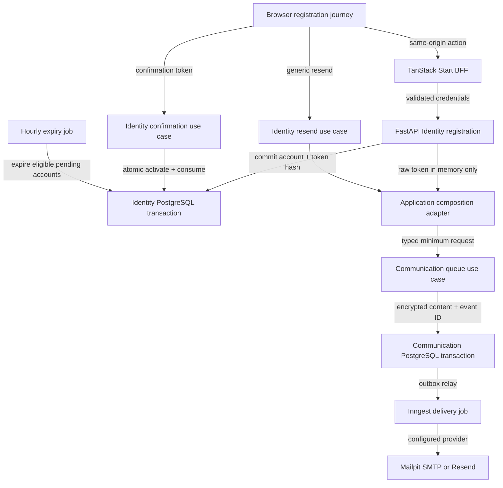

# 1. Context and scope

## Objective and source

Deliver the complete `SHIFU-61` registration and account-confirmation journey for
an individual learner. The learner can create an account with display name, e-mail
and password, receive a pt-BR confirmation message asynchronously, remain restricted
while confirmation is pending, resend the message safely, activate the account once
through a 24-hour link, and recover from invalid, used, expired or undelivered links.
Unconfirmed accounts expire seven days after creation and release their normalized
e-mail for an entirely new account.

This is a **complete** Spec because the delivery crosses the TanStack Start BFF,
FastAPI Identity and Communication modules, PostgreSQL, Inngest, SMTP/Resend,
generated e-mail assets, migrations, responsive UI and security-sensitive token
boundaries. Identity owns account eligibility, tokens, confirmation, cooldown and
account state. Communication owns the controlled message catalog, composition,
delivery, retries, idempotency and delivery state.

Product authority was retrieved completely at `2026-09-19T00:44:41Z`:

| Authority | URL | Content/version | Selected coverage |
| --- | --- | --- | --- |
| Identity PRD | [Shifu — PRD — Identity](https://joaogoliveiragarcia.atlassian.net/wiki/spaces/Shifu/pages/83001345/Shifu+PRD+Identity) | `83001345`, version `1` | `RP-01`, `RP-02`, `RP-08`, `RP-10`; `JN-01`, `JN-02`, `JN-08` |
| Communication PRD | [Shifu — PRD — Communication](https://joaogoliveiragarcia.atlassian.net/wiki/spaces/Shifu/pages/86114306/Shifu+PRD+Communication) | `86114306`, version `1` | `RP-01` through `RP-07`; `JN-01`, `JN-03`, `JN-04`, `JN-05`, `JN-06` |
| Delivery issue | [SHIFU-61](https://joaogoliveiragarcia.atlassian.net/browse/SHIFU-61) | updated `2026-09-18T12:21:15.369-0300` | Full-stack registration, confirmation and Communication integration |

## Current behavior and product gap

The repository already contains the integrated `SHIFU-62` sign-in foundation:
Better Auth session and pending-flow handling, BFF-to-FastAPI authentication,
Identity account/token entities and SQLAlchemy adapters, Communication entities and
repositories, a transactional event outbox, Inngest registration, Mailpit in Docker
Compose and public route constants for registration and pending confirmation.

No executable registration, confirmation, resend or expiry use case exists. The
declared `/register` and `/pending-confirmation` routes have no route files. No
Communication use case, concrete database group, delivery provider or job exists.
`packages/email` is absent. The initial database schema
also enforces global e-mail uniqueness, which conflicts with reuse after automatic
expiry or account deletion.

## Scope and product alignment

| Area | In scope | Out of scope |
| --- | --- | --- |
| Registration | Display name, normalized e-mail, password, validation, privacy-safe duplicate handling and pending-flow handoff | Social login, e-mail change, 2FA, profile editing |
| Confirmation | One-use 24-hour token, valid/expired/used/invalid states, activation and same-access continuation | Using confirmation as sign-in on another access |
| Resend | Generic response, 60-second cooldown, eligibility check, new token/request and invalidation of older pending tokens | Automatic resend caused by another registration attempt |
| Pending account | Restricted `/pending-confirmation` experience, delivery recovery and no protected access | Full session/device management or password recovery |
| Expiry | Automatic expiry seven days from account creation, token/session invalidation and e-mail release | Manual deletion of a pending account or restoration |
| Communication | Typed internal request, controlled confirmation template, asynchronous queue, delivery state, bounded retry, idempotency, Mailpit SMTP and Resend | SMS, push, marketing, arbitrary HTML, visible message history, additional production providers |
| Experience | pt-BR UI, desktop/mobile, keyboard, focus, assistive announcements and non-color-only states | Localization beyond pt-BR or light theme |

| Source requirement | Delivery | Notes |
| --- | --- | --- |
| Identity `RP-01`, `JN-01` | full | Creates a new pending account, preserves privacy and continues to confirmation. |
| Identity `RP-02`, `JN-01`, `JN-02` | full | Covers initial delivery, confirmation, resend, cooldown and recovery states. |
| Identity `RP-08`, `JN-08` | full | Expires unconfirmed accounts seven days after creation without extending the deadline on resend. |
| Identity `RP-10` | full for this slice | Covers responsive, keyboard and assistive behavior for all three surfaces. |
| Communication `RP-01` through `RP-07` | full for account confirmation | Covers the explicit request contract, catalog, provider delivery, retry, idempotency, state and privacy. |
| Communication `JN-01`, `JN-03`, `JN-04`, `JN-05`, `JN-06` | full for account confirmation | Covers successful delivery, temporary and permanent failure, technical reprocessing and deletion-style de-association after expiry. |

## Product decisions and assumptions

| Concern | Accepted contract |
| --- | --- |
| E-mail identity | Trim surrounding whitespace and normalize case consistently for registration, sign-in, uniqueness, resend and recovery. Active and pending accounts reserve the normalized e-mail; deleted/expired accounts do not. |
| Duplicate registration | Return the same accepted public response and confirmation destination without revealing whether the address is active or pending. Do not create another account or automatically resend. |
| Password | Require at least eight characters and no additional composition rule. Persist only an Argon2id hash compatible with the existing sign-in provider. |
| Pending context | Reuse the existing opaque signed HttpOnly `shifu-pending-flow` cookie and server-side 15-minute verification record. Never place account ID or e-mail in a browser-readable value. |
| Confirmation token | Generate at least 256 bits of cryptographic entropy, persist only its SHA-256 hash, allow one use and expire exactly 24 hours after issuance. |
| Confirmation result | A matching still-valid pending context may become an authenticated active session and continue to `/`; any other access proceeds to `/login`. Opening a link alone never authenticates another browser. |
| Resend | Accept at most one eligible resend per account in each rolling 60-second interval. An accepted resend invalidates every older unused confirmation token before creating the replacement. |
| Account expiry | Seven days are measured from immutable account creation time. Reissues do not extend it. Expiry increments `access_version`, invalidates pending confirmation tokens and marks the account deleted with the existing expiry reason. |
| Delivery failure | Account and token commits are never rolled back because an e-mail could not be queued or delivered. The pending page exposes a recoverable resend action. |
| Delivery providers | Local development uses SMTP against Mailpit; production uses Resend. Provider selection is server-only environment configuration. |
| Cancellation state | `cancelled` is an internal Communication supersession/redaction state for obsolete confirmation requests. It is not added to the user-visible delivery-state vocabulary in Communication `RP-06`; its persistence and event use are the operational behavior required by `RP-07` and `JN-06`. |
| Sensitive delivery data | Raw token/action URL exists only in process memory and encrypted Communication persistence. Outbox/Inngest events contain stable request identifiers, not tokens, action URLs, message bodies or provider credentials. |
| UI authority | `documentation/design.md` T01-T03 fixes behavior and design-system rules. The inspected Pencil nodes `s4zUz`, `Dr6Wk` and `lfk5T` are recorded in [`design/handoff.md`](./design/handoff.md); approved derived states require implementation evidence. |

# 2. Implementation Contract

## Functional requirements

| ID | RP/JN/source coverage | Required behavior |
| --- | --- | --- |
| `RF-01` | Identity `RP-01`, `RP-10`, `JN-01`; SHIFU-61 | Present a public pt-BR registration form at `/register` with display name, e-mail and password, clear required labels and the eight-character password rule before submission. |
| `RF-02` | Identity `RP-01`, `JN-01`; SHIFU-61 | Validate without erasing valid input, normalize e-mail case-insensitively, hash the password and create one new pending account with immutable creation time. |
| `RF-03` | Identity `RP-01`, Communication `RP-01`; SHIFU-61 | Treat an e-mail already reserved by a non-deleted account through an indistinguishable accepted response, create no duplicate account or delivery, and offer sign-in, recovery and resend paths. |
| `RF-04` | Identity `RP-02`, Communication `RP-01` to `RP-03`, `JN-01` | Issue a one-use 24-hour confirmation token, persist only its hash, queue the minimum typed account-confirmation request and navigate to `/pending-confirmation` without granting protected access. |
| `RF-05` | Communication `RP-02`, `RP-03`, `RP-07`, `JN-01` | Compose a deterministic pt-BR Shifu message with an identifiable action and deliver it asynchronously through the configured provider without logging the token, complete link or body. |
| `RF-06` | Communication `RP-04` to `RP-06`, `JN-03` to `JN-05` | Keep one stable communication identity, prevent technical reprocessing from creating another effective send, retry temporary failures finitely, stop on permanent rejection and report the known terminal state to Identity. |
| `RF-07` | Identity `RP-02`, `JN-01` | Consume a matching valid token once, activate the pending account atomically, preserve confirmation time, invalidate remaining confirmation tokens and reject subsequent reuse. |
| `RF-08` | Identity `RP-02`, `RP-10`, `JN-01` | Present distinct understandable valid, expired, already-used and invalid confirmation outcomes, with a safe recovery path and no secret left in browser storage or the settled URL. |
| `RF-09` | Identity `RP-02`, Communication `RP-05`, `JN-02` | Handle resend through a generic response; when eligible and outside the 60-second window, invalidate older pending tokens and create a new token and communication request. |
| `RF-10` | Identity `RP-08`, `JN-08` | Expire pending accounts seven days after original creation, invalidate accesses/tokens, preserve deletion time/reason and release the normalized e-mail for a wholly new account. |
| `RF-11` | Identity `RP-10`; SHIFU-61 | Make registration, pending and confirmation states responsive, keyboard-operable, assistive-technology understandable, visibly focused and never dependent on color alone. |

## Acceptance criteria

| ID | RF coverage | Requirement | Given | When | Then | Expected evidence |
| --- | --- | --- | --- | --- | --- | --- |
| `CA-01` | `RF-01`, `RF-11` | Public registration form | An anonymous learner opens `/register` at desktop or mobile width | The route renders and is traversed by keyboard | The labeled fields, eight-character guidance, primary action and sign-in path are visible without authenticated chrome, clipping or horizontal overflow; focus order and names are correct | Widget and route tests plus `VM-01` |
| `CA-02` | `RF-02` | Validation preservation | One or more submitted values are missing or malformed | Client and server validation settle | Name/e-mail/password errors are understandable, valid values remain, password is never echoed by the server, and no account/token/message row is created | Widget, use-case and controller tests |
| `CA-03` | `RF-02`, `RF-04` | Successful registration | A normalized e-mail is not reserved and all values are valid | Registration completes | Exactly one pending account, one hashed 24-hour token and one initial communication request are created; the browser receives only an opaque pending context and reaches `/pending-confirmation` without protected access | Use-case/controller/handler integration tests and `VM-02` |
| `CA-04` | `RF-03` | Private duplicate response | The normalized e-mail belongs to an active or pending account | Registration is submitted | Both states produce the same public status/body/navigation and generic visible message; no account, token, resend or message is created | Controller, handler and route tests |
| `CA-05` | `RF-04`, `RF-05` | Confirmation message | A new eligible token has been committed | Asynchronous processing completes locally | Mailpit contains one pt-BR Shifu message for the intended recipient with escaped display name, clear purpose and one confirmation action; no token/link/body appears in logs or Inngest payloads | Real job test, package checks and `VM-03` |
| `CA-06` | `RF-06` | Idempotent processing | The same communication request/event is delivered repeatedly | Communication processes it concurrently or after retry | One communication identity and at most one provider-accepted message result; attempt history and known state remain coherent | Communication use-case, persistence-concurrency and real job tests |
| `CA-07` | `RF-06` | Temporary and permanent failure | The provider reports a temporary failure or permanent rejection | Delivery processing settles | Temporary failure follows bounded retry; permanent rejection does not retry; exhausted delivery becomes failed, remains observable and informs Identity without deleting the account | Use-case and real job tests plus `VM-04` |
| `CA-08` | `RF-07`, `RF-08` | Valid one-time confirmation | A pending account opens its current token before 24 hours | Confirmation commits | Account becomes active once, confirmation time is stored, remaining tokens are invalidated and the URL no longer contains the token; same pending access continues to `/`, otherwise `/login` | Use-case/controller/handler/route tests and `VM-05` |
| `CA-09` | `RF-08` | Non-valid link states | A link is expired, used, invalidated or malformed | The confirmation route resolves it | No account is activated; expired, used and invalid states remain externally distinguishable only as approved recovery states, never expose account details, and provide resend/sign-in paths where applicable | Use-case/controller/widget/route tests and `VM-06` |
| `CA-10` | `RF-09` | Resend cooldown | A pending account has an accepted confirmation request less than 60 seconds old | Resend is requested | The response stays generic, displays the remaining wait, and creates no token or communication request | Use-case/controller/widget tests |
| `CA-11` | `RF-09` | Eligible resend | At least 60 seconds passed for an eligible pending account | Resend is requested once or concurrently | One replacement token/request is created, every older unused token is invalidated and the visible response remains generic; replay of the resulting request does not duplicate delivery | Use-case concurrency, controller and job tests plus `VM-07` |
| `CA-12` | `RF-10`, Communication `RP-07` | Seven-day expiry and communication de-association | A pending account reaches seven days from creation with pending, delivered or another terminal Communication state | Scheduled expiry runs once or repeatedly | Account is marked deleted for unconfirmed expiry, access version advances, pending contexts/tokens cease to work, e-mail becomes reusable and a later registration creates a new account ID without restoring data; every matched Communication row retains only communication ID, message type, state, provider outcome category, attempt count and timestamps, with no active account, recipient, correlation or encrypted-content association | Use-case, migration/persistence and real job tests plus `VM-08` |
| `CA-13` | `RF-11` | Accessible state feedback | Any operation is loading, successful, invalid or recoverably failed | A keyboard or assistive-technology user performs the flow | Controls expose pending/disabled state, duplicate submits are prevented, alerts are announced and focused where appropriate, recovery remains operable and meaning is not color-only | Widget/route tests and `VM-01`, `VM-04`, `VM-06` |

## Cross-cutting restrictions

| Concern | Contract |
| --- | --- |
| Authorization | Registration, confirmation and resend are public browser journeys through the same-origin BFF. Communication queueing is internal composition only and has no user-facing send endpoint. |
| Browser secrets | Never write passwords, raw tokens, account IDs, communication IDs or pending context to `localStorage`, `sessionStorage` or JavaScript-readable cookies. Remove the token from the settled browser URL immediately after capture. |
| Persistence secrets | Identity stores only token hashes. Communication encrypts the action URL/template values needed for retries with a server-only key; provider credentials remain environment-only. |
| Logging | Do not log request bodies, passwords/hashes, cookies, authorization headers, raw tokens, full action links, encrypted envelopes, provider credentials or complete message bodies. |
| Transactions | Account/token/outbox state has one Identity transaction owner. Communication request/attempt/outbox state has one Communication transaction owner. No distributed transaction spans the modules. |
| Partial failure | Identity commits before external delivery. Queue or delivery failure preserves the account and token and is recoverable through explicit resend. |
| Concurrency | Registration uniqueness, token consumption, resend eligibility/invalidation and expiry use database-enforced constraints plus lock/compare-and-set semantics; concurrent requests must not create duplicate official state. |
| Event privacy | Inngest/outbox events carry stable IDs and non-sensitive state only. Jobs load their own module state; Communication never reads Identity models or repositories. |

## Design Contract

The behavioral design authority is `documentation/design.md` T01-T03 and the
existing Identity public-shell language established by the sign-in feature. The
required Pencil references were inspected and exported in
[`design/handoff.md`](./design/handoff.md).

| Reference | Source/node | Route/surface/state | Viewport | Saved screenshot | Visible inventory | Interaction/state coverage | Ambiguities/exclusions | Validation target |
| --- | --- | --- | --- | --- | --- | --- | --- | --- |
| Registration | Pencil `s4zUz` | `/register`, default/validation/submitting/error | 1440 x 900 | [`s4zUz.png`](./design/s4zUz.png) | Brand, name/e-mail/password fields, guidance, submit and sign-in path | Validation preservation, duplicate privacy, pending and recovery | Mobile and runtime states are approved derived states | `CA-01` to `CA-04`, `VM-01`, `VM-02` |
| Pending confirmation | Pencil `Dr6Wk` | `/pending-confirmation`, cooldown/ready/failure | 1440 x 900 | [`Dr6Wk.png`](./design/Dr6Wk.png) | Restricted explanation, resend action, countdown and safe navigation | Cooldown, resend, temporary/permanent delivery failure | Mobile and runtime states are approved derived states | `CA-03`, `CA-07`, `CA-10`, `CA-11`, `VM-04`, `VM-07` |
| Confirmation return | Pencil `lfk5T` | `/confirm-email`, valid/expired/used/invalid | 1440 x 900 | [`lfk5T.png`](./design/lfk5T.png) | Status, explanation and recovery/continuation action | Token capture, URL cleanup, focus and navigation | Mobile and runtime states are approved derived states | `CA-08`, `CA-09`, `VM-05`, `VM-06` |

All surfaces use existing Shifu tokens, Instrument Serif headings, DM Sans controls,
the dark-only grid background, one visible primary action, 44 px minimum mobile
targets and the documented two-pixel focus language. Runtime-only countdown updates,
progress indication, focus movement and assistive announcements are allowed and must
honor `prefers-reduced-motion`.

# 3. Technical Contract

## Current technical state

| Evidence | Current responsibility | Gap |
| --- | --- | --- |
| `apps/server/src/shifu/identity/core/domain/entities/account.py` | Normalizes account e-mail and supports `confirm()` and `expire()` transitions | No registration/confirmation use cases or concurrency policy |
| `apps/server/src/shifu/identity/core/domain/entities/account_action_token.py` | Represents confirmation/recovery token lifecycle | Expiry mutation currently raises inside the transaction and would be rolled back; no delivery-state link |
| `apps/server/src/shifu/identity/core/domain/structures/auth_credentials.py` and SHIFU-62 sign-in boundary | Existing credential structure trims and case-normalizes e-mail before non-deleted account lookup | The completed SHIFU-62 local contract was reconciled to the Identity PRD in revision 21; registration, sign-in, uniqueness, resend and recovery now share the canonical e-mail identity |
| Identity SQLAlchemy adapters and `a25a7142d3ff_initial_application_schema.py` | Persist accounts and action tokens | Global e-mail uniqueness prevents approved reuse after deletion/expiry |
| `apps/web/src/provision/auth/better-auth/better-auth-provider.ts` | Owns sessions and opaque 15-minute pending-flow context | Pending context has no registration/resend/confirmation operations |
| `apps/web/src/constants/routes.ts` | Declares `/register` and `/pending-confirmation` | Route files and generated route entries are absent |
| Communication domain and SQLAlchemy adapters | Model message, attempts, state and provider port | No use cases, transaction group, provider, jobs or composition |
| Shared outbox and Inngest broker | Reliably relays committed events | No registration/Communication functions are registered |
| `docker-compose.yaml` | Provides PostgreSQL, Inngest and Mailpit | Application has no SMTP client or Mailpit validation path |
| `documentation/rules/email-package-rules.md` | Defines a Communication-owned React Email build contract | `packages/email` is absent; the feature adds the source package and Server package-data output |

## Solution and runtime flow



Identity creates and owns the raw token. Its transaction also generates and persists
the stable `communication_id` and `identity_confirmation_id` with the token and
pending-handle hashes, then commits account/token state before invoking the injected
composition gateway. The gateway is the sole initial-delivery mechanism: while the raw
token/action URL is still in process memory, it translates the successful Identity result
into Communication's explicit request without allowing either module to import the
other's private declarations. Communication encrypts retryable template values, commits
the supplied `communication_id`, its request and its own ID-only outbox event, and
returns a known queue state. A gateway
failure records safe `delivery_unavailable` state in Identity; it never rolls back the
account/token and is recovered only through an eligible explicit resend.

The shared outbox relays only the communication ID to Inngest. The Communication job
claims its own row, decrypts values, renders the approved generated HTML contract and
calls the environment-selected provider. Resend receives the stable communication ID
as provider idempotency key. SMTP processing records the attempt before sending and
does not automatically repeat an attempt whose provider outcome is ambiguous.
Confirmed temporary failures use delays of 1, 5, 15 and 60 minutes, with five total
provider attempts including the first. Permanent provider rejection or exhaustion is
terminal and emits an ID-only result event for Identity.

## Boundary contracts

| Boundary | Producer | Consumer | Canonical contract | Mapping/guarantees | Failure ownership |
| --- | --- | --- | --- | --- | --- |
| Registration handler | Browser/BFF | Identity registration controller | `POST /api/auth/register/identity` accepts `{displayName,email,password}`; it calls `POST /identity/registrations` and returns only `{redirectTo:"/pending-confirmation"}` | FastAPI returns `202 {result:"pending",pending_handle}` to the BFF only. The BFF stores the 256-bit handle in its 15-minute server-side verification record and sets the opaque HttpOnly cookie. Duplicate registration receives an unrecognized decoy handle and the identical public response. | UI owns validation display; FastAPI returns `422` only for malformed input; duplicate state stays private |
| Registration transaction | `RegisterAccountUseCase` | Identity database | normalized account + token hash + creation event | One transaction; active/pending partial unique e-mail reservation; Argon2id password hash | Identity owns duplicate race and rollback |
| Confirmation request | Identity workflow result | Composition delivery gateway/Communication queue | typed message type, pre-persisted `communication_id`, immutable `identity_confirmation_id`, account ID, recipient, display name, opaque action URL and expiry | `identity_confirmation_id` is the AccountActionToken identifier. Identity generates both IDs in its transaction and emits cancellation only from the persisted pair. Communication uses the supplied `communication_id` as its stable primary/idempotency identity. Identity depends on its own output-port protocol. `shifu.composition` implements it, imports both modules, and is injected through `IdentityPipe`; Identity never imports Communication or composition. Content is encrypted before the Communication commit. | Queue failure preserves Identity state and the persisted ID pair makes later cancellation a safe no-op when no Communication row exists |
| Communication event | Communication queue use case | Shared outbox/Inngest job | `{communication_id}` | Commit before relay; stable event ID; no recipient/token/link/body | Shared broker owns relay; Communication owns processing retry |
| E-mail template | Generated `packages/email` artifact | Communication renderer | versioned HTML + typed placeholder manifest | Deterministic pt-BR markup; Python injects only declared escaped string/URL values | Build fails on manifest/template drift; Communication rejects missing/extra values |
| Provider delivery | Communication delivery use case | SMTP or Resend adapter | `EmailMessage` → `DeliveryOutcome` | Stable request identity; normalized temporary/permanent outcome; timeout is bounded | Adapter maps provider errors; use case owns retry/terminal state |
| Pending status endpoint | BFF | Identity pending-status controller | `GET /api/auth/pending-confirmation` resolves the HttpOnly record and calls `POST /identity/pending-confirmations/status` with `{pending_handle}` | FastAPI returns `200 {state:"ready"|"cooldown"|"delivery_issue",retry_after_seconds?}`. The BFF maps an unknown/expired decoy handle to the generic restricted state and never exposes the handle. | Identity owns eligibility and delivery state; UI owns visible polling and recovery |
| Confirmation endpoint | BFF | Identity confirmation controller | `POST /api/auth/confirm-email` accepts `{token}` and calls `POST /identity/email-confirmations`; FastAPI returns `200 {result:"activated",profile,access_version}` or `200 {result:"expired"|"used"|"invalid"}` | The BFF creates a Better Auth session only for `activated`, then clears the pending record/cookie. The route validates a non-empty token, replaces the URL before settlement, and renders malformed/missing input as `invalid` without an API call. | Identity maps safe state; BFF owns URL cleanup and session continuation |
| Resend endpoint | BFF | Identity resend controller | `POST /api/auth/pending-confirmation/resend` resolves the HttpOnly record and calls `POST /identity/pending-confirmations/resend` with `{pending_handle}` | FastAPI returns `200 {result:"accepted"|"cooldown",retry_after_seconds?}` for real and decoy handles. Eligibility remains server-side; the BFF always preserves the privacy-safe visible response and local countdown. | Identity owns token replacement; UI owns countdown/recovery |
| Expiry schedule | Identity cron fan-out job | Expiry use case | hourly cron claims at most 100 IDs and emits one `identity.account-expiry-requested` event per ID | The individual event job locks and expires one account. Compare account `created_at` to the seven-day boundary; cron and child reruns are idempotent. | Job retries infrastructure failure; use case owns each account transaction |

### Exact wire and event ledger

All FastAPI operations below are unauthenticated public BFF-facing operations. They
accept only same-origin BFF requests in production configuration; they do not trust a
browser-supplied account identifier, and their CORS policy does not grant a browser
cross-origin access. Every invalid request returns `422 {"code":"invalid_input","fields":
{<field>: [<pt-BR message>]}}`; unexpected failures return `503
{"code":"identity_unavailable"}` without state details.

| Boundary | Request/event schema | Response/effect schema | Correlation and privacy |
| --- | --- | --- | --- |
| `POST /identity/registrations` | `{display_name: string(min 1 after trim), email: string(min 1), password: string(min 8)}` | `202 {result:"pending", pending_handle:string(base64url,43 chars)}` | `pending_handle` contains 256 random bits; Identity stores only SHA-256. It is returned to the BFF server, never its browser response. A duplicate returns the same schema with an unrecognized decoy handle. |
| `POST /identity/pending-confirmations/status` | `{pending_handle:string(base64url,43 chars)}` | `200 {state:"ready"|"cooldown"|"delivery_issue", retry_after_seconds:integer(min 0)|null}` | Unknown, expired and decoy handles map to the same safe restricted state as a non-deliverable pending flow. |
| `POST /identity/pending-confirmations/resend` | `{pending_handle:string(base64url,43 chars)}` | `200 {result:"accepted"|"cooldown", retry_after_seconds:integer(min 0)|null}` | The handle resolves server-side to one pending account. Unknown/expired/decoy values return `accepted` with no mutation. |
| `POST /identity/email-confirmations` | `{token:string(base64url,43 chars)}` | `200 {result:"activated", profile:{account_id:string,display_name:string,email:string,time_zone:string|null}, access_version:integer(min 1)}` or `200 {result:"expired"|"used"|"invalid"}` | Only the BFF receives the activated profile for technical-user/session promotion. The route maps missing, empty or malformed search tokens to `invalid` without this call. |
| `POST /api/auth/register/identity` | `{displayName:string(min 1 after trim),email:string(min 1),password:string(min 8)}` | `200 {redirectTo:"/pending-confirmation"}` plus opaque HttpOnly pending cookie | BFF maps camelCase to FastAPI snake_case and persists only `pending_handle` in its server-side Better Auth verification value. |
| `GET /api/auth/pending-confirmation` | No body; resolves signed HttpOnly pending cookie | `200 {state:"ready"|"cooldown"|"delivery_issue",retryAfterSeconds:number|null}` | Missing, expired and decoy cookies return the generic restricted state; the browser never receives the handle. |
| `POST /api/auth/pending-confirmation/resend` | Empty body; resolves signed HttpOnly pending cookie | `200 {result:"accepted"|"cooldown",retryAfterSeconds:number|null}` | BFF forwards its server-side handle only; it never accepts an account ID or handle from the browser. |
| `POST /api/auth/confirm-email` | `{token:string}` after route search validation | `200 {result:"activated",redirectTo:"/"}` or `200 {result:"expired"|"used"|"invalid",redirectTo:"/login"}` | BFF deletes the pending verification/cookie and creates the technical Better Auth session only for `activated`. |
| `identity.account-expiry-requested` | `{account_id:string}` | One event per claimed account, emitted by the cron fan-out after claim | ID-only canonical child event; the individual expiry job validates this exact Pydantic model. |
| `communication.delivery-state-changed` | `{communication_id:string, identity_confirmation_id:string, state:"delivered"|"temporary_failure"|"permanent_failure"|"exhausted"|"cancelled"}` | Identity records only its safe delivery state by `identity_confirmation_id` | Both IDs must match the immutable association while it is active. No recipient, token, URL, body, encrypted envelope or provider credential appears in the event. The Identity consumer validates a local strict transport schema at the messaging boundary and does not import Communication core declarations. |
| `identity.account-confirmation-cancelled` | `{communication_id:string, identity_confirmation_id:string, reason:"confirmed"|"reissued"|"expired"}` | Communication atomically matches the persisted ID pair and validates the typed reason. `confirmed` and `reissued` stop only pending/retrying delivery; `expired` stops pending/retrying delivery and redacts every matching row, including delivered and terminal rows. The Communication consumer validates a local strict transport schema at the messaging boundary and does not import Identity core declarations. | Emitted after confirmation, resend replacement or expiry; duplicate delivery after cancellation or redaction is a no-op by `communication_id`. |

## apps/server — Identity contracts

| Path | Change | Declaration/operation | Contract and guarantees | Dependencies/consumers | Generation/tests |
| --- | --- | --- | --- | --- | --- |
| `apps/server/src/shifu/identity/core/domain/entities/account.py` | Modify | Pending registration and expiry transitions | Preserves immutable creation time, confirmation time, access-version increment and deleted expiry reason | Registration, confirmation and expiry use cases | Domain/use-case tests |
| `apps/server/src/shifu/identity/core/domain/structures/auth_credentials.py` | Retain/reconcile | Canonical sign-in e-mail normalization boundary | Trims and case-normalizes credentials before non-deleted account lookup so sign-in matches registration, uniqueness, resend and recovery identity semantics; generic credential rejection remains unchanged | Existing SHIFU-62 sign-in flow | `apps/server/tests/core/identity/use_cases/test_sign_in_use_case.py`; `CI-15` |
| `apps/server/src/shifu/identity/core/use_cases/sign_in_use_case.py` | Modify | Sign-in compatibility boundary | Consumes normalized `AuthCredentials` without reintroducing an exact-case lookup; generic credential rejection remains unchanged | Existing SHIFU-62 Better Auth sign-in flow | `apps/server/src/shifu/identity/core/domain/structures/auth_credentials.py`; `CI-15` |
| `apps/server/src/shifu/identity/core/domain/structures/account_registration.py` | Create | `AccountRegistration`, `AccountRegistrationResult` | Typed normalized registration input and internal token/queue result including pre-persisted `communication_id`/`identity_confirmation_id`; raw token never serialized to browser | Registration use case/controller/composition | Unit/controller tests |
| `apps/server/src/shifu/identity/core/domain/events/account_expiry_requested.py` | Create | `AccountExpiryRequested` | Canonical per-account event emitted by the bounded cron fan-out | Expiry event job | Job tests |
| `apps/server/src/shifu/identity/core/domain/events/account_confirmation_cancelled.py` | Create | `AccountConfirmationCancelled` | ID-only cancellation after confirmation, resend replacement or expiry | Communication cancellation consumer | Use-case/job tests |
| `apps/server/src/shifu/identity/core/domain/entities/account_action_token.py` | Modify | Token expiry/use transitions | Separate state transition from raised result so expired state can commit; add delivery reference/status without provider details | Confirmation/resend/status consumers | Domain behavior through use cases |
| `apps/server/src/shifu/identity/core/interfaces/accounts_repository.py` | Modify | Active-reservation and expiry queries | Lock-aware normalized e-mail lookup; claim batches eligible for expiry | Registration and expiry use cases | Controller/job integration |
| `apps/server/src/shifu/identity/core/interfaces/account_action_tokens_repository.py` | Modify | Hash lookup, latest issue, invalidation and lock methods | Atomic one-use token and cooldown semantics | Confirmation/resend use cases | Controller integration |
| `apps/server/src/shifu/identity/core/interfaces/account_action_tokens_repository.py` | Modify | Safe delivery-state operation | Locks by `identity_confirmation_id` and records only `delivered|temporary_failure|permanent_failure|exhausted|cancelled`; it never accepts provider body/token data | Delivery-state use case | Use-case/job integration |
| `apps/server/src/shifu/identity/core/interfaces/action_token_provider.py` | Modify | Token generate/hash contract | At least 256-bit URL-safe secret and deterministic SHA-256 hash | Registration/resend/confirmation | Consuming use-case tests |
| `apps/server/src/shifu/identity/core/interfaces/confirmation_delivery_gateway.py` | Create | `ConfirmationDeliveryGateway` | Identity-owned output port receives a typed request including immutable `identity_confirmation_id` and returns a safe queue result; it has no Communication imports | Identity controller and composition implementation | Controller integration |
| `apps/server/src/shifu/identity/core/use_cases/register_account_use_case.py` | Create | `RegisterAccountUseCase.execute` | Creates one pending account, initial token and stable `communication_id`/`identity_confirmation_id` pair inside one Identity transaction; duplicate result is privacy-safe | Identity database, ID/clock/hash/token providers | Focused unit tests |
| `apps/server/src/shifu/identity/core/use_cases/confirm_account_use_case.py` | Create | `ConfirmAccountUseCase.execute` | Atomically validates/uses token, activates account and invalidates siblings | Identity database and clock | Focused unit tests |
| `apps/server/src/shifu/identity/core/use_cases/resend_email_confirmation_use_case.py` | Create | `ResendEmailConfirmationUseCase.execute` | Generic eligibility, locked 60-second cooldown, cancellation event from the old persisted ID pair and one replacement token with a new persisted ID pair | Identity database, ID/clock/token providers | Focused unit/concurrency tests |
| `apps/server/src/shifu/identity/core/use_cases/expire_unconfirmed_accounts_use_case.py` | Create | `ExpireUnconfirmedAccountsUseCase.execute` | Claims and expires up to 100 accounts per invocation without extending deadlines | Identity database and clock | Focused unit/job tests |
| `apps/server/src/shifu/identity/core/use_cases/record_communication_delivery_state_use_case.py` | Create | `RecordCommunicationDeliveryStateUseCase.execute` | Applies a validated terminal Communication state to the correlated confirmation request exactly once and emits no cross-module import | Identity database and clock | Focused unit/job tests |
| `apps/server/src/shifu/identity/rest/controllers/register_account_controller.py` | Create | `POST /identity/registrations` | Validates request; returns `202 {result:"pending",pending_handle}` only to the BFF caller and never logs the body | Registration use case/composition | REST integration and REST-client example |
| `apps/server/src/shifu/identity/rest/controllers/confirm_account_controller.py` | Create | `POST /identity/email-confirmations` | Accepts `{token}` and returns the exact `activated|expired|used|invalid` discriminator; activated includes profile/access version only for BFF session promotion | Confirmation use case | REST integration and REST-client example |
| `apps/server/src/shifu/identity/rest/controllers/resend_email_confirmation_controller.py` | Create | `POST /identity/pending-confirmations/resend` | Accepts only `{pending_handle}` and returns generic `accepted|cooldown` without account disclosure | Resend use case/composition | REST integration and REST-client example |
| `apps/server/src/shifu/identity/rest/controllers/get_pending_confirmation_status_controller.py` | Create | `POST /identity/pending-confirmations/status` | Resolves only the opaque pending handle to a safe delivery/cooldown state | Pending page BFF operation | REST integration |
| `apps/server/src/shifu/identity/rest/router.py` | Modify | Identity route registration | Registers each new operation exactly once | FastAPI composition | Controller suites |
| `apps/server/src/shifu/identity/pipes/identity_pipe.py` | Modify | Registration/confirmation dependency factories | Supplies module database and provider protocols; no core imports of adapters | Controllers/jobs | Composition coverage |
| `apps/server/src/shifu/identity/providers/security/pending_confirmation_handle_provider.py` | Create | `PendingConfirmationHandleProvider` | Creates and hashes opaque 256-bit BFF handles; Identity persists only a hash and accepts no account ID from the pending browser flow | Registration, resend and status use cases | Use-case/controller tests |
| `apps/server/src/shifu/identity/database/sqlalchemy/mappers/account_mapper.py` | Modify | Account registration/expiry mapping | Maps immutable creation and deleted-expiry state without leaking action material | Account repository | PostgreSQL integration |
| `apps/server/src/shifu/identity/database/sqlalchemy/mappers/account_action_token_mapper.py` | Modify | Token delivery/handle mapping | Maps token, pending-handle and safe delivery-state fields | Token repository | PostgreSQL integration |
| `apps/server/src/shifu/identity/messaging/inngest/jobs/fan_out_unconfirmed_account_expiry_job.py` | Create | `FanOutUnconfirmedAccountExpiryJob` | Stable hourly cron, claims at most 100 IDs and emits canonical child events | Expiry query/use case | Real Inngest job test |
| `apps/server/src/shifu/identity/messaging/inngest/jobs/expire_unconfirmed_account_job.py` | Create | `ExpireUnconfirmedAccountJob` | Consumes one expiry event and performs the locked, idempotent transition | Expiry use case | Real Inngest job test |
| `apps/server/src/shifu/identity/messaging/inngest/jobs/record_communication_delivery_state_job.py` | Create | `RecordCommunicationDeliveryStateJob` | Consumes `communication.delivery-state-changed`, validates both correlation IDs and records only the safe state through an Identity use case | Identity delivery-status use case | Real Inngest job test |
| `apps/server/src/shifu/identity/messaging/inngest/identity_inngest_messaging.py` | Modify | Job registration | Registers expiry fan-out, individual expiry and delivery-state consumer jobs alongside existing Identity jobs without a second endpoint | Shared registrar | Real job discovery test |
| `apps/server/src/shifu/identity/database/sqlalchemy/models/account_model.py` | Modify | Account e-mail reservation schema | Replaces global uniqueness with non-deleted reservation compatible with e-mail reuse | Account repository/migration | PostgreSQL integration |
| `apps/server/src/shifu/identity/database/sqlalchemy/models/account_action_token_model.py` | Modify | Token delivery linkage/state | Uses its immutable identifier as `identity_confirmation_id`; persists a non-null generated `communication_id`, safe delivery/status fields and indexes before the gateway call | Token mapper/repository | PostgreSQL integration |
| `apps/server/src/shifu/identity/database/sqlalchemy/repositories/accounts_repository.py` | Modify | Lock/reservation/expiry implementation | Uses SQLAlchemy expressions and caller-owned session | Identity database | Controller/job integration |
| `apps/server/src/shifu/identity/database/sqlalchemy/repositories/account_action_tokens_repository.py` | Modify | Token atomicity implementation | Hash lookup and invalidation share the caller transaction | Identity database | Controller integration |
| `apps/server/tests/core/identity/use_cases/test_sign_in_use_case.py` | Modify | Sign-in normalization regression coverage | Proves whitespace/case-insensitive e-mail lookup while preserving generic rejection and no protected side effects | `AuthCredentials`, `SignInUseCase` | `CI-15` |
| `apps/server/rest-client/identity/identity.rest` | Modify | Registration/confirmation/resend examples | One labeled non-secret request per new route | Manual HTTP parity | Artifact review |

## apps/server — Communication and composition contracts

| Path | Change | Declaration/operation | Contract and guarantees | Dependencies/consumers | Generation/tests |
| --- | --- | --- | --- | --- | --- |
| `apps/server/src/shifu/communication/core/use_cases/queue_communication_use_case.py` | Create | `QueueCommunicationUseCase.execute` | Validates controlled type, deduplicates stable request ID, encrypts no data itself and commits pending communication/event | Communication database, ID/clock/envelope provider | Unit/job tests |
| `apps/server/src/shifu/communication/core/use_cases/deliver_communication_use_case.py` | Create | `DeliverCommunicationUseCase.execute` | Claims request, records attempt, renders content, sends once per attempt and updates known state | Communication database, renderer/provider/clock | Unit/job tests |
| `apps/server/src/shifu/communication/core/use_cases/cancel_communication_use_case.py` | Create | `CancelCommunicationUseCase.execute` | Locks the correlated request and validates `confirmed|reissued|expired`. `confirmed`/`reissued` stop only pending/retrying delivery. `expired` stops pending/retrying delivery, leaves delivered/other terminal delivery state unchanged, and redacts every matching row's account/recipient/correlation/encrypted-content association while retaining only the defined operational metadata; duplicate events are idempotent | Communication database and clock | Focused unit/job tests |
| `apps/server/src/shifu/communication/core/domain/enums/communication_status.py` | Modify | Controlled communication lifecycle states | Adds the internal `cancelled` supersession/redaction state required by Communication `RP-07`/`JN-06`; it remains distinct from the user-visible delivery states in `RP-06` and from delivery failure/rejection | Communication entity, cancellation use case and persistence mapper | Use-case/job tests |
| `apps/server/src/shifu/communication/core/domain/entities/communication.py` | Modify | Cancellation transition | Allows only the cancellation transitions defined by `confirmed|reissued|expired`, preserving terminal metadata and supporting expiry redaction without restoring active associations | Cancellation use case and repository | `test_cancel_communication_use_case.py` |
| `apps/server/src/shifu/communication/core/domain/structures/communication_request.py` | Create | `CommunicationRequest`, `EmailMessage`, `DeliveryOutcome` | Controlled request includes pre-persisted `communication_id` and immutable `identity_confirmation_id`, content and provider-result structures with no Identity entity dependency | Queue, delivery and providers | Unit/job tests |
| `apps/server/src/shifu/communication/core/domain/events/communication_delivery_state_changed.py` | Create | `CommunicationDeliveryStateChanged` | ID-only terminal delivery/cancellation state carrying Communication and Identity-confirmation correlation IDs | Identity safe-status operation; consuming job translates the serialized event at its own messaging boundary without importing Communication core | Job tests |
| `apps/server/src/shifu/communication/core/interfaces/message_renderer.py` | Create | `MessageRenderer.render` | Accepts controlled message type and typed values; returns deterministic `EmailMessage` | Generated-template adapter | Consuming job tests |
| `apps/server/src/shifu/communication/core/interfaces/secret_envelope_provider.py` | Create | `SecretEnvelopeProvider.encrypt/decrypt` | Protects retryable token/link values at rest without leaking key types | Queue/delivery use cases | Consuming tests |
| `apps/server/src/shifu/communication/database/sqlalchemy/communication_database.py` | Create | `SqlalchemyCommunicationDatabase` | Sole transaction owner for Communication operations | Repositories/outbox | Job integration |
| `apps/server/src/shifu/communication/database/sqlalchemy/models/communication_model.py` | Modify | Communication storage | Uses the supplied `communication_id` as its stable identity; stores unique immutable `identity_confirmation_id` while active, encrypted content envelope, stable idempotency key and claim/retry indexes. Account ID, recipient, `identity_confirmation_id` and encrypted content become nullable and are cleared for every deletion-driven terminal state. Retained metadata is only communication ID, message type, state, provider outcome category, attempt count and timestamps. | Mapper/repository/migration | PostgreSQL job integration |
| `apps/server/src/shifu/communication/database/sqlalchemy/models/delivery_attempt_model.py` | Modify | Attempt uniqueness | Unique `(communication_id, attempt_number)` plus known provider result | Mapper/repository/migration | Concurrency integration |
| `apps/server/src/shifu/communication/database/sqlalchemy/mappers/communication_mapper.py` | Create | Communication persistence mapping | Maps active correlation/encrypted content and the de-associated terminal representation | Communication repository | PostgreSQL integration |
| `apps/server/src/shifu/communication/database/sqlalchemy/mappers/delivery_attempt_mapper.py` | Create | Attempt persistence mapping | Maps safe provider outcome and attempt number | Communication repository | PostgreSQL integration |
| `apps/server/src/shifu/communication/database/sqlalchemy/repositories/communications_repository.py` | Modify | Idempotent add/claim/update | Lock-aware request identity and retry scheduling | Communication database | Job integration |
| `apps/server/src/shifu/communication/database/sqlalchemy/repositories/communications_repository.py` | Modify | Correlated cancellation and de-association | Locks by both IDs while active. `confirmed`/`reissued` only transition pending/retrying requests to cancelled. `expired` stops pending/retrying delivery, leaves delivered/terminal state unchanged, and clears account ID, recipient, `identity_confirmation_id` and encrypted content for every matching state. A later event for an already cancelled/redacted `communication_id` is a no-op. | Cancellation use case | Use-case/job integration |
| `apps/server/src/shifu/communication/providers/email/template/generated_email_message_renderer.py` | Create | `GeneratedEmailMessageRenderer` | Loads versioned generated HTML/manifest and escapes only declared values | Server package-data output | Delivery job integration |
| `apps/server/src/shifu/communication/providers/email/template/generated/account-confirmation.html` | Generate | Versioned generated HTML | Tracked output generated by `packages/email`; contains only declared placeholders and no runtime secret | Python renderer/package data | Generated diff and wheel inspection |
| `apps/server/src/shifu/communication/providers/email/template/generated/account-confirmation.manifest.json` | Generate | Placeholder/schema manifest | Tracked output pins template version, subject and allowed values | Python renderer/package data | Generated diff and wheel inspection |
| `apps/server/src/shifu/communication/providers/email/smtp/smtp_email_delivery_provider.py` | Create | `SmtpEmailDeliveryProvider` | Bounded SMTP connection/send and safe temporary/permanent mapping | Mailpit/local SMTP | Delivery job integration |
| `apps/server/src/shifu/communication/providers/email/resend/resend_email_delivery_provider.py` | Create | `ResendEmailDeliveryProvider` | Bounded HTTPS call with stable provider idempotency key and safe response mapping | Resend production API | Controlled consumer integration |
| `apps/server/src/shifu/communication/providers/security/fernet_secret_envelope_provider.py` | Create | `FernetSecretEnvelopeProvider` | Authenticated encryption with environment-owned key and no diagnostic plaintext | Queue/delivery use cases | Consuming job tests |
| `apps/server/src/shifu/communication/messaging/inngest/jobs/deliver_communication_job.py` | Create | `DeliverCommunicationJob` | ID-only payload, finite retries delegated to persisted schedule and terminal state event | Delivery use case | Real Inngest job test |
| `apps/server/src/shifu/communication/messaging/inngest/jobs/cancel_communication_job.py` | Create | `CancelCommunicationJob` | Consumes the serialized `identity.account-confirmation-cancelled` contract through a local strict transport schema, validates both correlation IDs and marks the matching unsent/retrying request cancelled idempotently without importing Identity core | Communication cancellation use case | Real Inngest job test |
| `apps/server/src/shifu/communication/messaging/inngest/communication_inngest_messaging.py` | Create | `CommunicationInngestMessaging.register_jobs` | Returns delivery and cancellation consumer functions to the single shared registrar | FastAPI composition | Real job discovery test |
| `apps/server/src/shifu/composition/registration_confirmation_workflow.py` | Create | `RegistrationConfirmationWorkflow` | Implements Identity's `ConfirmationDeliveryGateway`, bridges typed issuance to Communication queueing, and binds the independent event consumers without either core importing the other | App composition, Identity pipe and Communication use case | Controller/job integration |
| `apps/server/src/shifu/app.py` | Modify | FastAPI/module/job composition | Registers Communication database/providers/jobs and retains one Inngest endpoint | Server lifespan | Integration/job suites |
| `apps/server/tach.toml` | Modify | Composition dependency declaration | Adds `shifu.composition` depending on Identity, Communication and Shared; adds Communication and composition to `shifu.app` only | Architecture gate | `uv run poe check:architecture` |
| `apps/server/src/shifu/shared/constants/environment.py` | Modify | Typed e-mail/security settings | Validates provider mode, SMTP, Resend, public action origin and envelope key; production fails fast | Composition/providers | Type/composition checks |
| `apps/server/.env.example` | Modify | Non-secret provider examples | Documents local SMTP defaults and blank production secret placeholders | Local runtime | Configuration review |
| `apps/server/pyproject.toml` | Modify | Runtime dependencies | Adds `resend==2.46.0`, `aiosmtplib` and `cryptography`; `uv.lock` is the resolved reproducible graph | Server runtime | `uv sync --frozen` |
| `apps/server/pyproject.toml` | Modify | Server package data | Includes `shifu/communication/providers/email/template/generated/*.html` and `*.json` in the Python wheel | Generated renderer | `uv run poe build` distribution inspection |
| `apps/server/uv.lock` | Generate | Resolved server dependency graph | Generated by uv; no manual edits | Server build | `uv sync --frozen` |
| `apps/server/migrations/versions/<generated_revision>_add_registration_confirmation_delivery.py` | Generate | Alembic schema transition | Revises e-mail uniqueness, non-null pre-generated token `communication_id`, active unique `identity_confirmation_id`, nullable deletion-redacted account/recipient/correlation/encrypted fields, retry indexes and attempt uniqueness; down revision is current head | PostgreSQL | Upgrade/downgrade and `alembic check` |

## packages/email — generated template contract

`packages/email` is a build-time Communication-owned React Email package. It does
not execute inside Python and does not send messages. Its build deterministically
generates an HTML template and a typed placeholder manifest consumed by the Python
renderer. This resolves the runtime-language boundary without adding a Node child
process to delivery jobs.

| Path | Change | Declaration/operation | Contract and guarantees | Dependencies/consumers | Generation/tests |
| --- | --- | --- | --- | --- | --- |
| `packages/email/package.json` | Create | Package scripts/dependencies | React Email rendering with `check:code`, `check:types` and `build` | pnpm workspace | Package gates |
| `packages/email/tsconfig.json` | Create | Strict TypeScript config | Source/build boundary only | Root TypeScript conventions | Type check |
| `packages/email/templates/email-layout.tsx` | Create | `EmailLayout` | pt-BR document, preview, Shifu identity and accessible footer | Confirmation template | Render check |
| `packages/email/templates/identity/account-confirmation-email.tsx` | Create | `AccountConfirmationEmail`, props and render helper | Deterministic subject/HTML with declared escaped name/action/expiry slots | Package build | Render/type check |
| `packages/email/templates/index.ts` | Create | Public exports | Exposes template, props and render helper without provider behavior | Build script | Type check |
| `packages/email/scripts/build-templates.ts` | Create | Generated-contract builder | Emits stable HTML and JSON manifest; fails on unknown/missing placeholders | Python renderer | `pnpm --dir packages/email build` |
| `pnpm-lock.yaml` | Generate | Workspace dependency resolution | Root canonical pnpm lockfile | All JS workspaces | `pnpm install --frozen-lockfile` |
| `apps/server/scripts/verify_email_package_data.py` | Create | Wheel artifact verifier | Opens the built wheel and asserts the generated HTML and manifest paths are present and JSON-manifest values match the renderer contract | E-mail CI | CI-18 |
| `.github/workflows/email-package-ci.yaml` | Create | Generated template and package-data verification | Triggers on `packages/email/**`, generated Server e-mail artifacts, `apps/server/pyproject.toml`, `apps/server/uv.lock`, `apps/server/scripts/verify_email_package_data.py`, root pnpm files and itself; installs Node/pnpm and Python/uv, runs package checks/build, `uv sync --frozen`, `uv run poe build`, then `uv run python scripts/verify_email_package_data.py dist/*.whl` | CI | GitHub Actions |
| `.github/workflows/server-app-ci.yaml` | Modify | Server migration and real-job verification | Adds PostgreSQL service/environment, runs `uv run alembic check` after migration setup, and executes `uv run poe test:jobs` on the Docker-capable runner | Server CI | CI-11 and CI-17 |

## apps/web — BFF, routes and UI

| Widget | Kind | Parent/entry | Direct children | Public contract | Behavior owner |
| --- | --- | --- | --- | --- | --- |
| `RegisterPage` | Page | `/register` | Registration form and navigation links | No props; public account creation surface | `useRegisterPage` |
| `PendingConfirmationPage` | Page | `/pending-confirmation` | Status alert, countdown, resend and navigation | No props; opaque pending context only | `usePendingConfirmationPage` |
| `ConfirmEmailPage` | Page | `/confirm-email` | Result state and continuation/recovery actions | Receives validated token search value from route | `useConfirmEmailPage` |

```text
apps/web/src/ui/identity/widgets/pages/
├── register-page/
│   ├── index.tsx
│   ├── use-register-page.ts
│   └── tests/
│       ├── register-page.test.tsx
│       └── use-register-page.test.ts
├── pending-confirmation-page/
│   ├── index.tsx
│   ├── use-pending-confirmation-page.ts
│   └── tests/
│       ├── pending-confirmation-page.test.tsx
│       └── use-pending-confirmation-page.test.ts
└── confirm-email-page/
    ├── index.tsx
    ├── use-confirm-email-page.ts
    └── tests/
        ├── confirm-email-page.test.tsx
        └── use-confirm-email-page.test.ts
```

| Path | Change | Declaration/operation | Contract and guarantees | Dependencies/consumers | Generation/tests |
| --- | --- | --- | --- | --- | --- |
| `apps/web/src/routes/register/index.tsx` | Create | `/register` route | Thin public route rendering `RegisterPage` | Route tree | Route integration |
| `apps/web/src/routes/pending-confirmation/index.tsx` | Create | `/pending-confirmation` route | Thin restricted-pending route; redirects missing/expired context safely | Better Auth pending resolver | Route integration |
| `apps/web/src/routes/confirm-email/index.tsx` | Create | `/confirm-email` route | Validates required token search, captures it and replaces URL before rendering result | `ConfirmEmailPage` | Route integration |
| `apps/web/src/routeTree.gen.ts` | Generate | TanStack route metadata | Generated only with current router CLI | Router | `generate-routes` |
| `apps/web/src/constants/routes.ts` | Modify | Canonical Identity paths | Retains existing registration/pending paths and adds confirmation route | All navigation/tests | Type/route tests |
| `apps/web/src/provision/auth/better-auth/better-auth-provider.ts` | Modify | Same-origin registration/pending/activation endpoints | Registers `POST /register/identity`, `GET /pending-confirmation`, `POST /pending-confirmation/resend` and `POST /confirm-email`; it owns the signed HttpOnly cookie, server-side pending-handle record and activated-session promotion | Catch-all auth handler | Handler integration |
| `apps/web/src/provision/auth/cookie-session-auth-provider.ts` | Modify | Browser-facing auth actions | Exposes registration, pending status, resend and confirmation outcomes without Better Auth types, handles or internal profile identifiers | Auth context | Page/handler integration |
| `apps/web/src/rest/services/identity-service.ts` | Modify | Server-only Identity operations | Adds `POST /identity/registrations`, `POST /identity/pending-confirmations/status`, `POST /identity/pending-confirmations/resend` and `POST /identity/email-confirmations` with exact internal schemas | Better Auth provider | Handler integration |
| `apps/web/src/ui/shared/contexts/auth-context/types/auth-context-value.ts` | Modify | Auth context contract | Exposes application-named operations and states | Identity action hooks | Provider/page tests |
| `apps/web/src/ui/shared/contexts/auth-context/use-auth-context-provider.ts` | Modify | Context composition | Delegates to cookie-session provider without reading HttpOnly values | Root provider | Context tests |
| `apps/web/src/ui/shared/contexts/auth-context/tests/use-auth-context-provider.test.ts` | Modify | Auth context provider regression suite | Proves the complete browser-safe registration, pending-status, resend and confirmation context value delegates to the cookie-session provider | Auth context provider | `CI-08` |
| `apps/web/src/ui/identity/hooks/use-register-account-action.ts` | Create | Registration action hook | Exposes semantic mutation state to the registration page | Auth context | Covered through page/route |
| `apps/web/src/ui/identity/hooks/use-confirm-email-action.ts` | Create | Confirmation action hook | Exposes safe result discriminator | Auth context | Covered through page/route |
| `apps/web/src/ui/identity/hooks/use-resend-confirmation-action.ts` | Create | Resend action hook | Exposes generic accepted/cooldown/recovery state | Auth context | Covered through pending page/route |
| `apps/web/src/ui/identity/widgets/pages/register-page/index.tsx` | Create | `RegisterPage` | Renders accessible form and states using shared primitives/tokens | `useRegisterPage` | Colocated component test |
| `apps/web/src/ui/identity/widgets/pages/register-page/use-register-page.ts` | Create | `useRegisterPage` | Owns TanStack Form, field preservation, submission, focus and navigation | Registration action/navigation | Colocated hook test |
| `apps/web/src/ui/identity/widgets/pages/pending-confirmation-page/index.tsx` | Create | `PendingConfirmationPage` | Renders restriction, countdown, resend and delivery recovery | Owning hook | Colocated component test |
| `apps/web/src/ui/identity/widgets/pages/pending-confirmation-page/use-pending-confirmation-page.ts` | Create | `usePendingConfirmationPage` | Owns context resolution, 60-second countdown, resend and announcements | Resend action/navigation | Colocated hook test |
| `apps/web/src/ui/identity/widgets/pages/confirm-email-page/index.tsx` | Create | `ConfirmEmailPage` | Renders valid/expired/used/invalid result and recovery actions | Owning hook | Colocated component test |
| `apps/web/src/ui/identity/widgets/pages/confirm-email-page/use-confirm-email-page.ts` | Create | `useConfirmEmailPage` | Owns one confirmation request, URL cleanup, focus and continuation | Confirmation action/navigation | Colocated hook test |
| `apps/web/src/ui/shared/widgets/layouts/root-layout/use-root-layout.ts` | Modify | Public-shell selection | Recognizes the concrete confirmation route and retains no authenticated chrome | Root layout | Existing layout tests |
| `apps/web/src/ui/shared/widgets/layouts/root-layout/tests/root-layout.test.tsx` | Modify | Root layout composition regression suite | Proves the public registration, pending and confirmation surfaces render without authenticated chrome | Root layout | `CI-08` |
| `apps/web/src/ui/shared/widgets/layouts/root-layout/tests/use-root-layout.test.ts` | Modify | Root layout hook regression suite | Proves the concrete confirmation route is classified with the existing public shell | Root layout hook | `CI-08` |
| `apps/web/tests/routes/identity/register.index.test.tsx` | Create | Routed `RegisterPage` suite | Mocked-transport route behavior at desktop/mobile and keyboard | Playwright fixture | `CA-01` to `CA-04`, `CA-13` |
| `apps/web/tests/routes/identity/pending-confirmation.index.test.tsx` | Create | Routed pending suite | Mocked context/cooldown/resend/failure behavior | Playwright fixture | `CA-03`, `CA-07`, `CA-10`, `CA-11`, `CA-13` |
| `apps/web/tests/routes/identity/confirm-email.index.test.tsx` | Create | Routed confirmation suite | Mocked result/URL/focus/navigation behavior | Playwright fixture | `CA-08`, `CA-09`, `CA-13` |
| `apps/web/tests/identity/registration-confirmation-auth-handler.test.ts` | Create | Same-origin handler integration | Real FastAPI/PostgreSQL HTTP/cookie/session boundary; no mocked persistence claim | Identity module fixture | `CA-03`, `CA-04`, `CA-08`, `CA-11` |

## Technical decisions

| Decision | Chosen approach | Alternative considered | Reason | Accepted trade-off |
| --- | --- | --- | --- | --- |
| Browser/API boundary | Same-origin TanStack Start BFF | Browser calling FastAPI directly | Reuses SHIFU-62 cookie/session boundary and keeps internal API/token details server-side | BFF requires explicit handler integration coverage |
| Cross-module coordination | Application composition adapter plus module-owned messaging-boundary translation between independent core contracts | Identity importing Communication use cases/repositories or Communication importing Identity core | Preserves module ownership and dependency direction; producer events remain owned by their originating module and consumers validate local strict transport schemas without cross-core imports | Two transactions and two serialized event boundaries require explicit partial-failure and idempotency handling |
| Template/runtime boundary | React Email build generates versioned HTML/manifest consumed by Python | Node subprocess per delivery or Python-only template | Preserves approved React Email ownership without a second runtime during jobs | Build artifact drift becomes a gate |
| Sensitive retry data | Encrypted Communication persistence and ID-only events | Raw link in outbox/Inngest payload | Supports retries while minimizing disclosure | Requires encryption-key lifecycle and rotation planning |
| E-mail reuse | Partial uniqueness for non-deleted accounts | Mutating deleted e-mail or retaining global uniqueness | Matches PRD reuse while preserving historical value | PostgreSQL-specific migration/index behavior |
| Delivery retries | Five total attempts at 0, 1, 5, 15 and 60 minutes | Unbounded SDK retries | Bounded, observable recovery without indefinite work | Provider outage beyond the schedule requires explicit resend |
| Expiry execution | Hourly Inngest job, batches of 100 | Request-time lazy expiry only | Ensures abandoned accounts release e-mail without user traffic | Expiry may occur up to one hour after the exact boundary |
| Cross-module composition | Identity REST controllers invoke an Identity-owned output port implemented in `shifu.composition` and injected by `FastAPIApp`; module-owned Inngest jobs translate serialized cross-module events at their messaging boundaries | Identity controller importing Communication or `shifu.composition`, or a consumer job importing the opposite module core | Preserves module-owned public routes, independent business cores and Tach dependency direction | App composition owns concrete orchestration and lifecycle wiring; each event boundary has its own strict transport validation and idempotency. |
| Delivery execution | Durable delivery job sleeps between persisted attempts; Identity cancellation events stop obsolete pending work | Database polling sweep | Keeps each request observable while retries remain bounded and idempotent | Requires explicit cancellation/status event consumers and real job coverage. |
| Expiry execution shape | Hourly cron scan emits one event per eligible account | Processing a batch in one job step | Each account expiry remains independently retryable and observable | Requires the messaging Rule to formally support cron triggers and fan-out. |
| Production e-mail provider | Resend Python async SDK `2.46.x`, 10-second timeout and stable Communication ID idempotency key | Direct HTTP adapter | Uses the official SDK contract while preserving a narrow provider port | Resend idempotency keys expire after 24 hours; a changed payload under the same key is a provider conflict. |
| Local e-mail provider | `aiosmtplib` with a bounded timeout; disconnect after SMTP `DATA` is terminal unknown | Blocking SMTP or automatic retry after ambiguous acceptance | Prevents a local retry from creating a duplicate message | A terminal unknown result remains recoverable only through explicit resend. |

## Revision 2 approved contract amendments

| Concern | Approved contract |
| --- | --- |
| Rule reconciliation | Before implementation, amend the selected Rules to use Shifu package names and current commands; preserve TanStack Form; use `apps/web/tests/<module>/` for browser suites; and define cron plus fan-out support for Inngest jobs. This feature removes `packages/validation` from scope. |
| Composition | Identity REST controllers retain the `/identity` public route group and own transport/use-case invocation. `shifu.composition` implements the Identity output port and binds concrete Communication dependencies. Identity and Communication cores import only their own core plus Shared; neither imports the other or `shifu.composition`. |
| Identity transaction | Registration atomically creates the pending account, Argon2id hash, 256-bit token hash and Identity event. Communication queues after that commit; a queue failure preserves the account/token and becomes recoverable delivery state. A separate idempotent Identity operation links known Communication state. |
| Delivery lifecycle | Communication owns encrypted template values, provider attempts, terminal state and cancellation. Terminal events update safe Identity delivery state. Identity cancellation events stop unsent/retrying obsolete requests after confirmation, resend or expiry. |
| Delivery retry | One durable delivery job owns the initial provider attempt plus waits of 1, 5, 15 and 60 minutes. The Communication ID is its stable idempotency key. Terminal rejection, exhaustion or SMTP acceptance ambiguity stops automatic retry; only explicit resend creates a new request. |
| Expiry execution | An hourly cron scan claims at most 100 eligible account IDs and emits one canonical per-account expiry event. Each per-account job/use case locks, expires, increments `access_version`, invalidates tokens and emits cancellation independently; reruns are idempotent. |
| E-mail reuse | Identity uses a PostgreSQL partial unique reservation for non-deleted accounts. Activation of a newly created account replaces any stale same-e-mail Better Auth technical projection without restoring the deleted account. |
| Template boundary | `packages/email` owns React Email source. Its deterministic build writes tracked HTML and a strict placeholder manifest into server renderer package data included in the Python wheel. Python escapes declared text and URL contexts, rejects missing/extra values, and never runs Node in delivery jobs. |
| Providers/encryption | Local SMTP uses `aiosmtplib`; production uses Resend Python async SDK `2.46.x`. Both use bounded 10-second attempts. Resend receives the stable ID as `idempotency_key`; its documented 24-hour replay window and changed-payload conflict are provider outcomes. Fernet uses an ordered server-only key ring: the first key encrypts and all configured current/previous keys decrypt. |
| Browser boundary | Browser mutations and status reads use same-origin Better Auth endpoints. FastAPI details, raw tokens, account IDs and Communication IDs never enter browser-readable storage or public response bodies. Exact FastAPI, BFF and REST-client schemas/statuses must be synchronized in the route/controller ledger before execution. |
| Pending context | Every accepted registration receives the same public response and a 15-minute opaque HttpOnly pending context. FastAPI returns a random 256-bit handle only to the BFF; Better Auth persists it in the server-side verification record. A duplicate gets an unrecognized decoy handle and creates no state. Every context gets the same visible 60-second countdown while Identity alone enforces eligible resend/cooldown. Pending status refreshes every 10 seconds only while visible and on focus, reconnect and resend. |
| Confirmation return | `/confirm-email` validates and captures the required token search value, replaces the URL before settlement, then presents `activated`, `expired`, `used` or `invalid`. A matching real pending context renders `Continuar`; any other access renders `Entrar`. Opening a link never silently authenticates another browser. |
| Design/evidence | [`design/handoff.md`](./design/handoff.md) owns the three inspected 1440 x 900 frames. Mobile `375 x 812`, short mobile `375 x 667`, validation, loading, delivery failure, focus, cooldown-ready and individual result states are approved derived states requiring fresh Playwright evidence. |

### Revision 4 contract-integrity additions

The path ledger above classifies the Identity, Communication, composition, package,
fixture, migration and CI paths required for this feature. Implementers must add a
path only when it has an explicit owner, operation, contract and test boundary; a
newly discovered unclassified path returns the Spec to `draft` for reconciliation.

## Readiness blockers

1. The inspected Pencil nodes and derived-state handoff remove the visual-reference
   blocker; the exported evidence is in [`design/handoff.md`](./design/handoff.md).
2. The Rule Pack is reconciled for generated e-mail artifacts, optional browser Zod,
   TanStack Form, route-versus-handler test placement, cron fan-out and current CI.
3. Revision 4 specifies the wire contract and ownership. The same independent Spec
   Reviewer must verify path integrity, isolated SMTP/job-fixture completeness and CI
   ownership before this Spec can become `ready`.

# 4. Validation Contract

## Automated boundaries

| Test file | Test type | Target | Coverage goal |
| --- | --- | --- | --- |
| `apps/server/tests/core/identity/use_cases/test_register_account_use_case.py` | Unit | Registration use case | Validation, normalization, privacy result, hashing, transaction and initial token |
| `apps/server/tests/core/identity/use_cases/test_confirm_account_use_case.py` | Unit | Confirmation use case | Valid, expired, used, invalidated and concurrent consumption |
| `apps/server/tests/core/identity/use_cases/test_resend_email_confirmation_use_case.py` | Unit | Resend use case | Generic eligibility, 60-second boundary, invalidation and concurrency |
| `apps/server/tests/core/identity/use_cases/test_expire_unconfirmed_accounts_use_case.py` | Unit | Expiry use case | Seven-day boundary, immutable deadline, idempotency and access invalidation |
| `apps/server/tests/core/identity/use_cases/test_record_communication_delivery_state_use_case.py` | Unit | Identity delivery-state use case | Correlation, allowed terminal transitions, duplicate events and privacy-safe persistence |
| `apps/server/tests/core/communication/use_cases/test_queue_communication_use_case.py` | Unit | Queue use case | Catalog validation, request idempotency, encrypted content handoff and outbox timing |
| `apps/server/tests/core/communication/use_cases/test_deliver_communication_use_case.py` | Unit | Delivery use case | Attempt state, temporary/permanent mapping, retry schedule and terminal reporting |
| `apps/server/tests/core/communication/use_cases/test_cancel_communication_use_case.py` | Unit | Communication cancellation use case | Persisted ID-pair correlation, `confirmed`/`reissued` stop behavior, `expired` redaction across pending/delivered/terminal rows, retained metadata and duplicate-event idempotency |
| `apps/server/tests/rest/controllers/identity/test_register_account_controller.py` | Integration | Registration HTTP/persistence | Real PostgreSQL account/token/outbox state, duplicate race and safe response |
| `apps/server/tests/rest/controllers/identity/test_confirm_account_controller.py` | Integration | Confirmation HTTP/persistence | Atomic activation/consumption, statuses and rollback |
| `apps/server/tests/rest/controllers/identity/test_resend_email_confirmation_controller.py` | Integration | Resend HTTP/persistence | Cooldown, replacement, invalidation, queue failure and safe response |
| `apps/server/tests/rest/controllers/identity/test_get_pending_confirmation_status_controller.py` | Integration | Pending-status HTTP/persistence | Handle validation, real/decoy/expired mapping and privacy-safe response through TestClient/PostgreSQL |
| `apps/server/tests/messaging/inngest/jobs/communication/test_deliver_communication_job.py` | Real job integration | Communication delivery | Registration, ID-only event, Mailpit/provider seam, retries, idempotency and state |
| `apps/server/tests/messaging/inngest/jobs/communication/test_cancel_communication_job.py` | Real job integration | Communication cancellation consumer | Canonical event discovery, correlation/reason validation, `expired` redaction and duplicate-event idempotency |
| `apps/server/tests/messaging/inngest/jobs/identity/test_expire_unconfirmed_accounts_job.py` | Real job integration | Scheduled expiry | Cron registration, bounded fan-out, individual child execution, duplicate runs, persistence effect and end-to-end cancellation/redaction inspection for pending, delivered and terminal Communication rows |
| `apps/server/tests/messaging/inngest/jobs/identity/test_record_communication_delivery_state_job.py` | Real job integration | Identity delivery-state consumer | Canonical event discovery, correlation validation, safe state recording and duplicate-event idempotency |
| `apps/server/tests/fixtures/inngest_fixture.py` | Modify | Job integration runtime | Extends the canonical fixture with disposable Mailpit, SMTP configuration and message assertions while retaining PostgreSQL, Inngest and FastAPI ownership; applies Alembic `head` to the disposable database before FastAPI starts, and exposes function-scoped application-table cleanup plus fresh inspection sessions for every job scenario; never reuses Compose |
| Colocated Identity page tests declared in section 3 | Widget/hook | Three page ownership trees | Loading, validation, pending, success, failure, focus, keyboard and recovery states |
| `apps/web/tests/routes/identity/*.test.tsx` | Browser route integration | Public routes | Mocked transport, URL, responsive, keyboard and visible recovery behavior |
| `apps/web/tests/identity/registration-confirmation-auth-handler.test.ts` | BFF handler integration | Same-origin BFF | Real FastAPI/PostgreSQL HTTP/cookie/session contract; explicitly not mocked route evidence |

## Acceptance coverage

| Acceptance | Automated boundary | Manual scenario | Evidence target |
| --- | --- | --- | --- |
| `CA-01` | Registration widget/route suites | `VM-01` | Desktop/mobile screenshots, accessibility and focus record |
| `CA-02` | Widget, registration use-case and controller suites | `VM-02` | Visible validation and database absence |
| `CA-03` | Registration controller and handler integration | `VM-02` | Pending URL/cookie and PostgreSQL rows |
| `CA-04` | Registration controller/handler/route suites | — | Indistinguishable response and no additional rows |
| `CA-05` | E-mail package checks and real delivery job | `VM-03` | Mailpit message and redacted logs/events |
| `CA-06` | Communication use-case/job concurrency coverage | `VM-03` | One message and coherent attempts |
| `CA-07` | Communication use-case and real job suite | `VM-04` | Retry/terminal run and pending-page recovery |
| `CA-08` | Confirmation use-case/controller/handler/route suites | `VM-05` | Active account, clean URL and final session/navigation |
| `CA-09` | Confirmation use-case/controller/widget/route suites | `VM-06` | Four understandable visible states |
| `CA-10` | Resend use-case/controller/widget suites | `VM-07` | Countdown and absence of new rows/message |
| `CA-11` | Resend concurrency/controller/job suites | `VM-07` | One replacement token/message and old-token rejection |
| `CA-12` | Expiry use-case/job/persistence suites | `VM-08` | Deleted old account and new independent account ID |
| `CA-13` | All widget/route accessibility matrices | `VM-01`, `VM-04`, `VM-06` | Keyboard, focus, announcements and non-color state evidence |

## Manual validations

### `VM-01` — Responsive and accessible registration

Start web at `http://localhost:7000` and FastAPI at `http://localhost:7777` with
PostgreSQL available. Open `/register` at the exact desktop and mobile viewports
captured from Pencil after the design blocker is resolved. Traverse every control by
keyboard, submit invalid values, inspect accessible names/alerts/focus, verify no
horizontal overflow and capture fresh screenshots. Inspect browser console and failed
requests. Clean created test data only through the isolated test fixture or approved
local cleanup path.

### `VM-02` — Registration through real local services

With PostgreSQL, Inngest, Mailpit, FastAPI and web healthy, register a new address.
Verify final URL `/pending-confirmation`, opaque HttpOnly pending cookie, one pending
account, one hashed token, one Communication request and no authenticated protected
session. Repeat the address with different casing and verify the same generic browser
result without another account or message.

### `VM-03` — Mailpit delivery and message privacy

Open Mailpit at `http://localhost:54326`. Inspect recipient, subject, pt-BR copy,
escaped display name and the clear confirmation action. Reprocess the same request and
verify no second message. Inspect Inngest event/run payloads, application logs and
database projections for absence of raw token, full link and message body.

### `VM-04` — Delivery failure and recovery

Use an approved local provider failure seam to produce one temporary failure and one
permanent rejection. Verify persisted attempts/retry timing, terminal state and Identity
notification. Confirm the account remains pending and the page communicates a
recoverable problem without suggesting another registration. Restore Mailpit and resend
successfully.

### `VM-05` — Valid confirmation and same-access continuation

Open the current Mailpit link in the browser that registered. Verify the token is
removed from the settled URL, account becomes active once, remaining tokens are
invalidated, a protected session is created and the final URL is `/`. Open the same link
in another clean browser and verify it does not authenticate that browser.

### `VM-06` — Confirmation recovery states

Exercise expired, already-used, invalidated and malformed links. Verify the mapped
pt-BR state, recovery action, keyboard focus, assistive announcement, clean URL, no
activation and no console/unhandled-request error.

### `VM-07` — Resend cooldown and replacement

From `/pending-confirmation`, request resend before and at the 60-second boundary.
Verify the countdown and generic response, then one new Mailpit message after
eligibility. Confirm the old link no longer activates the account and concurrent resend
requests produce one replacement only.

### `VM-08` — Seven-day expiry and e-mail reuse

Use an isolated fixture with a pending account created at least seven days earlier.
Run the registered expiry function through the real Inngest test runtime. Verify the old
pending context, token and access no longer work; the deletion timestamp/reason remain;
and a new registration with differently cased equivalent e-mail creates a new account
ID with no inherited data.

## Executable quality gates

| ID | Boundary | Command |
| --- | --- | --- |
| `CI-01` | E-mail package lint | `pnpm --dir packages/email check:code` |
| `CI-02` | E-mail package types | `pnpm --dir packages/email check:types` |
| `CI-03` | E-mail generated contract | `pnpm --dir packages/email build` |
| `CI-04` | Web route generation | `pnpm --filter web generate-routes` |
| `CI-05` | Web lint | `pnpm --filter web check:lint` |
| `CI-06` | Web architecture | `pnpm --filter web check:architecture` |
| `CI-07` | Web types | `pnpm --filter web check:types` |
| `CI-08` | Web unit tests | `pnpm --filter web test:unit` |
| `CI-09` | Web browser integration | `pnpm --filter web test:integration` |
| `CI-10` | Web build | `pnpm --filter web build` |
| `CI-11` | Server migration drift | `uv run alembic check` from `apps/server` |
| `CI-12` | Server lint | `uv run poe check:lint` from `apps/server` |
| `CI-13` | Server architecture | `uv run poe check:architecture` from `apps/server` |
| `CI-14` | Server types | `uv run poe check:types` from `apps/server` |
| `CI-15` | Server unit tests | `uv run poe test:unit` from `apps/server` |
| `CI-16` | Server REST integration | `uv run poe test:integration` from `apps/server` |
| `CI-17` | Server real Inngest jobs | `uv run poe test:jobs` from `apps/server` |
| `CI-18` | Server build and generated package data | `uv run poe build` from `apps/server` followed by `uv run python scripts/verify_email_package_data.py dist/*.whl` |

`CI-01` through `CI-03` become executable only after the new package manifest is
implemented. Docker is required for `CI-16` and `CI-17`; a skip is not passing
evidence. Playwright manual evidence must additionally inspect final URL, requests,
console, layout, focus and persistence/provider effects against real local services.

# 5. Documentation alignment and revision history

| Document | Authority for | State | Required change/confirmation |
| --- | --- | --- | --- |
| Identity PRD version 1 | Registration, confirmation, resend, expiry and accessibility | confirmed | No Confluence change required. |
| Communication PRD version 1 | Catalog, delivery, retries, idempotency, state and privacy | confirmed | No Confluence change required. |
| `documentation/modules.md` | Identity/Communication ownership | confirmed | Composition adapter must preserve independent business cores. |
| `documentation/architecture.md` | BFF, FastAPI, PostgreSQL and Inngest boundaries | confirmed | Generated template boundary remains feature-specific. |
| `documentation/design.md` | Design system and T01-T03 behavior | confirmed | File-backed references are captured in `design/handoff.md`; derived runtime/mobile states are approved there. |
| `documentation/rules/email-package-rules.md` | React Email package boundary | confirmed | Defines generated HTML/manifest consumption without a Python-to-Node runtime dependency. |
| `documentation/rules/validation-package-rules.md` | Browser Zod boundary | confirmed | Keeps `packages/validation` optional and preserves TanStack Form/Pydantic ownership. |
| `documentation/rules/widget-testing-rules.md` | Browser test placement | confirmed | Defers route suites to the more specific routing rule and reserves module paths for BFF handler suites. |
| `documentation/rules/messaging-layer-rules.md` | Cron and fan-out | confirmed | Defines bounded cron fan-out and independent event-triggered child jobs. |
| `documentation/tooling.md` | Real commands and local endpoints | confirmed with limitation | Package commands become real when `packages/email/package.json` exists. |

| Rule | Applies to | Evaluated revision |
| --- | --- | --- |
| `documentation/rules/typescript-conventions-rules.md` | Web, package and generated-contract TypeScript | 2026-09-18 repository state |
| `documentation/rules/python-conventions-rules.md` | Server source and tests | 2026-09-18 repository state |
| `documentation/rules/ui-layer-rules.md` | Identity UI, hooks, contexts and REST adapters | 2026-09-18 repository state |
| `documentation/rules/web-app-routing-rules.md` | Public routes and generated route tree | 2026-09-18 repository state |
| `documentation/rules/widget-testing-rules.md` | Widget, hook and browser tests | 2026-09-18 repository state |
| `documentation/rules/core-layer-rules.md` | Identity/Communication domain and use cases | 2026-09-18 repository state |
| `documentation/rules/email-package-rules.md` | React Email package and generated template | 2026-09-21 repository state; reviewed and reconciled for this feature |
| `documentation/rules/use-case-testing-rules.md` | Identity/Communication unit tests | 2026-09-18 repository state |
| `documentation/rules/server-app-layer-rules.md` | FastAPI composition and lifespan | 2026-09-18 repository state |
| `documentation/rules/rest-layer-rules.md` | Identity HTTP operations | 2026-09-18 repository state |
| `documentation/rules/controllers-testing-rules.md` | PostgreSQL-backed controller tests | 2026-09-18 repository state |
| `documentation/rules/database-layer-rules.md` | Models, repositories and migration | 2026-09-18 repository state |
| `documentation/rules/provision-layer-rules.md` | Token, encryption, SMTP and Resend adapters | 2026-09-18 repository state |
| `documentation/rules/messaging-layer-rules.md` | Outbox, jobs, delivery and expiry | 2026-09-18 repository state |
| `documentation/rules/jobs-testing-rules.md` | Real Inngest job integration | 2026-09-18 repository state |

| Revision | Date | Material change | Reason |
| --- | --- | --- | --- |
| 1 | 2026-09-18 | Created the complete registration, confirmation, expiry and Communication Contract as `draft`. | `SHIFU-61`, Identity PRD v1, Communication PRD v1 and the integrated SHIFU-62 baseline. |
| 2 | 2026-09-20 | Recorded approved composition, retry, expiry, provider, encryption, pending-context and design-handoff decisions. | Pencil nodes were inspected and Resend documentation was verified; Rule reconciliation and independent review remain required. |
| 3 | 2026-09-21 | Reconciled applicable Rules, recorded the opaque pending-handle BFF contract, endpoint schemas, composition injection, full path ledger and fixture/CI ownership. | Resolve revision-2 review blockers before rerunning independent review. |
| 4 | 2026-09-21 | Replaced the parallel job fixture with the canonical runtime fixture, selected the direct post-commit delivery gateway, and added exact HTTP/event, dependency and executable CI contracts. | Resolve the independent revision-3 review findings before rerunning review. |
| 5 | 2026-09-21 | Added module-owned consumers for terminal delivery and cancellation events, their registration/tests, and route-suite `.test.tsx` paths. | Resolve the independent revision-4 review findings before rerunning review. |
| 6 | 2026-09-21 | Added the Identity delivery-state and Communication cancellation core use cases, repository operations, unit tests, and pending-status controller integration test. | Resolve the independent revision-5 review findings before rerunning review. |
| 7 | 2026-09-21 | Declared the immutable Identity-to-Communication confirmation correlation and required terminal de-association of account, recipient, correlation and encrypted content. | Resolve the independent revision-6 review findings before rerunning review. |
| 8 | 2026-09-21 | Defined the pre-persisted Communication-ID lifecycle and extended deletion-driven Communication redaction to pending, delivered and terminal states. | Resolve the independent revision-7 review findings before rerunning review. |
| 9 | 2026-09-21 | Added typed cancellation reasons with cause-specific redaction and made the canonical Inngest fixture responsible for migration, cleanup and fresh persistence inspection. | Resolve the independent revision-8 review findings before rerunning review. |
| 10 | 2026-09-21 | Added the existing SHIFU-62 sign-in use case and regression test to the affected-path ledger so its e-mail lookup casefolds consistently with registration and the approved Identity e-mail contract. | Resolve the path-integrity finding before planning; this is an in-contract compatibility correction, not a new product requirement. |

| 11 | 2026-09-21 | Reconciled the SHIFU-62 e-mail identity boundary with the canonical PRD, added Communication cancellation state/entity paths, made cross-module event translation explicit, classified context/layout tests, included generated root/CI paths in scope, and added Communication `JN-06` coverage. | Resolve the independent revision-10 findings before planning; no new product outcome was introduced. |

Revision 11 passed the independent Spec review on 2026-09-21. The corrected
e-mail boundary, ownership, path ledger, Rule Pack reconciliation, and validation
coverage are ready for planning; no material contract ambiguity remains.
