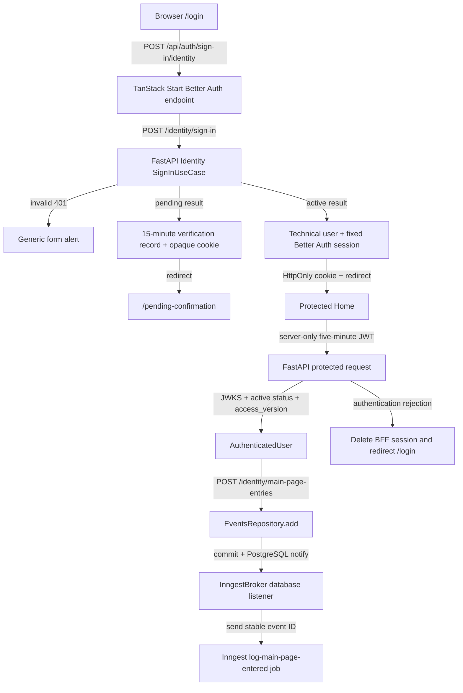

# 1. Context and scope

## Objective and source

Deliver the complete `SHIFU-62` sign-in slice so an individual learner can submit
an e-mail address and password through the public Shifu web application, have
FastAPI Identity validate those credentials without account disclosure, and receive
the access appropriate to the current account state. An active account receives a
Better Auth browser session and proceeds to Home. A pending account receives only a
short-lived confirmation-flow context and proceeds to the pending-confirmation
journey.

This is a **complete** Spec because the delivery crosses the TanStack Start BFF,
FastAPI, PostgreSQL, authentication providers, generated routes, responsive UI, and
security-sensitive session and token boundaries. Product authority is the canonical
[Identity PRD](https://joaogoliveiragarcia.atlassian.net/wiki/spaces/Shifu/pages/83001345/Shifu+PRD+Identity),
content ID `83001345`, version `1`; the delivery request is
[SHIFU-62](https://joaogoliveiragarcia.atlassian.net/browse/SHIFU-62).

## Current behavior and product gap

The repository has Identity account/status structures, account persistence, password
hashing and authentication ports, a TanStack Router application shell, and the
approved Pencil sign-in frame. It has no credential-validation use case or endpoint,
Better Auth runtime, browser session store, JWT/JWKS implementation, auth route
middleware, public `/login` route, or implemented sign-in UI. Every current web route
is rendered inside the authenticated application chrome even though no authenticated
session boundary exists.

## Scope and product alignment

| Area | In scope | Out of scope |
| --- | --- | --- |
| Sign-in experience | `/login`, credential submission, pending/submitting/error states, registration/recovery links, keyboard and mobile behavior | Registration, confirmation/resend behavior, password recovery/reset, password change |
| Credential authority | FastAPI Identity validates a trimmed e-mail against the exact stored value and verifies the password through `PasswordHashingProvider` | Better Auth password storage, password copying, social login, passwordless login, 2FA |
| Active access | Better Auth technical user/session projection, fixed 30-day browser session, concurrent sessions, active redirect to `/` | Remember-me choice, inactivity extension, device list, sign-out and individual/all-session revocation UI |
| Pending access | No authenticated session; opaque signed 15-minute pending-flow cookie and server-side verification record; redirect to `/pending-confirmation` | Implementing the pending-confirmation page or its resend lifecycle |
| API access | Five-minute Ed25519 JWT from the BFF session, FastAPI JWKS validation and current-account/access-version enforcement | Browser-readable API tokens, service identity in place of user identity, asynchronous revocation service |
| Abuse/failure handling | Built-in Better Auth database rate limit of 10 submissions per client IP per five-minute window; generic credential, throttling and infrastructure feedback | Account lockout, e-mail-keyed throttling, custom fixed 15-minute blocking model |
| Main-page event | Every completed authenticated entry to `/` makes exactly one `EventsRepository.add` attempt for `app/main-page.entered`; after commit, the shared database listener relays the durable event to Inngest and a logging-only job records it | Analytics aggregation, business-state mutation, duplicate page-entry suppression, or user-visible failure |

| Source requirement | Delivery | Notes |
| --- | --- | --- |
| Identity `RP-03` and `JN-03` | full | E-mail/password sign-in, generic rejection, pending routing, concurrent sessions, and explicit exclusions are delivered. |
| Identity `RP-07` | full for sign-in | Protected API access requires a currently active account and matching access version. Broader protected feature endpoints consume the shared contract later. |
| Identity `RP-10` | full for sign-in | Desktop/mobile, keyboard, focus, assistive-technology and non-color-only state requirements are included. |
| `SHIFU-61` | parallel adjacent delivery | Remains the owner of registration, password-hash creation, `/register`, `/pending-confirmation`, confirmation and resend behavior. Its completion is not a build or test prerequisite for SHIFU-62. |
| `SHIFU-63` | parallel adjacent delivery | Remains the owner of `/forgot-password` and recovery/reset behavior. Its completion is not a build or test prerequisite for SHIFU-62. |

## Product decisions and assumptions

| Concern | Accepted contract |
| --- | --- |
| Public paths | `/login`, `/register`, `/forgot-password`, `/pending-confirmation`; UI copy remains pt-BR. |
| E-mail matching | Trim surrounding whitespace, then use the current exact stored-email match. This Spec does not introduce lowercasing or change registration uniqueness. |
| Invalid credentials | Unknown, wrong-password and deleted accounts are indistinguishable and display `E-mail ou senha inválidos.` |
| Infrastructure failure | Display `Não foi possível entrar agora. Tente novamente.` without exposing provider, database or account details. |
| Throttling | Use Better Auth’s built-in PostgreSQL-backed limiter: 10 submissions per resolved client IP in five minutes; a `429` lasts only until that window resets and uses the provider retry header. |
| Session | Fixed 30 days from sign-in with refresh disabled; multiple sessions are allowed; security/account-state rejection may end access earlier. |
| Pending account | Never create an authenticated session. Keep only an opaque pending identifier in the signed browser cookie; keep account/e-mail context in a 15-minute server record. |
| Adjacent routes | SHIFU-62 defines and exercises stable `/register`, `/forgot-password`, and `/pending-confirmation` URL contracts with local test/dev fixtures; later sibling integration verifies compatibility. No sibling page, confirmation, recovery or reset behavior is implemented here, and links are never disabled or replaced with placeholders. |
| Delivery independence | SHIFU-62 is independently buildable and testable while SHIFU-61 and SHIFU-63 remain unfinished. The sign-in-owned verifier composition and controlled transport/auth-handler doubles satisfy this delivery; adjacent links and pending handoff are checked as canonical URL/redirect contracts, without implementing sibling product behavior. |
| Main-page entry | Every authenticated route entry to `/`, including reload and client navigation, creates one unique event through `EventsRepository`. The committed outbox row is the delivery source; Inngest retains event/run history and Shifu stores no derived business state. |

# 2. Implementation Contract

## Functional requirements

| ID | Source coverage | Required behavior |
| --- | --- | --- |
| `FR-01` | `RP-03`, `RP-10`, `JN-03`, SHIFU-62 | Present a public pt-BR sign-in form at `/login` with labeled e-mail/password controls, `Entrar`, password-recovery and registration links, and no remember-me or social-login control. |
| `FR-02` | `RP-03`, `JN-03`, SHIFU-62 | Send credentials only to the same-origin BFF; FastAPI Identity trims the e-mail, performs an exact non-deleted account lookup, and verifies the password without disclosing which credential or account state failed. |
| `FR-03` | `RP-03`, `RP-07`, `JN-03`, SHIFU-62 | For valid active credentials, create/update only the approved Better Auth technical projection, create an independent fixed 30-day session, set the protected cookie, and navigate to `/`. |
| `FR-04` | `RP-03`, `JN-03`, SHIFU-62 | For valid pending credentials, create no authenticated session; create a 15-minute opaque pending-flow context and navigate to `/pending-confirmation`. |
| `FR-05` | `RP-07`, SHIFU-62 | Reject anonymous or pending access before protected UI renders; mint a five-minute user JWT only inside the BFF; and have FastAPI validate signature, claims, current active status and `access_version` on each protected request. |
| `FR-06` | `RP-03`, `RP-10`, SHIFU-62 | Prevent duplicate submission, distinguish invalid credentials, throttling and recoverable infrastructure failure with the approved copies, preserve/clear fields as contracted, announce failures and move focus to the alert. |
| `FR-07` | `RP-10`, SHIFU-62 | Match the approved Pencil states at 1440×900 and 375×812, remain usable by keyboard and assistive technology, preserve visible focus and 44 px mobile targets, and avoid color-only status communication. |
| `FR-08` | User-approved technical observability extension to SHIFU-62 | After authentication succeeds for an entry to `/`, have FastAPI add one uniquely identified `app/main-page.entered` event through the transactional `EventsRepository`; after commit, have the shared database listener deliver that row to Inngest and run a logging-only function without domain mutation, page-entry deduplication, or visible page impact. |

## Acceptance criteria

| ID | FR coverage | Requirement | Given | When | Then | Expected evidence |
| --- | --- | --- | --- | --- | --- | --- |
| `AC-01` | `FR-01`, `FR-07` | Public responsive form | An anonymous learner opens `/login` at 1440×900 or 375×812 | The route finishes rendering | The approved form, copy, links, hierarchy and viewport behavior appear without authenticated chrome, clipping or horizontal overflow | Sign-in widget/page integration tests and `MV-01` against `a9R0Yh` and `Yzifg` |
| `AC-02` | `FR-01`, `FR-07` | Keyboard and assistive access | The default form is visible | The learner traverses and submits it by keyboard | Focus follows the semantic form order, remains visible, controls have names/labels, and status changes are announced without color-only meaning | Widget tests, route test and `MV-02` against `IxLms` |
| `AC-03` | `FR-02`, `FR-06` | Private rejection | The submitted e-mail is unknown, deleted, differently cased from the exact stored value, or paired with a wrong password | Sign-in completes | Every case returns the same external `401` contract and displays `E-mail ou senha inválidos.`; e-mail remains, password clears, focus moves to the form alert, and no session/pending record is created | Use-case/controller/auth-handler/widget tests and `MV-03` against `K4sy9p` and `U0Meh0` |
| `AC-04` | `FR-03`, `FR-05` | Active session | Valid credentials identify an active account | Sign-in completes | A host-only HttpOnly session cookie is set, the URL becomes `/`, reload restores access, a second client may create another session, and no password or Identity business state is copied into Better Auth | Controller/auth-handler/page integration tests and `MV-04` |
| `AC-05` | `FR-04`, `FR-05` | Pending handoff | Valid credentials identify a pending account | Sign-in completes | No Better Auth session/user projection is created for that attempt; a signed HttpOnly cookie contains only an opaque identifier, its server record expires after 15 minutes, and the URL becomes `/pending-confirmation` | Use-case/auth-handler integration tests and `MV-05` redirect/opaque-cookie evidence |
| `AC-06` | `FR-06` | In-flight state | A valid-shaped form is ready | The learner submits while the request remains unresolved | E-mail, password and submit controls are disabled; the action reads `Entrando...` with progress; repeated submit is ignored; registration/recovery links remain usable | Widget/route tests and `MV-02` against `i7xhg` |
| `AC-07` | `FR-06`, `FR-07` | Recoverable infrastructure failure | The Identity API, Better Auth persistence or session issuance fails | The request settles | The form displays `Não foi possível entrar agora. Tente novamente.`, preserves both fields, focuses the alert, creates no partial session, and permits retry | Auth-handler/widget/page integration tests and `MV-03` against `JGwvz` |
| `AC-08` | `FR-06` | Built-in throttling | One resolved client IP has submitted 10 requests inside the current five-minute window | It submits again before reset | Better Auth returns `429` with its retry header, Identity is not called, and the form displays `Muitas tentativas. Aguarde um momento e tente novamente.` without account mutation or e-mail-keyed state | Auth-handler integration tests and `MV-06` |
| `AC-09` | `FR-05` | Current-account enforcement | A session exists but the account is pending, deleted, missing, or has a different `access_version` | A protected route/API request is made | FastAPI rejects the JWT even if cryptographically valid; the BFF deletes the rejected session and redirects to `/login` before protected content remains visible | Current-session controller/route tests and `MV-07` |
| `AC-10` | `FR-02`, `FR-03`, `FR-04`, `FR-05` | Secret and persistence boundary | Sign-in and protected calls are exercised | Storage, logs, browser state and tokens are inspected | Passwords/hashes, JWTs, session tokens, pending context and private keys never appear in URLs, browser storage, JavaScript-readable cookies or logs; Better Auth tables contain only the contracted technical data | Automated negative assertions and `MV-07` |
| `AC-11` | `FR-08` | Main-page entry event | An active authenticated learner enters `/` by redirect, reload, or client navigation | The route completes authentication | The BFF sends one empty-body signal and FastAPI adds exactly one pending `app/main-page.entered` row containing only `event_id`, canonical `account_id`, and UTC `occurred_at`; commit notifies the shared listener, which eventually sends that stable event ID to Inngest and marks it published only after acknowledgement; the registered job writes one structured log; listener/Inngest unavailability never blocks or visibly changes the page and the committed row remains recoverable; if the event row cannot commit, FastAPI returns safe `503`, the BFF logs/suppresses it, and Dashboard still renders without claiming that an event was recorded | Use-case, controller, outbox/listener, real Inngest job, and Dashboard page integration tests plus `MV-08` |

## Cross-cutting restrictions

| Concern | Contract |
| --- | --- |
| Credential authority | FastAPI Identity is the only credential/account authority. Better Auth’s built-in e-mail/password endpoint is disabled/not exposed for this flow, and its account table stores no credential password. |
| Cookie policy | Session and pending cookies are host-only, `HttpOnly`, `SameSite=Lax`, `Path=/`, and `Secure` outside local HTTP development. Neither uses a `Domain` attribute. |
| Client IP | Throttling uses the BFF’s resolved client address from its trusted runtime/proxy boundary; it must not trust an arbitrary browser-supplied forwarding header. |
| Browser storage | Do not write credentials, account IDs, session tokens, pending context or access JWTs to `localStorage`, `sessionStorage`, query strings or JavaScript-readable cookies. |
| Logging | Do not log request bodies, passwords, password hashes, cookies, authorization headers, full JWTs, private JWK material or pending verification values. |
| Retry | Credential validation and session creation are not automatically retried. The learner explicitly retries after a recoverable failure or throttle window. |
| Consistency | The active session is created only after FastAPI validation succeeds. If technical-user or session persistence fails, no authenticated cookie is returned. Pending flow never creates an authenticated session. |
| Event delivery | The Identity use case writes through `EventsRepository` inside its database transaction. PostgreSQL notifies only after commit; the shared listener reserves and sends committed rows to Inngest, then marks them published after acknowledgement. Do not call Inngest from the use case or retry delivery in the page request. |
| Event privacy | The durable row/event contains only a unique event ID, canonical account ID, UTC occurrence time and technical delivery metadata. Do not include e-mail, display name, IP address, route query, cookie, session ID, authorization header or JWT. Inngest owns event/run retention after relay. |

## Design Contract

The file-backed design authority for this slice is
[design/handoff.md](./design/handoff.md). Its eight inspected screenshots cover desktop
default, mobile default, invalid credentials at both viewports, infrastructure
failure, submitting, keyboard focus, and the pending destination handoff. Every mapped
Pencil node passed layout/clipping inspection and every PNG was verified and visually
opened at its declared 1× viewport.

Implementation must use the existing Shifu tokens, typography, grid background and
focus language. The card is 440 px wide on desktop and fluid within 20 px mobile
gutters, uses 32 px desktop/24 px mobile padding, centers when height permits, and
top-aligns into vertical scrolling when it does not. Runtime-only caret rendering,
indeterminate progress motion, focus movement and assistive semantics are allowed;
motion must honor `prefers-reduced-motion`. Tablet interpolation and the mobile
submitting/infrastructure variants are derived from the approved frames and remain
browser-validation obligations, not missing design artifacts.

# 3. Technical Contract

## Current technical state

| Evidence | Current responsibility | Gap |
| --- | --- | --- |
| `apps/server/src/shifu/identity/core/domain/entities/account.py` and account repository/model | Own Identity account credentials, status and `access_version`; lookup already excludes deleted accounts and compares stored e-mail exactly | No sign-in action exposes a safe authentication result |
| `PasswordHashingProvider` and shared `AuthenticationProvider` | Define password verification and protected-user authentication ports | Sign-in has no concrete verifier composition yet; SHIFU-62 must provide its replaceable Argon2id verifier adapter and wire it through Identity composition. No JWT/JWKS implementation or request pipe exists |
| `Authentication` / `IssuedAccessToken` / `AccessTokenProvider` | Foundation currently assumes FastAPI-issued access tokens | Conflicts with the approved BFF-issued JWT architecture and must be reconciled |
| `apps/server/src/shifu/app.py` and Identity router | Compose module routers | Identity router registers no operations and the app has no auth dependencies |
| `apps/web/src/routes/__root.tsx`, `RootLayout`, `ROUTES` | Compose global providers, authenticated chrome and current route constants | No public shell, login path, Better Auth handler or route guard exists |
| `apps/web/package.json` | Provides current TanStack Start/Router and React runtime | Better Auth 1.6.23, PostgreSQL client and TanStack Form are absent |
| Initial Alembic schema | Owns application schema history | No Better Auth tables exist and FastAPI metadata does not represent them |

The Architecture pending item for JWT/JWKS parameters is resolved locally for this
feature by the accepted decisions below; Architecture itself remains unchanged until
the convention is reused beyond this slice.

## Solution and runtime flow



The browser posts only to the same-origin Better Auth handler. The custom
`/sign-in/identity` plugin validates its body, lets Better Auth apply the built-in
database rate limiter, and makes one bounded FastAPI credential request. FastAPI
executes a read-only Identity use case and returns either an active or
activation-only authentication projection; it never issues the browser session or
JWT.

For active results, the plugin synchronizes the framework-required user projection
by canonical `account_id`, creates a database session with the current
`access_version`, sets the session cookie, and clears any stale pending cookie. For
pending results, it creates only a Better Auth verification record and signed pending
cookie. Better Auth owns each of those technical writes; no transaction spans the BFF
and FastAPI databases, and failure before cookie issuance leaves the browser
unauthenticated.

Protected route middleware reads the server session, issues a five-minute JWT through
the Better Auth JWT plugin, and calls FastAPI’s current-session operation. FastAPI
verifies the Ed25519 signature and required claims, then loads the current account and
requires `ACTIVE` plus the token’s `access_version`. A dedicated authentication
rejection causes the BFF to delete its session and redirect to `/login`.

For `/` only, the route completes the ordinary protected-access check and then invokes
a server-only main-page-entry operation. FastAPI derives the actor from the validated
JWT, generates a unique event ID and UTC occurrence time, and adds the canonical event
through `IdentityDatabaseRepositories.events`. The database transaction commits the
outbox row and emits its PostgreSQL notification. The long-lived shared
`InngestBroker` listens for committed event changes, reads/reserves the durable row,
sends it to Inngest with the stable row ID, and marks it published only after
acknowledgement. The registered Identity job writes the structured event fields and
performs no business-state operation. Listener or Inngest unavailability leaves the
row recoverable and never changes the route result.

## Boundary contracts

| Boundary | Producer | Consumer | Canonical contract | Mapping/guarantees | Failure ownership |
| --- | --- | --- | --- | --- | --- |
| `POST /identity/sign-in` | `SignInController` | `IdentityService.validateCredentials` | `AuthCredentials` → `Authentication` | Trim e-mail, exact non-deleted lookup; response contains profile/access/version, never password/hash/token | Controller maps `InvalidCredentialsError` to indistinguishable `401`; BFF maps unavailable/invalid payload to `503` |
| `POST /api/auth/sign-in/identity` | Better Auth handler configured by `BetterAuthProvider` | `CookieSessionAuthProvider.signIn` through `AuthContext` / `useSignInAction` | `{email,password}` → `{access,redirectTo}` | Same-origin; built-in IP rate limit; active/pending writes complete before cookie response | Better Auth owns `429`; provider-owned endpoint owns rollback/no-cookie behavior and safe `401`/`503` mapping |
| Better Auth persistence | `BetterAuthProvider` | PostgreSQL | Six `better_auth_*` technical tables | Alembic schema must exactly match Better Auth 1.6.23 config; no Identity password or business-state mirror | Better Auth adapter errors become recoverable infrastructure failures |
| Pending cookie/record | `BetterAuthProvider` | Pending destination URL contract; page and resend lifecycle remain owned by `SHIFU-61` | Opaque random ID ↔ verification value `{accountId,email}` | Signed HttpOnly cookie; both sides expire at 15 minutes; no PII in cookie/query string | Missing/expired record redirects to `/login`; no authenticated session exists; SHIFU-62 validates the handoff through the handler's exact `Location` assertion, not a sibling route implementation |
| JWT/JWKS | Better Auth JWT plugin | `JwksJwtAuthenticationProvider` | EdDSA JWT and `/api/auth/jwks` | `iss` = environment’s canonical BFF origin; `aud` = `shifu-api`; `sub` = account ID; standard `iat`,`exp`,`jti` plus `sid`,`access_version`; five-minute lifetime | FastAPI owns signature/claim/current-account rejection; BFF owns session deletion on rejection |
| Protected identity | `JwksJwtAuthenticationProvider` | FastAPI controllers through authentication pipe | `AuthenticatedUser` | Resolves current display name/time zone after status/version checks; token profile data is never authoritative | Typed `AuthorizationError` maps to `401` without claim or account detail |
| `POST /identity/main-page-entries` | `MainPageEnteredController` | `IdentityService.publishMainPageEntered` through the `/` entry middleware | Empty body + bearer JWT → `202` | FastAPI derives the active `account_id`; generates unique `event_id` and UTC `occurred_at`; never accepts identity/event fields from the browser | Authentication rejection is `401`; enqueue failure is safe `503`; the BFF logs/suppresses `503` so observability cannot block the page; committed listener/Inngest failure is asynchronous |
| `app/main-page.entered` persistence/relay | `PublishMainPageEnteredUseCase` through `EventsRepository` | `InngestBroker` database listener, then `LogMainPageEnteredJob` | Durable event row `{id,name,payload,status,attempts,availability,reservation,published_at}` with payload `{event_id,account_id,occurred_at}` | Insert and notification commit together; listener startup/reconnect drains recoverable rows; stable row/event ID makes Inngest sends idempotent | Listener owns bounded delivery retry/reservation; job owns only the structured log and has zero retries |

## apps/server — Domain

| Declaration | Kind | Ownership/identity | Contract summary | Related declarations | Consumers |
| --- | --- | --- | --- | --- | --- |
| `Authentication` | Structure | Identity, identity-free result | Safe result of successful credential verification; contains current profile, allowed access and access version, but no access token | `AccountProfile`, `AccountAccess` | `SignInUseCase`, `SignInController` |
| `MainPageEnteredEvent` | Domain event | Identity-authenticated application entry | Immutable technical fact containing only unique event ID, canonical account ID and UTC occurrence time | Shared `Event`; `MainPageEnteredPayload` | `PublishMainPageEnteredUseCase`, `LogMainPageEnteredJob` |

| Path | Change | Declaration | Domain role/schema | Invariants/transitions | Errors/events | Exports/consumers |
| --- | --- | --- | --- | --- | --- | --- |
| `apps/server/src/shifu/identity/core/domain/structures/authentication.py` | Modify | `Authentication` structure | Resulting schema below | `PROTECTED` is returned only for active accounts; `ACTIVATION_ONLY` only for pending accounts; structure never contains credentials or tokens | `InvalidCredentialsError` is raised before construction | Existing structures barrel and sign-in action |
| `apps/server/src/shifu/identity/core/domain/structures/issued_access_token.py` | Remove | `IssuedAccessToken` structure | Obsolete FastAPI-issued-token result | No consumers exist; BFF owns token issuance | — | Remove barrel export |
| `apps/server/src/shifu/identity/core/domain/structures/__init__.py` | Modify | Structures exports | Export resulting `Authentication`; remove `IssuedAccessToken` | Public core surface matches BFF-owned token architecture | — | Core consumers |
| `apps/server/src/shifu/identity/core/domain/events/main_page_entered_event.py` | Create | `MainPageEnteredPayload`, `MainPageEnteredEvent` | Event name is exactly `app/main-page.entered`; payload is `{event_id,account_id,occurred_at}` | Values are server-derived; unique event ID per entry; UTC ISO timestamp; no credentials/profile/session/network data | Best-effort observability event; no domain transition | Event barrel, publisher and Inngest job |
| `apps/server/src/shifu/identity/core/domain/events/__init__.py` | Modify | Identity event exports | Export `MainPageEnteredEvent` and payload | Consumers never repeat the event-name literal or reconstruct payloads | — | Use case and job |

```python
# apps/server/src/shifu/identity/core/domain/structures/authentication.py
@structure
class Authentication:
    profile: AccountProfile
    access: AccountAccess
    access_version: int
```

**Schema — `Authentication`**

| Field | Type | Required | Validation | Description |
| --- | --- | --- | --- | --- |
| `profile` | `AccountProfile` | Yes | Current non-deleted account projection | Browser-safe Identity profile returned to the trusted BFF |
| `access` | `AccountAccess` | Yes | `PROTECTED` or `ACTIVATION_ONLY` | Access outcome derived from current account status |
| `access_version` | `int` | Yes | Integer `>= 1`; equals persisted account version | Version copied into the technical session/JWT and rechecked on protected requests |

## apps/server — Use cases

| Use case | Actor/trigger | Input/output | Direct collaborators | Consistency boundary | Failures/side effects |
| --- | --- | --- | --- | --- | --- |
| `SignInUseCase` | Anonymous BFF credential request | `AuthCredentials` → `Authentication` | `AccountsRepository`, `PasswordHashingProvider`, `Account`, `AccountProfile` | Read-only operation; one lookup and password verification; no account mutation or lockout state | Raises only generic `InvalidCredentialsError`; no session/JWT/event side effect |
| `PublishMainPageEnteredUseCase` | Authenticated `/` entry | Canonical `account_id` → `None` | `IdentityDatabase`, `EventsRepository`, `IdProvider`, `ClockProvider`, `MainPageEnteredEvent` | Opens one Identity transaction and adds one durable event; no business entity mutation | Commit makes the row visible and triggers database notification; persistence failure propagates to the controller’s safe logging boundary |

| Path | Change | Declaration/signature | Input/output/errors | Authorization/consistency | Side effects/dependencies | Consumers/tests |
| --- | --- | --- | --- | --- | --- | --- |
| `apps/server/src/shifu/identity/core/use_cases/sign_in_use_case.py` | Create | `SignInUseCase.execute(credentials: AuthCredentials) -> Authentication` | Trims e-mail; invalid/missing/deleted/wrong-password all raise `InvalidCredentialsError`; active/pending return contracted access | Anonymous action; exact stored-email comparison; password is verified even though no state is mutated | Depends only on repository/hash ports; creates no session/token/event | `SignInController`; focused unit suite |
| `apps/server/tests/core/identity/use_cases/test_sign_in_use_case.py` | Create | `TestSignInUseCase` | Covers active, pending, whitespace trimming, exact case mismatch, unknown/deleted/wrong password and repository/hash-port failure behavior | Autospecced ports; no framework/database | Asserts no mutation/lockout/session side effect | `AC-03` to `AC-05` |
| `apps/server/src/shifu/identity/core/use_cases/publish_main_page_entered_use_case.py` | Create | `PublishMainPageEnteredUseCase.execute(account_id: str) -> None` | Builds the canonical event with injected ID/clock values and calls `repositories.events.add(event)` exactly once inside `IdentityDatabase.transaction()` | Caller supplies only authenticated canonical account ID; no direct broker/Inngest dependency or business mutation | Depends on existing Identity database, `EventsRepository`, `IdProvider`, and `ClockProvider` ports | Controller; focused unit suite |
| `apps/server/tests/core/identity/use_cases/test_publish_main_page_entered_use_case.py` | Create | `TestPublishMainPageEnteredUseCase` | Autospecced database repository group/ID/clock ports verify exact canonical event and one `events.add` call | No framework or concrete repository/broker | Covers unique ID/time mapping, transaction exit and repository failure propagation | `AC-11` |

## apps/server — Interfaces

| Path | Change | Contract/signature | Capability semantics | Guarantees/failures | Implementers/consumers | Exports |
| --- | --- | --- | --- | --- | --- | --- |
| `apps/server/src/shifu/identity/core/interfaces/access_token_provider.py` | Remove | `AccessTokenProvider.issue(...)` | Obsolete FastAPI token-issuance port | No current implementer/consumer; token issuance belongs to Better Auth | Replaced by existing shared `AuthenticationProvider` for verification | Remove from Identity interface barrel |
| `apps/server/src/shifu/identity/core/interfaces/__init__.py` | Modify | Identity interface exports | Remove `AccessTokenProvider`; retain repository/hash/database/action-token ports | No change to `PasswordHashingProvider` or `AccountsRepository` | All Identity core consumers | Stable barrel without obsolete token issuer |
| `apps/server/src/shifu/shared/core/interfaces/events_repository.py` | Modify | `EventsRepository` outbox contract | Retain `add(event)` for use cases; add listener, claim, retry, earliest-wakeup and completion capabilities consumed only by shared infrastructure | Core methods expose typed events/outbox values, never SQLAlchemy, PostgreSQL or Inngest SDK types | Identity database scopes and `InngestBroker` | Shared interface barrel |
| `apps/server/src/shifu/shared/core/interfaces/events_repository_listener.py` | Create | `EventsRepositoryListener.unlisten() -> None` | Lifecycle handle returned by repository subscription | Idempotent cleanup; no database client type escapes | `InngestBroker` lifespan | Shared interface barrel |
| `apps/server/src/shifu/shared/core/interfaces/outbox_event.py` | Create | `OutboxEvent` structure | Stable pending/reserved event projection with ID, name, payload, attempts and availability/reservation timestamps | JSON-safe data; no ORM model | Repository/listener relay | Shared interface barrel |
| `apps/server/src/shifu/shared/core/interfaces/__init__.py` | Modify | Shared interface exports | Export expanded `EventsRepository`, listener and `OutboxEvent`; do not introduce `Broker` for use-case publication | No Inngest SDK types cross into core | Module databases and shared messaging | Stable shared interface barrel |

## apps/server — REST

| Operation | Server entry | Core action/contract | Web consumer | Security source | Compatibility/error owner |
| --- | --- | --- | --- | --- | --- |
| `POST /identity/sign-in` | `SignInController.handle` | `SignInUseCase` / `Authentication` | `IdentityService.validateCredentials` | Internal BFF network boundary; anonymous credentials | Pydantic request/`Response`; controller maps invalid credentials uniformly |
| `GET /identity/session` | `GetCurrentSessionController.handle` | `AuthenticationProvider` / `AuthenticatedUser` | Protected-route/session resolver | Bearer JWT validated by Identity pipe | Authentication pipe maps any invalid/current-account rejection to `401` |
| `POST /identity/main-page-entries` | `MainPageEnteredController.handle` | `PublishMainPageEnteredUseCase` / `MainPageEnteredEvent` | `IdentityService.publishMainPageEntered` | Bearer JWT validated by Identity pipe; empty body | Returns empty `202` only after the event row commits; enqueue failure returns safe `503`, which the BFF logs and suppresses so the page still renders |

| Path | Change | Declaration/operation | Boundary/security | Request/response/errors | Effects/consumers | Registration/examples |
| --- | --- | --- | --- | --- | --- | --- |
| `apps/server/src/shifu/identity/rest/controllers/sign_in_controller.py` | Create | `SignInController`, local `Request` and `Response`; `POST /sign-in` | Accept only BFF credential JSON; no auth required; never log body | Request `email: str`, `password: str`; `200` carries profile/access/version; `401` has one safe code/message; malformed input `422`; unexpected infrastructure failure remains safe `5xx` | Constructs `SignInUseCase` from injected core ports and serializes result | Identity router; `identity.rest`; controller test |
| `apps/server/src/shifu/identity/rest/controllers/get_current_session_controller.py` | Create | `GetCurrentSessionController`, local `Response`; `GET /session` | Requires bearer authentication through shared port | `200` returns account ID/display name/time zone; all signature/claim/status/version failures return indistinguishable `401` | Read-only current-user result used by BFF route guard | Identity router; `identity.rest`; controller test |
| `apps/server/src/shifu/identity/rest/controllers/main_page_entered_controller.py` | Create | `MainPageEnteredController`; `POST /main-page-entries` | Requires active `AuthenticatedUser`; accepts no body or identity fields | Empty `202`; authentication failure is safe `401`; database/event-recording failure is a safe `503` without internal detail | Executes event-recording use case with authenticated account ID only | Identity router; `identity.rest`; controller test |
| `apps/server/src/shifu/identity/rest/router.py` | Modify | `IdentityRouter.register` | Module prefix remains `/identity` | Registers each controller exactly once on every app construction | No mutable router state | FastAPI app composition |
| `apps/server/rest-client/identity/identity.rest` | Create | Identity route-group examples | Local variables only; no committed secrets/tokens | One labeled example each for sign-in, current session and main-page entry with placeholder bearer variable | Manual HTTP parity | Base URL uses the documented local server port; covers all registered operations once |
| `apps/server/tests/rest/controllers/identity/test_sign_in_controller.py` | Create | `TestSignInController` | HTTP through `TestClient`; PostgreSQL account repository; controlled hash-port implementation | `200`, uniform `401`, `422`, exact serialized active/pending bodies and no persistence mutation | Proves controller/use-case/repository wiring | `AC-03` to `AC-05` |
| `apps/server/tests/rest/controllers/identity/test_get_current_session_controller.py` | Create | `TestGetCurrentSessionController` | HTTP with real Ed25519 tokens, controlled JWKS transport and real account persistence; exercises the composed authentication adapter only through the controller/pipe boundary | `200` current projection; safe `401` for unknown/retired `kid`, wrong algorithm/signature/issuer/audience, missing/malformed claims, expiry, pending/deleted/missing account and stale version | Proves the complete protected transport/authentication boundary without a provider test file | `AC-09`, `AC-10` |
| `apps/server/tests/rest/controllers/identity/test_main_page_entered_controller.py` | Create | `TestMainPageEnteredController` | HTTP through `TestClient`, real PostgreSQL `SqlalchemyEventsRepository`, and controlled authentication | Active request returns `202` with one pending event row; invalid auth returns `401` with none; event-recording failure returns safe `503` with no row | Proves HTTP/transactional enqueue behavior without a provider test | `AC-11` |
| `apps/server/tests/conftest.py` | Modify | Shared HTTP/PostgreSQL fixtures | Add session-scoped PostgreSQL Testcontainer/engine/migration lifecycle and function-scoped app session/cleanup while retaining `client` compatibility | Tests use isolated PostgreSQL and clear dependency overrides/environment values after each case | Shared fixtures must not hide scenario actions or assertions | Both Identity controller suites and future database-backed controller tests |

## apps/server — Provision

| Capability | Core contract | Adapter | Runtime/provider | Registration | Consumers |
| --- | --- | --- | --- | --- | --- |
| Protected-user authentication | `AuthenticationProvider` | `JwksJwtAuthenticationProvider` | PyJWT with Ed25519 and BFF JWKS | `IdentityPipe.get_authentication_provider` | Authentication dependency and current-session controller |
| Password verification | `PasswordHashingProvider` | `Argon2idHashProvider` | Argon2id verifier using the Identity-compatible persisted hash format | `IdentityPipe.get_password_hashing_provider` | Sign-in use case/controller |
| Identifier generation | `IdentifierProvider` | `SystemIdentifierProvider` | System UTC time plus cryptographically random ULID suffix | `IdentityPipe.get_identifier_provider` | Main-page event use case/controller |
| Identity dependencies | Repository/hash/authentication ports | `IdentityPipe` | SQLAlchemy session, SHIFU-62 Argon2id verifier adapter, JWT settings | FastAPI `Depends` factories | Identity controllers |
| Event recording | `IdentityDatabase` / `EventsRepository` | `SqlalchemyIdentityDatabase` plus shared SQLAlchemy events repository | PostgreSQL transaction and committed notification | `IdentityPipe.get_database` | Main-page-entry controller/use case |

| Path | Change | Adapter/signature | Contract mapping/config | Failure/retry/secret boundary | Lifecycle/registration | Consumers/tests |
| --- | --- | --- | --- | --- | --- | --- |
| `apps/server/src/shifu/identity/providers/auth/password_hashing/argon2id_hash_provider.py` | Create | `Argon2idHashProvider.hash(password) -> str`; `verify(password, password_hash) -> bool` | Implements `PasswordHashingProvider`; uses the Identity-compatible Argon2id format and returns only a boolean from verification | No password/hash logging or raw library exception leakage; bounded local CPU settings; no automatic sign-in retry | Constructed by `IdentityPipe`; replaceable at the composition boundary | Sign-in controller/composition integration; no provider-owned test file |
| `apps/server/src/shifu/identity/providers/auth/jwt/jwks/jwks_jwt_authentication_provider.py` | Create | `JwksJwtAuthenticationProvider.authenticate(access_token) -> AuthenticatedUser` | Allow only `EdDSA`; validate `iss`, `aud`, `sub`, `iat`, `exp`, `jti`, `sid`, integer `access_version`; load current account and require active/matching version | Bounded JWKS fetch/cache; no token/log leakage; no automatic request retry; all expected failures become `AuthorizationError` | Request-scoped repository with reusable JWKS client/cache owned by app lifespan or safe provider instance | Authentication pipe; covered only through current-session controller integration |
| `apps/server/src/shifu/identity/pipes/identity_pipe.py` | Create | `IdentityPipe` dependency factories | Supplies repository/hash ports to sign-in, `AuthenticationProvider` to protected requests, and Identity database/ID/clock ports to the main-page event recorder | Production fails fast if required auth settings/hash adapter/database settings are absent; overrides remain available to tests | Main-page use case owns one database transaction; Inngest client/listener remain app-owned | Identity controllers |
| `apps/server/src/shifu/shared/core/interfaces/id_provider.py` | Existing contract | `IdentifierProvider.generate() -> str` | Framework-independent provider port for generated identifiers | No time/randomness or vendor dependency crosses core | Implemented by shared provider and replaceable through `IdentityPipe` | Main-page event use case and controller |
| `apps/server/src/shifu/shared/providers/system_clock_provider/system_clock_provider.py` | Create | `SystemClockProvider.now() -> datetime` | Implements `ClockProvider` with timezone-aware UTC system time | No account or event data; no import-time side effects | Constructed by shared messaging and `IdentityPipe` | Main-page event recording and broker retry timing |
| `apps/server/src/shifu/shared/providers/system_identifier_provider/system_identifier_provider.py` | Create | `SystemIdentifierProvider.generate() -> str` | Implements `IdentifierProvider` with a 26-character ULID | No credential or account data; only UTC timestamp and secure randomness | Constructed by `IdentityPipe`, database and messaging composition; no import-time side effects | Main-page event recording; no provider-owned test file |
| `apps/server/src/shifu/shared/providers/system_clock_provider/__init__.py` | Create | Shared clock-provider export | Exports `SystemClockProvider` from its provider folder | No registration or I/O | Package export only | Shared messaging and Identity composition |
| `apps/server/src/shifu/shared/providers/system_identifier_provider/__init__.py` | Create | Shared identifier-provider export | Exports `SystemIdentifierProvider` from its provider folder | No registration or I/O | Package export only | Database, messaging and Identity composition |
| `apps/server/src/shifu/identity/pipes/__init__.py` | Create | Identity pipe export | Stable import for REST boundary | No infrastructure leaks into core | Module composition | Controllers |
| `apps/server/src/shifu/shared/constants/environment.py` | Modify | `EnvironmentSettings` | Add validated auth JWKS/issuer/audience plus Inngest app ID, event key/signing key when required, and local dev-server base URL | No signing secret/private key enters FastAPI responses or logs; local defaults target the Compose dev server | Loaded once through existing environment boundary | JWT adapter, Inngest client and pipes |
| `apps/server/src/shifu/app.py` | Modify | `create_app` lifespan/composition | Own reusable JWKS and Inngest clients; collect each module job’s returned function and call `inngest.fast_api.serve(app, client, functions)` once to register the single `/api/inngest` SDK endpoint; keep repeat construction safe | Startup configuration errors are safe and explicit; no controller/router owns the SDK endpoint | Initialize once, close owned resources on teardown | Identity/shared pipes and Inngest endpoint |
| `apps/server/.env.example` | Modify | Auth and Inngest examples | Document local issuer, audience, JWKS URL, Inngest app ID/dev URL and blank production secret placeholders | Contains no real secret/private key | Copied to ignored `.env.local` | Local API runtime |
| `apps/server/pyproject.toml` | Modify | Runtime/dev dependencies and commands | Add `argon2-cffi`, `PyJWT[crypto]`, current compatible `inngest`, and Testcontainers support; remove the obsolete `pubsub` command that starts a second dev server against port 8080; add the Docker-capable Inngest job-test command | Pin through uv resolution; Compose remains for development, while job tests use disposable Testcontainers | Server environment | Runtime adapters, controller and job integration tests |
| `apps/server/uv.lock` | Generate | Resolved server dependencies | Generated from `pyproject.toml` with `uv sync` | No manual edits | Deterministic install | CI/local validation |
| `docker-compose.yaml` | Modify | Existing `inngest` service discovery | Keep the pinned persistent dev-server image/ports and configure it to sync the single FastAPI endpoint at `http://host.docker.internal:7777/api/inngest`; add the Linux host-gateway mapping required for the container to reach the host API | No second Inngest process or destructive volume change; endpoint becomes discoverable only when FastAPI is healthy | Root Compose lifecycle | Local runtime and manual validation |
| `.env.example` | Modify | Inngest callback example | Add the container-to-host FastAPI Inngest endpoint override with the documented default | Local non-secret URL only | Docker Compose interpolation | Inngest service discovery |
| `documentation/tooling.md` | Modify | Local Inngest startup/sync instructions | Document starting FastAPI plus the existing Compose `inngest` service, health verification, callback endpoint and job-test command | Do not instruct users to run the obsolete second dev server | Developer workflow | Implementation/evaluation |

SHIFU-62 creates and registers a replaceable `Argon2idHashProvider` for sign-in. It
implements the existing `PasswordHashingProvider` port and accepts the PHC-encoded
Argon2id v19 format with `m=65536` KiB, `t=3`, `p=4`, `hash_len=32` bytes and
`salt_len=16` bytes. `hash()` exists because the existing port is a writer/verifier
contract, but SHIFU-62 runtime uses only `verify()`; its hash helper is used solely by
independent test-fixture setup. Verification returns `False` (never a raw library
exception) for wrong passwords, malformed PHC strings, unsupported algorithms or
unsupported parameters. The integration fixture uses plaintext `Shifu#62-Test-2026!`,
asserts the generated value starts with `$argon2id$v=19$m=65536,t=3,p=4$`, and proves
true/false verification through the consuming controller/composition boundary rather
than a provider-owned test. SHIFU-61 continues to own registration behavior and must
emit this compatible format when integrated; replacing the adapter later is an
`IdentityPipe` integration change, not a prerequisite for building or testing SHIFU-62.

## apps/server — Messaging

| Path | Change | Declaration/operation | Event/function contract | Delivery/failure/observability | Registration/tests |
| --- | --- | --- | --- | --- | --- |
| `apps/server/src/shifu/shared/messaging/inngest/client.py` | Create | Shared `InngestClient` construction | Configures one Python SDK client from validated server environment | Server-only keys; local dev URL supported; no import-time connection | FastAPI lifespan/composition and broker |
| `apps/server/src/shifu/shared/messaging/inngest/inngest_broker.py` | Create | `InngestBroker.start()` / `stop()` database-listener relay | Subscribes to committed event notifications through `EventsRepository`; drains up to 100 available rows on startup/reconnect and whenever either a notification arrives or the repository’s earliest `available_at`/`reservation_expires_at` wakeup becomes due; releases expired reservations before each claim; uses five-minute reservations; sends with the stable row ID; marks published only after acknowledgement | Listener reconnect uses 1/2/4/8/16/30-second capped backoff; an interruptible 30-second maximum idle wait bounds clock/configuration drift; publication retry uses 5/10/20/40/80/160/300-second capped availability backoff with 10 automatic attempts; terminal rows remain visible | FastAPI lifespan owns one broker listener; covered through controller/outbox and real job integration, never a provider test |
| `apps/server/src/shifu/shared/messaging/inngest/__init__.py` | Modify | Inngest exports | Exports `InngestBroker` and `InngestMessaging` | No SDK surface crosses into core | Composition |
| `apps/server/src/shifu/identity/messaging/inngest/jobs/log_main_page_entered_job.py` | Create | `LogMainPageEnteredJob.handle(inngest_client)` static method | Returns the SDK function created with `inngest_client.create_function(fn_id='identity-log-main-page-entered', trigger=TriggerEvent(event='app/main-page.entered'), retries=0)`; the callback validates canonical payload and emits one structured info log | No step, database, child event or business effect; malformed payload fails safely | Application composition calls `handle` and passes its returned function to `inngest.fast_api.serve`; real job integration test |
| `apps/server/src/shifu/identity/messaging/inngest/jobs/__init__.py` | Create | Identity job exports | Exports `LogMainPageEnteredJob` without constructing or registering it | No import-time registration | App composition |
| `apps/server/tests/fixtures/inngest_fixture.py` | Create | Real Inngest integration fixture | Starts disposable PostgreSQL and Inngest Dev Server Testcontainers, starts FastAPI on the callback port, syncs `/api/inngest`, and exposes bounded event/log inspection | Random mapped Inngest port, explicit readiness and teardown, no fixed sleep as sole synchronization | Job suites |
| `apps/server/tests/messaging/inngest/jobs/identity/test_log_main_page_entered_job.py` | Create | `TestLogMainPageEnteredJob` | Sends authenticated HTTP entry signals through FastAPI so the real events repository, committed notification, `InngestBroker`, Inngest endpoint and job all execute; waits for completion and captures structured log | Asserts pending→reserved→published lifecycle, one run/log, exact safe fields, outage/reconnect recovery, stable-ID idempotency, terminal visibility and independent page entries | `AC-11` |

The `InngestBroker` is not injected into the use case and does not create event rows.
`EventsRepository.add` is the sole enqueue boundary. PostgreSQL notifications reduce
latency but are not the durability boundary: broker startup and reconnect always drain
eligible committed rows before waiting for further changes.

## apps/server — Database

| Persistence capability | Domain owner | Core contract | Models/types | Mapper | Repository/transaction owner |
| --- | --- | --- | --- | --- | --- |
| Better Auth technical identity/session state | Shared technical infrastructure; Identity remains business owner | Better Auth 1.6.23 adapter schema | `BetterAuthUserModel`, `BetterAuthSessionModel`, `BetterAuthAccountModel`, `BetterAuthVerificationModel`, `BetterAuthJwksModel`, `BetterAuthRateLimitModel` | Better Auth PostgreSQL adapter; FastAPI models are metadata-only | Better Auth adapter owns writes; Alembic owns schema history |
| Durable application events | Shared technical infrastructure; originating module owns event meaning | `EventsRepository` | `EventModel` and `OutboxEvent` | `SqlalchemyEventsRepository` | Originating module transaction inserts; shared `InngestBroker` listener reserves/delivers/marks rows |

| Path | Change | Declaration/operation | Schema/mapping | Integrity/query contract | Migration/transaction | Registration/consumers |
| --- | --- | --- | --- | --- | --- | --- |
| `apps/server/src/shifu/shared/database/sqlalchemy/models/better_auth_user_model.py` | Create | `BetterAuthUserModel` | Metadata-only mapping for `better_auth_users`; no FastAPI repository | Unique e-mail; projection fields only | Supports Alembic diffing; no Identity-domain mapping | Models barrel/Alembic; Better Auth consumes the table |
| `apps/server/src/shifu/shared/database/sqlalchemy/models/better_auth_session_model.py` | Create | `BetterAuthSessionModel` | Metadata-only mapping for `better_auth_sessions` | Unique token; user FK; access-version check and expiry indexes | Supports Alembic diffing; no FastAPI repository | Models barrel/Alembic; Better Auth consumes the table |
| `apps/server/src/shifu/shared/database/sqlalchemy/models/better_auth_account_model.py` | Create | `BetterAuthAccountModel` | Metadata-only mapping for `better_auth_accounts` | Provider identity uniqueness; password remains nullable and unused | Supports Alembic diffing; no FastAPI repository | Models barrel/Alembic; Better Auth consumes the table |
| `apps/server/src/shifu/shared/database/sqlalchemy/models/better_auth_verification_model.py` | Create | `BetterAuthVerificationModel` | Metadata-only mapping for `better_auth_verifications` | Unique pending identifier and expiry lookup | Supports Alembic diffing; no FastAPI repository | Models barrel/Alembic; Better Auth consumes the table |
| `apps/server/src/shifu/shared/database/sqlalchemy/models/better_auth_jwks_model.py` | Create | `BetterAuthJwksModel` | Metadata-only mapping for `better_auth_jwks` | Key ID primary key and retired-key expiry lookup | Supports Alembic diffing; private material remains infrastructure-only | Models barrel/Alembic; Better Auth consumes the table |
| `apps/server/src/shifu/shared/database/sqlalchemy/models/better_auth_rate_limit_model.py` | Create | `BetterAuthRateLimitModel` | Metadata-only mapping for `better_auth_rate_limits` | Framework ID primary key, unique limiter key and nonnegative count | Supports Alembic diffing; no account/e-mail relationship | Models barrel/Alembic; Better Auth consumes the table |
| `apps/server/src/shifu/shared/database/sqlalchemy/models/__init__.py` | Create | Shared technical model exports | Imports all six Better Auth tables and `EventModel` into `Model.metadata` | No feature repository export | Metadata registration only | Alembic environment |
| `apps/server/src/shifu/shared/database/sqlalchemy/models/event_model.py` | Create | `EventModel` | Shared `events` outbox table with stable event ID, name, JSONB payload, status, attempts, availability, reservation owner/expiry, created/updated/published timestamps and safe last-error code | Index eligible pending/failed rows and reservation expiry; payload privacy follows canonical event | Created by originating transaction; relayed by shared broker |
| `apps/server/src/shifu/shared/database/sqlalchemy/repositories/events_repository.py` | Create | `SqlalchemyEventsRepository` | Implements `add`, subscribe/listener lifecycle, reserve available rows, release expired reservations, find earliest availability/reservation wakeup, mark published and mark delivery failed | `add` inserts once and schedules `pg_notify` in the same transaction; claims use guarded PostgreSQL row locking; repository never calls Inngest | Module database scopes and `InngestBroker` |
| `apps/server/src/shifu/shared/database/sqlalchemy/repositories/__init__.py` | Create | Shared repository exports | Exports `SqlalchemyEventsRepository` | No module business repository enters Shared | Identity database composition and shared messaging |
| `apps/server/src/shifu/identity/database/sqlalchemy/identity_database.py` | Create | `SqlalchemyIdentityDatabase.transaction()` | Opens the sole SQLAlchemy session/transaction and yields accounts, action-token and shared events repositories bound to that session | Commits on normal exit, rolls back escaped failure, always closes; event-only operations use the same boundary | `IdentityPipe`, Identity use cases and controller integration tests |
| `apps/server/src/shifu/identity/database/sqlalchemy/__init__.py` | Modify | Identity SQLAlchemy export | Export `SqlalchemyIdentityDatabase` | No session escapes the adapter | Identity pipe/composition |
| `apps/server/migrations/env.py` | Modify | Alembic metadata registration | Import shared technical models with current module models | Future autogeneration must not propose dropping Better Auth tables | Existing online/offline migration lifecycle remains | Alembic |
| `apps/server/migrations/versions/b8f67e3c9a21_add_better_auth_schema.py` | Generate | Better Auth schema migration | Creates all six Better Auth tables described below | Empty-database and upgrade paths produce the same constraints/indexes | Generate with Alembic and test upgrade/downgrade | Web Better Auth runtime |
| `apps/server/migrations/versions/c4d82f1e7a30_add_event_outbox.py` | Generate | Shared event-outbox migration | Creates `events` plus committed-notification trigger/function | Eligible-state/reservation indexes; trigger notifies inserted event ID only after commit | Generate with Alembic, review trigger SQL explicitly, and test upgrade/downgrade; downgrade removes trigger/function before table | Shared events repository and Inngest broker listener |

### Table `events`

| Column | Type | Null | Default | Contract |
| --- | --- | --- | --- | --- |
| `id` | varchar(26) | No | — | Stable ULID primary key; reused as the Inngest external event ID |
| `name` | varchar(160) | No | — | Canonical event name; indexed with delivery state |
| `payload` | jsonb | No | — | Canonical JSON-safe payload only |
| `status` | varchar(16) | No | `pending` | `pending`, `publishing`, `failed`, `published`, or `terminal` |
| `attempts` | integer | No | `0` | Nonnegative delivery-attempt count |
| `available_at` | timestamptz | No | current timestamp | Next eligible claim time |
| `reserved_by` | varchar(160) | Yes | — | Current broker instance/execution owner |
| `reservation_expires_at` | timestamptz | Yes | — | Five-minute ownership expiry |
| `last_error_code` | varchar(80) | Yes | — | Safe classified code; never exception text or payload |
| `created_at`, `updated_at` | timestamptz | No | current timestamp | UTC lifecycle timestamps |
| `published_at` | timestamptz | Yes | — | Inngest acknowledgement time |

Indexes cover `(status, available_at)`, `reservation_expires_at`, and
`published_at`. Guarded state updates require the current `reserved_by`; a relay does
not hold a row lock while calling Inngest.

### Table `better_auth_users`

| Column | Type | Nullable | Default | Description |
| --- | --- | --- | --- | --- |
| `id` | text | No | — | Canonical Identity `account_id`; primary key |
| `name` | text | No | — | Current technical display-name projection |
| `email` | text | No | — | Current technical e-mail projection |
| `email_verified` | boolean | No | `false` | True for an active Identity account |
| `image` | text | Yes | — | Framework field; unused/null |
| `created_at` | timestamptz | No | current timestamp | Projection creation time |
| `updated_at` | timestamptz | No | current timestamp | Projection synchronization time |

| Index name | Columns | Type | Purpose |
| --- | --- | --- | --- |
| — | — | — | No secondary index; the named e-mail uniqueness constraint supplies the required lookup index in PostgreSQL |

| Constraint | Type | Definition | Purpose |
| --- | --- | --- | --- |
| `pk_better_auth_users` | primary key | `id` | Stable mapping to Identity account |
| `uq_better_auth_users_email` | unique | `email` | One technical projection per stored e-mail |

### Table `better_auth_sessions`

| Column | Type | Nullable | Default | Description |
| --- | --- | --- | --- | --- |
| `id` | text | No | — | Better Auth session ID; primary key |
| `token` | text | No | — | Random session token stored only server-side/HttpOnly cookie |
| `user_id` | text | No | — | FK to `better_auth_users.id` |
| `access_version` | integer | No | — | Identity version captured at sign-in |
| `expires_at` | timestamptz | No | — | Fixed creation time + 30 days |
| `ip_address` | text | Yes | — | Resolved client address when available |
| `user_agent` | text | Yes | — | Client user agent when available |
| `created_at` | timestamptz | No | current timestamp | Session creation time |
| `updated_at` | timestamptz | No | current timestamp | Technical row update time; never extends `expires_at` |

| Index name | Columns | Type | Purpose |
| --- | --- | --- | --- |
| `ix_better_auth_sessions_user_id` | `user_id` | btree | Concurrent-session lookup and later revocation |
| `ix_better_auth_sessions_expires_at` | `expires_at` | btree | Expiry cleanup |

| Constraint | Type | Definition | Purpose |
| --- | --- | --- | --- |
| `pk_better_auth_sessions` | primary key | `id` | Session identity |
| `uq_better_auth_sessions_token` | unique | `token` | One database session per opaque session token |
| `fk_better_auth_sessions_user` | foreign key | `user_id` → `better_auth_users.id` on delete cascade | Remove technical sessions with projection |
| `ck_better_auth_sessions_access_version` | check | `access_version >= 1` | Valid Identity version |

### Table `better_auth_accounts`

| Column | Type | Nullable | Default | Description |
| --- | --- | --- | --- | --- |
| `id` | text | No | — | Framework account-row ID |
| `account_id` | text | No | — | Provider account identifier |
| `provider_id` | text | No | — | Provider identifier |
| `user_id` | text | No | — | FK to technical user |
| `access_token`, `refresh_token`, `id_token`, `scope`, `password` | text | Yes | — | Framework fields; unused/null for Identity sign-in |
| `access_token_expires_at`, `refresh_token_expires_at` | timestamptz | Yes | — | Framework fields; unused/null |
| `created_at`, `updated_at` | timestamptz | No | current timestamp | Framework timestamps |

| Index name | Columns | Type | Purpose |
| --- | --- | --- | --- |
| `ix_better_auth_accounts_user_id` | `user_id` | btree | Framework relationship lookup |

| Constraint | Type | Definition | Purpose |
| --- | --- | --- | --- |
| `pk_better_auth_accounts` | primary key | `id` | Framework row identity |
| `fk_better_auth_accounts_user` | foreign key | `user_id` → `better_auth_users.id` on delete cascade | Technical cleanup |
| `uq_better_auth_accounts_provider` | unique | `provider_id`, `account_id` | Framework provider identity uniqueness |

### Table `better_auth_verifications`

| Column | Type | Nullable | Default | Description |
| --- | --- | --- | --- | --- |
| `id` | text | No | — | Verification row ID |
| `identifier` | text | No | — | Random pending-flow identifier namespace |
| `value` | text | No | — | Server-only serialized minimum pending context |
| `expires_at` | timestamptz | No | — | Creation time + 15 minutes |
| `created_at`, `updated_at` | timestamptz | No | current timestamp | Framework timestamps |

| Index name | Columns | Type | Purpose |
| --- | --- | --- | --- |
| `ix_better_auth_verifications_expires_at` | `expires_at` | btree | Expiry cleanup |

| Constraint | Type | Definition | Purpose |
| --- | --- | --- | --- |
| `pk_better_auth_verifications` | primary key | `id` | Verification identity |
| `uq_better_auth_verifications_identifier` | unique | `identifier` | One server record per opaque cookie value |

### Table `better_auth_jwks`

| Column | Type | Nullable | Default | Description |
| --- | --- | --- | --- | --- |
| `id` | text | No | — | Key ID used as JWT `kid` |
| `public_key` | text | No | — | Public JWK material exposed by JWKS endpoint |
| `private_key` | text | No | — | Better Auth-encrypted private key; never exposed/logged |
| `created_at` | timestamptz | No | current timestamp | Rotation age origin |
| `expires_at` | timestamptz | Yes | — | Retired-key removal boundary after grace period |

| Index name | Columns | Type | Purpose |
| --- | --- | --- | --- |
| `ix_better_auth_jwks_expires_at` | `expires_at` | btree | Retired-key cleanup |

| Constraint | Type | Definition | Purpose |
| --- | --- | --- | --- |
| `pk_better_auth_jwks` | primary key | `id` | Stable `kid` lookup |

### Table `better_auth_rate_limits`

| Column | Type | Nullable | Default | Description |
| --- | --- | --- | --- | --- |
| `id` | text | No | — | Better Auth database row ID; primary key |
| `key` | text | No | — | Better Auth’s unique path/client-IP key |
| `count` | integer | No | — | Attempts in the active window |
| `last_request` | bigint | No | Better Auth current epoch milliseconds | Provider window anchor |

| Index name | Columns | Type | Purpose |
| --- | --- | --- | --- |
| — | — | — | No secondary index; the named key uniqueness constraint supplies the required lookup index in PostgreSQL |

| Constraint | Type | Definition | Purpose |
| --- | --- | --- | --- |
| `pk_better_auth_rate_limits` | primary key | `id` | Framework rate-limit row identity |
| `uq_better_auth_rate_limits_key` | unique | `key` | One built-in limiter record per path/client key |
| `ck_better_auth_rate_limits_count` | check | `count >= 0` | Nonnegative provider counter |

**Cross-database notes:** this contract targets the repository’s PostgreSQL runtime.
All timestamps use timezone-aware PostgreSQL timestamps except the Better Auth
rate-limit epoch-millisecond field, which remains `bigint` to match the provider. The
BFF uses a PostgreSQL driver URL; FastAPI retains its SQLAlchemy `+psycopg` URL. Both
must target the same database without sharing connection pools.

**Migration delivery:** generate the migration from the registered SQLAlchemy metadata,
then compare every name/type/nullability/default/index/constraint with the Better Auth
1.6.23 configuration before upgrade. No backfill is required because the tables are new.
Upgrade must precede deployment of the BFF configuration. Downgrade is destructive to
sessions/keys and is permitted only when no environment relies on those sessions; it must
not touch `identity_accounts` or other business tables.

## apps/web — REST

| Path | Change | Declaration/operation | Boundary/security | Request/response/errors | Effects/consumers | Registration/examples |
| --- | --- | --- | --- | --- | --- | --- |
| `apps/web/src/core/shared/interfaces/rest-client.ts` | Modify | `RestRequestOptions.headers` and verb options | Shared transport abstraction accepts per-request headers without exposing Axios | Existing browser consumers remain compatible; server consumers can supply bearer headers | Used by REST services; existing REST tests remain authoritative |
| `apps/web/src/rest/axios/axios-rest-client.ts` | Modify | `AxiosRestClient(baseUrl?, options?)` | Existing REST client supports server-only base URL, disabled browser credentials and per-request headers | Default browser behavior is unchanged; server composition sets `withCredentials: false`; 15-second timeout, no automatic retry | Used by `IdentityService`; existing REST tests plus consuming integration |
| `apps/web/src/rest/services/identity-service.ts` | Create | `IdentityService(restClient).validateCredentials`, `getCurrentSession`, `publishMainPageEntered` | Direct module-oriented REST service; no redundant `identity/` child directory and never imported into the browser bundle | Posts credentials to `/identity/sign-in`; gets `/identity/session`; posts an empty body to `/identity/main-page-entries`; protected operations use the BFF-issued bearer token; validates response shapes and maps safe failures to shared `AuthError` kinds | Used by `BetterAuthProvider`; covered indirectly through handler and protected-route integrations |

## apps/web — Application errors

| Path | Change | Declaration | Contract | Consumers/tests |
| --- | --- | --- | --- | --- |
| `apps/web/src/core/errors/app-error.ts` | Create | `AppError extends Error` | Base for known web-application failures; preserves a safe message/title and native cause without exposing secrets | `RestError`, `AuthError`, `useAuthContext`; type/lint and consuming suites |
| `apps/web/src/core/errors/rest-error.ts` | Create | `RestError extends AppError` | Retains current HTTP status contract while joining the mandatory application-error hierarchy | Existing REST consumers/tests remain behavior-compatible |
| `apps/web/src/rest/errors/rest-error.ts` | Remove | Legacy `RestError` location | Move the existing HTTP error declaration into the web core error boundary; no duplicate REST-owned error class remains | REST imports migrate to `@/core/errors/rest-error` |
| `apps/web/src/core/errors/auth-error.ts` | Create | `AuthError extends AppError` | Shared auth-boundary kinds: `authentication-rejected`, `unavailable`, `invalid-response`; safe messages only | `IdentityService` and `BetterAuthProvider` handler/current-access methods share this error without a feature-specific error class |
| `apps/web/src/core/shared/responses/rest-response.ts` | Modify | REST response error mapping | Change the `RestError` import to `@/core/errors/rest-error` without changing status/code mapping | Existing response consumers and REST tests |
| `apps/web/src/ui/shared/hooks/use-rest-context.ts` | Modify | REST context boundary | Change the `RestError` import to `@/core/errors/rest-error`; preserve the missing-provider failure contract | REST context consumers and UI tests |

## apps/web — Provision

| Capability | Core contract | Adapter | Runtime/provider | Registration | Consumers |
| --- | --- | --- | --- | --- | --- |
| Identity sign-in/session issuance | Custom Better Auth endpoint configured inside the provider | `BetterAuthProvider` | Better Auth 1.6.23 internal adapter/cookie APIs | Better Auth handler | Auth handler route |
| Browser sign-in action | `SignInResult` | `CookieSessionAuthProvider` | Same-origin fetch to custom auth endpoint | `AuthContextProvider` | `useSignInAction` through `useAuthContext` |
| Protected-session resolution | Better Auth session + Identity current-session response | `getCurrentAccess`, `deleteRejectedSession` | TanStack Start server functions | `requireAuthMiddleware` | Protected routes |
| Main-page entry publication | Active Better Auth session translated to FastAPI bearer access | `publishMainPageEntered` | Server-only Identity REST service | `enterMainPageMiddleware` | `/` route only |

| Path | Change | Adapter/signature | Contract mapping/config | Failure/retry/secret boundary | Lifecycle/registration | Consumers/tests |
| --- | --- | --- | --- | --- | --- | --- |
| `apps/web/src/provision/auth/better-auth/better-auth-config.ts` | Create | `BetterAuthConfig()` | Validates server-only auth secret, canonical URL, PostgreSQL URL and internal FastAPI URL; defines fixed 30-day sessions, database rate limiting and EdDSA JWT policy | Fails startup safely; no server value enters Vite/browser bundles | Consumed only by `BetterAuthProvider`; no dedicated test |
| `apps/web/src/provision/auth/better-auth/better-auth-provider.ts` | Create | `BetterAuthProvider()` exposing `handler`, `getCurrentAccess`, `deleteRejectedSession`, `publishMainPageEntered` | Owns the Better Auth instance, pool lifecycle, internal custom `/sign-in/identity` endpoint, technical-user/session/pending-flow writes and protected-session operations; consumes `IdentityService` | Never persists passwords or returns JWTs to the browser; rejected Identity access deletes the session; a safe main-page enqueue `503` is logged and swallowed after authentication | Server-only singleton and per-request access methods; covered through auth-handler and page/layout integration, never a provider test |
| `apps/web/src/provision/auth/cookie-session-auth-provider.ts` | Create | `CookieSessionAuthProvider()` plus colocated `SignInInput`, `SignInResult`, `SignInFailure` types | Posts to same-origin `/api/auth/sign-in/identity`; exposes only the browser-safe application sign-in surface | Never stores payload/tokens; maps `401`, `429`, `5xx` to typed failures and preserves retry header | Constructed by `useAuthContextProvider`; tested through the UI provider hook and page/route boundaries |

**Expected auth and REST file trees**

```text
apps/web/src/provision/auth/
├── better-auth/
│   ├── better-auth-config.ts [Create]
│   └── better-auth-provider.ts [Create]
└── cookie-session-auth-provider.ts [Create]

apps/web/src/rest/services/
└── identity-service.ts [Create]
```

## apps/web — UI

| Widget | Kind | Parent/entry | Direct children | Public contract | Behavior owner |
| --- | --- | --- | --- | --- | --- |
| `RootLayout` | Layout | `routes/__root.tsx` | `AppLayout` for protected paths; active route content directly for public paths | `RootLayoutProps`; owns document/provider composition and shell selection only | `useRootLayout` |
| `SignInPage` | Page | `/login` route | `SquareBackground`, existing `Anchor`/`Icon`, and shared shadcn form primitives | No props; owns complete sign-in form, status alert and navigation actions | `useSignInPage` consuming `useSignInAction` |
| `SquareBackground` | Component | `SignInPage` and `AppLayout` | — | Reusable module-neutral decorative background with pointer-proximity enhancement; no business props | `useSquareBackground` |

**Expected widget file trees**

```text
apps/web/src/ui/identity/widgets/pages/sign-in-page/
├── index.tsx [Create]
├── use-sign-in-page.ts [Create]
└── tests/
    ├── sign-in-page.test.tsx [Create]
    └── use-sign-in-page.test.ts [Create]
```

```text
apps/web/src/ui/shared/widgets/
├── components/
│   ├── icon/
│   │   └── index.tsx [Modify]
│   └── square-background/
│       ├── index.tsx [Create]
│       ├── use-square-background.ts [Create]
│       └── tests/
│           ├── square-background.test.tsx [Create]
│           └── use-square-background.test.ts [Create]
└── layouts/
    ├── app-layout/
    │   ├── index.tsx [Modify]
    │   └── square-background/ [Remove]
    │       ├── index.tsx [Remove]
    │       └── use-square-background.ts [Remove]
    └── root-layout/
        ├── index.tsx [Modify]
        ├── use-root-layout.ts [Create]
        └── tests/
            ├── root-layout.test.tsx [Create]
            └── use-root-layout.test.ts [Create]
```

| Path | Change | Declaration/surface | Widget/role | State/actions contract | Async/failure contract | Design/responsive/accessibility | Dependencies/tests |
| --- | --- | --- | --- | --- | --- | --- | --- |
| `apps/web/src/ui/identity/widgets/pages/sign-in-page/index.tsx` | Create | `SignInPage` | Page widget | Renders shared shadcn e-mail/password controls, password-visibility button, submit button, alert and two `Anchor` links from hook contract | Renders idle, submitting, invalid, throttled and infrastructure states; no toast | Exact handoff geometry/copy/tokens; semantic form/labels; `role=alert` between password and submit; progress text/icon; 44 px mobile targets | Login route; `SquareBackground`; component test mocks owning hook |
| `apps/web/src/ui/identity/widgets/pages/sign-in-page/use-sign-in-page.ts` | Create | `useSignInPage` | Page behavior hook | Owns TanStack Form values/constraints, password visibility, alert ref, submit and field preservation; imperative navigation delegates to `useNavigation` | Invalid clears password only; throttle/infra preserve both; all failures focus alert; duplicate submit ignored; success navigates to the returned typed `RouteName` | Keyboard order/focus; no browser storage; submitting motion respects reduced motion through renderer | Consumes `useSignInAction` and `useNavigation`; hook test |
| `apps/web/src/ui/identity/widgets/pages/sign-in-page/tests/sign-in-page.test.tsx` | Create | `SignInPage` component suite | Colocated widget test | Covers each hook state and every visible action/control/copy | Asserts disabled/progress/alert/value mapping and callbacks | Accessible names/roles and design-relevant DOM | `AC-01` to `AC-03`, `AC-06`, `AC-07` |
| `apps/web/src/ui/identity/widgets/pages/sign-in-page/tests/use-sign-in-page.test.ts` | Create | `useSignInPage` hook suite | Colocated behavior test | Covers values, visibility, submit guard, navigation and focus | Covers exact preservation/clearing and error mapping branches | Keyboard/focus state ownership | `AC-02`, `AC-03`, `AC-06` to `AC-08` |
| `apps/web/src/ui/identity/hooks/use-sign-in-action.ts` | Create | `useSignInAction` | Feature action hook, not a widget | Obtains `signIn` from `useAuthContext`; exposes domain-specific action, pending state and typed error | Owns request lifecycle; no dedicated test per UI Rule | No rendering | Covered through page integration and widget boundaries |
| `apps/web/src/ui/shared/contexts/auth-context/index.tsx` | Create | `AuthContext`, `AuthContextProvider` | Shared application dependency context, not a widget | Declarative provider calls its provider hook; raw context begins as `null` | Does not call Better Auth or inspect cookies | Mounted inside `RootLayout` for public and protected consumers | Provider composition covered only through page/layout integration suites |
| `apps/web/src/ui/shared/contexts/auth-context/use-auth-context-provider.ts` | Create | `useAuthContextProvider` | React provider-value hook | Constructs `CookieSessionAuthProvider` and returns the complete, stable `AuthContextValue` | Owns no token/cookie persistence or business rules | Stable application lifetime under RootLayout | Colocated `use-auth-context-provider.test.ts` plus page/layout integration |
| `apps/web/src/ui/shared/contexts/auth-context/types/auth-context-value.ts` | Create | `AuthContextValue` | Complete shared auth context type | Derives the provider surface with `ReturnType<typeof CookieSessionAuthProvider>` | Exposes only application actions/results | Context/provider/consumer hook | Type checks |
| `apps/web/src/ui/shared/contexts/auth-context/types/index.ts` | Create | Auth-context type exports | Stable local types barrel | No behavior | Context implementation | Type checks |
| `apps/web/src/ui/shared/contexts/auth-context/tests/use-auth-context-provider.test.ts` | Create | `useAuthContextProvider` suite | React provider-value hook unit test | Mocks `CookieSessionAuthProvider`, invokes `useAuthContextProvider` and verifies the complete stable value supplied to `AuthContextProvider`; the composed provider also covers the missing-context `AppError` contract | Does not target an infrastructure provider or Better Auth plugin | UI unit command |
| `apps/web/src/ui/shared/contexts/auth-context/use-auth-context.ts` | Create | `useAuthContext` | Colocated shared context consumer hook | Sole raw `useContext(AuthContext)` consumer; returns typed value | Throws `AppError` outside its provider | Identity action hooks and later shared auth consumers | Focused consumer-hook suite plus page boundaries |
| `apps/web/src/ui/shared/hooks/use-navigation.ts` | Create | `useNavigation` | Shared imperative-navigation wrapper | Maps typed `RouteName` destinations through `ROUTES` and is the only UI hook importing TanStack `useNavigate` | No authentication or feature decision; preserves Router navigation errors | `useSignInPage`; covered indirectly by page-hook and page integration suites |
| `apps/web/src/ui/shared/styles/global.css` | Modify | Shifu semantic theme exposure | Expose the already-canonical `--control-border` and `--selo-text` values from `documentation/design.md` through Tailwind theme aliases; preserve all existing tokens and square-background behavior | No feature-local colors or light theme | Sign-in inputs, alerts and focus treatment; visual/manual validation |
| `apps/web/src/ui/shadcn/button.tsx` | Create | Shared `Button` primitive | shadcn primitive, not an application widget | Forwards native button props/ref and accepts design-token classes; preserves native disabled and button semantics | No async state; consumer owns loading behavior | Used for submit and password visibility with accessible names | Covered through `SignInPage` tests |
| `apps/web/src/ui/shadcn/input.tsx` | Create | Shared `Input` primitive | shadcn primitive, not an application widget | Forwards native input props/ref and accepts design-token classes | Consumer owns value/validation/disabled state | Preserves label association, focus-visible and password masking | Covered through `SignInPage` tests |
| `apps/web/src/ui/shadcn/label.tsx` | Create | Shared `Label` primitive | shadcn primitive, not an application widget | Forwards accessible label props and associates through `htmlFor` | No state | Preserves explicit visible labels | Covered through `SignInPage` tests |
| `apps/web/src/ui/shared/widgets/components/icon/index.tsx` | Modify | `IconName`, `ICON_COMPONENTS` | Shared icon boundary | Add `circle-alert`, `eye`, `eye-off` and `loader-circle`; consumers never import Lucide icons directly | No state | Icons remain decorative unless the owning button supplies its accessible name | Sign-in page and existing icon consumers |
| `apps/web/src/ui/shared/widgets/components/square-background/index.tsx` | Create | `SquareBackground` | Reusable Component widget | Renders the existing grid/wash structure and delegates pointer behavior to hook | Decorative fallback remains static without pointer/motion | Existing global token classes; `aria-hidden`; reduced-motion safe | AppLayout and SignInPage; component test |
| `apps/web/src/ui/shared/widgets/components/square-background/use-square-background.ts` | Create | `useSquareBackground` | Component behavior hook | Owns pointer proximity refs/state/effects and cleanup | No external async work | Disables enhancement for reduced motion/non-pointer use | Hook test |
| `apps/web/src/ui/shared/widgets/components/square-background/tests/square-background.test.tsx` | Create | `SquareBackground` component suite | Colocated widget test | Renders real composition with mocked owning hook | Covers active/inactive renderer states | Decorative semantics and token classes without implementation snapshots | UI unit command |
| `apps/web/src/ui/shared/widgets/components/square-background/tests/use-square-background.test.ts` | Create | `useSquareBackground` hook suite | Colocated behavior test | Covers pointer updates, cleanup and inactive/reduced-motion paths | No request state | Observable style/state output | UI unit command |
| `apps/web/src/ui/shared/widgets/layouts/app-layout/square-background/index.tsx` | Remove | Internal `SquareBackground` entrypoint | Superseded layout-internal location | No resulting declaration remains here | — | Prevents feature import from layout internals | Replaced by shared component path |
| `apps/web/src/ui/shared/widgets/layouts/app-layout/square-background/use-square-background.ts` | Remove | Internal `useSquareBackground` | Superseded layout-internal location | No resulting declaration remains here | — | Prevents duplicate ownership | Replaced by shared component path |
| `apps/web/src/ui/shared/widgets/layouts/app-layout/index.tsx` | Modify | `AppLayout` | Existing Layout widget | Import `SquareBackground` from module-neutral shared component; no behavior change | Existing layout hook remains owner | Visual output remains unchanged | Existing AppLayout tests plus shared background tests |
| `apps/web/src/ui/shared/widgets/layouts/root-layout/index.tsx` | Modify | `RootLayout` | Layout widget | Keeps document head/scripts and REST provider, mounts `AuthContextProvider`, and delegates shell choice to hook | Does not fetch feature data or call Better Auth | Login/pending/register/recovery omit `AppLayout`; protected routes retain current shell | Root tests and route integration |
| `apps/web/src/ui/shared/widgets/layouts/root-layout/use-root-layout.ts` | Create | `useRootLayout` | Layout behavior hook | Derives public/authenticated shell from canonical route constants; no account decision | Session authorization remains route middleware, not layout | SSR/client route classification must agree to avoid hydration flash | Hook test |
| `apps/web/src/ui/shared/widgets/layouts/root-layout/tests/root-layout.test.tsx` | Create | `RootLayout` component suite | Colocated layout test | Renders public content without `AppLayout` and protected content with it | No authentication substitute | Provider/script composition remains | `AC-01`, `AC-09` |
| `apps/web/src/ui/shared/widgets/layouts/root-layout/tests/use-root-layout.test.ts` | Create | `useRootLayout` hook suite | Colocated layout behavior test | Covers all four public route constants and representative protected routes | Deterministic path classification | SSR/hydration-equivalent output | `AC-01`, `AC-09` |

The e-mail control is required and uses `type=email`; the password is required. These
are transport-shape constraints only. Credential validity still produces the single
form-level authentication response. The design-approved button remains visibly
available in the idle frame; native/TanStack Form constraint handling prevents a
malformed submit without turning field validation into account disclosure.

## apps/web — Composition

| Composition boundary | Kind/scope | Imports/dependencies | Provides/exports | Consumers | Lifecycle/order |
| --- | --- | --- | --- | --- | --- |
| `BetterAuthProvider` | Server application composition | `BetterAuthConfig`, `IdentityService`, PostgreSQL pool and Better Auth cookie/JWT integrations | Configured handler plus current-access/session-deletion methods | API handler and route middleware | Provider is a server-only singleton; pool closes on runtime teardown |
| `AuthContextProvider` | Shared UI application composition | `CookieSessionAuthProvider` | Typed application auth actions through `useAuthContext` | Identity action hooks and later shared auth consumers | Mounted once under `RootLayout`; never exposes HttpOnly/session/JWT values |
| TanStack route tree | Generated composition | Route source files | Typed route metadata | Router | Generated after route edits; never hand-edited |
| `requireAuthMiddleware` | Shared route middleware | Provisioned `getCurrentAccess`, navigation redirect and `ROUTES` | Before-load authenticated access result | Current protected pages | Guard completes before protected page render |
| `enterMainPageMiddleware` | `/` route middleware | `requireAuthMiddleware` plus provisioned `publishMainPageEntered` | Authenticated access result while triggering durable event recording | Dashboard route only | Authentication completes first; enqueue failure never changes page result |

| Path | Change | Declaration | Wiring/configuration | Lifecycle/order | Connected contracts | Generation/consumers |
| --- | --- | --- | --- | --- | --- | --- |
| `apps/web/src/middlewares/require-auth-middleware.ts` | Create | `requireAuthMiddleware` | Consults provisioned current access, redirects anonymous/pending/rejected access through canonical `ROUTES`, and returns active session/access to route context | Deletes only a specifically rejected session; transient provider failure remains a route error | Shared singleton declaration used by every protected route | Protected route files and page integration suites |
| `apps/web/src/middlewares/enter-main-page-middleware.ts` | Create | `enterMainPageMiddleware` | Composes the ordinary authenticated route result and then invokes the server-only main-page publisher | Runs once per completed `/` route entry; logs and suppresses the publisher's safe enqueue `503`; never exposes JWT/event payload to browser code | `FR-08`, `AC-11` | Root route and Dashboard integration suite |
| `apps/web/src/routes/api/auth/$.ts` | Create | TanStack server route | `GET` and `POST` delegate requests to `BetterAuthProvider().handler` | No UI component; handler owns cookies/status | Better Auth endpoints including sign-in, token and JWKS | Route generator |
| `apps/web/src/routes/login/index.tsx` | Create | `/login` route | Thin public route rendering `SignInPage`; successful sign-in navigation is owned by the page hook’s typed result | No credential or session logic in the route file | Sign-in page | Route generator/test |
| `apps/web/src/routes/index.tsx` | Modify | `/` protected route | Use `enterMainPageMiddleware`, which completes `requireAuthMiddleware` before event recording, without changing page composition | Guard and event signal before page; enqueue failure remains invisible | Shared middleware | `shared/dashboard-page.test.ts` |
| `apps/web/src/routes/account/index.tsx` | Modify | `/account` protected route | Add `beforeLoad: requireAuthMiddleware` | Guard before page | Shared middleware | Generated tree remains derived |
| `apps/web/src/routes/curriculum/index.tsx` | Modify | `/curriculum` protected route | Add `beforeLoad: requireAuthMiddleware` | Guard before page | Shared middleware | Generated tree remains derived |
| `apps/web/src/routes/learning/index.tsx` | Modify | `/learning` protected route | Add `beforeLoad: requireAuthMiddleware` | Guard before page | Shared middleware | Generated tree remains derived |
| `apps/web/src/routes/gamification/index.tsx` | Modify | `/gamification` protected route | Add `beforeLoad: requireAuthMiddleware` | Guard before page | Shared middleware | Generated tree remains derived |
| `apps/web/src/routes/intelligence/index.tsx` | Modify | `/intelligence` protected route | Add `beforeLoad: requireAuthMiddleware` | Guard before page | Shared middleware | Generated tree remains derived |
| `apps/web/src/constants/routes.ts` | Modify | `ROUTES` | Define canonical `login`, `register`, `forgotPassword` and `pendingConfirmation` URL keys; only the `/login` route file is implemented here, while sibling destinations remain URL contracts until their owning routes integrate | This delivery must not create sibling route files or implement their page/flow behavior | Routes, middleware, anchors and tests | Canonical path map |
| `apps/web/src/routeTree.gen.ts` | Generate | TanStack route tree | Generated from route files by `pnpm --filter web generate-routes` | Generate after all route source changes; no manual edits | Router composition | Build/tests |
| `apps/web/tests/playwright.ts` | Create | Shared Playwright factory | Exports repository-standard `test`/`expect` extension point | All new web integration suites import it | Browser/request fixtures | Auth-handler plus all affected page/layout suites |
| `apps/web/tests/fixtures/identity-module-fixture.ts` | Create | Identity/auth browser fixtures | Composes authenticated-page and sign-in-handler account fixtures, shared credentials, deterministic request setup, canonical adjacent-link assertions and session-state route mocks; scenario overrides remain visible in tests | Page/layout suites use mocked transport; auth-handler scenarios use the configured local FastAPI/PostgreSQL boundary and never import or call `BetterAuthProvider` directly | Shared Playwright factory | Sign-in handler, sign-in page and protected page/layout suites |
| `apps/web/tests/identity/sign-in-auth-handler.test.ts` | Create | `POST /api/auth/sign-in/identity` integration suite | Sends HTTP requests through the registered Better Auth handler with controlled FastAPI and isolated PostgreSQL | Covers active projection/session/cookie and concurrent sessions; pending verification/cookie isolation; invalid/infrastructure rollback; built-in database limiter and secret absence | `AC-03` to `AC-08`, `AC-10`; no plugin-owned test file | Playwright request fixture/config |
| `apps/web/tests/identity/sign-in-page.test.ts` | Create | `SignInPage` integration suite at `/login` | Real public route, page and `RootLayout` composition with mocked transport; asserts exact method/path/body/status/headers and visible result | Covers desktop/mobile, links, keyboard, loading, invalid, throttle, infrastructure failure and successful active/pending navigation | `AC-01` to `AC-08`; mocked boundary is not persistence proof | Playwright config |
| `apps/web/tests/shared/dashboard-page.test.ts` | Create | `DashboardPage` integration suite at `/` | Real page/route/middleware composition with active, anonymous, rejected-session, entry-enqueue success and entry-enqueue failure fixtures | Active access renders Dashboard and sends one empty-body main-page-entry request on redirect/reload/client navigation; anonymous/rejected access sends none; enqueue failure still renders Dashboard | `AC-04`, `AC-09`, `AC-11`; shared Playwright factory/fixture |
| `apps/web/tests/identity/account-page.test.ts` | Modify | `AccountPage` integration suite at `/account` | Extend the existing page suite with active, anonymous and rejected-session fixtures | Active access renders Account; anonymous and rejected access redirect before protected content remains visible | `AC-09`; shared Playwright factory/fixture |
| `apps/web/tests/curriculum/curriculum-page.test.ts` | Create | `CurriculumPage` integration suite at `/curriculum` | Real page/route/middleware composition with active, anonymous and rejected-session fixtures | Active access renders Curriculum; anonymous and rejected access redirect before protected content remains visible | `AC-09`; shared Playwright factory/fixture |
| `apps/web/tests/learning/learning-page.test.ts` | Create | `LearningPage` integration suite at `/learning` | Real page/route/middleware composition with active, anonymous and rejected-session fixtures | Active access renders Learning; anonymous and rejected access redirect before protected content remains visible | `AC-09`; shared Playwright factory/fixture |
| `apps/web/tests/gamification/gamification-page.test.ts` | Create | `GamificationPage` integration suite at `/gamification` | Real page/route/middleware composition with active, anonymous and rejected-session fixtures | Active access renders Gamification; anonymous and rejected access redirect before protected content remains visible | `AC-09`; shared Playwright factory/fixture |
| `apps/web/tests/intelligence/intelligence-page.test.ts` | Create | `IntelligencePage` integration suite at `/intelligence` | Real page/route/middleware composition with active, anonymous and rejected-session fixtures | Active access renders Intelligence; anonymous and rejected access redirect before protected content remains visible | `AC-09`; shared Playwright factory/fixture |
| `apps/web/tests/shared/root-layout.test.ts` | Create | `RootLayout` integration suite | Exercises public versus protected shell selection with real route composition | `/login` omits `AppLayout`; protected pages retain it; provider composition remains stable | `AC-01`, `AC-09`; shared Playwright factory/fixture |
| `apps/web/tests/shared/app-layout.test.ts` | Modify | `AppLayout` integration suite | Extend existing desktop/mobile navigation coverage for the promoted `SquareBackground` and authenticated fixtures | Protected navigation remains functional with no duplicate background or shell regression | `AC-01`, `AC-09`; shared Playwright factory/fixture |
| `apps/web/package.json` | Modify | Web dependencies/scripts | Add Better Auth 1.6.23, `pg`, `@types/pg` and TanStack Form compatible with installed TanStack/React; change `test:unit` to `vitest run --passWithNoTests` so the config owns discovery | Server-only modules excluded from browser bundles; Playwright suites remain outside Vitest includes | Web runtime/tests | pnpm lock |
| `apps/web/vitest.config.ts` | Modify | Vitest unit discovery | Add explicit includes for colocated `src/ui/**/tests/**/*.test.{ts,tsx}`; module-owned page/layout suites under `apps/web/tests/<module>/*.test.ts` remain Playwright-only and no provision test directory is introduced | One unit command executes widget, context and hook suites without treating page/layout integration tests as Vitest | All contracted web unit/component test paths | `pnpm --filter web test:unit` |
| `pnpm-lock.yaml` | Generate | Resolved web dependencies | Generated by pnpm from package manifest | No manual edits | Deterministic install | CI/local validation |
| `apps/web/.env.example` | Modify | Local auth environment examples | Add auth base URL, secret placeholder, raw PostgreSQL URL and internal API URL; retain browser API URL for existing non-auth code | Placeholder values only; real secret stays in ignored `.env.local` | Auth environment parser | Local web runtime |

No files under `apps/web/src/routeTree.gen.ts` may be edited manually. No
`/register`, `/forgot-password` or `/pending-confirmation` route file may be created by
this delivery. Their URL contracts are validated with local fixtures and later sibling
integration, so their Jira delivery state cannot block SHIFU-62. No existing Identity
account model/repository schema, e-mail uniqueness, or compatible password-hash format
may be changed.

## Technical decisions

| Decision | Chosen approach | Alternative considered | Reason | Accepted trade-off |
| --- | --- | --- | --- | --- |
| Credential/session authority | FastAPI validates credentials; Better Auth owns only technical browser session state | Better Auth password authority or custom session system | Preserves Identity ownership and established architecture | Requires a supported custom plugin and a narrow technical projection |
| Better Auth persistence | Direct BFF PostgreSQL pool with Alembic-managed `better_auth_*` schema | FastAPI session endpoints or stateless cookie sessions | Uses Better Auth’s database session/revocation model across replicas | Adds a documented BFF-to-database boundary and shared technical models |
| Rate limiting | Built-in DB storage, 10 per IP per five-minute window | Custom 15-minute block model or e-mail-keyed limit | User preferred built-in Better Auth behavior and no account signal | Blocking ends when the provider window resets, not after a fixed 15 minutes |
| API token | Better Auth JWT plugin; Ed25519, five minutes, 30-day key rotation, 24-hour grace | FastAPI-issued token or service-only identity | Keeps token translation in BFF and minimizes exposure | Requires JWKS availability and coordinated clock/configuration |
| Pending access | Opaque cookie plus verification record, no authenticated session | Restricted or normal Better Auth session | Pending users never become authenticated application users | Pending routes must resolve separate short-lived context |
| Session lifetime | Fixed 30 days with refresh disabled | Seven days or rolling 30 days | Bounded lifetime without prohibited inactivity-only expiry | Active use does not extend the session |
| Main-page event delivery | Transactional `EventsRepository.add`, committed PostgreSQL notification, and long-lived `InngestBroker` database listener; unique event per entry; logging-only consumer job | Direct broker call from the use case, browser analytics call, sign-in-only event, or page-blocking delivery | User requires the repository/listener integration; FastAPI remains the authenticated producer and committed rows survive listener/Inngest outages | Adds an outbox table, listener lifecycle, delivery metadata and eventual at-least-once relay |
| Event relay limits | Claim 100 rows, reserve for five minutes, reconnect at 1/2/4/8/16/30 seconds, retry delivery at 5/10/20/40/80/160/300 seconds capped, terminal after 10 attempts | Unbounded drain, polling-only, or infinite retry | Deterministic multi-process recovery without holding database locks during network I/O | Terminal rows require later operator tooling outside this sign-in slice |

# 4. Validation Contract

Actual results, screenshots, logs and discrepancies belong in
[evaluation.md](./evaluation.md), created at implementation kickoff. Automated page/layout
integration tests use mocked transport and must not be reported as proof of FastAPI
authorization, PostgreSQL persistence or Better Auth compatibility; server integration
tests and the real local manual workflow supply those boundaries.

## Test file structure

| Test file | Test type | Target | Coverage goal |
| --- | --- | --- | --- |
| `apps/server/tests/core/identity/use_cases/test_sign_in_use_case.py` | unit | `SignInUseCase` | Credential/status decision matrix without infrastructure |
| `apps/server/tests/rest/controllers/identity/test_sign_in_controller.py` | integration | `POST /identity/sign-in` | HTTP, real PostgreSQL account lookup and safe response mapping |
| `apps/server/tests/rest/controllers/identity/test_get_current_session_controller.py` | integration | `GET /identity/session` | HTTP cryptographic-claim, JWKS and current-account enforcement through composed controller/pipe behavior |
| `apps/server/tests/core/identity/use_cases/test_publish_main_page_entered_use_case.py` | unit | `PublishMainPageEnteredUseCase` | Canonical event construction and transactional `EventsRepository.add` without infrastructure |
| `apps/server/tests/rest/controllers/identity/test_main_page_entered_controller.py` | integration | `POST /identity/main-page-entries` | Authentication, safe `202`, durable event enqueue and non-blocking repository failure through HTTP |
| `apps/server/tests/messaging/inngest/jobs/identity/test_log_main_page_entered_job.py` | Inngest integration | `LogMainPageEnteredJob` | Real event submission, function discovery, structured log and absence of persistence/effects |
| `apps/web/src/ui/shared/contexts/auth-context/tests/use-auth-context-provider.test.ts` | hook unit | `useAuthContextProvider` | Provider-value construction, stability and complete application auth surface; this is a UI hook test, not an infrastructure-provider test |
| `apps/web/src/ui/identity/widgets/pages/sign-in-page/tests/sign-in-page.test.tsx` | component | `SignInPage` | Rendered state/action/accessibility mapping |
| `apps/web/src/ui/identity/widgets/pages/sign-in-page/tests/use-sign-in-page.test.ts` | hook unit | `useSignInPage` | Form state, focus, duplicate-submit and navigation behavior |
| `apps/web/src/ui/shared/widgets/components/square-background/tests/square-background.test.tsx` | component | `SquareBackground` | Reusable decorative rendering boundary |
| `apps/web/src/ui/shared/widgets/components/square-background/tests/use-square-background.test.ts` | hook unit | `useSquareBackground` | Pointer/reduced-motion state and cleanup |
| `apps/web/src/ui/shared/widgets/layouts/root-layout/tests/root-layout.test.tsx` | component | `RootLayout` | Public versus authenticated chrome composition |
| `apps/web/src/ui/shared/widgets/layouts/root-layout/tests/use-root-layout.test.ts` | hook unit | `useRootLayout` | Canonical public-path classification |
| `apps/web/tests/identity/sign-in-auth-handler.test.ts` | BFF integration | `POST /api/auth/sign-in/identity` | Real handler registration, PostgreSQL persistence, cookies, rollback and built-in throttling without targeting the plugin declaration |
| `apps/web/tests/identity/sign-in-page.test.ts` | page integration | `SignInPage` at `/login` | Complete browser-visible public page, HTTP and responsive state matrix |
| `apps/web/tests/shared/dashboard-page.test.ts` | page integration | `DashboardPage` at `/` | Active/anonymous/rejected middleware and final page composition |
| `apps/web/tests/identity/account-page.test.ts` | page integration | `AccountPage` at `/account` | Active/anonymous/rejected middleware and final page composition |
| `apps/web/tests/curriculum/curriculum-page.test.ts` | page integration | `CurriculumPage` at `/curriculum` | Active/anonymous/rejected middleware and final page composition |
| `apps/web/tests/learning/learning-page.test.ts` | page integration | `LearningPage` at `/learning` | Active/anonymous/rejected middleware and final page composition |
| `apps/web/tests/gamification/gamification-page.test.ts` | page integration | `GamificationPage` at `/gamification` | Active/anonymous/rejected middleware and final page composition |
| `apps/web/tests/intelligence/intelligence-page.test.ts` | page integration | `IntelligencePage` at `/intelligence` | Active/anonymous/rejected middleware and final page composition |
| `apps/web/tests/shared/root-layout.test.ts` | layout integration | `RootLayout` | Public/protected shell and real auth-context composition |
| `apps/web/tests/shared/app-layout.test.ts` | layout integration | `AppLayout` | Authenticated desktop/mobile navigation and shared-background composition |

Every affected Page and Layout owns one Playwright integration file at
`apps/web/tests/<owning-module>/<widget-name>.test.ts`. The filename uses the widget's
kebab-case declaration (`sign-in-page.test.ts`, `root-layout.test.ts`) rather than the
route filename, URL segment or `.test.tsx`. Page/layout integration tests exercise the real
route, middleware and widget composition with mocked transport.

Infrastructure provider implementations never own test files. No suite may be created
under `apps/server/tests/providers` or `apps/web/tests/unit/provision`, and no dedicated
test may target `BetterAuthProvider`, `CookieSessionAuthProvider`, or another provision
adapter. React UI context hooks are not infrastructure providers: the colocated
`use-auth-context-provider.test.ts` explicitly tests `useAuthContextProvider`, while
infrastructure behavior remains exercised through handler, page and layout integration.

Web application plugins never own test files. The auth tree does not declare a separate
sign-in plugin module; the custom endpoint configured inside `BetterAuthProvider` is
exercised only through the registered `/api/auth/sign-in/identity` HTTP handler.

## Test cases by file

| Test file | Test case | Description | Assertions |
| --- | --- | --- | --- |
| `test_sign_in_use_case.py` | Active/pending success | Valid exact stored e-mail after trim and correct password | Correct `AccountAccess`, complete profile/version, no token or mutation |
| `test_sign_in_use_case.py` | Uniform rejection matrix | Unknown, deleted, case mismatch and wrong password | Same `InvalidCredentialsError`; no status/version mutation |
| `test_sign_in_controller.py` | HTTP credential contract | Active, pending, invalid and malformed bodies | Exact status/body; no password/hash returned; repository path is real |
| `test_get_current_session_controller.py` | Cryptographic/current-account matrix | Valid/unknown-retired `kid`, wrong algorithm/signature/issuer/audience, missing/malformed claims, expiry, stale version, pending, deleted and missing accounts | Only a valid EdDSA token for a current active/matching account returns `200`; every other case is the same safe `401`; no sensitive output |
| `test_publish_main_page_entered_use_case.py` | Canonical enqueue | Authenticated account ID with deterministic ID/clock ports; repository success/failure | Exact `app/main-page.entered` payload is added once inside one transaction; no direct broker call or business mutation; failure propagates to controller boundary |
| `test_main_page_entered_controller.py` | Authenticated durable-enqueue endpoint | Active, invalid-auth and event-database-unavailable requests | Active creates one pending row and returns empty `202`; invalid auth creates none and returns safe `401`; enqueue failure returns safe `503` with no row or internal detail |
| `identity/test_log_main_page_entered_job.py` | Logging-only real run | Canonical unique events are submitted through Inngest Dev Server | Function is discovered and completes once per event; structured log has only approved fields; no database/child event; repeated entries remain independent |
| `identity/sign-in-auth-handler.test.ts` | Active atomic issuance | Public handler receives an active Identity response and persistence succeeds/fails | Projection fields only; 30-day session; fixed expiry; cookie after success; concurrent sessions survive; rollback/no cookie on failure |
| `identity/sign-in-auth-handler.test.ts` | Pending isolation | Public handler receives a pending Identity response | Verification record + opaque 15-minute cookie; no user/session/JWT |
| `identity/sign-in-auth-handler.test.ts` | Built-in throttle | Eleventh same-IP handler request inside five-minute window | `429` + retry header; Identity upstream not called; no e-mail-keyed/account state |
| `use-auth-context-provider.test.ts` | UI context-provider hook | Hook constructs its value from the mocked browser auth adapter and is rerendered | Complete application surface is returned; provider identity is stable; composed missing-context use throws `AppError`; no Better Auth infrastructure provider is imported |
| `sign-in-page.test.tsx` | Render state matrix | Idle, submitting, invalid, throttle and infrastructure states | Exact copy, labels, roles, disabled state, links and values |
| `use-sign-in-page.test.ts` | Interaction matrix | Submit, repeated submit, visibility, failure and success | Request once; field preservation/clearing; alert focus; canonical navigation |
| `square-background.test.tsx` | Reusable renderer | Shared background is consumed outside `AppLayout` | Decorative semantics, grid/wash composition and hook-derived active state render without application-shell coupling |
| `use-square-background.test.ts` | Pointer lifecycle | Pointer-capable and reduced-motion/non-pointer environments | Proximity state updates and listeners clean up; static fallback remains |
| `root-layout` suites | Shell matrix | Login/registration/recovery/pending and representative protected paths | Public paths omit `AppLayout`; protected paths retain it without hydration mismatch |
| `identity/sign-in-page.test.ts` | Public sign-in page matrix | Desktop/mobile initial render, constraints, keyboard, in-flight, each failure, successful active/pending navigation and sibling links | Exact request and mocked response; final URL/visible outcome; focus, no console error, no failed unexpected request |
| `shared/dashboard-page.test.ts` | Dashboard protection/event matrix | Active, anonymous and API-rejected session opens `/`; entry enqueue succeeds/returns `503` across redirect, reload and client navigation | Active renders Dashboard and sends one entry signal each time; anonymous/rejected sends none; enqueue `503` remains invisible and non-blocking; no protected content leaks |
| `identity/account-page.test.ts` | Account protection matrix | Active, anonymous and API-rejected session opens `/account` | Active renders Account at canonical URL; anonymous/rejected redirect to `/login`; no protected content remains |
| `curriculum/curriculum-page.test.ts` | Curriculum protection matrix | Active, anonymous and API-rejected session opens `/curriculum` | Active renders Curriculum at canonical URL; anonymous/rejected redirect to `/login`; no protected content remains |
| `learning/learning-page.test.ts` | Learning protection matrix | Active, anonymous and API-rejected session opens `/learning` | Active renders Learning at canonical URL; anonymous/rejected redirect to `/login`; no protected content remains |
| `gamification/gamification-page.test.ts` | Gamification protection matrix | Active, anonymous and API-rejected session opens `/gamification` | Active renders Gamification at canonical URL; anonymous/rejected redirect to `/login`; no protected content remains |
| `intelligence/intelligence-page.test.ts` | Intelligence protection matrix | Active, anonymous and API-rejected session opens `/intelligence` | Active renders Intelligence at canonical URL; anonymous/rejected redirect to `/login`; no protected content remains |
| `shared/root-layout.test.ts` | Root layout matrix | Public sign-in and representative protected pages render | Public content omits `AppLayout`; protected content includes it; real auth-context composition initializes without exposing provider internals |
| `shared/app-layout.test.ts` | App layout matrix | Authenticated desktop/mobile navigation and promoted background | Existing navigation behavior remains; one shared background renders; no duplicate shell/background regression |

## Acceptance coverage

| Acceptance | Automated boundary | Manual scenario | Evidence target |
| --- | --- | --- | --- |
| `AC-01` | Sign-in widget plus `SignInPage`/`RootLayout` integration suites | `MV-01` | Evaluation “Responsive visual fidelity” with fresh 1440×900 and 375×812 screenshots |
| `AC-02` | Sign-in widget/hook plus `SignInPage` integration suite | `MV-02` | Evaluation “Keyboard, focus and submitting behavior” |
| `AC-03` | Sign-in use-case/controller/auth-handler/widget/page integration suites | `MV-03` | Evaluation “Failure privacy and recovery” screenshots/network trace |
| `AC-04` | Sign-in controller/auth-handler and protected-page integration suites | `MV-04` | Evaluation “Active persisted session” with DB/session evidence |
| `AC-05` | Sign-in use-case/auth-handler and `SignInPage` integration suite | `MV-05` | Evaluation “Pending-flow isolation” with verification/session table evidence |
| `AC-06` | Sign-in widget/hook/page integration suites | `MV-02` | Evaluation submitting screenshot and duplicate-request trace |
| `AC-07` | Auth-handler/widget/page integration suites | `MV-03` | Evaluation infrastructure recovery screenshot/network trace |
| `AC-08` | Auth-handler and `SignInPage` integration suites | `MV-06` | Evaluation throttle response/header and rate-limit row evidence |
| `AC-09` | Current-session controller plus all protected-page and layout integration suites | `MV-07` | Evaluation stale/deleted account access rejection and session deletion |
| `AC-10` | Negative assertions across controller/auth-handler/context/page suites | `MV-07` | Evaluation browser storage/log/DB inspection |
| `AC-11` | Event use-case/controller, outbox/listener, real Inngest job and Dashboard page integration suites | `MV-08` | Evaluation pending→published row, notification/listener trace, Inngest run, structured log and page continuity during listener/Inngest outage |

## Manual scenarios

### `MV-01` — Responsive visual fidelity

- **Maps:** `AC-01`; services: PostgreSQL, FastAPI and web healthy; fixture: anonymous browser with canonical adjacent-link assertions.
- **Start:** `/login`, first at 1440×900 and then 375×812; compare with `design/a9R0Yh.png` and `design/Yzifg.png`.

1. Open the page with a clean browser context.
2. Inspect the complete visible inventory and scroll behavior.
3. Inspect recovery and registration link `href` values and verify their canonical destinations without requiring either sibling page to exist.

Expected: no application chrome, clipping, overflow, console error or unexpected failed
request; card, grid, typography, spacing and controls match the references. Capture both
fresh screenshots and the final URLs. Cleanup: close the anonymous context.

### `MV-02` — Keyboard, focus and submitting behavior

- **Maps:** `AC-02`, `AC-06`; services as `MV-01`; fixture: delayed successful active response.
- **Start:** `/login` at 1440×900; compare focus/submitting states with `design/IxLms.png` and `design/i7xhg.png`.

1. Traverse e-mail, password, password-visibility action, submit and links using only the keyboard.
2. Enter valid credentials and submit; immediately attempt a second submit.
3. Inspect the accessibility tree/DOM and active element during focus and after the delayed response.

Expected: visible focus does not shift layout; exactly one request occurs; fields/action are
disabled with `Entrando...` and progress while links remain available; the final URL is `/`.
Capture focus/submitting screenshots, request trace and console state. Cleanup: delete the
created Better Auth session row/cookie through the application’s test cleanup, not raw browser
storage mutation.

### `MV-03` — Failure privacy and recovery

- **Maps:** `AC-03`, `AC-07`; services healthy for invalid credentials, then make the FastAPI sign-in endpoint temporarily unavailable; fixture: non-secret test credentials.
- **Start:** `/login` at desktop and 375×812; compare with `design/K4sy9p.png`, `design/U0Meh0.png` and `design/JGwvz.png`.

1. Submit unknown, deleted, wrong-password and case-mismatched e-mail scenarios separately.
2. Verify identical HTTP/UI rejection, retained e-mail, cleared password and alert focus.
3. Trigger infrastructure failure, verify both values remain, restore the API and retry.

Expected: exact approved copies, no state disclosure, no session/pending rows on failures,
successful explicit retry after restoration, correct alert semantics, no sensitive console/log
content. Save state screenshots and relevant safe network/DB observations. Cleanup: restore the
API and remove test account/session data through fixtures.

### `MV-04` — Active persisted and concurrent sessions

- **Maps:** `AC-04`; services healthy and migrations current; fixture: one active account seeded with the SHIFU-62-compatible Argon2id hash format.
- **Start:** `/login` in two isolated browser contexts.

1. Sign in from the first context, reload `/`, and inspect cookie attributes/browser storage.
2. Sign in from the second context without closing the first.
3. Verify both contexts still access `/`; inspect the technical projection and two session rows.

Expected: two independent fixed-expiry sessions, host-only protected cookies, no password/hash
or JWT in browser storage/database projection, and no session expiry extension after reload.
Save final URLs, safe cookie metadata and redacted DB evidence. Cleanup through fixture-owned
session/account cleanup.

### `MV-05` — Pending-flow isolation

- **Maps:** `AC-05`; services healthy; fixture: pending account and an auth-handler redirect assertion. The destination page implementation and resend lifecycle remain outside SHIFU-62.
- **Start:** `/login` at 1440×900; verify the redirect contract; `design/Dr6Wk.png` is a sibling handoff reference only and is not a SHIFU-62 screenshot target.

1. Sign in with valid pending credentials.
2. Inspect the final URL, browser cookie metadata and Better Auth tables.
3. Attempt a protected route, then repeat after the pending record expires/controlled clock advances 15 minutes.

Expected: the auth-handler response `Location` is exactly `/pending-confirmation`; cookie value is opaque and HttpOnly; one
verification record exists and no user/session row is created by the attempt; protected access
does not render; expired context returns to `/login`. Save redirect/network and redacted DB
evidence. Cleanup through pending-flow fixtures.

### `MV-06` — Built-in database throttling

- **Maps:** `AC-08`; services healthy; fixture: one anonymous client address and controlled window.
- **Start:** `/login` with no prior limiter record.

1. Submit 10 invalid attempts from the same resolved client address inside five minutes.
2. Submit once more and inspect response status/retry header and visible alert.
3. Verify FastAPI was not called for the blocked request, then advance beyond/reset the provider window and retry.

Expected: built-in Better Auth storage is shared through PostgreSQL, the eleventh request is
`429`, copy is exact, no account changes occur, and access resumes when the five-minute window
resets. Save safe header/request-count/DB evidence. Cleanup the limiter row through fixture cleanup.

### `MV-07` — Protected access invalidation and secret audit

- **Maps:** `AC-09`, `AC-10`; services healthy; fixture: active account/session plus controlled account status/version changes.
- **Start:** protected `/` with an authenticated browser at 1440×900.

1. Confirm the initial protected request succeeds and FastAPI receives a five-minute JWT.
2. Increment `access_version`, then separately exercise pending/deleted state fixtures and revisit the protected route.
3. Inspect redirect, session deletion, browser storage, safe application logs and technical tables.

Expected: each current-account mismatch is rejected before protected content remains, the BFF
session is deleted and URL becomes `/login`; no credential/token/private-key/pending value appears
in browser storage, URLs or logs. Save redacted request/status/session-row evidence and console
state. Cleanup all fixture-created rows.

### `MV-08` — Main-page event publication and outage tolerance

- **Maps:** `AC-11`; FastAPI, web and local Inngest Dev Server healthy initially; fixture: active authenticated account/session and captured structured server logs.
- **Start:** navigate to `/` by successful sign-in, then by reload and client navigation.

1. For each entry, inspect the FastAPI request, pending event row, commit notification, listener relay, Inngest event/run and completed logging job.
2. Verify every event has a distinct `event_id` and contains only `event_id`, canonical `account_id` and UTC `occurred_at`; verify no business row is written and the outbox row becomes published only after Inngest acknowledgement.
3. Stop or disconnect the listener/Inngest Dev Server, enter `/` again, confirm the row remains recoverable, restart the listener/service, and inspect eventual delivery plus the final page and browser console/network.
4. Make the event-row insert fail before commit, enter `/`, and inspect the FastAPI response, BFF log, Dashboard result and events table.

Expected: each authenticated entry commits one independent outbox row and eventually produces
one completed run and structured log; anonymous/rejected entry produces none; listener/Inngest
outage delays rather than loses a committed event while Dashboard remains rendered at `/`;
startup/reconnect draining recovers it; a pre-commit enqueue failure produces a safe FastAPI
`503`, no event row, and a logged/suppressed BFF failure while Dashboard remains rendered; no
sensitive value is logged.
Cleanup: stop only processes started for this scenario and restore the local Inngest service.

## Validation commands

| Command | Purpose/coverage |
| --- | --- |
| `pnpm --filter web generate-routes` | Regenerate `routeTree.gen.ts` from source routes and review only intended route changes |
| `pnpm --filter web check:lint` | Web Biome/style integrity |
| `pnpm --filter web check:architecture` | Web dependency-direction integrity |
| `pnpm --filter web check:types` | Strict TypeScript contract checking |
| `pnpm --filter web test:unit` | Widget, context and hook unit/component suites, including the UI `useAuthContextProvider` hook; no infrastructure-provider or plugin unit suites |
| `pnpm --filter web test:integration` | Public auth-handler integration plus every module-owned page/layout suite under `apps/web/tests/<module>/*.test.ts`, including all protected middleware compositions |
| `pnpm --filter web build` | TanStack Start server/browser bundle and SSR boundary |
| `cd apps/server && uv run poe db:upgrade` | Apply Alembic schema to the validation PostgreSQL database |
| `cd apps/server && uv run pytest tests/core/identity/use_cases/test_sign_in_use_case.py` | Focused Identity use-case matrix |
| `cd apps/server && uv run pytest tests/core/identity/use_cases/test_publish_main_page_entered_use_case.py` | Focused canonical event-publication unit contract |
| `cd apps/server && uv run pytest tests/rest/controllers/identity` | Focused HTTP/database integration boundary |
| `docker compose up -d inngest` | Start the existing persistent local Inngest Dev Server, which syncs the host FastAPI `/api/inngest` endpoint |
| `cd apps/server && uv run poe test:jobs` | Run Docker-capable real Inngest job integration suites, including logging-only main-page entry |
| `cd apps/server && uv run poe check:lint` | Server Ruff/style integrity |
| `cd apps/server && uv run poe check:architecture` | Server Tach dependency integrity |
| `cd apps/server && uv run poe check:types` | Strict Python typing |
| `cd apps/server && uv run poe test:unit` | All server use-case units |
| `cd apps/server && uv run poe test:integration` | All server REST integration tests |
| `cd apps/server && uv run poe build` | Server distribution build |

The repository defines no `test:coverage` command or numeric coverage policy for either
application. This Spec therefore does not invent one; focused and broad real commands above
are the executable gates. Any future coverage command is a Tooling amendment, not a hidden
SHIFU-62 requirement.

REST-client parity is mandatory: verify `apps/server/rest-client/identity/identity.rest`
exists, represents all three Identity operations exactly once, uses current request/response
shapes, and contains no real token or credential. The Orchestrator executes every `MV-*`
through the repository-approved Playwright CLI against local services and records evidence
in `evaluation.md`.

# 5. Documentation alignment and revision history

## Documentation alignment

| Document | Authority for | State | Required change/confirmation |
| --- | --- | --- | --- |
| Identity PRD, content `83001345`, version `1` | Account/access product intent, privacy, responsive/accessibility outcomes | confirmed | `RP-03`, `RP-07`, `RP-10` and `JN-03` are delivered without marking the PRD implemented or changing Confluence. |
| Jira `SHIFU-62` | Full-stack sign-in delivery and exclusions | confirmed | This Spec is the local implementation contract; Jira remains unchanged. |
| Jira `SHIFU-61` / `SHIFU-63` | Registration/hash/pending and recovery routes | confirmed | Parallel integration authorities; their unfinished status does not block SHIFU-62. SHIFU-62 adds no sibling page/flow, and its replaceable Argon2id verifier remains compatible with the registration hash contract. |
| `documentation/architecture.md` | BFF session ownership, Better Auth, JWT/JWKS, FastAPI authorization and planned Inngest processing | confirmed | Feature-local parameters resolve JWT/JWKS and the first logging-only Inngest slice without changing module authority. |
| `documentation/modules.md` | Identity and Shared ownership boundaries | confirmed | Identity remains credential/account authority; Shared owns only technical Better Auth schema metadata. |
| `documentation/design.md` | Dojo editorial tokens, T04 behavior, responsiveness and accessibility | confirmed | Approved supplemental Pencil states close the implementation-facing gaps. |
| `documentation/features/identity/sign-in/design/handoff.md` | File-backed visual states and implementation comparisons | changed | Eight verified 1× screenshots map to `AC-01`, `AC-02`, `AC-03`, `AC-05`, `AC-06`, `AC-07` and `MV-01` to `MV-05`. |
| `documentation/tooling.md` | Actual package managers, ports, Compose services and executable gates | changed | Keep pnpm/uv commands, document existing Compose Inngest endpoint sync and the new real job-test command; absence of coverage scripts remains explicit. |
| Inngest Python SDK documentation (`/inngest/inngest-py`, retrieved 2026-09-16) | Current FastAPI serving, synchronous event send, stable event ID, event trigger and retry configuration | confirmed | Use official client/serve integration; the database listener performs SDK sends after commit and the logging consumer has explicit zero retries. |

## Rule Pack

| Rule | Applies to | Evaluated revision |
| --- | --- | --- |
| `documentation/rules/typescript-conventions-rules.md` | Web declarations, names, widget entrypoints and dependencies | Worktree at 2026-09-16 |
| `documentation/rules/ui-layer-rules.md` | Sign-in UI, hooks, server/browser adapters and environment separation | Worktree at 2026-09-16 |
| `documentation/rules/web-app-routing-rules.md` | Public/protected routes, middleware, generated tree and route tests | Worktree at 2026-09-16 |
| `documentation/rules/widget-testing-rules.md` | Colocated widget/hook tests and indirect action-hook/REST-service coverage | Worktree at 2026-09-16 |
| `documentation/rules/python-conventions-rules.md` | Python declarations and test naming | Worktree at 2026-09-16 |
| `documentation/rules/core-layer-rules.md` | Identity structures, errors, ports and dependency direction | Worktree at 2026-09-16 |
| `documentation/rules/use-case-testing-rules.md` | `SignInUseCase` unit ownership and mocks | Worktree at 2026-09-16 |
| `documentation/rules/server-app-layer-rules.md` | FastAPI composition and dependency lifecycle | Worktree at 2026-09-16 |
| `documentation/rules/rest-layer-rules.md` | Identity controllers, schemas, registration and examples | Worktree at 2026-09-16 |
| `documentation/rules/controllers-testing-rules.md` | HTTP/PostgreSQL integration tests | Worktree at 2026-09-16 |
| `documentation/rules/database-layer-rules.md` | Better Auth metadata and Alembic migration | Worktree at 2026-09-16 |
| `documentation/rules/provision-layer-rules.md` | JWT/JWKS adapter, environment and pipes | Worktree at 2026-09-16 |
| `documentation/rules/messaging-layer-rules.md` | Canonical event, EventsRepository enqueue, database-listening Inngest broker, single endpoint and job ownership | Worktree at 2026-09-16 |
| `documentation/rules/jobs-testing-rules.md` | Real Inngest runtime, function registration, bounded polling and logging-effect evidence | Worktree at 2026-09-16 |

## Revision history

| Revision | Date | Material change | Reason |
| --- | --- | --- | --- |
| `1` | 2026-09-16 | Created the complete sign-in product, technical, design and validation contract | Identity PRD v1, SHIFU-62, repository evidence, approved questionnaire decisions and approved Pencil states |
| `2` | 2026-09-16 | Renamed and aligned the file-backed visual contract as `design/handoff.md` without changing approved behavior or evidence | Repository design-handoff naming and structure correction requested after Spec review |
| `3` | 2026-09-16 | Expanded `design/handoff.md` to the repository offline-implementation pattern and contracted exposure of canonical control/error tokens in `global.css` | HMS handoff reference supplied after revision 2 revealed the required token, component, surface and supplemental-coverage sections |
| `4` | 2026-09-16 | Removed all dedicated provider test files and reassigned their assertions to controller, context-consumer and provision integration boundaries | User correction that providers never own test files |
| `5` | 2026-09-16 | Replaced route-file integration test naming with one module-owned `*-page.test.ts` or `*-layout.test.ts` suite for every affected Page and Layout | User-supplied repository test-tree convention (`identity/account-page.test.ts`, `shared/app-layout.test.ts`) |
| `6` | 2026-09-16 | Removed the dedicated web plugin suite and reassigned its assertions to the registered auth-handler integration boundary | User correction that web application plugins, like providers, never own test files |
| `7` | 2026-09-16 | Moved all web application error declarations under `apps/web/src/core/errors/` and removed the legacy REST-owned error path | User correction that web app errors belong in the core folder |
| `8` | 2026-09-16 | Replaced the feature-specific `IdentityApiError` with the shared core `AuthError` and removed its provision-owned path | User correction that auth errors should use the shared auth error |
| `9` | 2026-09-16 | Added the existing REST response and REST-context consumers to the error-path migration contract | Spec review found imports that still referenced the removed REST-owned error location |
| `10` | 2026-09-16 | Consolidated server auth into `better-auth-config.ts` and `better-auth-provider.ts`, moved Identity HTTP operations into the direct REST service path, and replaced the consumer-hook test with the requested UI provider-hook test | User-directed auth-tree simplification and annotated test/folder corrections |
| `11` | 2026-09-16 | Added best-effort publication of `app/main-page.entered`, the shared Inngest bootstrap, logging-only Identity job, route trigger, privacy boundary and real job evidence | User-confirmed requirement to trigger Inngest on every authenticated main-page entry without Shifu persistence or business-state mutation |
| `12` | 2026-09-16 | Replaced direct use-case-to-Inngest publication with transactional `EventsRepository.add` and a database-listening `InngestBroker` relay | User correction that use cases enqueue events through the repository and Inngest jobs are triggered from committed database event changes |
| `13` | 2026-09-16 | Marked the reviewed Spec `ready` for implementation | Canonical SDD readiness gates passed; the prior `open` value came from stale reviewer-agent vocabulary rather than the authoritative artifact state machine |
| `14` | 2026-09-16 | Removed SHIFU-61 and SHIFU-63 as build/test prerequisites; added a replaceable SHIFU-62 Argon2id verifier composition and canonical URL/redirect assertions while preserving sibling product ownership | User correction that SHIFU-62 must be implemented independently of the unfinished registration and recovery deliveries |
| `15` | 2026-09-16 | Standardized the FastAPI/Inngest callback and local server runtime port on `7777` so the required relay validation is isolated from the host's MinIO ports | User instruction to use port `7777` for the server application |
| `16` | 2026-09-16 | Moved system identifier generation from the Identity pipe's private implementation to the shared `SystemIdentifierProvider` behind the core `IdentifierProvider` port | User instruction to use a core provider interface and shared provider in the server app |
| `17` | 2026-09-16 | Moved `InngestBroker` from the generic brokers package into the shared Inngest messaging package and updated composition/export paths | User instruction to move the broker into `shared/messaging/inngest` |
| `18` | 2026-09-16 | Placed each shared core provider in its own provider-named folder with a local package export | User instruction that every provider under `apps/server/src/shifu/shared/providers` must have its own folder |
| `19` | 2026-09-16 | Renamed the real Inngest job-test runtime fixture to the canonical `inngest_fixture` module, fixture, and runtime type | User instruction to rename the Inngest fixture |
| `20` | 2026-09-16 | Replaced the shared Compose dependency in the real Inngest job fixture with disposable PostgreSQL and Inngest Testcontainers | User suggestion to use Testcontainers for job tests; repository job-testing rule requires isolated service containers |

# 6. Delivery outcome

Spec revision `20` is complete. The integrated implementation, resolved review
findings, final automated gates, runtime checks, and fresh browser evidence are
recorded in [`evaluation.md`](./evaluation.md). No product contract was amended
during conclusion, so the revision remains `20`.
