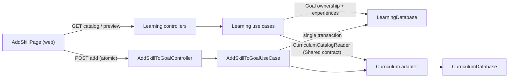

# 1. Context and scope

## Objective and source

Deliver, end to end, the manual flow to add a Habilidade to an existing Objetivo,
presenting Curriculum's currently suggested foundation Habilidades ("bases
sugeridas") as optional inclusions and adding every selected experience
atomically. Real source: Jira [SHIFU-65](https://joaogoliveiragarcia.atlassian.net/browse/SHIFU-65)
("Dev Task", blocked by the story [SHIFU-35](https://joaogoliveiragarcia.atlassian.net/browse/SHIFU-35)
"Adicionar e visualizar Habilidades independentes dentro de um Objetivo"). Owning
module: **Learning**. Canonical PRD: *Shifu — PRD — Learning*, Confluence page
`83066881`, version `6` (recorded by SHIFU-65's DoR checklist; page body read in
full on 2026-09-22 through the Atlassian Shifu MCP, `lastModified` "set. 15,
2026"). Requirements consumed in full: `RP-03`, `RP-04`, `RP-05`, `RP-25`;
journey `JN-17`. Delivery mode: **complete** — the slice spans a brand-new
cross-module contract, a Curriculum persistence adapter that does not exist yet,
a schema migration, and several web UI states across two applications; the
independent Spec Reviewer is mandatory.

## Current behavior and product gap

`/learning/goals/$goalId` currently renders only `GoalDetailPlaceholderPage`
(`apps/web/src/ui/learning/widgets/pages/goal-detail-placeholder-page/index.tsx`)
— a static "em preparação" panel with no data and no actions. No route exists at
`/learning/goals/$goalId/skills/add`.

Learning's domain already models this feature's shape — `Goal`, `SkillExperience`
(`apps/server/src/shifu/learning/core/domain/entities`), `SkillExperienceStatus`,
and the exact errors it needs (`GoalNotFoundError`, `InvalidGoalError`,
`SkillAlreadyAddedError`, `SkillExperienceNotFoundError`) — but only one read-only
use case exists (`ListHomeGoalsUseCase`) and one controller (`GetHomeGoalsController`).
Curriculum already models `Skill` and `SkillFoundation`
(`apps/server/src/shifu/curriculum/core/domain`) with complete SQLAlchemy models,
mappers and repositories for skills, skill foundations, competencies, materials,
activities and curriculum sequences, but it has **zero** use cases, **zero** REST
endpoints, and its `CurriculumDatabase` interface has no SQLAlchemy implementation
(`apps/server/src/shifu/curriculum/database/sqlalchemy/__init__.py` is empty) —
it is not wired into `app.state` at all.

No cross-module read contract exists anywhere in the codebase. The only
cross-module contract today is `AuthenticationProvider`
(`apps/server/src/shifu/shared/core/interfaces/authentication_provider.py`),
Shared-owned and Identity-implemented, used only for authentication. Learning
querying Curriculum's Skill catalog would be the first business-data cross-module
dependency ever implemented here.

`learning_skill_experiences` (migration `a25a7142d3ff`) has no unique constraint
on `(goal_id, skill_id)`; duplicate prevention today would rely entirely on an
application-level existence check race-prone under concurrent submits.

Gap: a learner has no way to add a Habilidade — with or without its suggested
foundation Habilidades — to an existing Objetivo.

## Scope and product alignment

| Area | In scope | Out of scope |
| --- | --- | --- |
| Route | `/learning/goals/$goalId/skills/add`: catalog browse/search (with an inline, per-result suggested-foundations preview) and the foundations confirmation dialog | The real `/learning/goals/$goalId` Objective/Graph page (delivered by SHIFU-35); the legacy `objectives` route contract fix (tracked separately under SHIFU-64) |
| Curriculum reads | Paginated/searched Skill catalog plus batched direct Skill Foundations, through a new Shared-owned read contract | Curriculum authoring; a general-purpose Curriculum browsing REST API for other consumers |
| Learning writes | Atomic creation of 1..N `SkillExperience` rows (the chosen Skill plus selected foundations), all `not-started` | Starting diagnosis; Skill removal (RP-21); AI-Planner-sourced Skill additions (RP-02) |
| Goal | Ownership validation for the `goal_id` in the URL | Goal creation, editing or removal |

| Source requirement | Delivery | Notes |
| --- | --- | --- |
| RP-03 | partial | Full "Gerenciar Habilidades Independentes dentro dos Objetivos" delivered for the manual-add-with-foundations path defined here, including the addition list's per-result foundation classification required by its Regras de Experiência; AI-Planner-sourced additions and Skill removal remain other slices. |
| RP-04 | partial | This slice creates the experiences and, when both ends are in the Objetivo, the foundation relation that RP-04's Grafo/Lista will read; rendering that visualization is owned by SHIFU-35, not this Spec. |
| RP-05 | full | Every experience created by this flow starts `not-started`; the diagnostic never starts automatically. |
| RP-25 | full (for the paths this Spec owns) | Responsive, keyboard-operable, pt-BR, no-color-only requirements apply to the add-skill route and its dialog. |
| JN-17 | partial | Delivers the full journey through "Learning adiciona a Habilidade e as bases selecionadas...". The closing "retorna ao Grafo do Objetivo atualizado, mostrando as novas Habilidades e relações" is satisfied as a correct redirect plus cache invalidation; the visual graph itself is deferred to SHIFU-35 (see Product decisions). |

## Product decisions and assumptions

- **Cross-module architecture.** A new Shared-owned `CurriculumCatalogReader`
  contract is introduced, implemented by Curriculum and consumed only by
  Learning — mirroring how `AuthenticationProvider` is Shared-owned and
  Identity-implemented. All three new REST endpoints live under Learning's
  router; Curriculum still exposes no REST surface of its own, consistent with
  the PRD never asking for a general Curriculum browsing API.
- **Catalog contract.** Page size fixed at 20 (not client-controlled), keyset
  pagination cursored on `curriculum_skills.name` (already unique), 300ms
  client-side debounce, case-insensitive substring match on `name` only via
  `ILIKE` (no accent-folding — the MVP catalog is small and fixed, so a
  `pg_trgm`/`unaccent` investment is not justified yet), and an explicit
  "Carregar mais" button rather than scroll-triggered auto-loading (keeps the
  flow keyboard-operable per RP-25 without extra accessibility machinery).
- **Per-result foundation preview threshold (design-sourced, corrects revision 1).**
  `design/shifu.pen` shows each catalog row's suggested-foundation info inline,
  not only inside the confirmation dialog. A Skill with exactly one direct
  foundation shows it directly ("Base sugerida: {name}" + status). A Skill with
  more than one shows a count summary ("N bases sugeridas · X no objetivo · Y
  ainda não adicionadas") behind a per-row "Ver bases"/"Ocultar bases" toggle
  that expands to the present/missing breakdown. A Skill with zero foundations
  shows neither. This replaces revision 1's unevidenced ">3 foundations"
  dialog-summary assumption; the dialog itself always lists every foundation
  directly with no summary/expand control, since no design frame shows one.
- **Dialog footer is design-verified, not a single dynamic button (corrects
  revision 1).** Confirmed by all five dialog frames: when ≥1 foundation is
  currently selected and no submit has failed yet, the footer shows **two**
  independent actions — "Somente habilidade" (adds only the chosen Skill,
  ignoring the current selection) and "Adicionar habilidade e N base(s))"
  (adds the Skill plus every currently selected foundation; the count is live
  in the label). When the selected count is 0 (nothing selectable, or the user
  cleared the selection), the footer collapses to a single "Adicionar
  habilidade" action equivalent to the skill-only path. After a failed submit,
  the footer always collapses to a single "Tentar novamente" action that
  resubmits the exact payload of the last attempt, never re-offering the
  two-way choice.
- **Bulk toggle.** When ≥1 foundation is selectable, the dialog offers one
  "Selecionar todas"/"Desmarcar todas" ghost button (label reflects whether
  every selectable foundation is currently selected) that toggles all of them
  at once.
- **Duplicate-prevention safety.** A new unique constraint on
  `learning_skill_experiences (goal_id, skill_id)` is added by migration so
  deduplication is DB-enforced, not just use-case-enforced; a constraint
  violation is translated to the existing `SkillAlreadyAddedError` at the
  repository boundary.
- **Entry point.** `GoalDetailPlaceholderPage` is not modified. The new route is
  reachable directly; SHIFU-35 wires the real "Adicionar Habilidade" button once
  the Objective page exists. The add-skill page itself carries a "Voltar ao
  Objetivo" back link to `/learning/goals/$goalId`, per the design.
- **Navigation target.** Both successful confirmation and cancellation return to
  `/learning/goals/$goalId` — today the placeholder page, tomorrow the real
  Graph. The Learning goals-list/goal-detail query cache is invalidated on
  success so the placeholder (and later the real page) reflects fresh data. An
  already-added Skill's catalog row exposes an "Abrir" action that navigates
  directly to its existing `SkillExperience` (no dialog, no extra request —
  the catalog response already carries the experience id).
- **Error-status gap fixed as part of this delivery.** `AppErrorHandler`
  (`apps/server/src/shifu/rest/handlers/app_error_handler.py`) today maps every
  `AppError` that is not `InvalidCredentialsError` to a generic HTTP 500, because
  no handler is registered for the `NotFoundError` / `ConflictError` /
  `ValidationError` families the REST rules describe as the intended pattern
  ("known specific errors are registered before the generic `AppError`
  mapping"). Since this feature is the first to raise `NotFoundError`,
  `ConflictError` and `ValidationError` subclasses through a controller, three
  generic handlers are registered as part of this Spec (see Technical Contract);
  this is a pre-existing repository gap being closed, not a new product
  behavior.
- **Design Contract complete.** `design/shifu.pen` was inspected live via
  `pen interactive` (headless MCP shell) on 2026-09-22; all seven Jira-cited
  frames were screenshotted and their node trees walked. See
  `design/handoff.md`. No mobile-specific frame exists for any of the eight
  captured states; narrow-viewport layout follows `documentation/design.md`
  §3.6/§9, the same accepted gap already recorded by `objectives-home`'s
  handoff. The pre-existing, untracked
  `documentation/features/learning/objective-detail/design/*.png` files in this
  worktree depict the out-of-scope Objective/Graph page (T12) from an unrelated
  prior session and remain untouched.

# 2. Implementation Contract

| ID | RP/JN coverage | Required behavior |
| --- | --- | --- |
| RF-01 | RP-03; issue SHIFU-65 | Only the authenticated owner of `goal_id` may use the add-skill flow; a non-existent Goal and a Goal owned by another account produce the identical not-found response, exposing no data. |
| RF-02 | RP-03, JN-17 | Before any search input, the flow presents the first page of Curriculum's supported Skills in alphabetical order. |
| RF-03 | RP-03, RP-25 | The Skill catalog supports server-side search with debounce and progressive (paginated) loading, exposing loading, empty-result, recoverable-error and progressive-load states. |
| RF-04 | RP-03 (Regras de Experiência) | Each catalog row for a Skill already present in the Goal shows an "Abrir" action that navigates directly to its existing `SkillExperience`; no confirmation dialog opens and no duplicate is ever created. |
| RF-05 | RP-03, JN-17 | For a Skill not yet in the Goal, the catalog response already classifies each of its direct Curriculum foundations as already-in-Goal or missing, and the confirmation dialog reuses that same classification. |
| RF-06 | RP-03 | Missing suggested foundations start selected but remain individually toggleable; foundations already in the Goal are shown read-only in both the catalog row and the dialog and are never re-added; only direct foundations are ever suggested — selecting one never silently pulls in its own (indirect) foundations. |
| RF-07 | RP-03 (Regras de Experiência) | Each catalog row previews its Skill's suggested foundations inline: exactly one direct foundation is shown directly with its status; more than one is shown as a count summary behind a "Ver bases"/"Ocultar bases" toggle that expands to the present/missing breakdown; zero foundations show neither. |
| RF-08 | RP-03; issue SHIFU-65 | Confirmation stays available and correctly labelled when: the Skill has no suggested foundations, every foundation already belongs to the Goal, or the selected count is 0 — in each case a single action adds only the chosen Skill. |
| RF-09 | RP-03 | The chosen Skill and every selected foundation are added as one atomic operation; on failure no experience is treated as added and the selection is preserved for retry; cancelling the dialog leaves the Goal unchanged. |
| RF-10 | RP-03, RP-05 | Every newly created SkillExperience starts `not-started`; adding a Skill never starts its diagnostic automatically. |
| RF-11 | issue SHIFU-65 | Duplicate submissions are prevented while an add operation is in flight. |
| RF-12 | JN-17 | After success, the flow returns to `/learning/goals/$goalId` with the Learning goals data invalidated for refetch (see Product decisions for the partial-coverage note). |
| RF-13 | RP-25 | The full flow works on desktop and mobile, is fully keyboard-operable, and never communicates state by color alone. |
| RF-14 | JN-17; issue SHIFU-65 | The catalog page offers a "Voltar ao Objetivo" back link to the Goal, a guidance banner explaining that suggested bases are optional, and a labelled "Buscar no Currículo" search field. |
| RF-15 | RP-03 (Regras de Experiência) | When ≥1 foundation is selectable in the dialog, a single bulk-toggle action selects or deselects every selectable foundation at once; its label reflects the current all-selected state. |
| RF-16 | RP-03; issue SHIFU-65 | The dialog footer shows two independent actions ("Somente habilidade" and "Adicionar habilidade e N base(s)") whenever ≥1 foundation is currently selected and no submit has failed; it collapses to one action ("Adicionar habilidade") when the selected count is 0; after any failed submit it collapses to one "Tentar novamente" action that resubmits the exact last-attempted payload. |

| ID | RF coverage | Requirement | Given | When | Then | Expected evidence |
| --- | --- | --- | --- | --- | --- | --- |
| CA-01 | RF-01 | Owner opens the route for their own Goal | An authenticated user owns `goal_id` | They open `/learning/goals/$goalId/skills/add` | The catalog page renders | CI-01, CI-02, VM-01 |
| CA-02 | RF-01 | Non-owner/nonexistent Goal exposes nothing | `goal_id` does not exist, or belongs to another account | The user opens or calls any of the three endpoints for that `goal_id` | A not-found response is returned, identical in both cases, with no Goal or Skill data | CI-01, CI-02 |
| CA-03 | RF-02 | First page before search | The route just opened, no query typed | — | The first alphabetical page of Curriculum Skills is shown | CI-02, VM-01 |
| CA-04 | RF-03 | Debounced search | The catalog is open | The user types a query | A loading state appears after the debounce window, then matching results replace the list | CI-03, VM-02 |
| CA-05 | RF-03 | Empty search result | A query matches no Skill | Search completes | An empty-result state with a clear message is shown | CI-03, VM-02 |
| CA-06 | RF-03 | Recoverable search failure | The catalog request fails | Search completes with an error | A recoverable error state with "Tentar novamente" is shown, preserving the typed query | CI-03, VM-02 |
| CA-07 | RF-03 | Progressive loading | More Skills match than one page | The user activates "Carregar mais" (mouse or keyboard) | The next page is appended without discarding the current list | CI-03, VM-02 |
| CA-08 | RF-04 | Already-added row opens directly | The chosen Skill already has a SkillExperience in this Goal | The user activates that row's "Abrir" action | The flow navigates straight to the existing SkillExperience; no dialog opens; no new experience is created | CI-01, CI-02, VM-03 |
| CA-09 | RF-05 | Foundations classified in the catalog response | A Skill is not yet in the Goal and has direct foundations | The catalog page renders the row | Each foundation is already flagged present-in-goal or missing, without a further request when the row's own dialog opens | CI-01, CI-02, VM-04 |
| CA-10 | RF-06 | Missing foundations start selected, toggleable | The dialog is open with missing foundations | — / the user unchecks one | They start checked; unchecking one leaves the others selected | CI-02, VM-04 |
| CA-11 | RF-06 | Present foundations are read-only | A foundation already belongs to the Goal | The dialog and the catalog row render it | It is shown without a checkbox/selection affordance and is never resubmitted | CI-01, CI-02, VM-04 |
| CA-12 | RF-06 | No indirect inclusion | A selected foundation itself has further (indirect) foundations | The user confirms | Only the directly selected foundations are added; the indirect ones are never included | CI-01, CI-02 |
| CA-13 | RF-07 | Multi-foundation row summary and expand | A Skill has more than one direct foundation | The row renders, then the user activates "Ver bases" | A count summary is shown collapsed; activating the toggle reveals the full present/missing breakdown and flips the toggle to "Ocultar bases" | CI-02, VM-05 |
| CA-14 | RF-08 | No suggested foundations | The chosen Skill has zero direct foundations | The dialog opens | It states no additional foundation will be added; a single "Adicionar habilidade" confirms the Skill alone | CI-01, CI-02, VM-06 |
| CA-15 | RF-08 | All foundations already present | Every direct foundation already belongs to the Goal | The dialog opens | It states they already belong to the Goal; a single "Adicionar habilidade" adds only the chosen Skill | CI-01, CI-02, VM-06 |
| CA-16 | RF-06, RF-08 | User deselects every optional foundation | Foundations were suggested and selected | The user unchecks all of them | The footer collapses to a single "Adicionar habilidade" action that adds only the chosen Skill | CI-01, CI-02, VM-04 |
| CA-17 | RF-09 | Atomic success | The dialog has 0..N foundations selected | The user confirms via any footer action | The chosen Skill and every selected foundation are created as `not-started` experiences in one operation | CI-01, CI-02, VM-03 |
| CA-18 | RF-09 | Cancel leaves Goal unchanged | The dialog is open, some foundations selected | The user cancels | No SkillExperience is created; the Goal is unchanged; the flow returns to the catalog | CI-02, VM-07 |
| CA-19 | RF-09 | Failure preserves selection | The atomic add fails (e.g. transient error) | The user confirms | The dialog stays open, the selection is preserved, "Tentar novamente" is offered, and no partial experience is persisted | CI-01, CI-02, VM-08 |
| CA-20 | RF-10 | Created experiences start `not-started` | An add succeeds | — | Every created `SkillExperience.status` is `not-started`; no diagnostic session starts | CI-01, CI-02 |
| CA-21 | RF-11 | Duplicate-submit guard | A confirm is in flight | The user activates any footer confirm action again | The second activation is ignored/disabled; exactly one atomic operation executes | CI-02, VM-03 |
| CA-22 | RF-12 | Success navigation | The atomic add succeeds | — | The flow navigates to `/learning/goals/$goalId`; the Learning goals query cache is invalidated | CI-02, VM-03 |
| CA-23 | RF-13 | Keyboard and non-color operability | The full flow, any state | The user operates search, list, toggles, checkboxes, confirm and cancel by keyboard only | Every control is reachable and operable; no state is conveyed by color alone | VM-01, VM-09 |
| CA-24 | RF-13 | Responsive rendering | The full flow | Viewed at the design's desktop viewport and a narrow mobile viewport | Layout matches the design references at desktop and follows `design.md`'s responsive rules at mobile | VM-01, VM-09 |
| CA-25 | RF-14 | Back link | The catalog page is open | The user activates "Voltar ao Objetivo" | The flow navigates to `/learning/goals/$goalId` | VM-01 |
| CA-26 | RF-07 | Single-foundation row shown inline | A Skill has exactly one direct foundation | The row renders | The foundation's name and status are shown directly, with no toggle | VM-05 |
| CA-27 | RF-15 | Bulk select/deselect all | The dialog has ≥1 selectable foundation | The user activates the bulk toggle | Every selectable foundation's checked state flips together; the toggle's own label updates ("Selecionar todas" ↔ "Desmarcar todas") | CI-02, VM-04 |
| CA-28 | RF-16 | "Somente habilidade" ignores current selection | The dialog has ≥1 foundation currently selected | The user activates "Somente habilidade" | Only the chosen Skill is added; the currently checked foundations are not included | CI-01, CI-02, VM-04 |
| CA-29 | RF-16 | Primary action label carries the live count | The dialog has N ≥ 1 foundations currently selected | The selection count changes | The primary action's label updates to "Adicionar habilidade e N base(s))"; activating it adds the Skill plus those N foundations | VM-04 |
| CA-30 | RF-08, RF-16 | Footer collapses at zero selection | The selected count is 0 (nothing selectable or user cleared it) | The dialog renders | Only one action, "Adicionar habilidade", is shown; no "Somente habilidade"/count-labelled pair appears | CI-02, VM-04, VM-06 |
| CA-31 | RF-09, RF-16 | Retry resubmits the exact last attempt | A submit failed after either the skill-only or the skill+bases path was chosen | The user activates "Tentar novamente" | The identical payload of the failed attempt is resubmitted; the two-way choice is not re-offered | VM-08 |

### Cross-cutting restrictions

| Restriction | Applies to | Rule |
| --- | --- | --- |
| Authorization | All three endpoints | Every endpoint requires the bearer-authenticated user and re-validates that `goal_id` belongs to `user.account_id`; failure is indistinguishable from a non-existent Goal. |
| Atomicity | POST add | The chosen Skill and every selected foundation are persisted inside one `LearningDatabase.transaction()`; no code path can observe a partial result. |
| Concurrency | POST add | A unique DB constraint on `(goal_id, skill_id)` is the backstop against a racing duplicate submit; the repository translates the resulting integrity error into `SkillAlreadyAddedError`. |
| Accessibility | Whole route | RP-25: keyboard operability, no color-only signaling, pt-BR copy, desktop and mobile layouts. |
| Secrets | Whole route | No credentials, tokens or another account's data are ever returned by any of the three endpoints. |

## Design Contract

Complete. `design/shifu.pen` was inspected live through the Pencil MCP
(`pen interactive`, headless, `--in design/shifu.pen`) on 2026-09-22. All seven
Jira-cited frames were screenshotted at export scale `1`, visually inspected, and
their node trees walked to extract exact pt-BR copy and interaction states. The
full inventory, per-state screenshots and Pencil-to-Shifu component mapping are
recorded in
[`design/handoff.md`](../../../features/learning/add-skill/design/handoff.md)
(colocated at `documentation/features/learning/add-skill/design/handoff.md`),
following the same `design/handoff.md` convention already used by
`objectives-home` and `sign-in`.

Summary of the eight captured states (desktop 1440-wide only; no mobile frame
exists — narrow-viewport layout follows `documentation/design.md` §3.6/§9, same
accepted gap as `objectives-home`):

| Reference | State | Criteria |
| --- | --- | --- |
| `yR0iN` | Catalog, bases-preview collapsed | CA-01, CA-03, CA-25, CA-26 |
| `SVHqP` | Catalog, one row's bases-preview expanded | CA-13 |
| `o663ai` | Dialog, ≥1 foundation selected (two-button footer) | CA-09, CA-10, CA-27, CA-28, CA-29 |
| `xzwuv` | Dialog, no suggested foundations | CA-14 |
| `w3glK` | Dialog, all foundations already present | CA-15 |
| `UXNLJ` | Dialog, 0 foundations selected (single-button footer) | CA-16, CA-27, CA-30 |
| `iQP0U` | Dialog, failed submit with selection preserved | CA-19, CA-31 |

Token mapping reuses the existing Dojo editorial tokens (`--jade-*` learning,
`--selo-*` action/error, `--latão-*` never used here — this flow is pedagogical,
not gamified); the alert in `iQP0U` uses the neutral/warning treatment, not
`--selo-fill`, matching `documentation/design.md` §7's "Erro recuperável" row.
No supplemental screenshot is required beyond the seven captured frames: the
not-found response (CA-02) and the in-flight duplicate-submit guard (CA-21) are
non-visual/transient states with no dedicated design state, validated
behaviorally (CI/VM), not visually.

# 3. Technical Contract

## Current technical state

| Evidence | Current responsibility | Gap |
| --- | --- | --- |
| `apps/server/src/shifu/learning/core/domain/entities/{goal,skill_experience}.py` | Goal and SkillExperience entities, including `SkillExperience` status transitions | No creation flow calls them for a manual add with foundations |
| `apps/server/src/shifu/learning/core/domain/errors/{goal_not_found_error,invalid_goal_error,skill_already_added_error}.py` | Errors this flow needs already defined | Nothing raises them yet |
| `apps/server/src/shifu/curriculum/core/domain/{entities/skill.py,structures/skill_foundation.py}` | Skill and SkillFoundation (= "bases sugeridas") fully modeled | No use case, adapter or REST surface reads them |
| `apps/server/src/shifu/curriculum/core/interfaces/skills_repository.py` | `find_by_id`, `find_many_by_ids`, `find_all`, `add_many`, `remove_all` | No paginated/searchable listing method |
| `apps/server/src/shifu/curriculum/core/interfaces/skill_foundations_repository.py` | `find_many_by_skill_id` (single id), `find_many_by_foundation_skill_id`, `find_all`, `add_many`, `remove_all` | No batched-by-many-skill-ids lookup, needed to avoid N+1 when the catalog page previews foundations for up to 20 Skills at once |
| `apps/server/src/shifu/curriculum/database/sqlalchemy/{repositories,models,mappers}/*.py` | All six Curriculum SQLAlchemy repositories/models/mappers implemented | Never assembled into a `CurriculumDatabase`; `sqlalchemy/__init__.py` is empty |
| `apps/server/src/shifu/app.py` | Wires `identity_database`, `learning_database`, `intelligence_database`, `authentication_provider` into `app.state` | No `curriculum_database` or any cross-module reader is wired |
| `apps/server/src/shifu/shared/core/interfaces/authentication_provider.py` | The only existing cross-module contract (Shared-owned, Identity-implemented) | No equivalent exists for Curriculum→Learning business data |
| `apps/server/src/shifu/rest/handlers/app_error_handler.py` | Registers `InvalidCredentialsError` → 401/503 and a generic `AppError` → 500 fallback | `NotFoundError`, `ConflictError`, `ValidationError` have no registered handler and currently fall through to HTTP 500 |
| `apps/server/migrations/versions/a25a7142d3ff_initial_application_schema.py` | Creates `learning_skill_experiences` with only a primary key on `id` | No unique constraint on `(goal_id, skill_id)` |
| `apps/web/src/routes/learning/goals/$goalId/index.tsx` | Renders `GoalDetailPlaceholderPage` | No route exists at `.../skills/add`; no entry point renders yet |
| `apps/web/src/ui/shared/hooks/use-navigation.ts` | `navigateTo`, `navigateToGoalDetail`, `navigateToPlanner` — typed `useNavigate` wrappers per dynamic route | No `navigateToAddSkill` |
| `apps/web/src/rest/services/learning-service.ts` | `LearningService.getGoals` | No catalog search, preview or add operations |
| `apps/web/src/ui/learning/widgets/layouts/goals-list-section/*` | Reference pattern: colocated `use-<widget>.ts` behavior hook + `use-<x>-query.ts` TanStack Query hook + component test under `tests/` | No debounced/paginated query precedent exists anywhere in the web app yet |

## Solution and runtime flow

Learning owns the entry point end to end. The web `AddSkillPage` loads the
catalog through a new Learning REST group nested under `/learning/goals/{goal_id}`.
Server-side, each of the three new controllers depends only on Learning's own
`LearningDatabase` plus the new Shared `CurriculumCatalogReader` contract —
Learning's core never imports Curriculum's core. The reader is implemented by a
Curriculum-owned adapter that opens its own `CurriculumDatabase.transaction()`
internally; composition (`app.py`) wires the concrete adapter into
`app.state.curriculum_catalog_reader` exactly as it already wires
`authentication_provider`.

- **Search** (`GET .../skills/catalog`): validates Goal ownership, delegates
  paging/matching to the reader's `search_skills`, then — for the returned page
  of Skills only — batch-fetches direct foundations for all of their ids in one
  `reader.find_direct_foundations_for_many` call and batch-fetches the Goal's
  existing `SkillExperience`s once via `skill_experiences.find_many_by_goal_id`.
  Each response row is assembled by combining these three results: whether the
  Skill itself is already in the Goal (and its experience id, for "Abrir"), and
  each of its direct foundations' own already-in-Goal status.
- **Preview** (`GET .../skills/{skill_id}/addition-preview`): validates Goal
  ownership and that the Skill exists in Curriculum, checks
  `skill_experiences.find_by_goal_id_and_skill_id` first (short-circuits to
  `already_added` with the existing experience id when found — normally
  unreachable from the UI since the catalog already hides that path behind
  "Abrir", but still authoritative for a direct API call), otherwise reads
  direct foundations through the reader and classifies each against Learning's
  own experiences for that Goal — the same shape the catalog row already
  previewed, refetched authoritatively at dialog-open time.
- **Add** (`POST .../skills`): validates Goal ownership and Skill existence, then
  opens one `LearningDatabase.transaction()` that re-checks for an existing
  experience (`SkillAlreadyAddedError` if found), validates every submitted
  foundation id is actually a direct foundation of the chosen Skill
  (`InvalidFoundationSelectionError` otherwise — defends against a tampered
  request, since the dialog's own foundation list came from the preview call),
  drops any foundation id that already has an experience in the Goal, builds one
  `SkillExperience` per remaining id (all `status=not-started`), and persists
  them with `skill_experiences.add_many`. The unique `(goal_id, skill_id)`
  constraint is the last line of defense against a concurrent duplicate submit;
  the SQLAlchemy repository translates the resulting integrity error into
  `SkillAlreadyAddedError` so the controller boundary never sees a raw database
  exception. The web dialog always resubmits the exact same
  `foundation_skill_ids` list on retry after a failure — "Somente habilidade"
  submits `[]`, "Adicionar habilidade e N bases" submits the currently checked
  ids, and a retry resends whichever list was last attempted.

All three controllers are thin HTTP adapters: they resolve dependencies through
`LearningPipe`, construct the use case, call `.execute(...)`, and map the result
to a `Response` model. No controller uses `try`/`except`; expected failures
(`GoalNotFoundError`, `CurriculumSkillNotFoundError`, `SkillAlreadyAddedError`,
`InvalidFoundationSelectionError`) escape to the newly-generalized
`AppErrorHandler`.



| Boundary | Producer | Consumer | Canonical contract | Mapping/guarantees | Failure ownership |
| --- | --- | --- | --- | --- | --- |
| In-process port | `CurriculumCatalogReaderProvider` (Curriculum) | Learning use cases | `shared/core/interfaces/curriculum_catalog_reader.py` `CurriculumCatalogReader` | Read-only; each call opens its own `CurriculumDatabase.transaction()`; returns `SkillCatalogPage` / `SkillCatalogEntry` / `SkillFoundationEntry` (Shared structures); foundations are fetched batched, keyed by skill id | Curriculum adapter surfaces domain data only, no Curriculum errors cross the boundary |
| HTTP | `search_skill_catalog_controller.py` | `AddSkillCatalogSection` (web) | `GET /learning/goals/{goal_id}/skills/catalog` | `{items:[{id,name,description,already_in_goal,skill_experience_id,foundations:[{skill_id,name,already_in_goal}]}], next_cursor}`; keyset-paginated, 20/page | 404 via `GoalNotFoundError` |
| HTTP | `preview_skill_addition_controller.py` | `AddSkillFoundationsDialog` (web) | `GET /learning/goals/{goal_id}/skills/{skill_id}/addition-preview` | `{already_added, skill_experience_id, skill_name, foundations:[{skill_id,name,already_in_goal}]}` | 404 via `GoalNotFoundError`/`CurriculumSkillNotFoundError` |
| HTTP | `add_skill_to_goal_controller.py` | `AddSkillFoundationsDialog` (web) | `POST /learning/goals/{goal_id}/skills` | Request `{skill_id, foundation_skill_ids: string[]}`; Response 201 `{created:[{id,skill_id,status}]}` | 404 `GoalNotFoundError`/`CurriculumSkillNotFoundError`, 409 `SkillAlreadyAddedError`, 400 `InvalidFoundationSelectionError` |

## Affected layer contracts

### Domain (Shared)

| Path | Change | Declaration/operation | Contract and guarantees | Dependencies/consumers | Generation/tests |
| --- | --- | --- | --- | --- | --- |
| `apps/server/src/shifu/shared/core/domain/structures/skill_catalog_entry.py` | Create | `SkillCatalogEntry{id: str, name: str, description: str}` (`@structure`, frozen) | Module-neutral Skill shape for cross-module reads | Produced by Curriculum's reader adapter; consumed by Learning use cases | Conformance covered indirectly by the use-case tests that consume it |
| `apps/server/src/shifu/shared/core/domain/structures/skill_catalog_page.py` | Create | `SkillCatalogPage{items: tuple[SkillCatalogEntry, ...], next_cursor: str \| None}` | Keyset page result | Same as above | Same as above |
| `apps/server/src/shifu/shared/core/domain/structures/skill_foundation_entry.py` | Create | `SkillFoundationEntry{skill_id: str, name: str}` | Direct-foundation shape for cross-module reads | Same as above | Same as above |
| `apps/server/src/shifu/shared/core/domain/structures/__init__.py` | Modify | Export the three new structures | — | — | — |

### Interfaces (Shared)

| Path | Change | Declaration/operation | Contract and guarantees | Dependencies/consumers | Generation/tests |
| --- | --- | --- | --- | --- | --- |
| `apps/server/src/shifu/shared/core/interfaces/curriculum_catalog_reader.py` | Create | `CurriculumCatalogReader(Protocol)`: `search_skills(*, query: str \| None, cursor: str \| None, limit: int) -> SkillCatalogPage`; `find_skill_by_id(skill_id: str) -> SkillCatalogEntry \| None`; `find_direct_foundations_for_many(skill_ids: list[str]) -> dict[str, list[SkillFoundationEntry]]` | Read-only; implemented by Curriculum, consumed by Learning; mirrors `AuthenticationProvider`'s Shared-owned/module-implemented shape; the batched foundations method is used both by the catalog search (many ids at once) and the preview endpoint (single-id list, then unwrapped) so there is exactly one foundations-reading method to implement and test | Implementer: `CurriculumCatalogReaderProvider`. Consumers: Learning's three new use cases | Unit-tested indirectly through the use cases (mocked with `create_autospec`) |
| `apps/server/src/shifu/shared/core/interfaces/__init__.py` | Modify | Export `CurriculumCatalogReader` | — | — | — |

### Interfaces (Curriculum)

| Path | Change | Declaration/operation | Contract and guarantees | Dependencies/consumers | Generation/tests |
| --- | --- | --- | --- | --- | --- |
| `apps/server/src/shifu/curriculum/core/interfaces/skills_repository.py` | Modify | Add `search(self, *, query: str \| None, cursor: str \| None, limit: int) -> tuple[list[Skill], str \| None]` to `SkillsRepository(Protocol)` | Returns up to `limit` Skills ordered by `name` ascending, matching `query` case-insensitively when provided, starting after `cursor`; second tuple element is the next cursor (`None` when exhausted) | Implemented by `SqlalchemySkillsRepository`; consumed by `CurriculumCatalogReaderProvider` | No dedicated repository test. Per `database-layer-rules.md`, a repository-focused integration test outside `apps/server/tests/core` is warranted only for persistence semantics that cannot be observed clearly through an application boundary; here `test_search_skill_catalog_controller.py` already proves case-insensitive matching and keyset-cursor pagination end to end against real Postgres, so that condition is not met |
| `apps/server/src/shifu/curriculum/core/interfaces/skill_foundations_repository.py` | Modify | Add `find_many_by_skill_ids(self, skill_ids: list[str]) -> list[SkillFoundation]` to `SkillFoundationsRepository(Protocol)` | Single-query `IN (...)` batch lookup across many `skill_id`s, avoiding N+1 when previewing a full catalog page | Implemented by `SqlalchemySkillFoundationsRepository`; consumed by `CurriculumCatalogReaderProvider.find_direct_foundations_for_many` | Same rationale as above — exercised end to end by `test_search_skill_catalog_controller.py` |

### REST (Shared)

| Path | Change | Declaration/operation | Contract and guarantees | Dependencies/consumers | Generation/tests |
| --- | --- | --- | --- | --- | --- |
| `apps/server/src/shifu/rest/handlers/app_error_handler.py` | Modify | Register three additional handlers on `AppErrorHandler.register`: `NotFoundError`→404, `ConflictError`→409, `ValidationError`→400, each built with `code` derived from `snake_case(type(error).__name__)` and `message=error.message`; registered before the existing generic `AppError`→500 handler; the existing `InvalidCredentialsError` and identity-path 503 special cases are untouched | Closes the gap where every non-identity `AppError` currently returns 500 regardless of its real semantics; scoped to the three error families this feature raises (`GoalNotFoundError`/`CurriculumSkillNotFoundError` as `NotFoundError`, `SkillAlreadyAddedError` as `ConflictError`, `InvalidGoalError`/`InvalidFoundationSelectionError` as `ValidationError`) | Read by `FastAPIApp.register`; benefits every controller that raises these families, not only this feature's | `apps/server/tests/rest/handlers/test_app_error_handler.py` (Create) asserting each status/code mapping |

### Domain (Learning)

| Path | Change | Declaration/operation | Contract and guarantees | Dependencies/consumers | Generation/tests |
| --- | --- | --- | --- | --- | --- |
| `apps/server/src/shifu/learning/core/domain/errors/curriculum_skill_not_found_error.py` | Create | `CurriculumSkillNotFoundError(NotFoundError)`, `message='A habilidade do currículo não foi encontrada.'` | Raised when a `skill_id` does not resolve through `CurriculumCatalogReader` | Raised by `PreviewSkillAdditionUseCase`, `AddSkillToGoalUseCase` | Covered by their use-case tests |
| `apps/server/src/shifu/learning/core/domain/errors/invalid_foundation_selection_error.py` | Create | `InvalidFoundationSelectionError(ValidationError)`, `message='A seleção de bases não é válida para esta habilidade.'` | Raised when a submitted `foundation_skill_ids` entry is not a direct foundation of the chosen Skill | Raised by `AddSkillToGoalUseCase` | Covered by its use-case test |
| `apps/server/src/shifu/learning/core/domain/errors/__init__.py` | Modify | Export both new errors | — | — | — |
| `apps/server/src/shifu/learning/core/domain/structures/suggested_foundation.py` | Create | `SuggestedFoundation{skill_id: str, name: str, already_in_goal: bool}` (`@structure`) | One foundation row, shared shape reused by both the catalog row preview and the dialog preview | Produced by `SearchSkillCatalogUseCase` and `PreviewSkillAdditionUseCase`; consumed by their controllers | — |
| `apps/server/src/shifu/learning/core/domain/structures/skill_addition_preview.py` | Create | `SkillAdditionPreview{skill_id: str, skill_name: str, existing_skill_experience_id: str \| None, suggested_foundations: tuple[SuggestedFoundation, ...]}` (`@structure`) | Preview use-case output | Produced by `PreviewSkillAdditionUseCase`; consumed by its controller | — |
| `apps/server/src/shifu/learning/core/domain/structures/skill_catalog_row.py` | Create | `SkillCatalogRow{id: str, name: str, description: str, already_in_goal: bool, skill_experience_id: str \| None, foundations: tuple[SuggestedFoundation, ...]}` (`@structure`) | One catalog result row, combining the raw Curriculum `SkillCatalogEntry` with this Goal's already-in-Goal/foundation status | Produced by `SearchSkillCatalogUseCase`; consumed by `SearchSkillCatalogController` | — |
| `apps/server/src/shifu/learning/core/domain/structures/__init__.py` | Modify | Export the three new structures | — | — | — |

### Use cases (Learning)

| Path | Change | Declaration/operation | Contract and guarantees | Dependencies/consumers | Generation/tests |
| --- | --- | --- | --- | --- | --- |
| `apps/server/src/shifu/learning/core/use_cases/search_skill_catalog_use_case.py` | Create | `SearchSkillCatalogUseCase(database: LearningDatabase, curriculum_catalog_reader: CurriculumCatalogReader).execute(account_id: str, goal_id: str, query: str \| None, cursor: str \| None) -> tuple[list[SkillCatalogRow], str \| None]` | Raises `GoalNotFoundError` when the Goal is missing or foreign; calls `reader.search_skills(limit=20)`, then `reader.find_direct_foundations_for_many` for the page's ids and `skill_experiences.find_many_by_goal_id(goal_id)` once, and assembles each `SkillCatalogRow` (marking a foundation's own `already_in_goal` from the same experience set); read-only, no transaction needed on the Learning side beyond the ownership/experience lookup | Consumed by `SearchSkillCatalogController` | `apps/server/tests/core/learning/use_cases/test_search_skill_catalog_use_case.py` (Create) |
| `apps/server/src/shifu/learning/core/use_cases/preview_skill_addition_use_case.py` | Create | `PreviewSkillAdditionUseCase(database, curriculum_catalog_reader).execute(account_id: str, goal_id: str, skill_id: str) -> SkillAdditionPreview` | Raises `GoalNotFoundError`/`CurriculumSkillNotFoundError`; short-circuits to `existing_skill_experience_id` set when already added; otherwise classifies every direct foundation (via `find_direct_foundations_for_many([skill_id])`) as `already_in_goal` via `skill_experiences.find_by_goal_id_and_skill_id` | Consumed by `PreviewSkillAdditionController` | `apps/server/tests/core/learning/use_cases/test_preview_skill_addition_use_case.py` (Create) |
| `apps/server/src/shifu/learning/core/use_cases/add_skill_to_goal_use_case.py` | Create | `AddSkillToGoalUseCase(database, curriculum_catalog_reader, id_provider: IdentifierProvider, clock_provider: ClockProvider).execute(account_id: str, goal_id: str, skill_id: str, foundation_skill_ids: list[str]) -> list[SkillExperience]` | Raises `GoalNotFoundError`/`CurriculumSkillNotFoundError` before opening a transaction; inside one `database.transaction()`: raises `SkillAlreadyAddedError` if the chosen Skill already has an experience; raises `InvalidFoundationSelectionError` if any requested id is not a direct foundation; silently drops already-present foundations (never duplicates); creates one `not-started` `SkillExperience` per chosen Skill + remaining foundation, `inclusion_reason=None`; persists via `add_many` | Consumed by `AddSkillToGoalController` | `apps/server/tests/core/learning/use_cases/test_add_skill_to_goal_use_case.py` (Create) |
| `apps/server/src/shifu/learning/core/use_cases/__init__.py` | Modify | Export the three new use cases | — | — | — |

### REST (Learning)

| Path | Change | Declaration/operation | Contract and guarantees | Dependencies/consumers | Generation/tests |
| --- | --- | --- | --- | --- | --- |
| `apps/server/src/shifu/learning/rest/controllers/search_skill_catalog_controller.py` | Create | `GET /learning/goals/{goal_id}/skills/catalog?query=&cursor=` → 200 `Response{items: list[{id,name,description,already_in_goal,skill_experience_id,foundations:[{skill_id,name,already_in_goal}]}], next_cursor: str \| None}` | Auth via `SharedPipe.get_authenticated_user`; database via `LearningPipe.get_database`; reader via `LearningPipe.get_curriculum_catalog_reader` | Calls `SearchSkillCatalogUseCase` | `apps/server/tests/rest/controllers/learning/test_search_skill_catalog_controller.py` (Create) |
| `apps/server/src/shifu/learning/rest/controllers/preview_skill_addition_controller.py` | Create | `GET /learning/goals/{goal_id}/skills/{skill_id}/addition-preview` → 200 `Response{already_added: bool, skill_experience_id: str \| None, skill_name: str \| None, foundations: list[{skill_id,name,already_in_goal}]}` | Same dependency wiring | Calls `PreviewSkillAdditionUseCase` | `apps/server/tests/rest/controllers/learning/test_preview_skill_addition_controller.py` (Create) |
| `apps/server/src/shifu/learning/rest/controllers/add_skill_to_goal_controller.py` | Create | `POST /learning/goals/{goal_id}/skills` → 201 `Response{created: list[{id,skill_id,status}]}`; `Request{skill_id: str, foundation_skill_ids: list[str] = []}` | Same dependency wiring plus `LearningPipe.get_identifier_provider`/`get_clock_provider` | Calls `AddSkillToGoalUseCase` | `apps/server/tests/rest/controllers/learning/test_add_skill_to_goal_controller.py` (Create) |
| `apps/server/src/shifu/learning/rest/router.py` | Modify | Register the three controllers on the existing `/learning` router | — | — | Exercised by the controller tests above |
| `apps/server/src/shifu/learning/rest/controllers/__init__.py` | Modify | Export the three new controllers | — | — | — |

### Provision / Composition (Learning, Curriculum)

| Path | Change | Declaration/operation | Contract and guarantees | Dependencies/consumers | Generation/tests |
| --- | --- | --- | --- | --- | --- |
| `apps/server/src/shifu/curriculum/providers/curriculum_catalog_reader_provider.py` | Create | `CurriculumCatalogReaderProvider(curriculum_database: CurriculumDatabase)` implementing `CurriculumCatalogReader`; each method opens its own `curriculum_database.transaction()` | `search_skills` → `skills.search(...)`; `find_skill_by_id` → `skills.find_by_id`; `find_direct_foundations_for_many` → `skill_foundations.find_many_by_skill_ids(...)` grouped by `skill_id`, then resolves names via one `skills.find_many_by_ids` over the distinct `foundation_skill_id`s | Wired into `app.state.curriculum_catalog_reader` by `app.py` | No dedicated provider test (`provision-layer-rules.md` forbids one); exercised end-to-end against real Postgres through `test_search_skill_catalog_controller.py` and `test_preview_skill_addition_controller.py`, which traverse the composed pipe (`LearningPipe.get_curriculum_catalog_reader` → this provider → `SqlalchemyCurriculumDatabase`) |
| `apps/server/src/shifu/curriculum/database/sqlalchemy/curriculum_database.py` | Create | `SqlalchemyCurriculumDatabase(engine, id_provider=None)` implementing `CurriculumDatabase`, assembling all six existing SQLAlchemy repositories per transaction (mirrors `SqlalchemyLearningDatabase`) | Sole Curriculum transaction boundary | Used by `CurriculumCatalogReaderProvider` and future Curriculum controllers | No dedicated test; exercised end-to-end (real Postgres) by `test_search_skill_catalog_controller.py` and `test_preview_skill_addition_controller.py`, same as the provider it backs |
| `apps/server/src/shifu/curriculum/database/sqlalchemy/__init__.py` | Modify | Export `SqlalchemyCurriculumDatabase` | — | — | — |
| `apps/server/src/shifu/learning/pipes/learning_pipe.py` | Modify | Add `get_identifier_provider() -> IdentifierProvider` (`SystemIdentifierProvider()`), `get_clock_provider() -> ClockProvider` (`SystemClockProvider()`), `get_curriculum_catalog_reader(request: Request) -> CurriculumCatalogReader` (`request.app.state.curriculum_catalog_reader`) — mirrors `IntelligencePipe` | — | Depended on by the three new controllers | Exercised by the controller tests |
| `apps/server/src/shifu/app.py` | Modify | Instantiate `app.state.curriculum_database = SqlalchemyCurriculumDatabase(engine=database_engine, id_provider=id_provider)` and `app.state.curriculum_catalog_reader = CurriculumCatalogReaderProvider(app.state.curriculum_database)`, alongside the existing database/provider wiring | — | Read by `LearningPipe.get_curriculum_catalog_reader` | Exercised transitively by controller tests running against the real app |

### Database (Learning)

| Path | Change | Declaration/operation | Contract and guarantees | Dependencies/consumers | Generation/tests |
| --- | --- | --- | --- | --- | --- |
| `apps/server/src/shifu/learning/database/sqlalchemy/repositories/skill_experiences_repository.py` | Modify | `add_many` wraps `self._session.add_all(...); self._session.flush()` in `try`/`except sqlalchemy.exc.IntegrityError` and re-raises `SkillAlreadyAddedError` | Translates the new unique-constraint violation into the domain error at the adapter boundary, keeping the use case infrastructure-free | Called by `AddSkillToGoalUseCase` | `apps/server/tests/core/learning/use_cases/test_add_skill_to_goal_use_case.py` covers the use-case-level effect; a Testcontainers repository test covers the actual constraint |
| `apps/server/migrations/versions/<generated>_add_skill_experience_goal_skill_unique_constraint.py` | Generate | `Columns`: none added. `Indexes/Constraints`: `UniqueConstraint('goal_id', 'skill_id', name='uq_learning_skill_experiences_goal_id_skill_id')` on `learning_skill_experiences`. `down_revision`: `faa7f006048a` (current head). Downgrade drops the constraint. No data migration; the table has no existing duplicate rows to reconcile in any environment that has only run this feature's own seed/tests. | Generated with `uv run poe db:migrate "add skill experience goal skill unique constraint"`, reviewed, then applied with `uv run poe db:upgrade` | Enforced at the database level for `AddSkillToGoalUseCase` | Exercised by the repository/controller integration tests above |

## Widget hierarchy (UI)

| Widget | Kind | Parent/entry | Direct children | Public contract | Behavior owner |
| --- | --- | --- | --- | --- | --- |
| `AddSkillPage` | Page | route `/learning/goals/$goalId/skills/add` | `AddSkillCatalogSection`, `AddSkillFoundationsDialog` | `{goalId: string}` | `use-add-skill-page.ts` |
| `AddSkillCatalogSection` | Layout | `AddSkillPage` | `SkillCatalogItem[]` | `{goalId: string, onSelectSkill(skillId: string): void}` | `use-add-skill-catalog-section.ts` |
| `SkillCatalogItem` | Component (stateful: local expand/collapse) | `AddSkillCatalogSection` | `SkillFoundationRow[]` (read-only, when expanded) | `{id, name, description, alreadyInGoal, skillExperienceId, foundations, onOpen(): void, onAdd(): void}` | `use-skill-catalog-item.ts` (local `expanded` toggle only — no query/mutation) |
| `AddSkillFoundationsDialog` | Layout | `AddSkillPage` | `SkillFoundationRow[]` | `{goalId, skillId: string \| null, open: boolean, onOpenChange(open: boolean): void, onAdded(): void}` | `use-add-skill-foundations-dialog.ts` |
| `SkillFoundationRow` | Component | `AddSkillCatalogSection` (read-only), `AddSkillFoundationsDialog` (selectable) | — | `{skillId, name, alreadyInGoal: boolean, checked?: boolean, onToggle?(): void}` (checkbox props omitted when read-only) | pure renderer |

```text
apps/web/src/
├── routes/learning/goals/$goalId/skills/add/
│   └── index.tsx                                   (Create)
├── ui/learning/widgets/pages/add-skill-page/
│   ├── index.tsx                                   (Create)
│   └── use-add-skill-page.ts                        (Create)
├── ui/learning/widgets/layouts/add-skill-catalog-section/
│   ├── index.tsx                                   (Create)
│   ├── use-add-skill-catalog-section.ts             (Create)
│   ├── use-skill-catalog-query.ts                   (Create)
│   └── tests/
│       └── add-skill-catalog-section.test.tsx       (Create)
├── ui/learning/widgets/layouts/add-skill-foundations-dialog/
│   ├── index.tsx                                   (Create)
│   ├── use-add-skill-foundations-dialog.ts          (Create)
│   ├── use-skill-addition-preview-query.ts          (Create)
│   └── tests/
│       └── add-skill-foundations-dialog.test.tsx    (Create)
├── ui/learning/widgets/components/skill-catalog-item/
│   ├── index.tsx                                   (Create)
│   └── use-skill-catalog-item.ts                    (Create)
├── ui/learning/widgets/components/skill-foundation-row/
│   ├── index.tsx                                   (Create)
│   └── tests/
│       └── skill-foundation-row.test.tsx           (Create)
├── ui/shared/hooks/use-debounced-value.ts            (Create)
├── ui/shared/hooks/use-navigation.ts                (Modify — add `navigateToAddSkill(goalId)`)
└── rest/services/learning-service.ts                (Modify — add `searchSkillCatalog`, `getSkillAdditionPreview`, `addSkillToGoal`)
```

### UI (Learning + Shared)

| Path | Change | Declaration/operation | Contract and guarantees | Dependencies/consumers | Generation/tests |
| --- | --- | --- | --- | --- | --- |
| `apps/web/src/routes/learning/goals/$goalId/skills/add/index.tsx` | Create | `createFileRoute('/learning/goals/$goalId/skills/add/')` with `beforeLoad: () => requireAuthMiddleware()`, rendering `AddSkillPage` with `goalId` from `Route.useParams()` | Mirrors `goals/$goalId/index.tsx` exactly | Registered by generated route tree | `apps/web/tests/learning/add-skill-page.test.ts` (Playwright, Create) |
| `apps/web/src/ui/learning/widgets/pages/add-skill-page/index.tsx` + `use-add-skill-page.ts` | Create | Renders the "Voltar ao Objetivo" back link (`useNavigation().navigateToGoalDetail`); owns `selectedSkillId` (dialog open/closed) and the post-add success redirect | Renders loading/empty/error/populated states delegated to `AddSkillCatalogSection`; opens `AddSkillFoundationsDialog` when a not-yet-added Skill's "Adicionar" is activated | Consumes `AddSkillCatalogSection`, `AddSkillFoundationsDialog` | Covered by the Playwright suite above; no separate Vitest test (thin composition) |
| `apps/web/src/ui/learning/widgets/layouts/add-skill-catalog-section/*` | Create | `use-skill-catalog-query.ts` wraps `useInfiniteQuery` (TanStack Query) keyed `['learning', 'goal', goalId, 'skill-catalog', debouncedQuery]`, `getNextPageParam` reading `next_cursor`; `use-add-skill-catalog-section.ts` composes it with `useDebouncedValue(query, 300)` and derives `loading \| empty \| error \| populated` state plus `handleLoadMore`/`handleRetry`; renders the guidance banner and search field | Debounce 300ms; page size 20 (server-fixed); explicit "Carregar mais" button; each item passes `onOpen` (already-added → `navigateToGoalDetail` via `skillExperienceId`'s owning route — see product decision) and `onAdd` (not-yet-added → bubbles `onSelectSkill`) to `SkillCatalogItem` | `AddSkillPage` | `tests/add-skill-catalog-section.test.tsx` (Vitest component test mocking the colocated hook, mirroring `goals-list-section.test.tsx`) |
| `apps/web/src/ui/learning/widgets/components/skill-catalog-item/*` | Create | `use-skill-catalog-item.ts` owns only a local `expanded` boolean for the "Ver bases"/"Ocultar bases" toggle (no query/mutation — the row's data comes from the parent's catalog query) | Renders one of three shapes: already-added ("Já está neste objetivo" + "Abrir"), single-foundation-inline, or many-foundations-summary-with-toggle (rendering read-only `SkillFoundationRow`s when expanded) | `AddSkillCatalogSection` | Covered by the section's test (internal widget, no dedicated file per widget-testing-rules) |
| `apps/web/src/ui/learning/widgets/layouts/add-skill-foundations-dialog/*` | Create | `use-skill-addition-preview-query.ts` wraps `useQuery` for the preview call, keyed `['learning', 'goal', goalId, 'skill-addition-preview', skillId]`, `enabled: Boolean(skillId)`; `use-add-skill-foundations-dialog.ts` owns foundation selection `Set<string>` (seeded from `!already_in_goal` entries), the bulk select/deselect-all toggle, submit-in-flight guard (CA-21), the add mutation, and a `lastAttemptedFoundationIds: string[] \| null` retry memory (CA-31) | Footer mode derives from `{selectedCount, hasFailedAttempt}`: two buttons when `selectedCount > 0 && !hasFailedAttempt`; one "Adicionar habilidade" when `selectedCount === 0`; one "Tentar novamente" resubmitting `lastAttemptedFoundationIds` when `hasFailedAttempt`; on submit success, invalidates `['learning', 'home-goals']` and the catalog/preview query keys for this `goal_id`, then calls `onAdded` | `AddSkillPage` | `tests/add-skill-foundations-dialog.test.tsx` (Vitest component test) |
| `apps/web/src/ui/learning/widgets/components/skill-foundation-row/index.tsx` | Create | Pure renderer; renders a checkbox when both `alreadyInGoal` is false and `onToggle` is provided, a read-only "Já no objetivo" badge otherwise | `{skillId,name,alreadyInGoal,checked?,onToggle?}` | `AddSkillCatalogSection` (read-only), `AddSkillFoundationsDialog` (selectable) | `tests/skill-foundation-row.test.tsx` (Create) — this widget has two independent owners rendering it in genuinely different modes (read-only badge vs. selectable checkbox), which is its own reuse contract per `widget-testing-rules.md`, not just a structural part of one owner; a small dedicated test asserts both render modes directly instead of relying on either consumer's test to incidentally cover both |
| `apps/web/src/ui/shared/hooks/use-debounced-value.ts` | Create | `useDebouncedValue<T>(value: T, delayMs: number): T` — module-neutral, generic debounce | First reusable debounce hook in the web app | `use-add-skill-catalog-section.ts` | Query/action-style reusable hook; no dedicated test per widget-testing rules (covered through the consuming section's test) |
| `apps/web/src/ui/shared/hooks/use-navigation.ts` | Modify | Add `navigateToAddSkill(goalId: string)` → `navigate({ params: { goalId }, to: '/learning/goals/$goalId/skills/add' })` | Mirrors existing `navigateToGoalDetail`/`navigateToPlanner`; `navigateToGoalDetail` is reused (not duplicated) for both the back link and the already-added "Abrir" action, since both land on the same Goal-scoped placeholder route today | Any future entry point (SHIFU-35); used directly by this Spec's own pages | No dedicated test (thin wrapper); exercised transitively |
| `apps/web/src/rest/services/learning-service.ts` | Modify | Add `searchSkillCatalog(accessToken, goalId, {query, cursor})`, `getSkillAdditionPreview(accessToken, goalId, skillId)`, `addSkillToGoal(accessToken, goalId, {skillId, foundationSkillIds})`, plus their response types (`SkillCatalogRow`, `SkillAdditionPreviewResponse`, `AddSkillResponse`), following the existing `validateGoalsResponse`-style inline shape guard | Wraps the three new endpoints; throws `AppError` on a malformed body, matching `getGoals` | Consumed by the three new query/mutation hooks via `createServerFn` server functions (mirroring `use-home-goals-query.ts`'s `fetchHomeGoals`) | Exercised transitively through the section/dialog component tests and the Playwright suite |

**Note on `SkillExperienceId` navigation.** Revision 1 assumed a dedicated route
for a single Skill's experience existed; it does not — `/learning/goals/$goalId`
is the only Goal-scoped page today (still the out-of-scope placeholder). "Abrir"
therefore also navigates to `/learning/goals/$goalId` via `navigateToGoalDetail`
in this delivery slice, identical to the back link and the success redirect; the
catalog response's `skill_experience_id` is still returned and stored so SHIFU-35
can route to the real per-Skill surface once it exists, without another Spec
amendment to this endpoint's shape.

## Technical decisions

| Decision | Chosen approach | Alternative considered | Reason | Accepted trade-off |
| --- | --- | --- | --- | --- |
| Cross-module Curriculum read | Shared-owned `CurriculumCatalogReader` Protocol, Curriculum-implemented, Learning-consumed | Learning-owned port implemented by a composition adapter | `modules.md` states cross-module contracts are "owned by Shared"; mirrors the only existing precedent, `AuthenticationProvider` | Shared grows a business-shaped (if neutral) structure set instead of staying purely infrastructural |
| Catalog matching | `ILIKE` substring on `name`, no accent folding | `pg_trgm` + `unaccent` for fuzzy/accent-insensitive search | MVP Curriculum catalog is small and fixed; avoids a new Postgres extension and functional index for this slice | A user typing without accents on an accented Skill name may get no match; documented, not solved here |
| Pagination style | Keyset cursor on unique `name` | Offset/limit | `curriculum_skills.name` is already unique, making keyset pagination correct and stable without a new column; avoids offset drift while results are being paged | Cursor is opaque to the client (just the last-seen name) rather than a page number |
| Progressive loading UX | Explicit "Carregar mais" button | `IntersectionObserver` auto-scroll | Simpler, and keeps the flow keyboard-operable per RP-25 without extra focus-management work | One extra click per page versus automatic loading |
| Per-row foundations batching | One `find_direct_foundations_for_many`/`find_many_by_skill_ids` batch call per catalog page, instead of one lookup per row | Fetch foundations lazily per row on hover/expand | A 20-row page with a per-row round trip is a real N+1; batching keeps the search endpoint to a bounded, constant number of Curriculum queries regardless of page size | The catalog response is heavier (embeds every row's foundations) even for rows the user never expands |
| Duplicate-submit safety net | New unique DB constraint on `(goal_id, skill_id)` + repository-level `IntegrityError` translation | Rely solely on the use case's pre-check | The pre-check alone races under concurrent submits of the same atomic operation; the constraint makes the guarantee real | One more Alembic migration to review/apply in every environment |
| Foundation-selection tampering | Server re-validates every submitted `foundation_skill_ids` entry against the Skill's actual direct foundations | Trust the client-submitted list | The preview response is the only source of truth for "direct foundation"; a tampered POST must not be able to add an unrelated Skill's experience | One extra reader call inside the write transaction |
| Dialog footer mode | Client-side derived from `{selectedCount, hasFailedAttempt}` exactly as shown by the five design frames (two-button / single-confirm / single-retry) | A single dynamic "Confirmar" button whose payload depends on checkbox state (revision 1's assumption) | The design unambiguously shows two independent, simultaneously-visible actions when foundations are selected, not one relabelled button | The dialog hook carries one extra piece of state (`hasFailedAttempt`/`lastAttemptedFoundationIds`) beyond plain selection |
| Error-status handling | Generalize `AppErrorHandler` with `NotFoundError`/`ConflictError`/`ValidationError` handlers instead of one handler per concrete error class | Register a dedicated handler per new error class, like `InvalidCredentialsError` | REST rules describe registering "known specific errors... before the generic `AppError` mapping"; a family-level handler scales to every current and future subclass without per-class boilerplate | Every subclass of these three families now returns the family's status; a future error needing a different status must be special-cased explicitly, as `InvalidCredentialsError` already is |

# 4. Validation Contract

| Test file | Test type | Target | Coverage goal |
| --- | --- | --- | --- |
| `apps/server/tests/core/learning/use_cases/test_search_skill_catalog_use_case.py` | unit | `SearchSkillCatalogUseCase` | Ownership check, batched-foundations assembly per row, already-in-goal/experience-id flagging, `GoalNotFoundError` for missing/foreign Goal |
| `apps/server/tests/core/learning/use_cases/test_preview_skill_addition_use_case.py` | unit | `PreviewSkillAdditionUseCase` | Already-added short-circuit, foundation classification, empty-foundations and all-present-foundations branches, `CurriculumSkillNotFoundError` |
| `apps/server/tests/core/learning/use_cases/test_add_skill_to_goal_use_case.py` | unit | `AddSkillToGoalUseCase` | Atomic creation, `SkillAlreadyAddedError`, `InvalidFoundationSelectionError` for a non-direct id, already-present foundations never duplicated, `not-started` status on every created experience |
| `apps/server/tests/rest/controllers/learning/test_search_skill_catalog_controller.py` | route | `GET /learning/goals/{goal_id}/skills/catalog` | 200 shape including per-row `foundations`/`already_in_goal`/`skill_experience_id`, pagination cursor round-trip, 404 for a foreign/missing Goal |
| `apps/server/tests/rest/controllers/learning/test_preview_skill_addition_controller.py` | route | `GET /learning/goals/{goal_id}/skills/{skill_id}/addition-preview` | Already-added vs. foundations-list shapes, 404s |
| `apps/server/tests/rest/controllers/learning/test_add_skill_to_goal_controller.py` | route | `POST /learning/goals/{goal_id}/skills` | 201 shape and persisted rows, 404/409/400 statuses via the generalized `AppErrorHandler` |
| `apps/server/tests/rest/handlers/test_app_error_handler.py` | route | `AppErrorHandler` | `NotFoundError`→404, `ConflictError`→409, `ValidationError`→400, identity-path 503 case and generic `AppError`→500 fallback all unaffected |
| `apps/web/src/ui/learning/widgets/layouts/add-skill-catalog-section/tests/add-skill-catalog-section.test.tsx` | component | `AddSkillCatalogSection` (mocking its colocated hook) | loading/empty/error/populated rendering, "Carregar mais" activation, already-added "Abrir" vs. not-yet-added "Adicionar" row rendering, single-foundation-inline vs. many-foundations-summary-with-toggle rendering |
| `apps/web/src/ui/learning/widgets/layouts/add-skill-foundations-dialog/tests/add-skill-foundations-dialog.test.tsx` | component | `AddSkillFoundationsDialog` (mocking its colocated hook) | Read-only present rows, bulk select/deselect-all toggle and its label, two-button vs. single-button vs. retry footer modes, live count in the primary label, duplicate-submit guard, retry resubmits the exact last payload |
| `apps/web/src/ui/learning/widgets/components/skill-foundation-row/tests/skill-foundation-row.test.tsx` | component | `SkillFoundationRow` | Read-only badge rendering when `alreadyInGoal`/no `onToggle`; checkbox rendering and `onToggle` firing otherwise |
| `apps/web/tests/learning/add-skill-page.test.ts` | manual/Playwright | `/learning/goals/$goalId/skills/add` routed page | Real end-to-end: search → select → confirm → redirect to `/learning/goals/$goalId`; already-added "Abrir" redirect; back link; keyboard path; narrow viewport |

| Test file | Test case | Description | Assertions |
| --- | --- | --- | --- |
| `test_search_skill_catalog_use_case.py` | `test_should_flag_foundation_already_in_goal_from_batched_experiences` | Page includes a Skill whose foundation already has an experience | The assembled `SkillCatalogRow.foundations` entry has `already_in_goal=True`; `find_direct_foundations_for_many` called once for the whole page |
| `test_add_skill_to_goal_use_case.py` | `test_should_create_experiences_for_skill_and_selected_foundations_atomically` | Confirm with 2 selected foundations | `add_many` called once with 3 `SkillExperience` objects, all `status=NOT_STARTED` |
| `test_add_skill_to_goal_use_case.py` | `test_should_raise_when_skill_already_added` | Skill already has an experience | Raises `SkillAlreadyAddedError`; `add_many` never called |
| `test_add_skill_to_goal_use_case.py` | `test_should_raise_when_foundation_is_not_direct` | Submitted foundation id absent from the reader's direct-foundations result | Raises `InvalidFoundationSelectionError` |
| `test_add_skill_to_goal_use_case.py` | `test_should_never_duplicate_an_already_present_foundation` | One selected foundation already has an experience | Only the remaining new experiences are added; no duplicate row |
| `add-skill-foundations-dialog.test.tsx` | duplicate submit is ignored | Confirm clicked twice rapidly | The add mutation function is invoked exactly once |
| `add-skill-foundations-dialog.test.tsx` | footer collapses at zero selection | All foundations unchecked | Only "Adicionar habilidade" renders; "Somente habilidade" and the counted primary label are absent |
| `add-skill-foundations-dialog.test.tsx` | retry resubmits the exact last payload | A skill-only submit (`[]`) fails, user retries | The mutation is called again with `foundation_skill_ids: []`, not the currently-checked set |

| Acceptance | Automated boundary | Manual scenario | Evidence target |
| --- | --- | --- | --- |
| CA-01 | `test_search_skill_catalog_controller.py` | VM-01 | evaluation.md §Acceptance matrix |
| CA-02 | `test_search_skill_catalog_controller.py`, `test_preview_skill_addition_controller.py`, `test_add_skill_to_goal_controller.py` | — | evaluation.md |
| CA-03 | `test_search_skill_catalog_use_case.py` | VM-01 | evaluation.md |
| CA-04 | `add-skill-catalog-section.test.tsx` | VM-02 | evaluation.md |
| CA-05 | `add-skill-catalog-section.test.tsx` | VM-02 | evaluation.md |
| CA-06 | `add-skill-catalog-section.test.tsx` | VM-02 | evaluation.md |
| CA-07 | `add-skill-catalog-section.test.tsx` | VM-02 | evaluation.md |
| CA-08 | `test_search_skill_catalog_use_case.py`, `add-skill-catalog-section.test.tsx` | VM-03 | evaluation.md |
| CA-09 | `test_search_skill_catalog_use_case.py` | VM-04 | evaluation.md |
| CA-10 | `add-skill-foundations-dialog.test.tsx` | VM-04 | evaluation.md |
| CA-11 | `add-skill-foundations-dialog.test.tsx`, `add-skill-catalog-section.test.tsx` | VM-04 | evaluation.md |
| CA-12 | `test_add_skill_to_goal_use_case.py` | — | evaluation.md |
| CA-13 | `add-skill-catalog-section.test.tsx` | VM-05 | evaluation.md |
| CA-14 | `test_preview_skill_addition_use_case.py` | VM-06 | evaluation.md |
| CA-15 | `test_preview_skill_addition_use_case.py` | VM-06 | evaluation.md |
| CA-16 | `add-skill-foundations-dialog.test.tsx` | VM-04 | evaluation.md |
| CA-17 | `test_add_skill_to_goal_use_case.py`, `test_add_skill_to_goal_controller.py` | VM-03 | evaluation.md |
| CA-18 | `add-skill-foundations-dialog.test.tsx` | VM-07 | evaluation.md |
| CA-19 | `test_add_skill_to_goal_use_case.py`, `add-skill-foundations-dialog.test.tsx` | VM-08 | evaluation.md |
| CA-20 | `test_add_skill_to_goal_use_case.py` | — | evaluation.md |
| CA-21 | `add-skill-foundations-dialog.test.tsx` | VM-03 | evaluation.md |
| CA-22 | `add-skill-page.test.ts` | VM-03 | evaluation.md |
| CA-23 | — (keyboard/visual-only; no automated a11y suite in this repo yet) | VM-01, VM-09 | evaluation.md |
| CA-24 | — (viewport rendering is visual-only) | VM-01, VM-09 | evaluation.md |
| CA-25 | `add-skill-page.test.ts` | VM-01 | evaluation.md |
| CA-26 | `add-skill-catalog-section.test.tsx` | VM-05 | evaluation.md |
| CA-27 | `add-skill-foundations-dialog.test.tsx` | VM-04 | evaluation.md |
| CA-28 | `add-skill-foundations-dialog.test.tsx` | VM-04 | evaluation.md |
| CA-29 | `add-skill-foundations-dialog.test.tsx` | VM-04 | evaluation.md |
| CA-30 | `add-skill-foundations-dialog.test.tsx` | VM-04, VM-06 | evaluation.md |
| CA-31 | `add-skill-foundations-dialog.test.tsx` | VM-08 | evaluation.md |

## Manual validation scenarios

- **VM-01** (CA-01, CA-03, CA-23, CA-24, CA-25): Preconditions: a seeded account owning a Goal, `docker compose` services up. Start at `/learning/goals/{ownedGoalId}/skills/add` on desktop (1280×800) then mobile (375×812) viewports against the `yR0iN` design reference. Actions: (1) load the page; (2) Tab through the back link, guidance banner, search field, list and (if present) "Carregar mais"; (3) activate "Voltar ao Objetivo". Expected: the first alphabetical page renders without typing; every control is keyboard-reachable in a logical order; no state is conveyed by color alone; layout matches the design reference at desktop and follows the responsive fallback at mobile; the back link navigates to `/learning/goals/{ownedGoalId}`; no console errors or failed requests.
- **VM-02** (CA-04–CA-07): Preconditions: same as VM-01. Actions: (1) type a query matching several Skills; (2) type a query matching none; (3) simulate a failed catalog request (e.g. via DevTools network block) and retry; (4) load enough results to trigger "Carregar mais" and activate it. Expected: debounced loading indicator, correct result set, empty-state message, recoverable-error state with working retry, appended (not replaced) results on load-more.
- **VM-03** (CA-08, CA-17, CA-21, CA-22): Preconditions: one Skill already added to the Goal, one Skill not yet added with 1+ direct foundations. Actions: (1) activate the already-added Skill's "Abrir"; (2) activate the not-yet-added Skill's "Adicionar", confirm with foundations selected, double-click confirm quickly. Expected: (1) navigates straight to `/learning/goals/{goalId}` with no dialog; (2) exactly one POST fires, response creates the expected rows, redirect lands on `/learning/goals/{goalId}` with the goals query refetched.
- **VM-04** (CA-09–CA-11, CA-16, CA-27, CA-28, CA-29, CA-30): Preconditions: a Skill with a mix of present and missing direct foundations. Actions against the `o663ai`/`UXNLJ` references: (1) toggle each missing foundation off and on; (2) activate "Selecionar todas" then "Desmarcar todas"; (3) with ≥1 selected, activate "Somente habilidade" and confirm it submits an empty foundation list; (4) re-open, select 1 then 2 foundations and confirm the primary label updates to "Adicionar habilidade e 1 base"/"...e 2 bases"; (5) deselect everything and confirm only "Adicionar habilidade" remains. Expected: present foundations render read-only without a checkbox; missing ones start checked and are independently toggleable; the bulk toggle's own label flips with the all-selected state; the two footer actions are simultaneously visible and independently correct; the footer always collapses to one action at zero selection.
- **VM-05** (CA-13, CA-26): Preconditions: one Skill with exactly 1 direct foundation, one Skill with 3. Actions: view the catalog against `yR0iN`/`SVHqP`; activate "Ver bases" on the 3-foundation row; activate "Ocultar bases". Expected: the 1-foundation Skill shows its foundation inline with no toggle; the 3-foundation Skill shows the count summary collapsed, then the present/missing breakdown when expanded, with the toggle label and icon flipping; other rows are unaffected by the expand.
- **VM-06** (CA-14, CA-15, CA-30): Two Skills: one with zero direct foundations (`xzwuv`), one where every foundation is already in the Goal (`w3glK`). Expected copy per case and a single "Adicionar habilidade" action in both, never the two-button pair.
- **VM-07** (CA-18): Open the dialog with foundations selected, then cancel. Expected: dialog closes, returns to the catalog, no network write occurred, Goal state unchanged on reload.
- **VM-08** (CA-19, CA-31): Force the add request to fail (network block) against the `iQP0U` reference for both a skill-only attempt and a skill+bases attempt (two passes), then retry each. Expected: dialog stays open, selection intact, the warning alert copy matches the design, footer shows only "Cancelar"/"Tentar novamente" (not the two-button pair) regardless of which path failed; retry with the block removed resubmits the exact same payload and succeeds without a duplicate row.
- **VM-09** (CA-23, CA-24): Full keyboard pass of the entire flow (back link → search → select → expand a row's bases → toggle foundations → bulk toggle → confirm) with no pointer input, at both viewports; confirm focus order and visible focus rings throughout.

## Commands

```bash
cd apps/server
uv run poe check:lint
uv run poe check:architecture
uv run poe check:types
uv run poe test:unit
uv run poe test:integration
uv run poe db:migrate "add skill experience goal skill unique constraint"
uv run poe db:upgrade
```

```bash
pnpm --filter web check:lint
pnpm --filter web check:architecture
pnpm --filter web check:types
pnpm --filter web test:unit
pnpm --filter web test:integration
```

No new HTTP routes are added to Curriculum's REST client, since Curriculum still
exposes no REST endpoints. All three new routes belong to Learning; create
`apps/server/rest-client/learning/goal-skills.rest` (Create) with one labeled
request per new controller route (`GET .../skills/catalog`, `GET
.../skills/{skill_id}/addition-preview`, `POST .../skills`), reusable non-secret
variables for `{{baseUrl}}`, `{{goalId}}`, `{{skillId}}` and a placeholder
`{{accessToken}}` variable, and no credentials.

# 5. Documentation alignment and revision history

| Document | Authority for | State | Required change/confirmation |
| --- | --- | --- | --- |
| Shifu — PRD — Learning (Confluence `83066881`, v6) | RP-03, RP-04, RP-05, RP-25, JN-17 | confirmed | Read in full 2026-09-22; no PRD amendment required. Revision 2's design-derived corrections implement RP-03's existing "a lista de adição deve informar quais bases sugeridas já pertencem ao Objetivo e quais ainda não pertencem" requirement more literally than revision 1 did. |
| `documentation/modules.md` | Learning/Curriculum ownership, cross-module contract shape | confirmed | Confirms contracts are "owned by Shared"; the new `CurriculumCatalogReader` follows that rule, no amendment needed |
| `documentation/architecture.md` | Module boundaries, layer composition | confirmed | No architectural statement conflicts with this Spec; the Curriculum `CurriculumDatabase` adapter and app.py wiring follow the documented per-module layering |
| `documentation/design.md` | Design tokens, breakpoints, component library | confirmed | No new tokens/components required |
| `apps/server/src/shifu/rest/handlers/app_error_handler.py` | HTTP error-status mapping | changed (planned) | Generalizing the handler is documented as a Technical decision and layer-contract row above, not a silent side effect |
| `design/shifu.pen` | Visual/interaction authority for the add-skill route and dialog | confirmed | Inspected live 2026-09-22 via the Pencil MCP; recorded in `documentation/features/learning/add-skill/design/handoff.md` |

| Rule | Applies to | Evaluated revision |
| --- | --- | --- |
| `documentation/rules/python-conventions-rules.md` | All new/modified Python | repository state at 2026-09-22 |
| `documentation/rules/core-layer-rules.md` | Domain/use-case/interface changes in Learning, Curriculum, Shared | repository state at 2026-09-22 |
| `documentation/rules/use-case-testing-rules.md` | New use-case tests | repository state at 2026-09-22 |
| `documentation/rules/rest-layer-rules.md` | New controllers, `AppErrorHandler` generalization | repository state at 2026-09-22 |
| `documentation/rules/controllers-testing-rules.md` | New controller tests | repository state at 2026-09-22 |
| `documentation/rules/database-layer-rules.md` | New migration, repository change | repository state at 2026-09-22 |
| `documentation/rules/provision-layer-rules.md` | `CurriculumCatalogReaderProvider`, pipe changes, `app.py` wiring; forbids a dedicated provider test | repository state at 2026-09-22 |
| `documentation/rules/server-app-layer-rules.md` | `app.py` composition wiring, `learning_pipe.py` dependency methods | repository state at 2026-09-22 |
| `documentation/rules/ui-layer-rules.md` | New widgets, hooks, REST service methods | repository state at 2026-09-22 |
| `documentation/rules/web-app-routing-rules.md` | New route file | repository state at 2026-09-22 |
| `documentation/rules/widget-testing-rules.md` | New component and Playwright tests | repository state at 2026-09-22 |

| Revision | Date | Material change | Reason |
| --- | --- | --- | --- |
| 1 | 2026-09-22 | Created the Spec for the add-Skill-with-suggested-foundations flow | SHIFU-65 |
| 2 | 2026-09-22 | Completed the Design Contract via live Pencil MCP inspection; corrected the Implementation and Technical Contracts to match design-verified behavior the revision-1 authoring session couldn't see: per-catalog-row inline foundations preview (single-foundation-inline vs. summary+toggle), the two-action/one-action/retry dialog footer (replacing an assumed single dynamic button), the bulk select/deselect-all toggle, the "Abrir" direct-navigation row action, and the batched catalog-search query shape needed to support all of this without N+1 | Design capture unblocked after Pencil MCP became available (`@pen.dev/cli`, `pen interactive`) |
