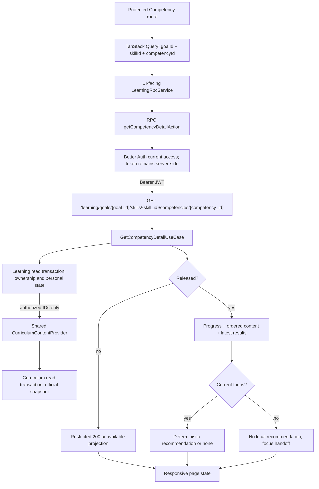

# 1. Context and scope

## Objective and source

Deliver SHIFU-72 so an authenticated individual learner can open one Competency
inside a specific Goal and Skill experience, understand its current pedagogical
state, browse every released Material and Activity in the official Curriculum order,
and follow the adaptive recommendation only when that Competency is the current
focus. Learning owns authorization, progress, focus, recommendation and user-state
isolation; Curriculum remains authoritative for Skill, Competency and content data.

This is a **complete** Spec because the slice crosses TanStack Start/Query/Router,
the authentication BFF, FastAPI, Learning and Curriculum boundaries, PostgreSQL,
schema migration, responsive design states and account-private authorization.
Product authority is the current canonical
[Learning PRD](https://joaogoliveiragarcia.atlassian.net/wiki/spaces/Shifu/pages/83066881/Shifu+PRD+Learning),
content ID `83066881`, version `13`, retrieved in full on
`2026-09-21T20:36:10-03:00`. The delivery source is
[SHIFU-72](https://joaogoliveiragarcia.atlassian.net/browse/SHIFU-72), updated
2026-09-16. Its traceability text still cites PRD version `6`; version `13` governs
this Contract and does not conflict with the selected current requirements.

## Current behavior and product gap

The repository has Learning/Curriculum domain objects, repository protocols,
SQLAlchemy models/repositories, migrations and development seed data. Learning has
no use cases, concrete transaction adapter, dependency pipe, controller or API
operation; its router is empty. The web `/learning` route and page are placeholders,
there is no nested Competency route, no Learning REST contract or server-state query,
and `@tanstack/react-query` is not installed despite Architecture assigning remote
read state to TanStack Query.

The persisted `CompetencyProgress` representation is also incomplete: the domain
entity requires `hard_activity_score` to represent `mastered`, but its SQLAlchemy
model, mapper and initial migration omit that value. Without correction, a mastered
Competency cannot round-trip safely. Existing repository methods also assume one
Skill experience per Goal/Skill and one progress row per experience/Competency
without database uniqueness enforcing either lookup.

## Scope and product alignment

| Area | In scope | Out of scope |
| --- | --- | --- |
| Route and access | Protected `/learning/goals/$goalId/skills/$skillId/competencies/$competencyId`; current-account ownership and Goal-specific Skill isolation | Goal/Skill creation, diagnosis, account or role management |
| Competency state | Name, released/unavailable state, progress, status, current focus and focus-returned explanation | Recalculating Skill-wide result, completing/reopening a Skill, editing progress from the page |
| Curriculum sequence | Official ordered Materials and Activities, types, localized difficulty and latest official Activity score | Curriculum authoring, alternative ordering, Material contents, Activity questions or evaluation |
| Recommendation | Server-side recommendation for the current focus using RP-17; manual access remains available | Global recommendations, Mentor, recommendation persistence or automatic Activity start |
| Navigation | Typed Skill, focus-Competency, Material and Activity destination contracts carrying Goal/Skill/Competency context, including contract-only route registrations for destinations not yet implemented | Implementing SHIFU-66 Skill detail, SHIFU-73 Material detail or SHIFU-74/75 Activity execution pages |
| UI states | Available focus, focus returned, released non-focus, loading, safe not-found, unavailable and recoverable error at desktop/mobile | New Pencil product behavior or placeholder destination pages |
| Persistence | Learning/Curriculum transaction adapters; `hard_activity_score` round-trip; lookup integrity/indexes | New progress history, recommendation table, read receipts or Activity history UI |

| Source requirement | Delivery | Notes |
| --- | --- | --- |
| Learning `RP-08` | partial | Fully delivers ordered, immediately accessible released content for one Competency and preserves return context; internal Material/Activity pages remain adjacent tickets. |
| Learning `RP-15` | partial | Reads current Competency progress and the latest completed official Learning evaluation per Activity without recalculating or mutating progress. |
| Learning `RP-16` | partial | Presents thresholds/status, release and first-non-mastered focus for this detail surface; Skill-wide result and update workflows remain SHIFU-66/74/75. |
| Learning `RP-17` | partial | Computes and displays the focus-local recommendation and non-focus handoff; global/Skill recommendation surfaces remain outside this slice. |
| Learning `RP-25` | full for this surface | Delivers pt-BR responsive, keyboard, assistive-technology, visible-focus and non-color-only behavior. |
| Learning `JN-06` | partial | Covers opening the Competency and choosing released theory/practice; destination contents are adjacent deliveries. |
| Learning `JN-10` | partial | Covers observing regression-driven focus return and the current recommendation; no review Activity execution is implemented here. |

## Product decisions and assumptions

| Concern | Accepted contract |
| --- | --- |
| Artifact location | This Contract lives at `documentation/features/learning/competency-detail/spec.md`; the pre-existing module-level `documentation/features/learning/spec.md` note is preserved with its original SHIFU-72 Jira URL. |
| Canonical revision | Learning PRD version `13` governs. SHIFU-72's version-6 citation is recorded as stale metadata; this workflow does not mutate Jira or Confluence. |
| Unreleased content | An owned, existing but unreleased Competency returns HTTP `200` with a restricted `unavailable` projection. It exposes only safe Skill/focus navigation context and no progress, sequence, score or recommendation. |
| Private absence | Missing, malformed hierarchy, non-owned Goal, Skill not in that Goal, Curriculum mismatch and private resource mismatch never disclose which check failed. Validly shaped requests return the same safe `404`; malformed ID syntax returns transport `422`; missing/invalid authentication returns `401`. |
| Focus | The current focus is the first Competency in Curriculum position order whose Learning status is not `mastered`; a missing progress row is not mastered. If every Competency is mastered, there is no current focus or recommendation. |
| Focus returned | `focus_returned` is true only when the requested Competency is the current focus and at least one later Competency remains released, proving that focus had previously advanced. |
| Progress display | Available detail uses `current_progress`, then `initial_progress`, then `0`; stored status is authoritative and missing status is rendered as `learning`. This read never changes either value. |
| Current Activity score | The displayed score is the newest completed `learning` evaluation by attempt submission order. Diagnostic and review attempts, pending/failed evaluations and stale older results do not replace it. |
| Recommendation | For a released focus, map progress `<40` to easy, `40–<70` to medium and `>=70` to hard; prefer the first unevaluated Activity of that difficulty in official order, otherwise reinforce the lowest latest official score, break ties by order, and avoid the immediately previous Activity when another equally eligible candidate exists. If no Activity exists for the target difficulty, omit the recommendation rather than invent a fallback. |
| Released non-focus design | Reuse the available-detail hierarchy, omit local recommendation treatment, show a neutral explanation and a typed `Ir para a Competência em foco` action. This user-approved assumption is captured in `design/handoff.md`. |
| Navigation ownership | SHIFU-72 owns typed destination patterns and parameters only. Target rendering belongs to SHIFU-66, SHIFU-73, SHIFU-74 and SHIFU-75 and is not replaced by stubs. |
| Cross-module read | A Shared `CurriculumContentProvider` contract returns immutable content snapshots from a Curriculum-owned implementation. Learning and Curriculum use separate read-only transactions; transient read skew during future Curriculum authoring is accepted for this MVP read flow. |
| Side effects | Opening, retrying or navigating from the page writes no progress, recommendation, read receipt, attempt, evaluation or event. |

# 2. Implementation Contract

## Functional requirements

| ID | RP/JN/source coverage | Required behavior |
| --- | --- | --- |
| `RF-01` | `RP-08`, `RP-25`, `JN-06`, SHIFU-72 | Protect the canonical Competency-detail route and return data only when the authenticated account owns the Goal, that Goal contains the requested Skill experience, and Curriculum confirms the Skill/Competency hierarchy. |
| `RF-02` | `RP-15`, `RP-16`, `JN-10`, SHIFU-72 | For a released Competency, show its Curriculum name, current display progress, Learning status, whether it is the current focus, and the focus-returned explanation only when its derivation is true. |
| `RF-03` | `RP-08`, `RP-15`, `JN-06`, SHIFU-72 | Render every released Material and Activity exactly once in official Curriculum position order; label item kind, Activity difficulty and latest completed official Learning score; reading/opening a Material never gates content or changes progress. |
| `RF-04` | `RP-16`, `RP-17`, `JN-06`, `JN-10`, SHIFU-72 | When the requested Competency is the current focus, compute the deterministic adaptive recommendation, visibly distinguish it without relying only on color, keep all released choices accessible and never start an Activity automatically. |
| `RF-05` | `RP-17`, `RP-25`, `JN-06`, SHIFU-72 | When a different released Competency is visited, show no local recommendation; explain that recommendations follow the current focus and offer navigation to that focus Competency. |
| `RF-06` | `RP-08`, `RP-16`, `RP-25`, SHIFU-72 | Represent an owned but unreleased Competency as a restricted supported state with prerequisite/focus guidance and Skill return, without exposing its progress, sequence, scores or recommendation. |
| `RF-07` | `RP-08`, `RP-25`, `JN-06`, SHIFU-72 | Provide typed navigation back to the owning Skill and to each released Material/Activity while preserving `goalId`, `skillId` and `competencyId` in the URL; links emit only their canonical destination contracts. |
| `RF-08` | `RP-25`, SHIFU-72 | Present unresolved loading, safe private absence, recoverable failure and successful recovery with exact pt-BR feedback; retry the same query explicitly and never leave the route indefinitely pending. |
| `RF-09` | `RP-25`, SHIFU-72 | Match the approved file-backed desktop/mobile states, remain operable by keyboard and assistive technology, expose visible focus and minimum 44 px mobile targets, and communicate status with text/icons in addition to color. |
| `RF-10` | `RP-15`, `RP-16`, SHIFU-72 | Preserve mastered Competency data across PostgreSQL round-trips, enforce the uniqueness assumed by Goal/Skill and experience/Competency lookups, and perform this entire feature as a side-effect-free read. |

## Acceptance criteria

| ID | RF coverage | Requirement | Given | When | Then | Expected evidence |
| --- | --- | --- | --- | --- | --- | --- |
| `CA-01` | `RF-01`, `RF-06`, `RF-08` | Private authenticated access | An anonymous request, invalid token, non-owner, nonexistent Goal, mismatched Skill/Competency or malformed hierarchy targets the endpoint/route | The detail is requested | Anonymous/invalid authentication is `401`; validly shaped private absence is indistinguishable `404`; owned unreleased content is the restricted `200 unavailable` state; no private name, progress, score or existence signal leaks | Use-case/controller/route matrices and `VM-03`/`VM-04` |
| `CA-02` | `RF-02`, `RF-10` | Released detail projection | The owner has a released Competency with persisted Learning progress | The detail loads | Name, normalized display progress, localized status and focus state match authoritative Curriculum/Learning records; the request performs no writes | Use-case/controller integration tests and `VM-01` |
| `CA-03` | `RF-03`, `RF-07` | Official sequence and results | Curriculum defines interleaved Materials/Activities and Learning has zero, one or several completed attempts | The sequence renders | DOM/visual order equals Curriculum position; each item appears once; Materials have no score; each Activity shows type/difficulty and only its newest completed official Learning score | Use-case/widget/route tests and `VM-01` |
| `CA-04` | `RF-04`, `RF-09` | Focus recommendation | The released requested Competency is the first non-mastered item and contains target-difficulty candidates | The detail loads and the learner selects `Praticar` | Exactly one deterministic recommendation is identified, non-color text marks it, alternatives remain accessible, immediate repetition is avoided when possible, and selection emits the canonical Activity URL without automatic start before activation | Use-case/widget/route tests and `VM-01`/`VM-05` |
| `CA-05` | `RF-05`, `RF-07`, `RF-09` | Released non-focus handoff | The requested released Competency is not the current focus | The detail loads | No item is locally recommended; the neutral notice and `Ir para a Competência em foco` action appear; all released items remain accessible; activation emits the focus detail pattern with explicit IDs | Use-case/widget/route tests and `VM-06` |
| `CA-06` | `RF-06`, `RF-09` | Supported unavailable state | The owned hierarchy exists but `content_released` is false or its progress row is absent | The detail loads | HTTP is `200`; the page shows the approved lock state, safe focus/prerequisite name and Skill return; sequence, progress, scores and recommendation are absent from both response and DOM | Controller/widget/route tests and `VM-04` |
| `CA-07` | `RF-03`, `RF-07` | Context-preserving navigation | An available detail is visible | The learner activates Skill return, a Material or an Activity | The registered typed route retains the exact Goal/Skill/Competency context and item ID; until its sibling page lands, the contract-only destination resolves through the router's generic not-found boundary without a placeholder page or progress mutation | Widget tests, one route suite per registered route and `VM-01` URL/network checks |
| `CA-08` | `RF-08`, `RF-09` | Loading, failure and recovery | The query is unresolved, returns malformed/5xx/network failure, then succeeds | The learner opens and retries the page | Loading is announced; failure uses the approved in-page copy, exposes no internals, focuses the recovery region and enables one explicit refetch; success replaces the error without duplicate requests, stale alert or console failure | Widget/route tests and `VM-02`/`VM-03` |
| `CA-09` | `RF-09` | Responsive and accessible operation | Any acceptance-relevant state is opened at 1440×900 and 390×844 | The learner traverses all actions by keyboard and inspects the accessibility tree | Heading/list/link/button/status semantics, visible focus, readable wrapping, 44 px mobile targets and non-color state cues are present with no clipping, horizontal overflow or bottom-navigation obstruction | Widget/route tests and `VM-01`–`VM-06` screenshots/accessibility checks |
| `CA-10` | `RF-02`, `RF-04`, `RF-10` | Persistence integrity and isolation | Two accounts or two Goals reference the same Skill, and a mastered Competency has a hard score | Each context is queried through the real application/database boundary | Each response uses only its own Goal-specific state; mastered status/hard score round-trip; uniqueness constraints reject duplicate semantic rows; reads create no event or mutation | PostgreSQL controller integration and migration checks plus `VM-07` |

## Cross-cutting restrictions

| Concern | Contract |
| --- | --- |
| Account privacy | Authorize Goal ownership before requesting Curriculum content. Map every validly shaped ownership/hierarchy miss to the same generic not-found response and copy. |
| Browser credentials | The Learning RPC action obtains the Better Auth session and JWT server-side. UI widgets and services never receive the bearer token; do not serialize it into route context, query data, browser storage, URLs, logs or client-visible errors. |
| Module authority | Learning decides ownership, progress, release, focus and recommendation. Curriculum supplies immutable official content snapshots only; Shared defines transport-neutral cross-module shapes and no business decision. |
| Read consistency | Learning and Curriculum each own one read-only transaction. No joint session crosses modules, and no transaction is committed by middleware or repositories. |
| Query lifecycle | Query key is `['learning', 'competency-detail', goalId, skillId, competencyId]`; one initial request, no automatic retry, explicit user retry, and no window-focus refetch for this page. |
| Logging | Do not log authorization headers, JWTs, account IDs paired with route failures, private content payloads, database errors or raw provider responses. |
| Side effects | GET, retry and navigation do not mutate Learning/Curriculum, publish events or mark content read. |
| Destination compatibility | Every typed link points to generated route metadata. SHIFU-72 registers missing Skill/Material/Activity paths as protected contract-only routes whose loader raises TanStack Router `notFound()` before rendering; sibling tickets replace that boundary with their owned page. Automated/manual evidence verifies the route pattern and params without claiming a sibling page rendered. |

## Design Contract

The file-backed authority is [design/handoff.md](./design/handoff.md). Ten inspected
Pencil exports cover available focus, loading, recoverable error, unavailable and
focus-returned states at `1440 × 900` and `390 × 844`. The user-approved released
non-focus state is documented as a required visual assumption and must receive fresh
runtime screenshots at both viewports.

Implementation uses the existing Shifu dark-only tokens, serif heading/sans body,
application shell, shared icons, progress and focus language. Curriculum order is
semantic DOM order; mobile cards wrap without horizontal scrolling; status, focus,
recommendation, availability and failure never rely on color alone. Runtime focus,
assistive announcements, native caret and optional reduced-motion-safe skeleton
behavior may differ from static PNGs while preserving their hierarchy and geometry.

# 3. Technical Contract

## Current technical state

| Evidence | Current responsibility | Gap |
| --- | --- | --- |
| `apps/server/src/shifu/learning/core/domain` | Owns Goal, Skill experience, Competency progress, attempts, evaluations, statuses and recommendation structures | No detail projection or application action assembles those values |
| Learning repository protocols and SQLAlchemy repositories | Read Goal, experience, progress, attempts and evaluations | No concrete `LearningDatabase`; evaluation lookup cannot fetch a set by attempt IDs efficiently |
| Curriculum repository protocols and SQLAlchemy repositories | Read Skills, Competencies, sequences, Materials and Activities | No concrete `CurriculumDatabase` or cross-module snapshot provider exists |
| `CompetencyProgressModel` / mapper and Alembic head `c4d82f1e7a30` | Persist most Competency progress fields | `hard_activity_score`, semantic uniqueness and read-path indexes are missing |
| `LearningRouter` | Reserves `/learning` | Registers no controller; no Learning pipe or REST-client request exists |
| `IdentityPipe` and `JwksJwtAuthenticationProvider` | Authenticate protected FastAPI requests | Authentication dependency is Identity-owned and constructs a new provider per request, contrary to the Shared contract/process cache boundary |
| `AppErrorHandler` | Protects Identity-specific failures | Generic not-found/service failures currently collapse to `500`, and unexpected failures return `500` instead of the Rule-required safe `503` |
| Web `RootLayout`, contexts and auth middleware | Compose shell, direct browser REST client and protected-route session check | No root Query client, RPC context or Learning RPC service exists; auth middleware currently returns the server-only access token in its result; no Learning RPC action keeps the token server-side |
| `/learning` route/page and generated route tree | Render a protected placeholder Learning dashboard | No dynamic Competency route, remote query, stateful detail widget or typed item navigation exists |
| `apps/web/package.json` / `pnpm-lock.yaml` | Declare the current React 19/TanStack Start runtime | `@tanstack/react-query` is absent; npm resolved current stable `5.103.2` during Spec research |

The Rule Pack's `web-app-routing-rules.md` validation examples still name stale
`pnpm --dir apps/web check:code` / `test` commands. Current manifests and
`documentation/tooling.md` govern executable commands; Section 4 records only those
real commands and Section 5 records the documentation discrepancy.

## Resulting core schemas

The following are complete resulting schemas for new or changed domain/shared
structures. All structures are immutable repository `@structure` values; percentages
remain `Decimal` in server core and become JSON numbers only in the controller.

| Declaration | Resulting fields and invariants |
| --- | --- |
| Shared `CurriculumMaterialSnapshot` | `id: str`, `title: str`, `material_type: str`, `position: int >= 1`; no Material content body crosses this read contract. |
| Shared `CurriculumActivitySnapshot` | `id: str`, `title: str`, `activity_type: str`, `difficulty: str`, `position: int >= 1`. |
| Shared `CurriculumCompetencySnapshot` | `id: str`, `skill_id: str`, `name: str`, `position: int >= 1`, `items: tuple[CurriculumMaterialSnapshot \| CurriculumActivitySnapshot, ...]`; item positions are unique and returned sorted. |
| Shared `CurriculumSkillSnapshot` | `id: str`, `name: str`, `competencies: tuple[CurriculumCompetencySnapshot, ...]`; Competency IDs/positions are unique and sorted. |
| Learning `OfficialActivityResult` | `activity_id: str`, `attempt_id: str`, `score: Decimal` in `0..100`, `submitted_at: datetime`, `completed_at: datetime`; represents one completed `learning` evaluation correlated with its attempt. |
| Learning `CompetencyMaterialDetail` | `id: str`, `title: str`, `position: int`; represents one released navigation item. |
| Learning `CompetencyActivityDetail` | `id: str`, `title: str`, `position: int`, `activity_type: str`, `difficulty: ActivityDifficulty`, `latest_score: Decimal \| None`; recommendation is not stored on the item. |
| Learning `AvailableCompetencyDetail` | `goal_id`, `skill_id`, `skill_name`, `competency_id`, `competency_name: str`; literal availability `available`; `progress: Decimal` in `0..100`; `status: CompetencyProgressStatus`; `is_focus`, `focus_returned: bool`; `focus_competency_id`, `focus_competency_name: str \| None`; ordered `items`; `recommendation: ActivityRecommendation \| None`. Recommendation is absent unless `is_focus`. |
| Learning `UnavailableCompetencyDetail` | `goal_id`, `skill_id`, `skill_name`, `competency_id`, `competency_name: str`; literal availability `unavailable`; `focus_competency_id`, `focus_competency_name: str \| None`. It has no progress, status, items, score or recommendation fields. |
| Learning `CompetencyDetail` | Type alias `AvailableCompetencyDetail \| UnavailableCompetencyDetail`, discriminated by `availability`. |
| Existing `CompetencyProgress` persistence | Complete round-trip includes existing `hard_activity_score: Decimal \| None`; mastered rows require current progress `>=85`, hard score `>=80` and `mastered_at`. No domain field changes. |

Shared snapshots contain official facts only. They do not carry `content_released`,
progress, focus, latest scores or recommendation, so Curriculum/Shared cannot decide
Learning behavior.

## Solution and runtime flow



The use case first opens the Learning transaction, loads the Goal by ID, compares its
`account_id`, loads the Skill experience by `(goal_id, skill_id)`, and rejects any miss
with `CompetencyDetailNotFoundError`. Only then may it request the immutable Curriculum
Skill snapshot. It validates the requested Competency belongs to that snapshot, reads
all progress rows and the requested Competency's attempts/evaluations, derives focus,
release, latest results and recommendation, and returns one discriminated projection.
Neither transaction writes, emits events or shares a SQLAlchemy session.

The Curriculum provider owns one read transaction and bulk-loads the Skill,
Competencies, sequences and the referenced Material/Activity records. A missing
official object produces `None` for the whole Skill snapshot; database/provider
failure escapes as a safe service failure. It never imports Learning.

The UI-facing `LearningRpcService` is composed in the root RPC context and is the only
feature API consumed by the page/query hook. It delegates to the TanStack Start RPC
action under `src/rpc/actions`, maps the returned DTO to the validated safe application
union and translates safe failure kinds. The RPC action validates all three IDs,
resolves the current Better Auth access from the incoming cookie, creates a server-only
`RestClient`, composes the rule-conforming `LearningService(RestClient)` HTTP adapter
and supplies the JWT only to that server-side service call. The browser never receives
credentials, transport internals or raw FastAPI errors. A lost/rejected session
redirects to `/login`; a `404` renders a generic non-disclosing unavailable surface;
a supported `200 unavailable` renders the prerequisite/focus state;
network/`5xx`/malformed responses render the recoverable error and explicit query
refetch.

## Cross-boundary contracts

| Boundary | Producer | Consumer | Canonical contract | Mapping/guarantees | Failure ownership |
| --- | --- | --- | --- | --- | --- |
| Curriculum snapshot | Curriculum provider | Learning use case | Shared `CurriculumContentProvider.get_skill_content(skill_id)` → `CurriculumSkillSnapshot \| None` | Immutable primitives/Shared structures; one Curriculum transaction; ordered and complete for referenced items | Provider/database failure becomes safe service failure; `None` is mapped by Learning to private `not_found` |
| Learning transaction | `SqlalchemyLearningDatabase` | `GetCompetencyDetailUseCase` | Existing `LearningDatabaseRepositories` plus batched evaluation lookup | One session, commit on normal read exit, rollback on exception, always close; no repository commits | Learning database adapter |
| Protected HTTP | Learning controller | Server-composed `LearningService` | `GET /learning/goals/{goal_id}/skills/{skill_id}/competencies/{competency_id}` | Bearer identity from Shared authentication pipe; JSON discriminator; Decimal→number; snake_case transport | Global `AppErrorHandler`; controller contains no catch/business logic |
| REST service | `LearningService(RestClient)` | `getCompetencyDetailAction` | `getCompetencyDetail(accessToken, goalId, skillId, competencyId)` → validated transport DTO | Service maps only HTTP method/path/header/response through injected `RestClient`; no RPC, React, auth-session or Axios construction | Service normalizes HTTP failures; action serializes safe failure kind |
| RPC action | `getCompetencyDetailAction` | UI-facing `LearningRpcService` | Zod-validated `{goalId, skillId, competencyId}` → DTO or safe failure kind | Cookie/session, server URL, REST adapter and bearer remain server-only; action composes the REST service and contains no presentation or Learning decisions | Action clears/rejects invalid session safely; RPC service owns application mapping |
| UI RPC service | `LearningRpcService` from root RPC context | Page query hook | `getCompetencyDetail(goalId, skillId, competencyId)` → validated `CompetencyDetail` | UI consumes the service only and never imports RPC actions or credential types | RPC service maps DTO/safe errors; page hook owns redirect/recovery presentation |
| Query state | Page hook | `CompetencyDetailPage` | Key `['learning','competency-detail',goalId,skillId,competencyId]` | `retry: false`, `refetchOnWindowFocus: false`; explicit retry cancels/replaces the active request | Page hook exposes semantic loading/detail/error/retry values |
| Typed navigation | Content widgets | TanStack Router | Skill, focus, Material and Activity route patterns with explicit params | No interpolated internal URLs; Goal/Skill/Competency context retained | Route/widget owns activation; sibling feature owns target rendering |

## REST contract

`GET /learning/goals/{goal_id}/skills/{skill_id}/competencies/{competency_id}` has no
request body. Each identifier is a 26-character ULID-like uppercase alphanumeric path
value; malformed values receive FastAPI `422` before the use case. Success is one of:

```json
{
  "availability": "available",
  "goal_id": "01SHF...",
  "skill_id": "01SHF...",
  "skill_name": "Lógica de programação",
  "competency_id": "01SHF...",
  "competency_name": "Estruturas de repetição",
  "progress": 72,
  "status": "proficient",
  "is_focus": true,
  "focus_returned": false,
  "focus_competency_id": "01SHF...",
  "focus_competency_name": "Estruturas de repetição",
  "items": [
    {"kind": "material", "id": "01SHF...", "title": "Repetição com for", "position": 1},
    {"kind": "activity", "id": "01SHF...", "title": "Contar de 1 até n", "position": 2, "activity_type": "learning", "difficulty": "easy", "latest_score": 100}
  ],
  "recommendation": {"competency_id": "01SHF...", "activity_id": "01SHF...", "difficulty": "hard", "type": "new-activity"}
}
```

```json
{
  "availability": "unavailable",
  "goal_id": "01SHF...",
  "skill_id": "01SHF...",
  "skill_name": "Lógica de programação",
  "competency_id": "01SHF...",
  "competency_name": "Estruturas de repetição",
  "focus_competency_id": "01SHF...",
  "focus_competency_name": "Fundamentos de lógica"
}
```

Expected failures are `401 {detail: {code: "unauthorized", ...}}` from the Shared
authentication pipe, `404 {code: "not_found", message: "Recurso não encontrado."}`
for every validly shaped private absence, `422` for malformed path syntax, and
`503 {code: "service_unavailable", message: "Serviço temporariamente indisponível."}`
for dependency/unexpected failure. No error includes an identifier or exception text.

## Affected layer contracts

### Core Domain, Use cases and Interfaces

| Path | Change | Declaration/operation | Contract and guarantees | Dependencies/consumers | Generation/tests |
| --- | --- | --- | --- | --- | --- |
| `apps/server/src/shifu/shared/core/domain/structures/curriculum_content.py` | Create | `CurriculumMaterialSnapshot`, `CurriculumActivitySnapshot`, `CurriculumCompetencySnapshot`, `CurriculumSkillSnapshot`, `CurriculumContentItem` | Complete immutable Shared projection family defined above; validates positive unique positions; contains no learner state or Curriculum entities | Curriculum provider produces; Learning consumes | Covered through Learning use-case/controller tests |
| `apps/server/src/shifu/shared/core/domain/structures/__init__.py` | Modify | Public snapshot exports | Explicitly exports the five Shared declarations without side effects | Composition/import consumers | Import/type checks |
| `apps/server/src/shifu/shared/core/interfaces/curriculum_content_provider.py` | Create | `CurriculumContentProvider.get_skill_content(skill_id)` | Synchronous provider returns one complete immutable Skill snapshot or `None`; no ORM/session/vendor types | Curriculum implementation; Learning use case | Autospecced in use-case tests; real implementation via controller tests |
| `apps/server/src/shifu/shared/core/interfaces/__init__.py` | Modify | `CurriculumContentProvider` export | Makes the stable Shared protocol available without registering an adapter | Learning/Curriculum/composition | Import/type checks |
| `apps/server/src/shifu/learning/core/domain/enums/competency_availability.py` | Create | `CompetencyAvailability` | Values `available`, `unavailable`; used only as projection discriminator | Learning detail structures/controller | Use-case/controller tests |
| `apps/server/src/shifu/learning/core/domain/enums/__init__.py` | Modify | Availability export | Explicit public export | Learning core/REST | Import/type checks |
| `apps/server/src/shifu/learning/core/domain/structures/official_activity_result.py` | Create | `OfficialActivityResult` | Complete schema above; validates percentage and evaluation time not before submission | Repository query/use case | Use-case and PostgreSQL controller tests |
| `apps/server/src/shifu/learning/core/domain/structures/competency_material_detail.py` | Create | `CompetencyMaterialDetail` | Complete released Material navigation projection | Use case/controller | Use-case/controller tests |
| `apps/server/src/shifu/learning/core/domain/structures/competency_activity_detail.py` | Create | `CompetencyActivityDetail` | Complete Activity projection with latest official score | Use case/controller | Use-case/controller tests |
| `apps/server/src/shifu/learning/core/domain/structures/available_competency_detail.py` | Create | `AvailableCompetencyDetail` | Complete available schema above; enforces focus/recommendation compatibility | Use case/controller | Use-case/controller tests |
| `apps/server/src/shifu/learning/core/domain/structures/unavailable_competency_detail.py` | Create | `UnavailableCompetencyDetail` | Complete restricted schema; impossible to attach progress/items/recommendation by type | Use case/controller | Use-case/controller tests |
| `apps/server/src/shifu/learning/core/domain/structures/competency_detail.py` | Create | `CompetencyDetail`, `CompetencyDetailItem` type aliases | Discriminated result/item unions; no framework types | Use case/controller/fakers | Type/use-case tests |
| `apps/server/src/shifu/learning/core/domain/structures/__init__.py` | Modify | Detail/result exports | Explicit public exports for all new structures/type aliases | Learning core/REST/tests | Import/type checks |
| `apps/server/src/shifu/learning/core/domain/errors/competency_detail_not_found_error.py` | Create | `CompetencyDetailNotFoundError` | Extends shared `NotFoundError`; safe generic message, no resource identifier | Use case/global handler | Use-case/controller tests |
| `apps/server/src/shifu/learning/core/domain/errors/__init__.py` | Modify | Error export | Public error import without registration | Learning use case/tests | Import/type checks |
| `apps/server/src/shifu/learning/core/interfaces/activity_evaluations_repository.py` | Modify | `find_many_by_attempt_ids(attempt_ids)` | Returns evaluations for supplied attempts in one query; empty tuple returns empty list; no ordering/business selection implied | Use case/SQLAlchemy repository | Autospec plus controller integration |
| `apps/server/src/shifu/learning/core/use_cases/get_competency_detail_use_case.py` | Create | `GetCompetencyDetailUseCase.execute(account_id, goal_id, skill_id, competency_id)` | Sole authoritative read action; ownership-before-content, projection, focus/latest-result/recommendation rules, no mutation/event; one Learning transaction plus provider call | Learning DB and Shared provider | Dedicated unit tests |
| `apps/server/src/shifu/learning/core/use_cases/__init__.py` | Modify | Use-case export | Public use-case import | Controller/tests | Import/type checks |

### Database and Curriculum provider

| Path | Change | Declaration/operation | Contract and guarantees | Dependencies/consumers | Generation/tests |
| --- | --- | --- | --- | --- | --- |
| `apps/server/src/shifu/curriculum/database/sqlalchemy/curriculum_database.py` | Create | `SqlalchemyCurriculumDatabase.transaction()` | Creates one shared SQLAlchemy session, all Curriculum repositories, commits normal exit, rolls back escaped exception, always closes | Curriculum provider/composition | Controller integration through provider |
| `apps/server/src/shifu/curriculum/database/sqlalchemy/__init__.py` | Modify | Database export | Explicit adapter export | Composition | Import/type checks |
| `apps/server/src/shifu/curriculum/providers/curriculum_content_provider/curriculum_content_provider.py` | Create | `DatabaseCurriculumContentProvider` | Implements Shared protocol using only Curriculum database/domain; bulk-resolves complete Skill snapshot; no Learning import/decision | App composition; Learning use case through protocol | Controller integration; no provider-owned test |
| `apps/server/src/shifu/curriculum/providers/curriculum_content_provider/__init__.py` | Create | Provider export | Explicit adapter export without I/O | Composition | Import/type checks |
| `apps/server/src/shifu/learning/database/sqlalchemy/learning_database.py` | Create | `SqlalchemyLearningDatabase.transaction()` | One session and complete `LearningDatabaseRepositories`, including Shared events repository; sole transaction owner, commit/rollback/close semantics | Learning pipe/use case | Controller integration |
| `apps/server/src/shifu/learning/database/sqlalchemy/__init__.py` | Modify | Database export | Explicit adapter export | Composition | Import/type checks |
| `apps/server/src/shifu/learning/database/sqlalchemy/models/competency_progress_model.py` | Modify | `hard_activity_score`; uniqueness/index/check metadata | Nullable `Numeric(5,2)`, `0..100` check; unique `(skill_experience_id, competency_id)` and lookup index | Mapper/repository/migration | Migration and controller integration |
| `apps/server/src/shifu/learning/database/sqlalchemy/models/skill_experience_model.py` | Modify | Uniqueness/index metadata | Unique `(goal_id, skill_id)` and Goal lookup index | Repository/migration | Migration and controller integration |
| `apps/server/src/shifu/learning/database/sqlalchemy/models/goal_model.py` | Modify | Account index metadata | Index on `account_id` for owned Goal reads | Repository/migration | Migration/controller integration |
| `apps/server/src/shifu/learning/database/sqlalchemy/models/activity_attempt_model.py` | Modify | Result-read index metadata | Composite index `(skill_experience_id, activity_id, submitted_at)` | Attempt/evaluation reads | Migration/controller integration |
| `apps/server/src/shifu/curriculum/database/sqlalchemy/models/competency_model.py` | Modify | Skill/order index metadata | Composite index `(skill_id, position)` | Curriculum snapshot provider | Migration/controller integration |
| `apps/server/src/shifu/curriculum/database/sqlalchemy/models/material_model.py` | Modify | Skill index metadata | Index on `skill_id` | Curriculum snapshot provider | Migration/controller integration |
| `apps/server/src/shifu/curriculum/database/sqlalchemy/models/activity_model.py` | Modify | Competency index metadata | Index on `competency_id` | Curriculum snapshot provider | Migration/controller integration |
| `apps/server/src/shifu/learning/database/sqlalchemy/mappers/competency_progress_mapper.py` | Modify | `hard_activity_score` mapping | Maps the field in both directions; mastered entity round-trips without weakening invariants | Progress repository | Migration/controller integration |
| `apps/server/src/shifu/learning/database/sqlalchemy/repositories/activity_evaluations_repository.py` | Modify | Batched evaluation lookup | One parameterized `IN` query; returns domain evaluations only; no N+1 lookup | Learning use case | Controller integration |
| `apps/server/migrations/versions/d72c0f4e8a31_add_learning_competency_detail_integrity.py` | Generate | Alembic revision after `c4d82f1e7a30` | Adds/backfills hard score, checks/constraints/indexes below; upgrade is data-preserving or aborts; downgrade removes only this revision's schema additions | All persistence adapters | Generate/review; disposable PostgreSQL `VM-07` only—no migration-specific test |
| `apps/server/src/shifu/shared/database/seed_data.py` | Modify | SHIFU-72 development fixture | Adds deterministic five-item repetition Competency, released/focus/non-focus/unavailable progress contexts and official scores without real user data | Explicit local seed/manual validation | Real seeded application scenarios only—no seed-specific test |

The migration has these exact semantics:

| Table | Columns | Indexes/constraints | Backfill and delivery constraint |
| --- | --- | --- | --- |
| `learning_competency_progresses` | Add nullable `hard_activity_score NUMERIC(5,2)` | Check `0 <= hard_activity_score <= 100`; unique `(skill_experience_id, competency_id)`; supporting lookup index | For existing mastered rows, backfill the maximum score from completed official Learning attempts whose Curriculum Activity difficulty is `hard`. Abort with a safe migration diagnostic if any mastered row cannot be reconstructed; never silently demote or invent a score. Audit duplicates before adding uniqueness. |
| `learning_skill_experiences` | — | Unique `(goal_id, skill_id)` and Goal lookup index | Abort on duplicates; no automatic deletion/merge. |
| `learning_goals` | — | Index `account_id` | Non-destructive. |
| `learning_activity_attempts` | — | Index `(skill_experience_id, activity_id, submitted_at)` | Non-destructive; supports ordered result derivation. |
| `curriculum_competencies` | — | Index `(skill_id, position)` | Non-destructive; supports ordered snapshot. |
| `curriculum_materials` | — | Index `skill_id` | Non-destructive. |
| `curriculum_activities` | — | Index `competency_id` | Non-destructive. |

Downgrade drops these indexes/constraints and `hard_activity_score`; it therefore
forgets only the newly persisted hard-score snapshot and must not be used as a
production rollback after new mastered updates without an explicit data-retention
decision. The implementation records the duplicate/mastered-row preflight in
Evaluation before applying the migration outside disposable tests.

### REST, Provision and Composition

| Path | Change | Declaration/operation | Contract and guarantees | Dependencies/consumers | Generation/tests |
| --- | --- | --- | --- | --- | --- |
| `apps/server/src/shifu/shared/pipes/authentication_pipe.py` | Create | `AuthenticationPipe.get_authentication_provider`, `get_authenticated_user` | Reads the process-owned Shared `AuthenticationProvider` from app state; parses Bearer credentials and emits the existing safe `401`; imports no Identity implementation | Protected module controllers/Identity pipe | Controller integration; no pipe-owned test |
| `apps/server/src/shifu/shared/pipes/__init__.py` | Create | Pipe export | Explicit Shared authentication pipe export | Learning/Identity | Import/type checks |
| `apps/server/src/shifu/identity/pipes/identity_pipe.py` | Modify | Authentication dependency delegation | Reuses Shared authentication pipe/provider while retaining Identity-owned database/password/clock/ID dependencies | Existing Identity controllers | Existing Identity controller regression tests |
| `apps/server/src/shifu/learning/pipes/learning_pipe.py` | Create | `get_database`, `get_curriculum_content_provider` | Returns app-state values typed as core/Shared protocols; no business logic/session ownership | Learning controller | Controller integration; no pipe-owned test |
| `apps/server/src/shifu/learning/pipes/__init__.py` | Create | Pipe export | Explicit Learning pipe export | Learning controller | Import/type checks |
| `apps/server/src/shifu/learning/rest/controllers/get_competency_detail_controller.py` | Create | Controller-local response models; `GetCompetencyDetailController.handle` | Registers one synchronous GET, validates path IDs, injects Shared user/Learning dependencies, executes use case, maps union to JSON without business decisions | Learning router/use case/web service | Dedicated HTTP integration test |
| `apps/server/src/shifu/learning/rest/controllers/__init__.py` | Modify | Controller export | Explicit registration import | Learning router | Import/type checks |
| `apps/server/src/shifu/learning/rest/router.py` | Modify | Controller registration | Registers detail controller once under `/learning` | FastAPI app | Controller integration |
| `apps/server/src/shifu/rest/handlers/app_error_handler.py` | Modify | Typed global mappings | Registers specific invalid credentials, `NotFoundError`→404, `AuthorizationError`→403, `ServiceUnavailableError`→503, generic `AppError`→500 and unexpected `Exception`→safe 503 in that order; Identity path privacy remains intact | All controllers | Existing Identity plus Learning controller tests |
| `apps/server/src/shifu/app.py` | Modify | Process composition | Constructs one Identity DB/auth provider, Curriculum DB/content provider and Learning DB from the shared engine; stores typed adapters in app state before router use; lifespan disposes existing resources once | Pipes/controllers/tests | Repeated-register/controller integration |
| `apps/server/rest-client/learning/competencies.rest` | Create | Labeled detail requests | Includes available, unavailable, not-found and unauthenticated GET examples with reusable non-secret IDs/token variable; no credentials or real token | Manual/API parity | Artifact inspection and local manual validation |

The Shared authentication extraction is an architecture compatibility correction,
not a transfer of account authority: Identity still supplies `JwksJwtAuthenticationProvider`
and validates current account state; protected modules consume only Shared
`AuthenticationProvider` / `AuthenticatedUser`.

### Web Composition, REST and UI

#### Widget hierarchy

| Widget | Kind | Parent/entry | Direct children | Public contract | Behavior owner |
| --- | --- | --- | --- | --- | --- |
| `CompetencyDetailPage` | Page widget | Dynamic Learning route | `CompetencyDetailHeader`, `CompetencyDetailFeedback`, `CompetencyContentList` | Props `goalId`, `skillId`, `competencyId`; composes exactly one semantic page state and declares no local React child component | `useCompetencyDetailPage` |
| `CompetencyDetailHeader` | Internal widget | Page | Shared typed Link, `Icon`, badges and `ProgressMeter` | Skill/Competency names and IDs, progress/status/focus flags; owns heading hierarchy, Skill return, progress/status semantics and focus-returned orientation | Pure renderer with independent accessible header contract |
| `CompetencyDetailFeedback` | Internal widget | Page | Shared `Icon`, Button/typed Link | Discriminated loading, private absence, restricted unavailable or recoverable error props; owns announcements, safe field omission and retry/focus/Skill actions | Parent callbacks/props with independent state/action contract |
| `CompetencyContentList` | Internal widget | Page | `CompetencyContentRow` instances | Ordered discriminated items, recommendation ID and route context; owns list semantics, official order and exactly-once row composition | Pure renderer with independent ordered-list contract |
| `CompetencyContentRow` | Internal widget | Content list | Shared `Icon`, tags and typed TanStack Link | Discriminated Material/Activity item, recommendation flag and explicit Goal/Skill/Competency params; owns variant copy, score/difficulty visibility, recommendation treatment and canonical destination | Pure renderer with independent row/navigation contract |

Every named internal React component is a widget directory with an `index.tsx`.
Widget entrypoints may use native elements and shared primitives directly, but must not
declare a local named child component; any new named child discovered during
implementation receives its own nested widget directory and affected-path/test entry
through the amendment workflow.

Expected widget tree:

```text
apps/web/src/ui/learning/widgets/pages/competency-detail-page/
├── index.tsx
├── use-competency-detail-page.ts
├── competency-detail-header/
│   ├── index.tsx
│   └── tests/
│       └── competency-detail-header.test.tsx
├── competency-content-list/
│   ├── index.tsx
│   ├── competency-content-row/
│   │   ├── index.tsx
│   │   └── tests/
│   │       └── competency-content-row.test.tsx
│   └── tests/
│       └── competency-content-list.test.tsx
├── competency-detail-feedback/
│   ├── index.tsx
│   └── tests/
│       └── competency-detail-feedback.test.tsx
└── tests/
    └── competency-detail-page.test.tsx
```

| Path | Change | Declaration/operation | Contract and guarantees | Dependencies/consumers | Generation/tests |
| --- | --- | --- | --- | --- | --- |
| `apps/web/package.json` | Modify | `@tanstack/react-query` dependency | Add current stable `^5.103.2`; no unrelated dependency changes | Root layout/page hook | pnpm install/check/build |
| `pnpm-lock.yaml` | Generate | Resolved Query dependency | Generated only by pnpm from manifest; never hand-edited | Deterministic web install | CI/local validation |
| `apps/web/src/core/learning/competency-detail.ts` | Create | Browser `CompetencyDetail` discriminated contracts and validators | Framework-independent camelCase application values; validates every RPC DTO field/range/discriminator before UI use | Learning RPC service/page | Consumer tests |
| `apps/web/src/rest/services/learning-service.ts` | Create | `LearningService.getCompetencyDetail` | Rule-conforming HTTP adapter factory receives `RestClient`; maps the protected FastAPI GET path/header and validates the snake_case transport DTO; no RPC, React, auth-session or Axios construction | RPC action only | Exercised through route/server-backed manual boundaries; no service-owned test |
| `apps/web/src/rpc/actions/learning/get-competency-detail-action.ts` | Create | `getCompetencyDetailAction` | TanStack Start `createServerFn` validates three IDs, resolves Better Auth access/request server-side, constructs server-only `AxiosRestClient` from validated server configuration, composes `LearningService(restClient)`, supplies JWT to that service call and returns the DTO or safe serializable failure kind; no UI mapping/business decision | `LearningRpcService` only | Route/manual boundaries; no action-owned test |
| `apps/web/src/rpc/services/learning-service.ts` | Create | `LearningRpcService.getCompetencyDetail` | UI-facing RPC facade invokes `getCompetencyDetailAction`, validates/maps the returned DTO to the camelCase application union and raises safe `RestError`; no auth, JWT, Axios or React state | RPC context/page query hook | Exercised through widget/page integration tests; no service-owned test |
| `apps/web/src/ui/shared/contexts/rpc-context/index.tsx` | Create | `RpcContext`, `RpcContextProvider` | Declarative null-default context/provider receives the value from its owning hook and exposes UI-facing RPC services only; no actions, credentials or behavior in the component | Root layout/UI consumers | Provider-hook/page tests |
| `apps/web/src/ui/shared/contexts/rpc-context/types/rpc-context-value.ts` | Create | `RpcContextValue` | Contains `learningService: ReturnType<typeof LearningRpcService>` and no raw action, REST client or credential | RPC context/provider/consumer | Type/context tests |
| `apps/web/src/ui/shared/contexts/rpc-context/types/index.ts` | Create | Type barrel | Explicitly exports `RpcContextValue` only | RPC context package | Type check |
| `apps/web/src/ui/shared/contexts/rpc-context/use-rpc-context-provider.ts` | Create | `useRpcContextProvider` | Constructs one `LearningRpcService` for the root context; owns no remote state and imports the action only indirectly through the service | `RpcContextProvider` | Dedicated provider-hook test |
| `apps/web/src/ui/shared/hooks/use-rpc-context.ts` | Create | `useRpcContext` | Sole consumer hook for raw `RpcContext`; validates provider presence and returns typed UI-facing services | Feature query hooks | Page integration tests; no dedicated trivial-consumer test |
| `apps/web/src/middlewares/require-auth-middleware.ts` | Modify | Sanitized protected-route result | Keeps access token server-only; returns only account/display/time-zone context or redirects to login | All protected routes | Existing protected route regression tests |
| `apps/web/src/ui/shared/widgets/layouts/root-layout/use-root-layout.ts` | Modify | Root Query client ownership | Lazily creates one `QueryClient` per root mount, returns it with existing route classification, keeps it stable across rerenders and imposes no feature retry/refetch defaults; no module singleton | `RootLayout` | Existing colocated hook test expanded |
| `apps/web/src/ui/shared/widgets/layouts/root-layout/index.tsx` | Modify | Root Query/RPC composition | Mounts third-party `QueryClientProvider` with the client from `useRootLayout` and `RpcContextProvider` at the root alongside existing REST/Auth composition, without introducing an internal provider widget or changing public/protected shell selection | All query/RPC consumers | Existing root-layout tests |
| `apps/web/src/routes/learning/goals/$goalId/skills/$skillId/index.tsx` | Create | Protected Skill contract index route | Registers the exact Skill destination required by this page as an index leaf, never a parent of descendant Competency routes; after auth, loader raises TanStack `notFound()` and renders no placeholder or Skill content until SHIFU-66 replaces the boundary | Generated tree/Skill-return Link | Owning learning-page integration test |
| `apps/web/src/routes/learning/goals/$goalId/skills/$skillId/competencies/$competencyId.tsx` | Create | Dynamic protected route | Literal file route, `beforeLoad: requireAuthMiddleware`, `Route.useParams()` translated to page props; no data/business/error markup | Generated tree/page | Owning competency-detail-page integration test |
| `apps/web/src/routes/learning/goals/$goalId/skills/$skillId/competencies/$competencyId/materials/$materialId.tsx` | Create | Protected Material contract route | Registers the typed Material destination; after auth, loader raises TanStack `notFound()` and renders no placeholder or Material content until SHIFU-73 replaces the boundary | Generated tree/Material Links | Owning competency-detail-page integration test |
| `apps/web/src/routes/learning/goals/$goalId/skills/$skillId/competencies/$competencyId/activities/$activityId.tsx` | Create | Protected Activity contract route | Registers the typed Activity destination; after auth, loader raises TanStack `notFound()` and renders no placeholder, execution or evaluation until SHIFU-74/75 replaces the boundary | Generated tree/Activity Links | Owning competency-detail-page integration test |
| `apps/web/src/routeTree.gen.ts` | Generate | TanStack route metadata | Generated by `pnpm --filter web generate-routes`; never hand-edited; exact nested params/path reviewed | Router | Owning page/layout integration tests and build |
| `apps/web/src/ui/learning/widgets/pages/competency-detail-page/index.tsx` | Create | `CompetencyDetailPage` | Exhaustive state composition from its owning hook; renders only declared child widgets and no locally declared React child component or transport/business calculation | Dynamic route/page hook/children | Colocated page and owning page integration tests |
| `apps/web/src/ui/learning/widgets/pages/competency-detail-page/use-competency-detail-page.ts` | Create | `useCompetencyDetailPage` | Obtains `LearningRpcService` through `useRpcContext`; owns exact Query key/options, semantic result aliases, explicit retry and lost-session navigation; UI never imports the RPC action or REST service; no dedicated query-hook test | Page/Learning RPC service | Page/widget integration tests |
| `apps/web/src/ui/learning/widgets/pages/competency-detail-page/competency-detail-header/index.tsx` | Create | `CompetencyDetailHeader` | Independent header widget contract above: Skill return, heading, progress/status/focus semantics and responsive orientation using shared primitives/tokens | Page/shared widgets/Router | Dedicated child-widget test plus owning page integration tests |
| `apps/web/src/ui/learning/widgets/pages/competency-detail-page/competency-content-list/index.tsx` | Create | `CompetencyContentList` | Independent ordered-list widget contract above: renders each official item exactly once through `CompetencyContentRow`, with no inline row component | Page/content row | Dedicated child-widget test plus owning page integration tests |
| `apps/web/src/ui/learning/widgets/pages/competency-detail-page/competency-content-list/competency-content-row/index.tsx` | Create | `CompetencyContentRow` | Independent discriminated row widget contract above: Material/Activity metadata, latest score, recommendation treatment and canonical typed destination | Content list/shared widgets/Router | Dedicated row-widget test plus owning page integration tests |
| `apps/web/src/ui/learning/widgets/pages/competency-detail-page/competency-detail-feedback/index.tsx` | Create | `CompetencyDetailFeedback` | Independent feedback widget contract above: loading/status, generic private absence, restricted unavailable and recoverable-error surfaces with focus/announcement semantics | Page/shared primitives | Dedicated child-widget test plus owning page integration tests |
| `apps/web/src/ui/shared/widgets/components/progress-meter/index.tsx` | Modify | Semantic tone support | Adds optional `tone: 'primary' \| 'success'` with current default preserved; Learning uses success while retaining accessible progress semantics | Existing and Learning pages | Colocated public-contract regression test plus page tests |
| `apps/web/src/ui/shared/widgets/components/icon/index.tsx` | Modify | Required registered icon names | Adds only approved arrow-left, chevron-right, lock-keyhole, rotate-ccw and target icons; feature imports shared `Icon`, never Lucide directly | Learning widgets | Colocated icon-registry rendering test plus page tests |

The route uses direct typed TanStack `Link` contracts for dynamic destinations, as
per the Router Rule. The canonical patterns are:

```text
/learning/goals/$goalId/skills/$skillId
/learning/goals/$goalId/skills/$skillId/competencies/$competencyId
/learning/goals/$goalId/skills/$skillId/competencies/$competencyId/materials/$materialId
/learning/goals/$goalId/skills/$skillId/competencies/$competencyId/activities/$activityId
```

No dynamic path is concatenated and no cast, native internal anchor or second route
map is introduced. All four patterns have source route declarations and generated
metadata in this delivery. The three sibling-owned destinations are deliberately
contract-only: authentication runs, then their loader raises `notFound()` before any
target content renders. SHIFU-66/73/74/75 replace those boundaries with owned pages.

### Validation paths

| Path | Change | Declaration/operation | Contract and guarantees | Dependencies/consumers | Generation/tests |
| --- | --- | --- | --- | --- | --- |
| `apps/server/tests/learning/core/use_cases/test_get_competency_detail_use_case.py` | Create | Use-case unit matrix | Autospecced Learning DB/provider protocols; proves rules/side-effect absence without infrastructure | Core Contract | `uv run poe test:unit` |
| `apps/server/tests/learning/server/controllers/test_get_competency_detail_controller.py` | Create | HTTP/PostgreSQL integration matrix | Real FastAPI composition at Alembic head, Learning/Curriculum repositories and auth dependency override; proves JSON/privacy/Goal isolation, persisted hard-score round-trip and zero GET mutations through the application boundary | Server/application Contract | `uv run poe test:integration` |
| `apps/web/src/ui/learning/widgets/pages/competency-detail-page/tests/competency-detail-page.test.tsx` | Create | Component integration | Uses typed `useCompetencyDetailPageMock` with a fresh return in `beforeEach`; renders the real child composition for all public hook states and asserts interactions, semantics and exact typed destinations without executing the real query hook | UI Contract | `pnpm --filter web test:unit` |
| `apps/web/src/ui/learning/widgets/pages/competency-detail-page/competency-detail-header/tests/competency-detail-header.test.tsx` | Create | Child-widget component contract | Exercises Skill return, heading hierarchy, status/focus combinations, progress semantics and focus-returned orientation at the owning header boundary | Header UI Contract | `pnpm --filter web test:unit` |
| `apps/web/src/ui/learning/widgets/pages/competency-detail-page/competency-detail-feedback/tests/competency-detail-feedback.test.tsx` | Create | Child-widget component contract | Exercises loading, private absence, restricted unavailable, recoverable error, retry and focus/Skill navigation with safe field omission and announcement semantics | Feedback UI Contract | `pnpm --filter web test:unit` |
| `apps/web/src/ui/learning/widgets/pages/competency-detail-page/competency-content-list/tests/competency-content-list.test.tsx` | Create | Child-widget component contract | Renders real `CompetencyContentRow` children and proves official ordering, exactly-once item composition, list semantics and recommendation selection | Content-list UI Contract | `pnpm --filter web test:unit` |
| `apps/web/src/ui/learning/widgets/pages/competency-detail-page/competency-content-list/competency-content-row/tests/competency-content-row.test.tsx` | Create | Child-widget component contract | Exercises Material, Activity, scored/unscored and recommended variants, localized metadata, accessible labels and exact typed destination params | Row UI Contract | `pnpm --filter web test:unit` |
| `apps/web/src/ui/shared/contexts/rpc-context/tests/use-rpc-context-provider.test.ts` | Create | Context provider-hook contract | Confirms root RPC context constructs and exposes one typed `LearningRpcService` without leaking the raw action, REST service/client or credentials | Shared UI context | `pnpm --filter web test:unit` |
| `apps/web/src/ui/shared/widgets/components/progress-meter/tests/progress-meter.test.tsx` | Create | Public widget regression | Covers preserved default tone, explicit success tone and accessible progress semantics through the reusable widget boundary | Shared UI widget | `pnpm --filter web test:unit` |
| `apps/web/src/ui/shared/widgets/components/icon/tests/icon.test.tsx` | Create | Public icon registry regression | Renders each newly registered public `IconName` through shared `Icon` and preserves existing accessible labeling behavior | Shared UI widget | `pnpm --filter web test:unit` |
| `apps/web/src/ui/shared/widgets/layouts/root-layout/tests/use-root-layout.test.ts` | Modify | Root Query lifecycle | Proves the root hook retains one lazily created `QueryClient` across rerenders, isolates separate root mounts and preserves route classification/default options | Root composition hook | `pnpm --filter web test:unit` |
| `apps/web/src/ui/shared/widgets/layouts/root-layout/tests/root-layout.test.tsx` | Modify | Composition regression | Uses typed `useRootLayoutMock` with a known client; confirms root `QueryClientProvider` and `RpcContextProvider` wrap existing REST/Auth/shell ordering without changing public/protected layout | Root composition | `pnpm --filter web test:unit` |
| `apps/web/tests/learning/competency-detail-page.test.ts` | Create | Module-owned routed page integration | Exercises the real routed page/application composition with intercepted RPC action responses for loading, available, focus-returned, non-focus, unavailable, failure/retry and desktop/mobile behavior; owns the page-widget browser matrix required by Widget Testing Rules | Page/UI Contract | `pnpm --filter web test:integration` |

No test is created for the Curriculum provider, Learning/Shared pipes, RPC action,
RPC/REST services or query hook in isolation. Their observable behavior is owned by
the use-case, controller, context, widget, module-owned page/layout suite and manual
full-stack boundaries above. Each child widget has substantial independent state,
semantic or navigation behavior and therefore owns the dedicated public-contract test
declared above; tests do not exist merely to mirror the directory tree. The owning
page/layout suites contain the route assertions for their routes, satisfying both the
Widget Testing and Web Routing ownership rules.

## Technical decisions

| Decision | Chosen approach | Alternative considered | Reason | Accepted trade-off |
| --- | --- | --- | --- | --- |
| Cross-module content | Shared immutable provider contract with Curriculum-owned implementation and separate read transaction | Learning importing Curriculum repositories; one app-composed joint SQL transaction | Preserves module/Tach direction and product authority; user explicitly chose a Shared provider | Small transient read-skew window if Curriculum becomes mutable later |
| Unreleased API state | Restricted discriminated `200 unavailable` projection | `403` failure carrying prerequisite context | It is a supported pedagogical page state, not transport failure, and the type prevents detail leakage | Clients must distinguish availability inside success responses |
| Private absence | Uniform generic `404` after authentication | Reveal which Goal/Skill/Competency check failed | Prevents cross-account and hierarchy enumeration | Debugging requires safe server-side tracing without identifiers in client errors |
| Web API separation | UI consumes root-composed `LearningRpcService`; the RPC action composes rule-conforming `LearningService(RestClient)` for FastAPI | UI imports an action directly, an RPC-invoking file is placed under `rest/services`, or a feature provision provider is added | Applies the user-confirmed service-for-UI/action-for-API boundary while preserving the REST-service factory rule | Adds distinct RPC service/action/REST service boundaries and one mocked action hop |
| Browser/API auth | Learning RPC action obtains JWT, creates the server REST client and calls FastAPI through `LearningService` | Browser RPC service calls FastAPI directly with serialized token | Follows BFF authority and eliminates browser-readable bearer tokens | RPC action owns server transport composition and safe serialization |
| Server state | TanStack Query 5.103.2 with `QueryClient` owned by `RootLayout`/`useRootLayout` and a page-owned query hook | Separate `QueryProvider` widget, route-local effect/state or Router loader cache only | Matches the user-confirmed root ownership and standardizes loading/error/refetch behavior | Root-layout hook gains stable client lifecycle responsibility |
| Internal widget boundaries | Every named React child is a widget directory; header, feedback, content list and row each own an independent public behavior test | Locally declared child components or page-only coverage | Makes the implementation tree explicit and honors the user-confirmed test ownership without violating the no-tree-mirroring Rule | More focused widget files/tests and some intentional parent/child coverage overlap |
| Server test ownership | New tests live module-first under `tests/learning/core` and `tests/learning/server`; persistence is exercised only through the module-owned controller boundary | Extend legacy technology-first `tests/core`/`tests/rest`, or add `tests/database` migration/repository/seed suites | Applies the approved global module-first convention and keeps tests aligned to business ownership | Legacy tests remain temporarily discoverable until a separate maintenance migration |
| Focus/recommendation | Pure deterministic derivation on each read | Persist focus/recommendation rows | PRD defines them from current facts and this page is side-effect-free | Recomputes small in-memory projections per request |
| Persistence repair | Add/backfill hard score plus semantic uniqueness/read indexes | Ignore the mapper gap or create a second status snapshot | Restores existing entity invariant and repository lookup assumptions | Migration must audit legacy duplicates/mastered rows and may abort safely |
| Destination pages | Register protected typed route contracts whose loaders raise generic `notFound()` until sibling pages replace them | Use unregistered typed paths, arbitrary `href`/casts, placeholders or absorb sibling feature contents | Keeps generated Router metadata valid without inventing target product UI or crossing Jira ownership | Navigation reaches the canonical URL but full destination rendering waits for SHIFU-66/73/74/75 |
| Missing non-focus frame | User-approved documented assumption plus runtime desktop/mobile screenshots | Modify Pencil or keep the state ambiguous | Product behavior is explicit and visual treatment is bounded | Runtime capture, not a Pencil frame, is the final fidelity evidence |

# 4. Validation Contract

Actual command output, screenshots, database observations, request traces and findings
belong in `evaluation.md`, created only when implementation begins. Mocked web route
transport proves UI/route contracts, not FastAPI authorization or PostgreSQL state;
the module-owned controller test and the real local manual migration/seed flow supply
those boundaries.

## Automated test cases

| Test file | Test case | Description | Assertions |
| --- | --- | --- | --- |
| `test_get_competency_detail_use_case.py` | Ownership-first rejection matrix | Missing/non-owner Goal, absent Skill experience, provider miss and mismatched Competency | Same `CompetencyDetailNotFoundError`; provider is not called before ownership succeeds; no write/event methods called |
| `test_get_competency_detail_use_case.py` | Available projection | Released progress plus interleaved snapshot and completed/pending/failed attempts | Correct display progress/status/order; only latest completed `learning` score per Activity; no Material score |
| `test_get_competency_detail_use_case.py` | Focus matrix | Missing progress, learning/developing/proficient/mastered rows, all mastered and a later released Competency | First non-mastered focus; no focus when all mastered; `focus_returned` only for the proven regression case |
| `test_get_competency_detail_use_case.py` | Recommendation matrix | Progress on both threshold edges, unevaluated/evaluated/tied candidates, immediate previous candidate and no target-difficulty Activity | Exact difficulty buckets, new-before-reinforcement, lowest-score/tie order, repeat avoidance, or `None`; only focus receives recommendation |
| `test_get_competency_detail_use_case.py` | Restricted unavailable/non-focus | Missing/unreleased requested progress and a different released current focus | Unavailable type contains no protected fields; released non-focus contains items but no recommendation and carries focus target |
| `test_get_competency_detail_controller.py` | HTTP success unions | Real persisted available, non-focus, unavailable, focus-returned and all-mastered fixtures | Exact `200` discriminator/body/numeric serialization; ordered content; no persistence mutation/event |
| `test_get_competency_detail_controller.py` | HTTP access/failure matrix | Missing/invalid bearer, malformed ID, cross-account/cross-Goal/mismatched IDs, provider failure | Safe `401`, `422`, uniform `404`, or `503`; no private/internal message and no cross-context data |
| `test_get_competency_detail_controller.py` | Application composition | Repeated `FastAPIApp.register()` with real Learning/Curriculum databases and dependency override cleanup | Correct adapters/Shared auth pipe are reachable; no duplicate controller registration or leaked override/session |
| `competency-detail-page.test.tsx` | State matrix | Fresh typed `useCompetencyDetailPageMock` values for loading, available focus, focus returned, released non-focus, unavailable, not-found, recoverable failure and recovered result | Exact copy/roles/hierarchy, no stale fields, explicit retry, correct recommendation presence/absence; real query hook never runs |
| `competency-detail-page.test.tsx` | Interaction/accessibility matrix | Fresh typed hook mock plus keyboard traversal and each typed link/action | Visible semantic links/buttons, ordered list, progress/status announcements, one retry, exact route pattern/params, no direct Lucide import |
| `competency-detail-header.test.tsx` | Header contract matrix | Learning/developing/proficient/mastered status, focus/focus-returned flags and representative progress values | Skill return has exact typed params; one page heading, localized non-color status/focus labels and accessible progress semantics render without local business derivation |
| `competency-detail-feedback.test.tsx` | Feedback state/action matrix | Loading, private absence, unavailable with and without focus target, recoverable failure and retry | Correct status/alert semantics and actions; unavailable/private states omit forbidden detail; retry fires once; focus/Skill links use exact params |
| `competency-content-list.test.tsx` | Ordered composition matrix | Interleaved Material/Activity items with zero/one recommendation | Real row widgets render once in official order inside one semantic list; recommendation identity is passed only to the matching Activity |
| `competency-content-row.test.tsx` | Row variant/navigation matrix | Material, unscored Activity, scored Activity, recommended Activity and non-recommended alternatives | Localized labels, allowed score/difficulty fields, non-color recommendation copy, accessible action and exact route pattern/params; Material never renders score/recommendation |
| `use-rpc-context-provider.test.ts` | Learning RPC service composition | Provider hook constructs the root RPC context value | Exactly one typed `LearningRpcService` is exposed; no raw action, REST client/service or credential field crosses the context contract |
| `progress-meter.test.tsx` / `icon.test.tsx` | Shared public regressions | Existing default plus new tone/icons | Default progress behavior remains stable; success tone retains semantics; every new `IconName` renders through shared `Icon` |
| `use-root-layout.test.ts` | Root Query lifecycle | Root hook rerender and separate root mount | One client remains stable per mount, separate mounts do not share a client, no feature defaults are imposed and route classification remains unchanged |
| `root-layout.test.tsx` | Query/RPC composition regression | Typed root-hook mock supplies a known client while public/protected children render | Root `QueryClientProvider` and `RpcContextProvider` wrap existing REST/Auth/shell composition once without changing public/protected behavior |
| `apps/web/tests/learning/competency-detail-page.test.ts` | Routed page state/transport matrix | Authenticated routed page at desktop/mobile with delayed, available focus, focus-returned, non-focus, unavailable and failure→retry RPC responses | Loading/error replacement, exact request IDs, rendered states, links, responsive/no-overflow behavior, one retry and no automatic destination start |
| `$competencyId.test.tsx` | Route contract matrix | Authenticated/anonymous direct detail route with one representative intercepted RPC response | Guard precedes render; exact dynamic IDs reach one action; final URL and destination render; no real backend or route-param cast |
| `$skillId/index.test.tsx`, `$materialId.test.tsx`, `$activityId.test.tsx` | Contract-route matrix | Anonymous and authenticated direct navigation to each canonical destination, plus Competency-detail navigation beneath the Skill segment | Auth runs first; exact URL/params are registered; the Skill index never intercepts descendants; authenticated contract routes reach generic not-found with no backend request, target markup or side effect |

## Acceptance coverage

| Acceptance | Automated boundary | Manual scenario | Evidence target |
| --- | --- | --- | --- |
| `CA-01` | Use-case ownership plus controller/route access matrices | `VM-03`, `VM-04` | Evaluation “Privacy and supported unavailability” with safe HTTP/DOM evidence |
| `CA-02` | Use-case available projection and real controller persistence | `VM-01`, `VM-05` | Evaluation available/focus-returned screenshots and response/DB comparison |
| `CA-03` | Use-case score/order matrix, controller, child-widget and module page suites | `VM-01` | Evaluation ordered DOM, response and database evidence |
| `CA-04` | Use-case recommendation matrix, row/list widgets and module page suite | `VM-01`, `VM-05` | Evaluation recommendation derivation, non-color label and Activity destination |
| `CA-05` | Use-case non-focus plus feedback/page/route tests | `VM-06` | Evaluation accepted-assumption screenshots and focus destination |
| `CA-06` | Use-case/controller restricted union and feedback/page tests | `VM-04` | Evaluation unavailable screenshots and negative response/DOM field inspection |
| `CA-07` | Row/list widgets, module page and route-source assertions | `VM-01`, `VM-04`, `VM-06` | Evaluation canonical destination pattern/params without sibling-render claim |
| `CA-08` | Page widget and module page loading/failure/recovery matrices plus malformed-action route case | `VM-02`, `VM-03` | Evaluation loading/error screenshots, one-refetch trace and recovered DOM |
| `CA-09` | Child/page widget semantics and desktop/mobile module page suite | `VM-01`–`VM-06` | Evaluation accessibility snapshots/tree, focus, layout and console/network inspection |
| `CA-10` | Controller isolation, persisted hard-score round-trip and zero-mutation assertions | `VM-07` | Evaluation account/Goal isolation, manual migration/seed preflight and no-write DB diff |

## Manual scenarios

All scenarios use PostgreSQL on `localhost:54344`, web on
`http://localhost:7000`, FastAPI on `http://localhost:7777`, the explicit
development seed and a clean non-production browser context. Verify `/health` and
application startup before navigation. Use Playwright CLI for interaction and fresh
screenshots; inspect the final URL, relevant request, DOM/accessibility semantics,
console messages and all failed/4xx/5xx requests. Never place the seed password or
bearer token in an evidence artifact.

### `VM-01` — Available focus, order and navigation

- **Maps:** `CA-02`, `CA-03`, `CA-04`, `CA-07`, `CA-09`.
- **Start:** the seeded released focus Competency route at 1440×900, then 390×844;
  references `design/xsNI4.png` and `design/R7GgrF.png`.

1. Sign in with the local seed learner and open the canonical Competency URL.
2. Compare title, badges, progress, ordered five-item sequence, localized metadata,
   two latest scores and the recommended hard Activity with each saved reference.
3. Traverse return, every item and `Praticar` using the keyboard; inspect accessible
   names, focus order and focus visibility.
4. Activate each link, verify the exact canonical URL/params and, for the three
   sibling-owned contract routes, the generic router not-found result with no target
   markup or backend request; return to the detail route between activations.
5. Inspect the single detail GET and verify no mutation/event request occurs.

Expected: one available response, exact Curriculum/DOM order, deterministic
recommendation, manual alternatives, no clipping/overflow/obstruction, unexpected
failed request or console error. Save desktop/mobile screenshots, accessibility/DOM
snapshot and safe request summary. Cleanup: return to the detail route and close the
browser context; do not reset shared Docker services.

### `VM-02` — Loading state

- **Maps:** `CA-08`, `CA-09`.
- **Start:** seeded focus route with the RPC action response deliberately held;
  references `design/DF05W.png` and `design/IqpIe.png`.

1. Open at 1440×900 and 390×844 while the first response remains unresolved.
2. Inspect status semantics, visible loading copy, shell continuity, focus and layout.
3. Release the request and confirm the available page replaces loading once.

Expected: announced `Carregando Competência e seu progresso...`, no enabled content
actions or indefinite pending state, exactly one request and clean replacement.
Capture both loading screenshots and request timing; restore normal transport.

### `VM-03` — Privacy, recoverable failure and retry

- **Maps:** `CA-01`, `CA-08`, `CA-09`.
- **Start:** seeded route at both viewports; references `design/m4Swx.png` and
  `design/pYLj5.png`.

1. Exercise anonymous/invalid session, other-account Goal and mismatched hierarchy.
2. Confirm redirect/`401` or uniform generic `404` without leaked names/progress.
3. Make FastAPI temporarily unavailable, open the owned route, inspect the error
   announcement/focus, restore FastAPI and activate `Tentar novamente` once.
4. Verify the same query key/IDs are requested and the successful state replaces the
   error without duplicate requests.

Expected: safe failure classifications/copy, exact recoverable-error geometry,
successful explicit recovery, no sensitive console/log output. Save desktop/mobile
error screenshots and safe network trace; restore FastAPI and close the context.

### `VM-04` — Restricted unavailable Competency

- **Maps:** `CA-01`, `CA-06`, `CA-07`, `CA-09`.
- **Start:** seeded owned unreleased Competency at both viewports; references
  `design/VrlNG.png` and `design/B0DSt.png`.

1. Open the route and inspect the `200 unavailable` response and page.
2. Confirm the response/DOM contains no progress, status, items, scores or recommendation.
3. Traverse the Skill return action by keyboard and verify its exact route pattern/params.

Expected: approved lock surface and safe focus/prerequisite name, responsive wrapping,
no content leak, mutation, console error or unexpected failure. Capture both screenshots,
response-field inspection and destination evidence.

### `VM-05` — Focus returned after regression

- **Maps:** `CA-02`, `CA-04`, `CA-09`.
- **Start:** seeded earlier released Competency is again first non-mastered while a
  later Competency remains released; references `design/A61TJ.png` and
  `design/u301ZL.png`.

1. Open at desktop/mobile and compare the reinforcement explanation and content layout.
2. Inspect the response derivation and confirm no history flag is persisted.
3. Traverse the recommendation and alternatives by keyboard.

Expected: `focus_returned: true`, exact explanation, one current recommendation and
all manual choices; no write occurs. Save both screenshots and response/DB evidence.

### `VM-06` — Released non-focus accepted assumption

- **Maps:** `CA-05`, `CA-07`, `CA-09`.
- **Start:** seeded released Competency different from current focus at 1440×900 and
  390×844; design treatment is specified in `design/handoff.md` without a Pencil PNG.

1. Open the route and inspect the available content sequence.
2. Confirm no item has `Recomendada` or recommendation action.
3. Inspect the neutral notice and activate `Ir para a Competência em foco` by keyboard.
4. Verify the exact focus route pattern/params without requiring sibling rendering.

Expected: content remains manually accessible, no local recommendation, clear focus
handoff, no color-only meaning or overflow. Fresh desktop/mobile screenshots are
required evidence for the accepted visual assumption.

### `VM-07` — Real persistence, migration and Goal isolation

- **Maps:** `CA-10`.
- **Start:** disposable PostgreSQL upgraded from `c4d82f1e7a30` to head with valid
  reconstructible legacy rows; two users and two Goals for the same Skill are fixture-owned.

1. Record the migration duplicate/mastered-row preflight and apply the new revision.
2. Query each account/Goal route through FastAPI with its own valid token.
3. Verify mastered progress and hard score round-trip; attempt duplicate semantic rows
   and observe constraint rejection.
4. Compare table/event counts and row timestamps before/after repeated GET/retry calls.
5. On a disposable copy only, downgrade to `c4d82f1e7a30` and confirm the documented
   loss boundary; return the validation database to head.

Expected: no cross-account/cross-Goal state, constraints and indexes present, reads
have zero business/event mutations and unsafe legacy input aborts rather than being
rewritten. Save migration output/schema inspection and sanitized row-count/diff evidence.
Cleanup: dispose only the test database/container; never reset shared development data.

## Executable commands

| Working directory | Command | Contract |
| --- | --- | --- |
| Repository root | `pnpm --filter web generate-routes` | Regenerate and review only `routeTree.gen.ts` after route source creation. |
| Repository root | `pnpm --filter web check:lint` | Web lint/format policy. |
| Repository root | `pnpm --filter web check:architecture` | Web dependency boundaries. |
| Repository root | `pnpm --filter web check:types` | Strict TypeScript contract. |
| Repository root | `pnpm --filter web test:unit` | Widget/layout component integration. |
| Repository root | `pnpm --filter web test:integration` | Mocked-transport browser route integration. |
| Repository root | `pnpm --filter web build` | TanStack Start production build and route consistency. |
| `apps/server` | `uv run poe db:upgrade head` | Apply reviewed migration to the selected disposable/local database. |
| `apps/server` | `uv run poe check:lint` | Ruff lint/format policy. |
| `apps/server` | `uv run poe check:architecture` | Tach module boundaries, including no business-module imports. |
| `apps/server` | `uv run poe check:types` | Strict Python type contract. |
| `apps/server` | `uv run poe test:unit` | Module-first Learning use-case suite plus legacy use-case discovery during migration. |
| `apps/server` | `uv run poe test:integration` | Module-first Learning server/controller integration plus legacy REST discovery during migration, against Alembic-migrated PostgreSQL Testcontainers. |
| `apps/server` | `uv run poe test` | Complete existing pytest suite; SHIFU-72 adds no database-, migration- or seed-specific suite. |
| `apps/server` | `uv run poe build` | Server package build. |

`pnpm --filter web test:integration` remains mocked-transport route evidence. The
manual Playwright CLI scenarios are the required real BFF→FastAPI→PostgreSQL proof.

## Builder exits and prohibited scope

| Exit | Requirement |
| --- | --- |
| Contract integrity | All `RF-*`/`CA-*` mappings remain bidirectional; any behavior-changing discovery returns the Spec to `draft`. |
| Generated artifacts | Route tree and lockfile are regenerated from sources; neither is hand-edited. Migration is generated/reviewed with exact declared revision semantics. |
| Architecture | `uv run poe check:architecture` proves Learning and Curriculum import only Shared, and app composition is the only boundary that knows both adapters. |
| Design | All ten supplied states plus the two runtime non-focus screenshots have fresh comparison evidence; no clipping/overflow or undocumented token appears. |
| Full-stack | Real authenticated owner/non-owner, Goal isolation, available/unavailable/recovery and no-write behavior are evidenced; mocked route transport is not substituted. |
| Prohibited additions | No Plan/Evaluation during this workflow; no `apps/server/tests/database/**` or repository/model/mapper/migration/seed-specific test; no new SHIFU-72 test under legacy `apps/server/tests/core/**` or `apps/server/tests/rest/**`; no Pencil mutation, destination placeholder page, Material renderer, Activity execution/evaluation, diagnosis, Skill calculation, recommendation persistence, history, Gamification or Mentor change. The three declared loader-only route registrations are the sole destination-scope exception and must terminate at generic `notFound()`. |

# 5. Documentation alignment and revision history

## Authority alignment

| Document | Authority for | State | Required change/confirmation |
| --- | --- | --- | --- |
| Learning PRD content `83066881`, version `13` | Product outcomes, actors, rules and journeys | confirmed | Read in full on 2026-09-21; `RP-08`, `RP-15`, `RP-16`, `RP-17`, `RP-25`, `JN-06`, `JN-10` govern this bounded slice. |
| SHIFU-72 | Delivery objective, acceptance scope, design nodes and exclusions | confirmed with stale citation | Ticket points to PRD version `6`; current version `13` is authoritative. No Jira write is authorized or required. |
| `documentation/modules.md` | Learning/Curriculum ownership and Shared cross-module contracts | confirmed | Shared provider contract plus Curriculum implementation preserves module authority. |
| `documentation/architecture.md` | BFF, TanStack Query, auth and module composition | confirmed | Root-composed `QueryClient`, UI-facing `LearningRpcService`, server-only action and action-composed `LearningService(RestClient)` preserve inward web layering while closing the browser-token gap; Shared auth pipe implements the protected-module boundary. |
| `documentation/design.md` | Dark-only tokens, typography, shell, responsive/accessibility language | confirmed | Feature handoff maps Pencil roles to existing design authority; no global design change. |
| `documentation/tooling.md` and current manifests | Executable commands and installed runtime | amended | `test:unit` and `test:integration` discover the module-first server paths while retaining legacy discovery until a separate migration; add Query 5.103.2 through pnpm. |
| `documentation/rules/use-case-testing-rules.md`, `controllers-testing-rules.md`, `rest-layer-rules.md` and `core-layer-rules.md` | Server test placement | amended | New tests are module-first under `tests/<module>/core` and `tests/<module>/server`; legacy trees remain discoverable only for migration compatibility. |
| `documentation/rules/database-layer-rules.md` | Persistence verification ownership | amended | Database behavior is verified through module-owned application boundaries and disposable delivery evidence; dedicated database/repository/model/mapper/migration/seed test suites are prohibited. |
| `documentation/rules/web-app-routing-rules.md` | Route placement/generation/tests | changed documentation alignment needed | Its required-validation paragraph still names absent `check:code`/`test` scripts. Manifests/tooling govern this delivery; correct the Rule example in a separate documentation-maintenance change, not inside SHIFU-72 implementation. |
| `documentation/rules/widget-testing-rules.md` + `documentation/rules/web-app-routing-rules.md` | Browser suite ownership and route-source coverage | confirmed additively | `apps/web/tests/learning/competency-detail-page.test.ts` and `apps/web/tests/learning/learning-page.test.ts` own the routed page matrices, including protected route assertions; no separate `apps/web/tests/routes/**` suites are used. |
| `design/shifu.pen` and [design/handoff.md](./design/handoff.md) | Approved visual states and implementation-facing inventory | confirmed | Ten scale-1 references saved/inspected; non-focus treatment accepted as a documented runtime assumption; no Pencil write. |

## Evaluated Rule Pack

| Rule | Applies to | Evaluated revision |
| --- | --- | --- |
| `documentation/rules.md` | Dynamic rule routing and scope changes | Repository state 2026-09-22 |
| `documentation/rules/typescript-conventions-rules.md` | Web types, imports and declarations | Repository state 2026-09-21 |
| `documentation/rules/ui-layer-rules.md` | Widget/query/provider/navigation/accessibility boundaries | Repository state 2026-09-21 |
| `documentation/rules/web-app-routing-rules.md` | Dynamic protected route, route generation and mocked route tests | Repository state 2026-09-21 |
| `documentation/rules/widget-testing-rules.md` | Stateful widget and observable behavior coverage | Repository state 2026-09-21 |
| `documentation/rules/python-conventions-rules.md` | Server naming, typing and package exports | Repository state 2026-09-21 |
| `documentation/rules/core-layer-rules.md` | Use-case, domain structure, error and module direction | Repository state 2026-09-22 |
| `documentation/rules/use-case-testing-rules.md` | Autospecced Learning use-case tests | Repository state 2026-09-22 |
| `documentation/rules/server-app-layer-rules.md` | App composition, pipes and transaction ownership | Repository state 2026-09-21 |
| `documentation/rules/rest-layer-rules.md` | Controller/response/error/web-service contracts | Repository state 2026-09-22 |
| `documentation/rules/controllers-testing-rules.md` | Real HTTP/PostgreSQL controller integration | Repository state 2026-09-22 |
| `documentation/rules/database-layer-rules.md` | Models, repositories, migration, sessions and seed | Repository state 2026-09-22 |
| `documentation/rules/provision-layer-rules.md` | Shared auth/Curriculum provider and server-only RPC transport composition | Repository state 2026-09-21 |

## Revision history

| Revision | Date | Material change | Reason |
| --- | --- | --- | --- |
| 3 | 2026-09-22 | Moved SHIFU-72 server tests to module-first `tests/learning/core` and `tests/learning/server`; prohibited database-specific tests; moved migration and seed verification to the controller/manual application boundaries; amended global rules and transitional test discovery | User-confirmed server test ownership and persistence-testing convention |
| 2 | 2026-09-21 | Moved QueryClient ownership to the root layout; replaced the feature provision provider with UI-facing `LearningRpcService`, `src/rpc/actions` API action and action-composed `LearningService(RestClient)`; made every named child a widget; added dedicated child-widget suites and page-owned route assertions | User-confirmed web layering, widget-boundary and test-ownership amendment plus reviewer conflict resolution |
| 1 | 2026-09-21 | Created the SHIFU-72 complete Contract, current-PRD reconciliation, Shared Curriculum provider boundary, API/persistence/BFF/UI contracts, design bundle and validation matrix | User selected SHIFU-72 and confirmed artifact, design, unavailable-response and cross-module decisions |
