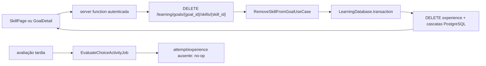

> Implementação concluída na branch `codex/SHIFU-68-skill-removal`. Evidências,
> achados e aceite manual estão em [`evaluation.md`](evaluation.md).

# 1. Context and scope

## Objective and source

Entregar a SHIFU-68 para que a pessoa autenticada remova permanentemente uma
experiência de Habilidade de um Objetivo, em qualquer etapa, por uma ação
confirmada disponível na página da Habilidade e nas visualizações Lista e Grafo
do Objetivo. Learning é o módulo proprietário. Esta é uma Spec **complete** por
atravessar UI, REST, Core, persistência transacional e o consumidor assíncrono de
avaliações.

A autoridade de produto é [Shifu — PRD — Learning](https://joaogoliveiragarcia.atlassian.net/wiki/spaces/Shifu/pages/83066881/Shifu+PRD+Learning),
content ID `83066881`, versão `21`, lida integralmente em `2026-09-26`. O Jira
continua citando a versão `6`; a Spec usa a versão canônica atual e registra
esse drift. RP-21, RP-03, RP-25 e JN-14 permanecem compatíveis com o recorte e
continuam exigindo que evidências por Conceito, bases diagnósticas, cobertura,
recomendações e verificações pertençam à experiência removida.

## Current behavior and product gap

O código de produto em `main` está sincronizado com `origin/main` no commit
`fa893802f637b345a5456c5d94918249615f67d4`; somente este bundle documental da
SHIFU-68 está untracked. A SHIFU-66 está `Concluído` no
Jira e sua implementação full-stack foi integrada nesse commit. A rota real
`/learning/goals/$goalId/skills/$skillId` agora cobre os quatro estados da
experiência: `SkillPage` mantém os estados de diagnóstico e delega os estados
`learning`/`completed` a `SkillExperience`, cujo `SkillOverview` já possui o
gatilho visual de ações, ainda sem comportamento. Portanto, não há mais cenário
de placeholder: a entrega deve integrar a remoção à composição final da página.
A Lista e o Grafo do `GoalDetailPage` também renderizam “Mais ações”, ainda
desabilitado. Não existe endpoint, use case ou ação web para remover somente uma
experiência de Habilidade.

O banco já trata `learning_skill_experiences` como pai de progresso por
Competência, tentativas, avaliações, observações por Conceito e estados por
Conceito por meio de `ON DELETE CASCADE`. O job de avaliação já ignora tentativa
ou experiência ausente, mas a remoção individual ainda não existe e a cobertura
atual não prova esse fluxo pela ação de domínio da SHIFU-68.

## Scope and product alignment

| Área | Em escopo | Fora de escopo |
| --- | --- | --- |
| Entrada | Menu na página de Habilidade, na Lista e no Grafo; disponível em qualquer status | Redesenhar essas páginas, criar nova página ou alterar outras ações do menu |
| Confirmação | Nome da Habilidade, isolamento da experiência, perdas e irreversibilidade; cancelar, pending, erro e retry | Exigir senha ou digitação do nome; restauração/undo |
| Remoção | Uma experiência e todos os dados Learning dependentes, de forma atômica e state-idempotent | Remover o Objetivo, outras Habilidades ou registros do Currículo |
| Concorrência | Avaliação pendente/falha não bloqueia remoção; entrega tardia vira no-op e não recria dados | Cancelar fisicamente execução externa já despachada |
| Pós-sucesso | Habilidade some de Lista/Grafo; SkillPage volta ao Grafo do mesmo Objetivo; visualização atual é preservada no GoalDetail | Alterar a visualização escolhida pelo usuário ou navegar para Home |
| Qualidade | Autorização privada, teclado, foco, mobile, erro recuperável e proteção contra submissão duplicada | Mudanças globais de navegação ou autenticação |

| Requisito fonte | Entrega | Observação |
| --- | --- | --- |
| RP-03 — experiências independentes por Objetivo | full | A mesma Habilidade do Currículo em outro Objetivo permanece intacta |
| RP-21 — remover uma Habilidade do Objetivo | full | Inclui todo o inventário de dados e entrega tardia sem recriação |
| RP-25 — acessibilidade, responsividade e pt-BR | full | Três superfícies, confirmação e recuperação |
| JN-03 — acompanhar Objetivo | partial | Somente integração da ação nas visualizações existentes |
| JN-14 — remover Habilidade | full | Solicitar, explicar, confirmar, remover e atualizar a superfície de origem |

## Product decisions and assumptions

- A URL identifica a experiência por `goal_id` + `skill_id` do Currículo, como
  as rotas Learning existentes; o ID interno `skill_experience_id` não vira
  contrato público.
- Repetir o DELETE após sucesso retorna a mesma ausência privada (`404`) usada
  para inexistência ou falta de propriedade. O efeito é idempotente: não há nova
  mutação, recriação ou exposição de existência.
- “Remover a última Habilidade” mantém o Objetivo vazio. Remoção de Objetivo é a
  ação distinta já entregue pela SHIFU-67.
- O evento/outbox histórico já persistido não é apagado; ele é registro técnico
  imutável. Consumidores devem encontrar a experiência ausente e encerrar sem
  efeito oficial.
- Não será criada migração: as FKs e cascatas necessárias já existem. A entrega
  deve provar essa premissa contra o PostgreSQL migrado atual.

# 2. Implementation Contract

## Functional requirements

| ID | RP/JN/source coverage | Required behavior |
| --- | --- | --- |
| RF-01 | RP-03, RP-21 | Somente a conta autenticada proprietária do Objetivo pode remover a experiência; inexistência, Objetivo alheio e Habilidade que não pertence ao Objetivo produzem ausência privada sem distinção útil. |
| RF-02 | RP-21 | A remoção é permitida em `not-started`, `diagnosing`, `learning` e `completed`, inclusive com avaliação `pending` ou `failed`. |
| RF-03 | RP-21 | A transação remove somente a experiência selecionada e todos os dados dependentes: justificativa, diagnóstico, evidências/estados por Conceito, progresso/domínio/cobertura/verificação, recomendação, conteúdo liberado, tentativas, avaliações e resumo final. |
| RF-04 | RP-03, RP-21 | O Objetivo, as demais experiências nele, a mesma Habilidade em outros Objetivos e o Currículo permanecem intactos; a última remoção deixa o Objetivo vazio. |
| RF-05 | RP-21 | A operação é atômica e state-idempotent: sucesso só é comunicado após commit; falha preserva o estado anterior; repetição não recria nem remove recursos adicionais. |
| RF-06 | RP-21 | Uma avaliação entregue após a remoção é ignorada e não recria experiência, progresso, evidência, avaliação, resumo ou evento oficial derivado. |
| RF-07 | RP-21, JN-14 | As três entradas abrem uma confirmação com o nome da Habilidade, escopo “só desta experiência”, perdas e irreversibilidade; Cancelar não envia remoção. |
| RF-08 | RP-21, JN-14 | Pending bloqueia confirmação duplicada; falha mantém o diálogo aberto, informa erro seguro e permite tentar novamente. |
| RF-09 | RP-21, JN-14 | Após sucesso no GoalDetail, a Habilidade some e a visualização Lista/Grafo permanece; após sucesso na SkillPage, navega para o Grafo do mesmo Objetivo. |
| RF-10 | RP-25 | Menu, diálogo e feedback usam pt-BR, nomes acessíveis, foco visível, teclado completo, alvos adequados e layout utilizável em 390 × 844 e desktop. |

## Acceptance criteria

| ID | RF coverage | Requirement | Given | When | Then | Expected evidence |
| --- | --- | --- | --- | --- | --- | --- |
| CA-01 | RF-01, RF-03 | Proprietário remove a experiência | Conta dona, Objetivo e Habilidade válidos | DELETE é confirmado | `204`; experiência e dependências deixam de existir | Use-case unit + controller integration |
| CA-02 | RF-01, RF-05 | Ausência privada e repetição segura | Recurso inexistente, alheio, associação inválida ou já removida | DELETE é solicitado | `404` com mesmo contrato seguro; nenhum outro dado muda | Use-case unit + controller integration |
| CA-03 | RF-01 | Autenticação obrigatória | Recurso existente sem sessão válida | DELETE é solicitado | `401`; tudo permanece | Controller integration |
| CA-04 | RF-02, RF-03 | Qualquer estado é removível | Experiências nos quatro estados, com avaliação pendente/falha | Cada remoção é executada | Todas as linhas filhas, inclusive concept state/observation, são eliminadas | Controller integration com PostgreSQL |
| CA-05 | RF-04 | Isolamento da remoção | Outra Habilidade no Objetivo e mesma skill em outro Objetivo | Uma experiência é removida | Objetivo, irmã, outra experiência e Currículo permanecem | Controller integration |
| CA-06 | RF-05 | Atomicidade e concorrência sem deadlock | Falha controlada ou avaliação concorrente seguindo a ordem experience → evaluation | Remoção é tentada | Falha faz rollback integral; concorrência espera/termina sem ciclo e a remoção conclui; erro transitório continua recuperável | Integração transacional concorrente |
| CA-07 | RF-06 | Evento tardio vira no-op | Evento canônico já despachado e experiência removida | Job recebe o evento | Run termina como stale/no-op; nada é recriado ou publicado | Inngest job integration |
| CA-08 | RF-07 | Confirmação correta | Menu aberto em qualquer superfície | “Remover habilidade” é acionado | Diálogo mostra nome, isolamento, perdas e ação destrutiva | Component/route + VM-01–VM-03 |
| CA-09 | RF-07 | Cancelamento preserva | Diálogo aberto | Cancelar, Fechar ou Escape | Diálogo fecha, foco retorna e nenhuma requisição é emitida | Component/route + VM-01 |
| CA-10 | RF-08 | Pending e erro recuperável | Confirmação aberta | Confirma rapidamente ou backend falha | Uma requisição; controles bloqueados em pending; erro mantém diálogo e retry funciona | Component/hook/route |
| CA-11 | RF-09 | Atualização da origem | Remoção iniciada na Lista ou Grafo | Backend confirma | Habilidade some, relações se recompõem e view atual não muda | GoalDetail tests + VM-03 |
| CA-12 | RF-09 | Retorno da SkillPage | Remoção iniciada na SkillPage | Backend confirma | URL vira `/learning/goals/$goalId` e abre o Grafo sem item removido | SkillPage route test + VM-01 |
| CA-13 | RF-10 | Acessibilidade e mobile | Desktop e 390 × 844 | Fluxo por ponteiro e teclado | Menu/dialog têm nomes, foco, Escape/Enter/Space, sem clipping e sem erro de console | Playwright CLI + VM-01–VM-03 |

## Design Contract

A autoridade salva está em [`design/handoff.md`](design/handoff.md). As quatro
capturas requeridas foram exportadas e inspecionadas; Lista/Grafo reutilizam a
composição já congelada pela SHIFU-64.

| Reference | Source/node | Route/surface/state | Viewport | Screenshot | Visible inventory | Interaction/state coverage | Ambiguities/exclusions | Validation target |
| --- | --- | --- | --- | --- | --- | --- | --- | --- |
| Confirmação | `design/shifu.pen` / `C51Tjy` | Diálogo aberto | Componente 440 px | [PNG](design/references/C51Tjy.png) | Título, contexto, perdas, Cancelar e commit | Abrir/cancelar/confirmar | Pending/erro são suplementares; aviso de irreversibilidade compartilhado é permitido | CA-08–CA-10, VM-01 |
| Skill desktop | `uyfWq` | SkillPage/menu disponível | 1440 × 900 | [PNG](design/references/uyfWq.png) | Cabeçalho, gatilho e experiência | Posição e hierarquia | Conteúdo adaptativo atual permanece | CA-08, CA-12, VM-01 |
| Skill mobile | `wXPwI` | SkillPage/menu aberto | 390 × 844 | [PNG](design/references/wXPwI.png) | Menu sem corte e conteúdo em coluna | Responsive/teclado | Sem redesenho de navegação | CA-13, VM-02 |
| Item do menu | `wr9RG` | Menu aberto nas três superfícies | Componente 228 px | [PNG](design/references/wr9RG.png) | Ícone + “Remover habilidade” | Menu reutilizável | Lista/Grafo preservam seus frames SHIFU-64 | CA-08, CA-11, VM-03 |

# 3. Technical Contract

## Current technical state

| Evidence | Current responsibility | Gap |
| --- | --- | --- |
| `SkillExperiencesRepository` + `SqlalchemySkillExperiencesRepository` | Busca por goal/skill, lock por ID e `remove` | Falta busca bloqueante por goal/skill para a ação pública |
| Models Learning + migrations `a25a7142d3ff` e `b7c82d3e5f01` | Cascatas de experience para progress/attempt/evaluation/concept evidence/state | Cobertura da remoção individual e das tabelas v2 não existe |
| `EvaluateChoiceActivityJob` / `EvaluateChoiceActivityUseCase` | Valida tentativa/evaluation atuais e retorna quando experiência sumiu | Teste de remoção usa SQL bruto, não a ação SHIFU-68 |
| `RemoveGoalUseCase` / `RemoveGoalController` | Padrão de autorização privada, transação única e DELETE 204 | Atua no Objetivo inteiro, não numa experiência |
| `SkillPage` / `useSkillPage` | Página real dos estados `not-started` e `diagnosing`, além da orquestração da rota | O header desses estados ainda não expõe ações; não há confirmação nem mutation de remoção |
| `SkillExperience` / `SkillOverview` | Experiência final da SHIFU-66 para `learning`/`completed`; o overview já renderiza “Ações da Habilidade” | O gatilho é um botão inerte e precisa ser substituído pelo menu compartilhado sem alterar o conteúdo adaptativo |
| Goal list row / graph node | Exibem gatilho “Mais ações” desabilitado | Falta menu e callback para o dono da operação |
| `ConfirmationDialog` | Confirmação destrutiva compartilhada com pending/error | Falta lista opcional de perdas exigida por C51Tjy |
| `learning-service.ts` + `learning.rest` | Contratos web e exemplos das rotas Learning atuais | Falta DELETE de Habilidade e paridade do route group |

## Solution and runtime flow



O controller recebe a identidade de `SharedPipe`, injeta `LearningDatabase` e
executa um use case síncrono. Dentro de uma única transação, o use case localiza
a associação `goal_id + skill_id` com lock, valida o Goal e seu `account_id` e
remove a experiência. Qualquer ausência ou falha de propriedade lança
`SkillExperienceNotFoundError`; o handler global mantém o `404` seguro. O commit
é o único ponto de sucesso. Cascatas existentes removem as linhas dependentes;
falha aborta a transação inteira.

A ordem global de lock para caminhos que precisam de experiência e avaliação é
`SkillExperience FOR UPDATE` antes de `ActivityEvaluation FOR UPDATE`. O fluxo de
avaliação continua lendo a tentativa para descobrir `skill_experience_id`, mas
passa a bloquear a experiência antes da avaliação; se ela já tiver sido
removida, retorna. A remoção bloqueia a experiência e executa o delete/cascade.
Assim, uma avaliação que ganhou o lock termina antes da remoção, e uma remoção
que ganhou o lock faz a avaliação posterior encerrar sem efeito, sem ciclo de
locks invertidos.

O web encapsula o DELETE em uma server function autenticada e em um action hook
compartilhado por SkillPage e GoalDetail. Cada page hook é dono da seleção, do
diálogo e do pós-sucesso. GoalDetail invalida/refaz o prefixo de query do mesmo
Objetivo sem remontar sua `view`; SkillPage invalida os mesmos dados e usa
`navigateToGoalDetail(goalId)`. A action não comunica sucesso antecipado e seu
pending bloqueia novas confirmações.

| Boundary | Producer | Consumer | Canonical contract | Mapping/guarantees | Failure ownership |
| --- | --- | --- | --- | --- | --- |
| HTTP | Web LearningService | RemoveSkillFromGoalController | DELETE nested, sem body, `204` | IDs de rota; bearer obtido no servidor | AppErrorHandler: 401/404/503 seguros |
| Core/persistence | RemoveSkillFromGoalUseCase | SkillExperiencesRepository | `goal_id`, `skill_id`, `account_id` | Uma transação, lock e delete state-idempotent | Erro escapa; database rollback |
| FK cascade | SkillExperience row | Tabelas Learning filhas | FKs atuais `ON DELETE CASCADE` | Sem migração; filhos desaparecem no mesmo commit | PostgreSQL/transaction owner |
| Async | ActivitySubmissionRequestedEvent | EvaluateChoiceActivityJob/use case | Payload canônico existente | Attempt/experience ausente encerra sem efeitos | Job registra stale/no-op; não recria |
| UI state | SkillActionsMenu | Page hooks | `onRemove(skill)` | Menu puro; página possui diálogo/mutation | Diálogo mantém erro e retry |

## Server affected layer contracts

| Path | Change | Declaration/operation | Contract and guarantees | Dependencies/consumers | Generation/tests |
| --- | --- | --- | --- | --- | --- |
| `apps/server/src/shifu/learning/core/interfaces/skill_experiences_repository.py` | Modify | `find_by_goal_id_and_skill_id_for_update` | Retorna uma experiência bloqueada ou `None` | Use case; SQLAlchemy adapter | Use-case autospec + integration |
| `apps/server/src/shifu/learning/core/use_cases/remove_skill_from_goal_use_case.py` | Create | `RemoveSkillFromGoalUseCase.execute(account_id, goal_id, skill_id)` | Autoriza, remove em uma transação e usa ausência privada | LearningDatabase | Unit test |
| `apps/server/src/shifu/learning/core/use_cases/__init__.py` | Modify | Re-export do use case | Superfície Core explícita | Controller/job test | Architecture/type gates |
| `apps/server/src/shifu/learning/core/use_cases/evaluate_choice_activity_use_case.py` | Modify | Ordem de aquisição de locks | Bloqueia experience antes de evaluation; ausência encerra sem efeito | EvaluateChoiceActivityJob | Unit + job integration |
| `apps/server/src/shifu/learning/database/sqlalchemy/repositories/skill_experiences_repository.py` | Modify | Busca `SELECT ... FOR UPDATE` por goal/skill | Lock e mapping sem commit | Interface Core | Controller integration |
| `apps/server/src/shifu/learning/rest/controllers/remove_skill_from_goal_controller.py` | Create | `RemoveSkillFromGoalController` | DELETE nested, auth, `204`, sem body | Use case + pipes | Controller integration |
| `apps/server/src/shifu/learning/rest/controllers/__init__.py` | Modify | Re-export do controller | Registro explícito | LearningRouter | Architecture/type gates |
| `apps/server/src/shifu/learning/rest/router.py` | Modify | Registrar controller | Uma rota no router `/learning` | FastAPIApp composition | HTTP integration |
| `apps/server/rest-client/learning/learning.rest` | Modify | Request “Remove skill from goal” | Paridade completa do grupo, variáveis sem segredo | Desenvolvedor local | Revisão de paridade |
| `apps/server/tests/learning/core/use_cases/test_remove_skill_from_goal_use_case.py` | Create | `TestRemoveSkillFromGoalUseCase` | Sucesso, ausência, propriedade, associação e ausência de efeitos | Mocks de Protocol | `test:unit` |
| `apps/server/tests/learning/core/use_cases/test_evaluate_choice_activity_use_case.py` | Modify | Ordem global de locks | Experience lock precede evaluation lock e ausência continua no-op | Core use case | `test:unit` |
| `apps/server/tests/learning/server/controllers/test_remove_skill_from_goal_controller.py` | Create | `TestRemoveSkillFromGoalController` | HTTP/auth/cascade/isolamento/idempotência/rollback | PostgreSQL migrado | `test:integration` |
| `apps/server/tests/messaging/inngest/jobs/learning/test_evaluate_choice_activity_job.py` | Modify | Cenário de deletion | Remove pela ação SHIFU-68 antes de publicar evento tardio | Inngest + PostgreSQL reais | `test:jobs` |

Não há mudança de Entity/Structure, evento ou migration. A integração deve
coordenar duas transações reais com timeout limitado para provar que a ordem
experience → evaluation não produz deadlock e que uma falha forçada antes do
commit preserva integralmente a experiência e seus filhos.

## Web widget hierarchy

| Widget | Kind | Parent/entry | Direct children | Public contract | Behavior owner |
| --- | --- | --- | --- | --- | --- |
| `SkillActionsMenu` | Feature component | SkillPage, SkillOverview, GoalSkillRow, GoalGraphNode | shadcn DropdownMenu | `skillName`, `onRemove` | Radix/shadcn; pure renderer |
| `SkillPage` | Page | skill route | `SkillActionsMenu` nos estados diagnósticos, `SkillExperience`, `ConfirmationDialog` único | `goalId`, `skillId` | `useSkillPage` |
| `SkillExperience` / `SkillOverview` | Settled branch | SkillPage | Conteúdo SHIFU-66 + `SkillActionsMenu` | experiência + `onRequestRemove` | SkillPage continua dona da mutation/dialog |
| `GoalDetailPage` | Page | goal route | Header, switcher, Graph/List, `ConfirmationDialog` | `goalId` | `useGoalDetailPage` |
| `GoalSkillList`/`GoalSkillRow` | Layout/pure component | GoalDetailPage | `SkillActionsMenu` | skills + `onRequestRemove` | Parent page hook |
| `GoalSkillGraph`/`GoalGraphNode` | Layout/node | GoalDetailPage/ReactFlow | `SkillActionsMenu` | node data + `onRequestRemove` | Existing graph hook + parent callback |

```text
apps/web/src/ui/learning/
├── hooks/
│   └── use-remove-skill-action.ts                 # create
├── widgets/components/skill-actions-menu/
│   ├── index.tsx                                  # create
│   └── tests/skill-actions-menu.test.tsx          # create
└── widgets/pages/
    ├── skill-page/
    │   ├── index.tsx                              # modify
    │   ├── use-skill-page.ts                      # modify
    │   ├── tests/skill-page.test.tsx              # modify
    │   ├── skill-experience/index.tsx             # modify
    │   ├── skill-experience/tests/skill-experience.test.tsx # modify
    │   └── skill-overview/index.tsx               # modify
    └── goal-detail-page/
        ├── index.tsx                              # modify
        ├── use-goal-detail-page.ts                # modify
        ├── tests/goal-detail-page.test.tsx        # modify
        ├── tests/use-goal-detail-page.test.ts     # modify
        ├── goal-skill-list/index.tsx              # modify
        ├── goal-skill-list/goal-skill-row/index.tsx # modify
        ├── goal-skill-graph/index.tsx             # modify
        ├── goal-skill-graph/use-goal-skill-graph.ts # modify
        ├── goal-skill-graph/goal-graph-node/index.tsx # modify
        └── goal-skill-graph/tests/goal-skill-graph.test.tsx # modify
```

| Path | Change | Declaration/operation | Contract and guarantees | Dependencies/consumers | Generation/tests |
| --- | --- | --- | --- | --- | --- |
| `apps/web/package.json` | Modify | `@radix-ui/react-dropdown-menu` | Versão compatível com os Radix atuais | shadcn primitive | `pnpm --filter web add @radix-ui/react-dropdown-menu` na raiz |
| `pnpm-lock.yaml` | Generate | Resolução da dependência | Gerado somente pelo pnpm, sem edição manual | Workspace | Mesmo comando de add; type/build |
| `apps/web/src/ui/shadcn/dropdown-menu.tsx` | Create | Primitivos DropdownMenu | Sem conteúdo Learning; teclado/foco Radix | SkillActionsMenu | Component/route tests |
| `apps/web/src/ui/shared/widgets/components/confirmation-dialog/index.tsx` | Modify | Lista opcional de detalhes | Preserva SHIFU-67; renderiza perdas acessíveis | SkillPage/GoalDetail | Existing shared test |
| `apps/web/src/ui/shared/widgets/components/confirmation-dialog/tests/confirmation-dialog.test.tsx` | Modify | Cenário com detalhes | Lista, pending, erro e compatibilidade | Shared dialog | Unit |
| `apps/web/src/ui/learning/widgets/components/skill-actions-menu/index.tsx` | Create | `SkillActionsMenu` | Menu pt-BR, item destrutivo e callback | Três superfícies | Component test |
| `apps/web/src/ui/learning/widgets/components/skill-actions-menu/tests/skill-actions-menu.test.tsx` | Create | Contrato público | Abrir, teclado, escolher e fechar | shadcn menu | Unit |
| `apps/web/src/ui/learning/hooks/use-remove-skill-action.ts` | Create | server function + `useRemoveSkillAction` | Auth no servidor, mutation sem estado visual | Dois page hooks | Cobertura via consumidores |
| `apps/web/src/rest/services/learning-service.ts` | Modify | `removeSkillFromGoal` | DELETE nested, bearer, sem regra de negócio | Server function | Route/browser tests |
| `apps/web/src/ui/learning/widgets/pages/skill-page/index.tsx` | Modify | Compor diálogo único e menu dos estados diagnósticos; propagar ação ao settled branch | Ação disponível em qualquer estágio sem duplicar mutation | useSkillPage/SkillExperience | Component/route |
| `apps/web/src/ui/learning/widgets/pages/skill-page/use-skill-page.ts` | Modify | Estado/handlers de remoção | Cancel/pending/error/invalidate/navigate | Shared action/navigation | Hook through page/route |
| `apps/web/src/ui/learning/widgets/pages/skill-page/tests/skill-page.test.tsx` | Modify | Matriz do diálogo | Estados e callbacks observáveis | Mock do owning hook | Unit |
| `apps/web/src/ui/learning/widgets/pages/skill-page/skill-experience/index.tsx` | Modify | Propagar `onRequestRemove` | Preserva todos os estados e blocos entregues pela SHIFU-66 | SkillOverview | Existing component test |
| `apps/web/src/ui/learning/widgets/pages/skill-page/skill-experience/tests/skill-experience.test.tsx` | Modify | Wiring da ação no settled branch | O menu seleciona a experiência atual sem regredir recomendação/lista | SkillExperience | Unit |
| `apps/web/src/ui/learning/widgets/pages/skill-page/skill-overview/index.tsx` | Modify | Substituir botão inerte por `SkillActionsMenu` | Mantém posição, nome acessível e visual SHIFU-66 | SkillExperience | Parent component test |
| `apps/web/src/ui/learning/widgets/pages/goal-detail-page/index.tsx` | Modify | Propagar callback + diálogo único | Seleção central e preservação de view | useGoalDetailPage | Component/route |
| `apps/web/src/ui/learning/widgets/pages/goal-detail-page/use-goal-detail-page.ts` | Modify | Seleção/handlers/query refresh | Uma mutation; view local preservada | Shared action/query client | Hook test |
| `apps/web/src/ui/learning/widgets/pages/goal-detail-page/tests/goal-detail-page.test.tsx` | Modify | Lista/Grafo/dialog states | Entradas, pending/error/success | Mock owning hook | Unit |
| `apps/web/src/ui/learning/widgets/pages/goal-detail-page/tests/use-goal-detail-page.test.ts` | Modify | Orquestração real do hook | Seleção, cancelamento, invalidation e view | Mock action/query | Unit |
| `apps/web/src/ui/learning/widgets/pages/goal-detail-page/goal-skill-list/index.tsx` | Modify | `onRequestRemove` | Encaminha callback | GoalSkillRow | Parent tests |
| `apps/web/src/ui/learning/widgets/pages/goal-detail-page/goal-skill-list/goal-skill-row/index.tsx` | Modify | Substituir stub por menu | Nome/skill corretos | SkillActionsMenu | Parent tests |
| `apps/web/src/ui/learning/widgets/pages/goal-detail-page/goal-skill-graph/index.tsx` | Modify | Propagar callback ao grafo | Sem alterar canvas/controls | Graph hook | Existing graph tests |
| `apps/web/src/ui/learning/widgets/pages/goal-detail-page/goal-skill-graph/use-goal-skill-graph.ts` | Modify | Incluir callback no node data | Layout e highlights preservados | GoalGraphNode | Existing graph tests |
| `apps/web/src/ui/learning/widgets/pages/goal-detail-page/goal-skill-graph/goal-graph-node/index.tsx` | Modify | Substituir stub por menu | Menu dentro do node sem habilitar drag | SkillActionsMenu | Graph/page tests |
| `apps/web/src/ui/learning/widgets/pages/goal-detail-page/goal-skill-graph/tests/goal-skill-graph.test.tsx` | Modify | Contrato público do grafo | Novo callback/prop e wiring do node sem regressão de layout/highlight | GoalSkillGraph | Unit |
| `apps/web/tests/learning/skill-experience-page.test.ts` | Modify | Rota SkillPage final da SHIFU-66 | BFF DELETE, navegação, erro, teclado/mobile | App real + transporte mockado | Playwright integration |
| `apps/web/tests/learning/goal-detail-page.test.ts` | Modify | Fluxos Lista/Grafo | Request, remoção visual, view preservada | App real + transporte mockado | Playwright integration |

## Technical decisions

| Decision | Chosen approach | Alternative considered | Reason | Accepted trade-off |
| --- | --- | --- | --- | --- |
| Identificador HTTP | `goal_id` + curriculum `skill_id` | Expor `skill_experience_id` | Alinha todas as rotas Learning e evita contrato interno | Use case faz lookup composto |
| Ausência/repetição | `404` genérico para missing/not-owned/already removed | `204` para qualquer ausência | Preserva privacidade e padrão atual; efeito continua idempotente | Segunda resposta difere do primeiro sucesso |
| Integridade/locks | Delete da experience + cascatas existentes; ordem global experience → evaluation | Deletes manuais ou aceitar lock invertido/retry | Banco garante atomicidade e a ordem remove o ciclo de deadlock com avaliação | Altera a ordem interna do use case de avaliação e exige regressão dedicada |
| Evento tardio | Guardas atuais tornam run no-op | Cancelamento físico do job | Out of scope e delivery é at-least-once | Evento histórico pode continuar no outbox |
| Menu | shadcn/Radix DropdownMenu reutilizável | Menu customizado como AccountMenu | Semântica/foco/teclado mais robustos e segue UI Rule | Nova dependência e lockfile |
| Estado UI | Um diálogo por Page, menu emite seleção | Um diálogo por row/node | Evita mutations concorrentes e estado duplicado | Prop drilling explícito para List/Graph |

# 4. Validation Contract

## Test boundaries

| Test file | Test type | Target | Coverage goal |
| --- | --- | --- | --- |
| `apps/server/tests/learning/core/use_cases/test_remove_skill_from_goal_use_case.py` | unit | Use case | Autorização, associação, idempotência de efeito e colaboração |
| `apps/server/tests/learning/server/controllers/test_remove_skill_from_goal_controller.py` | HTTP integration | Controller + DB | 204/401/404, cascatas completas, isolamento, rollback e remoção concorrente sem deadlock |
| `apps/server/tests/messaging/inngest/jobs/learning/test_evaluate_choice_activity_job.py` | job integration | Inngest real | Evento entregue depois da remoção não recria efeitos |
| `apps/server/tests/learning/core/use_cases/test_evaluate_choice_activity_use_case.py` | unit | Evaluation use case | Experience lock precede evaluation lock; missing experience continua no-op |
| `apps/web/src/ui/learning/widgets/components/skill-actions-menu/tests/skill-actions-menu.test.tsx` | component | Menu | Semântica, ponteiro, Enter/Space/Escape e callback |
| `apps/web/src/ui/shared/widgets/components/confirmation-dialog/tests/confirmation-dialog.test.tsx` | component | Confirmação | Lista de perdas, pending, erro e regressão do Goal |
| `apps/web/src/ui/learning/widgets/pages/skill-page/tests/skill-page.test.tsx` | component | SkillPage | Composição do menu/dialog nos estados diagnósticos e estados do owning hook |
| `apps/web/src/ui/learning/widgets/pages/skill-page/skill-experience/tests/skill-experience.test.tsx` | component | SkillExperience/SkillOverview | Propagação da ação no settled branch sem regressão da experiência SHIFU-66 |
| `apps/web/src/ui/learning/widgets/pages/goal-detail-page/tests/*.test.ts*` | component/hook | GoalDetail | Seleção, view, refresh, pending/error e prop wiring |
| `apps/web/src/ui/learning/widgets/pages/goal-detail-page/goal-skill-graph/tests/goal-skill-graph.test.tsx` | component | GoalSkillGraph | Novo callback chega ao node sem regressão do contrato existente |
| `apps/web/tests/learning/skill-experience-page.test.ts` | route integration | Skill route final | Server function, DELETE, URL final, teclado/mobile e conteúdo SHIFU-66 preservado |
| `apps/web/tests/learning/goal-detail-page.test.ts` | route integration | Goal route | Lista/Grafo, request e preservação da view |

| Acceptance | Automated boundary | Manual scenario | Evidence target |
| --- | --- | --- | --- |
| CA-01 | Use case + controller | — | Evaluation acceptance + EV |
| CA-02 | Use case + controller | — | Evaluation acceptance + EV |
| CA-03 | Controller | — | Evaluation acceptance + EV |
| CA-04 | Controller/PostgreSQL | — | Evaluation acceptance + EV |
| CA-05 | Controller/PostgreSQL | — | Evaluation acceptance + EV |
| CA-06 | Controller/PostgreSQL com transações coordenadas e falha controlada | — | Evaluation acceptance + EV |
| CA-07 | Inngest job | — | Evaluation acceptance + EV |
| CA-08 | Components + routes | VM-01, VM-03 | Screenshot/runtime EV |
| CA-09 | Components + routes | VM-01 | Runtime EV |
| CA-10 | Components/hooks/routes | VM-01 | Runtime EV |
| CA-11 | GoalDetail route | VM-03 | Runtime EV |
| CA-12 | SkillPage route | VM-01 | Runtime EV |
| CA-13 | Route tests + Playwright CLI | VM-01–VM-03 | Visual/a11y EV |

## Manual scenarios

### VM-01 — SkillPage desktop, success and recovery

- **Criteria:** CA-08–CA-10, CA-12, CA-13.
- **Preconditions:** web/API/PostgreSQL saudáveis; conta dona; Habilidade em
  aprendizado com dados; viewport 1440 × 900; referências `uyfWq`, `wr9RG` e
  `C51Tjy`.
- **Steps:** abrir SkillPage; operar o menu por teclado; cancelar com Escape e
  confirmar retorno de foco/ausência de request; reabrir; forçar uma falha
  segura e verificar diálogo aberto/retry; confirmar com sucesso.
- **Expected:** um DELETE; controles pending bloqueados; erro recuperável; URL
  final do mesmo Objetivo; Grafo sem a Habilidade; console sem erro e nenhuma
  requisição 4xx/5xx não explicada.
- **Evidence:** screenshot fresco do menu, diálogo, erro e destino; request e
  consulta de persistência; limpar somente fixture criada.

### VM-02 — SkillPage mobile

- **Criteria:** CA-08, CA-10, CA-13.
- **Preconditions:** cenário VM-01 em 390 × 844; referência `wXPwI`.
- **Steps:** abrir menu por ponteiro e teclado; percorrer item e diálogo; testar
  Cancelar/Fechar/confirmar.
- **Expected:** sem corte/scroll horizontal, alvos utilizáveis, foco visível e
  conteúdo do diálogo alcançável.
- **Evidence:** screenshots frescos e inspeção de DOM/layout/console.

### VM-03 — Lista e Grafo

- **Criteria:** CA-08, CA-11, CA-13.
- **Preconditions:** Objetivo com duas Habilidades; refs SHIFU-64 + `wr9RG`.
- **Steps:** remover uma Habilidade pela Lista e verificar permanência em Lista;
  repetir fixture pelo Grafo e verificar permanência no Grafo, recomposição das
  relações e ausência da removida.
- **Expected:** uma experiência removida por vez; irmã/Objetivo intactos; mesma
  visualização e foco coerente após atualização.
- **Evidence:** screenshots de Lista/Grafo, requests, URL, console e consulta de
  persistência.

## Commands and sensors

| CI | Command/sensor | Coverage |
| --- | --- | --- |
| CI-01 | `cd apps/server && uv run poe check:lint` | Python lint/format |
| CI-02 | `cd apps/server && uv run poe check:architecture` | Limites de módulo/camada |
| CI-03 | `cd apps/server && uv run poe check:types` | Tipagem Python |
| CI-04 | `cd apps/server && uv run poe test:unit` | Use cases |
| CI-05 | `cd apps/server && uv run poe test:integration` | HTTP + PostgreSQL |
| CI-06 | `cd apps/server && uv run poe test:jobs` | Inngest real/Testcontainers |
| CI-07 | `cd apps/server && uv run poe build` | Build servidor |
| CI-08 | `pnpm --filter web check:lint` | Web lint/format |
| CI-09 | `pnpm --filter web check:architecture` | Fronteiras Web |
| CI-10 | `pnpm --filter web check:types` | Tipagem TypeScript |
| CI-11 | `pnpm --filter web test:unit` | Component/hook suites |
| CI-12 | `pnpm --filter web test:integration` | Rotas reais com transporte mockado |
| CI-13 | `pnpm --filter web build` | Build Web e route generation |
| CI-14 | Revisão de `learning.rest` contra todos os controllers Learning | Paridade REST-client |
| CI-15 | Playwright CLI + inspeção de request/console/DOM/persistência | VM-01–VM-03 e visual |

# 5. Documentation alignment and revision history

| Document | Authority for | State | Required change/confirmation |
| --- | --- | --- | --- |
| Confluence Learning PRD `83066881` v21 | RP-03, RP-21, RP-25, JN-14 | confirmed | Conteúdo completo relido em 2026-09-26; nenhuma escrita externa |
| Jira SHIFU-68 | Recorte de entrega | confirmed with drift | `A fazer`; continua citando PRD v6 e node inexistente `nrpwf`; Spec usa v21 e nodes atuais |
| Jira/entrega SHIFU-66 | Superfície final da SkillPage | completed | Jira `Concluído` em 2026-09-26 e implementação presente em `main`; remove a contingência de placeholder |
| `documentation/architecture.md` | Camadas/transações/messaging | confirmed | Learning permanece dono; sem nova integração |
| `documentation/modules.md` | Autoridade Learning/Curriculum | confirmed | Curriculum é somente preservado, não mutado |
| `documentation/design.md` | Tokens, destrutiva, T14 | confirmed | Gatilho neutro; commit `--danger` |
| `documentation/features/learning/skill-removal/design/handoff.md` | Autoridade visual salva | created | Quatro referências verificadas |
| `documentation/tooling.md` + manifests | Comandos | confirmed | Apenas comandos reais registrados |
| `documentation/agents/spec-reviewer-agent.md` | Compatibilidade de arquitetura e Rules | confirmed | Revisão 1: três achados corrigidos; revisão 2: recheck read-only sem achados residuais |

| Rule | Applies to | Evaluated revision |
| --- | --- | --- |
| `documentation/rules/python-conventions-rules.md` | Server source/tests | main `fa89380`, unchanged since r1, rechecked 2026-09-26 |
| `documentation/rules/core-layer-rules.md` | Use case/interfaces/errors | main `fa89380`, unchanged since r1, rechecked 2026-09-26 |
| `documentation/rules/use-case-testing-rules.md` | Unit tests | main `fa89380`, unchanged since r1, rechecked 2026-09-26 |
| `documentation/rules/rest-layer-rules.md` | Controller/web service/REST client | main `fa89380`, unchanged since r1, rechecked 2026-09-26 |
| `documentation/rules/controllers-testing-rules.md` | HTTP/PostgreSQL tests | main `fa89380`, unchanged since r1, rechecked 2026-09-26 |
| `documentation/rules/database-layer-rules.md` | Repository/cascade/transaction | main `fa89380`, unchanged since r1, rechecked 2026-09-26 |
| `documentation/rules/messaging-layer-rules.md` | Late-event no-op | main `fa89380`, unchanged since r1, rechecked 2026-09-26 |
| `documentation/rules/jobs-testing-rules.md` | Inngest integration | main `fa89380`, unchanged since r1, rechecked 2026-09-26 |
| `documentation/rules/typescript-conventions-rules.md` | Web code | main `fa89380`, unchanged since r1, rechecked 2026-09-26 |
| `documentation/rules/ui-layer-rules.md` | Widgets/hooks/menu/dialog | main `fa89380`, unchanged since r1, rechecked 2026-09-26 |
| `documentation/rules/widget-testing-rules.md` | Unit/route/browser coverage | main `fa89380`, unchanged since r1, rechecked 2026-09-26 |

| Revision | Date | Material change | Reason |
| --- | --- | --- | --- |
| 1 | 2026-09-25 | Contrato inicial completo, integrado diretamente às páginas reais e ao pipeline atual | Jira SHIFU-68, PRD Learning v17, Pencil atual e main `94dc7ad` |
| 2 | 2026-09-26 | Reconciliou a conclusão da SHIFU-66, a composição final `SkillPage` → `SkillExperience` → `SkillOverview`, os testes existentes e o PRD Learning v21 | SHIFU-66 concluída e integrada no main `fa89380`; nenhuma mudança de comportamento da remoção |
