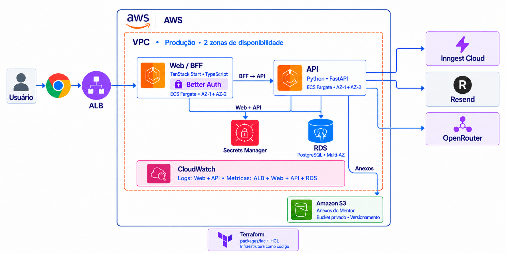

# Infraestrutura do Shifu

Este documento registra a **arquitetura de infraestrutura definida** para o
Shifu. A pilha de desenvolvimento local já existe no repositório; a implantação
da arquitetura completa na AWS é uma etapa de execução. O laboratório de
armazenamento tem configuração Terraform em `packages/iac`; código existente
não confirma provisionamento na conta AWS.
Para a arquitetura das aplicações e os limites dos módulos de produto, consulte
[`architecture.md`](architecture.md) e [`modules.md`](modules.md).



## Decisões de plataforma

| Responsabilidade | Escolha para staging e produção |
| --- | --- |
| Provedor de nuvem | AWS |
| Execução das aplicações | Dois serviços ECS com Fargate: Web/BFF e API |
| Banco relacional | Amazon RDS for PostgreSQL |
| Arquivos de anexos do Mentor | Amazon S3; integração planejada, com objetos privados |
| Cache e limitação de requisições | Redis gerenciado, em rede privada; produto e capacidade a definir |
| Processamento assíncrono | Inngest Cloud |
| E-mail transacional | Resend |
| Avaliação e recursos de IA | OpenRouter, acessado pela API |
| Segredos de aplicação | AWS Secrets Manager |
| Logs, métricas e alarmes AWS | Amazon CloudWatch |
| Provisionamento | Terraform em HCL no pacote `packages/iac`; configuração e estado separados por ambiente |

Essas escolhas não transferem regras de negócio para a infraestrutura. Identity,
Communication, Curriculum, Learning, Gamification e Intelligence continuam com
as responsabilidades definidas em [`modules.md`](modules.md).

## Fluxo das aplicações

```text
Navegador → HTTPS/ALB → Web/BFF (TanStack Start, TypeScript)
                            ├─ Better Auth → RDS PostgreSQL
                            └─ chamadas autenticadas → API (Python, FastAPI)
                                                        ├─ RDS PostgreSQL
                                                        ├─ Redis
                                                        ├─ S3 (anexos privados do Mentor; planejado)
                                                        ├─ Inngest Cloud
                                                        └─ OpenRouter

Inngest Cloud → endpoint assinado da API → jobs → Resend
```

- **Web/BFF:** executa TanStack Start no ECS Fargate. O Better Auth roda no
  processo Web, atende `/api/auth`, mantém contas e sessões no PostgreSQL e
  usa seus segredos de configuração. O BFF chama a API por contrato autenticado;
  a API continua responsável por autorização e regras dos módulos.
- **API:** executa FastAPI no ECS Fargate. A API usa PostgreSQL para dados de
  produto, Redis para cache e limitação de requisições, OpenRouter para os
  recursos de IA previstos e Inngest para trabalho assíncrono.
- **E-mail:** Identity solicita comunicações, Communication organiza a entrega
  assíncrona, e o provedor de produção/staging é o Resend. Better Auth não é um
  serviço de envio de e-mails separado nem chama Resend diretamente nesse fluxo.
- **Inngest:** eventos saem da API para o Inngest Cloud. A plataforma chama o
  endpoint assinado da API para executar as funções registradas. A exposição
  pública desse endpoint deve ser restrita ao caminho necessário e protegida
  pela validação de assinatura.

O ALB recebe tráfego HTTPS e encaminha para os serviços conforme os caminhos
publicados. Web e API devem ter health checks independentes. Os caminhos e
domínios finais serão definidos junto ao roteamento de staging e produção.

## Rede e sub-redes

Cada ambiente tem uma VPC isolada, distribuída em **duas zonas de
disponibilidade (AZs)**. Em cada AZ:

| Camada | Sub-redes | Recursos e acesso |
| --- | --- | --- |
| Pública | Uma por AZ | ALB e NAT Gateway; rota para o Internet Gateway |
| Aplicação | Uma privada por AZ | Tarefas ECS de Web e API; sem IP público |
| Dados | Uma privada por AZ | RDS e Redis; sem rota direta para a internet |

Em produção, cada serviço ECS mantém tarefas nas duas AZs, com capacidade
para continuar atendendo se uma AZ falhar. O RDS usa implantação Multi-AZ.
Staging usa capacidade reduzida e RDS Single-AZ; isso diminui custo e não
oferece a mesma disponibilidade de produção.

As tarefas privadas precisam de saída HTTPS para Inngest Cloud, Resend e
OpenRouter. Produção usa um NAT Gateway por AZ. Staging usa um NAT Gateway
compartilhado, assumindo explicitamente o ponto único de falha e o tráfego
entre AZs. VPC endpoints para serviços AWS, como ECR, Secrets Manager e
CloudWatch, são uma otimização posterior cuja seleção depende de medição de
custo e tráfego.

Os security groups devem permitir somente os fluxos necessários:

- internet → ALB: HTTPS;
- ALB → Web e caminhos públicos necessários da API: portas das tarefas;
- Web/BFF → API: tráfego interno autenticado;
- Web/BFF e API → RDS: PostgreSQL;
- API → Redis: porta do serviço Redis;
- tarefas ECS → serviços AWS e provedores externos: saída necessária.

RDS e Redis não devem aceitar conexões diretamente da internet. O acesso
operacional ao banco deve usar um mecanismo administrativo controlado, sem
abrir a sub-rede de dados.

## Dados, autenticação e segredos

### S3 — anexos do Mentor

O uso definido de S3 no Shifu é **somente para anexos do Mentor**, como imagens,
PDFs e outros arquivos enviados nas conversas. Materiais didáticos não fazem
parte desse uso. A integração com o Mentor é planejada; esta decisão de
infraestrutura não afirma que upload, leitura de anexos ou processamento pela
IA já estejam implementados ou aprovados no PRD de Intelligence.

O S3 guarda o conteúdo dos arquivos. O PostgreSQL guarda seus metadados e
vínculos: identificador do anexo, usuário, conversa, nome original, tipo,
tamanho e chave do objeto. O caminho segue o domínio proprietário:

```text
intelligence/mentor/users/{userId}/conversations/{conversationId}/attachments/{attachmentId}/{filename}
```

Exemplo com identificadores fictícios:

```text
intelligence/mentor/users/u123/conversations/c456/attachments/a789/exercicio.pdf
```

A API deve construir a chave, validar o arquivo e verificar a autorização
para a conversa. O prefixo organiza os objetos, mas não concede acesso. Os
anexos reais permanecem privados, com bloqueio de acesso público no bucket.
A identidade IAM da API deve ter somente as permissões necessárias. Não são
fornecidas credenciais AWS ao navegador.

O fluxo planejado usa URLs pré-assinadas de duração limitada para upload e
download, emitidas após autorização. Antes de disponibilizar o anexo à
conversa, a API deve confirmar o upload e seus metadados. A URL temporária não
é o identificador persistente do arquivo; persiste-se a chave do objeto.
Tipos aceitos, limites de tamanho, retenção, exclusão e integração com a IA
precisam de definição no contrato da funcionalidade antes da implementação.

### Laboratório acadêmico de S3 — primeira entrega

A primeira entrega da atividade de armazenamento é um laboratório separado
da aplicação, operado pela console e/ou CLI, com infraestrutura reproduzível
em Terraform. Não exige implementar o upload no site. O laboratório tem bucket
e estado próprios, sem compartilhar anexos reais com staging ou produção.

O laboratório deve demonstrar:

- criação do bucket, nome e região escolhida;
- pelo menos cinco arquivos de tipos diferentes: imagem, PDF, JSON, CSV e TXT;
- pelo menos um objeto público e um privado;
- versionamento habilitado e duas versões de um objeto na mesma chave;
- link público funcionando no navegador, conforme o template da atividade;
- relatório técnico e link do repositório, com configuração, prints, comandos
  utilizados e identificação dos integrantes.

Os arquivos privados do laboratório usam `academic/storage-activity/private/`
e conteúdos fictícios, conforme o README do pacote. O prefixo de domínio
`intelligence/mentor/` permanece definido para a futura integração do produto.
O objeto público existe somente para a demonstração:

```text
academic/storage-activity/public/exemplo.txt
```

A política do laboratório deve permitir leitura pública apenas desse objeto,
sem liberar listagem, escrita ou leitura dos anexos privados. As configurações
de bloqueio de acesso público da conta e do bucket precisam ser verificadas
para permitir essa exceção. A configuração pública do laboratório não deve
ser aplicada aos buckets de anexos reais.

Para demonstrar versionamento, enviar duas versões de um PDF usando a mesma
chave e registrar os identificadores das versões. Lifecycle e hospedagem de
site estático são complementos sugeridos, não parte obrigatória desta primeira
entrega de S3. O pacote atual contém somente S3 para esta
primeira entrega. Os procedimentos completos estão no
[`README do pacote`](../packages/iac/README.md).

### PostgreSQL e segredos

O PostgreSQL do RDS é compartilhado pelas aplicações conforme seus esquemas e
contratos: Better Auth no Web/BFF persiste contas, sessões e chaves; a API
persiste os dados dos módulos. Migrações de esquema devem ser executadas como
uma etapa controlada do deploy, sem depender da inicialização simultânea das
tarefas. Backups automáticos, retenção, restauração testada e objetivo de
recuperação precisam ser definidos antes de produção.

O Secrets Manager mantém segredos **separados por ambiente**. Os principais
grupos são credenciais do banco, `BETTER_AUTH_SECRET`,
`SHIFU_BFF_SHARED_SECRET`, chaves do Inngest, chave do Resend e credenciais do
OpenRouter. As tarefas ECS recebem somente os segredos necessários à sua
função, por IAM de menor privilégio. O Web/BFF precisa dos segredos do Better
Auth e da integração autenticada com a API; a API precisa dos segredos dos
provedores que utiliza. Nenhum segredo deve ser gravado em imagens, na
configuração Terraform em texto puro ou no repositório.

TLS deve proteger o tráfego público. A comunicação entre serviços e com o
banco deve seguir as configurações de criptografia exigidas por cada serviço.
O certificado público pode ser gerenciado pelo AWS Certificate Manager; DNS
e nomes de domínio ainda precisam de definição.

## Processamento, observabilidade e operação

O Inngest Cloud executa os fluxos assíncronos de staging e produção, incluindo
entrega transacional e tarefas com retry. A API deve verificar a assinatura
das chamadas e aplicar idempotência nos jobs que podem ser repetidos. O
Inngest Dev Server continua sendo o ambiente local; testes de integração de
jobs usam a infraestrutura descartável definida no repositório.

Web e API enviam logs e métricas de aplicação ao CloudWatch. ALB e RDS fornecem
métricas de infraestrutura; alarmes devem cobrir indisponibilidade, erros,
latência, capacidade e falhas de jobs. A observabilidade de execução de
funções no Inngest Cloud deve ser consultada na plataforma ou integrada
explicitamente; o CloudWatch não a substitui automaticamente. Logs não devem
conter tokens, credenciais, conteúdo sensível de mensagens ou dados pessoais
desnecessários.

As imagens das aplicações devem ser publicadas no ECR. O pipeline de entrega
deve validar as aplicações, gerar imagens versionadas, executar migrações
controladas e atualizar os serviços ECS com verificação de saúde. O desenho
final do pipeline e a política de rollback ainda precisam ser definidos.

## Ambientes e provisionamento

| Ambiente | Execução e integrações |
| --- | --- |
| Local | `docker-compose.yaml` fornece PostgreSQL, Redis, Inngest Dev Server e Mailpit. Web e API rodam pelos comandos dos respectivos manifests. E-mails são capturados pelo Mailpit. |
| Laboratório | Configuração Terraform em `packages/iac`, somente com S3 e arquivos fictícios para a primeira entrega. Independente do runtime do Shifu. |
| Staging | Configuração Terraform, estado e segredos próprios; ECS Fargate com capacidade reduzida, RDS Single-AZ, Redis privado, um NAT Gateway, Inngest Cloud e Resend. |
| Produção | Configuração Terraform, estado e segredos próprios; serviços ECS em duas AZs, RDS Multi-AZ, NAT por AZ, Inngest Cloud e Resend. |

Terraform deve criar e atualizar os recursos AWS de cada ambiente, inclusive
rede, grupos de segurança, IAM, ECR, ECS, ALB, banco, cache, S3, segredos e
observabilidade. Os ambientes precisam de configuração e estado isolados. A
revisão de mudanças de infraestrutura deve preceder a aplicação em produção.
Inngest Cloud, Resend e OpenRouter são serviços externos configurados por
ambiente; o Terraform provisiona a infraestrutura AWS, não esses serviços por
inferência.

### Organização do pacote Terraform

O pacote fica em `packages/iac`, com recursos declarados em HCL e somente
Amazon S3 para a primeira entrega da atividade. Os arquivos fictícios são
enviados manualmente pela AWS CLI, conforme o README; não há script de fixtures.

```text
packages/iac/
├── README.md
├── .gitignore
├── .terraform.lock.hcl
├── versions.tf
├── variables.tf
├── locals.tf
├── outputs.tf
├── terraform.tfvars.example
├── s3.tf
└── fixtures/
    ├── public/
    ├── private/
    └── archive/
```

- `versions.tf`: versões aceitas do Terraform e providers AWS e Random.
- `.terraform.lock.hcl`: versões e hashes dos providers; deve ser versionado.
- `variables.tf` e `terraform.tfvars.example`: região AWS e prefixo do bucket.
- `locals.tf`: tags compartilhadas do laboratório.
- `s3.tf`: bucket, versionamento, criptografia, lifecycle e política pública
  restrita ao objeto de demonstração.
- `outputs.tf`: região, nome do bucket e URL pública de demonstração.
- `fixtures/`: arquivos fictícios para upload manual, incluindo duas versões
  do PDF.

O pacote é um laboratório acadêmico de S3. Não provisiona rede, RDS, DynamoDB,
EFS ou serviços da aplicação e não implementa anexos do Mentor. A arquitetura
de staging e produção continua planejada, com configuração e estado próprios.

### Estado e execução

A configuração atual usa estado local, ignorado pelo `.gitignore`. Não há
backend remoto configurado. A identidade AWS é fornecida pelas credenciais ou
pelo perfil do operador. Credenciais, arquivos de estado e planos gerados não
entram no Git; o estado deve ser preservado enquanto houver recursos ativos.

A partir de `packages/iac`, o fluxo documentado no README é:

```sh
terraform init
terraform fmt -check -recursive
terraform validate
terraform plan
```

A criação de recursos ocorre com `terraform apply`, após revisão do plano e
autorização para a implantação. Para uso compartilhado e futuros ambientes,
o backend remoto e seu controle de acesso e bloqueio precisam ser definidos
antes do deploy. A decisão anterior de usar Pulumi Cloud foi substituída;
não se presume um backend remoto já implantado.

O código do laboratório existe no pacote. O documento não confirma execução
de `apply` nem provisionamento de recursos na conta AWS.

## Parâmetros de implementação antes do primeiro deploy

- Região AWS, domínios, certificados e política de DNS/WAF.
- CIDRs da VPC, endereçamento das sub-redes e estratégia de acesso operacional.
- Produto Redis gerenciado, dimensionamento inicial e política de persistência.
- Capacidade mínima ECS por ambiente, autoscaling e limites de custo.
- Retenção de backups e logs, testes de restauração, RPO e RTO.
- Pipeline de deploy, migrações, rollback e armazenamento remoto e bloqueio do estado Terraform.
- Uso de VPC endpoints frente ao custo de NAT e volume de saída.

Esta arquitetura complementa a arquitetura da aplicação. Os parâmetros
operacionais acima não alteram as escolhas de plataforma definidas neste
documento. Nomes exatos de recursos, preços e capacidades serão verificados
durante a implementação do Terraform; o documento não afirma que os recursos já
estão provisionados.
