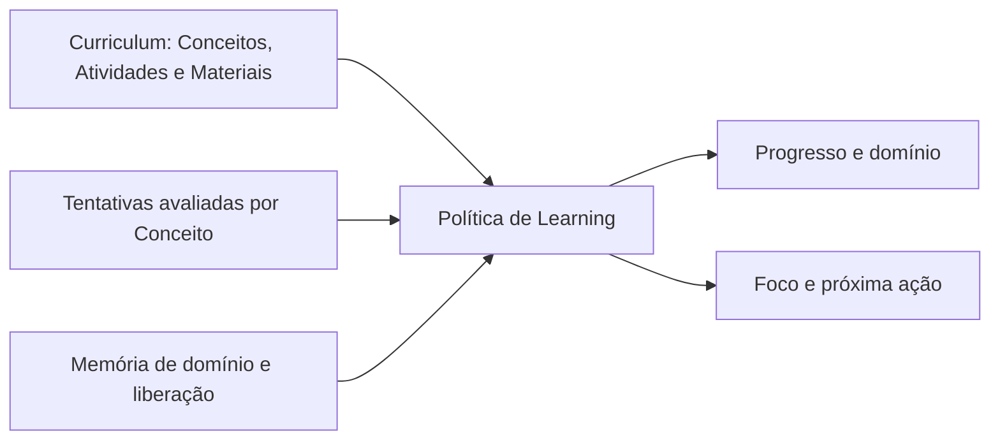
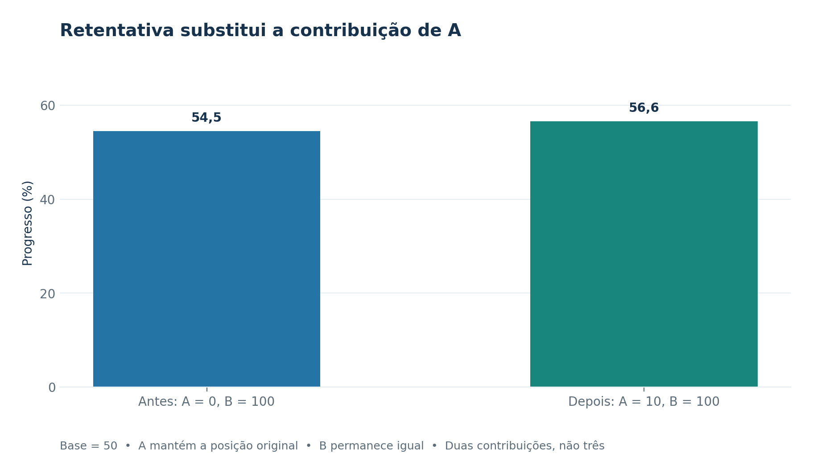
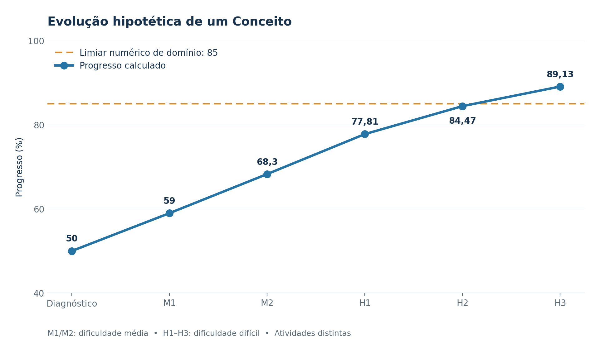
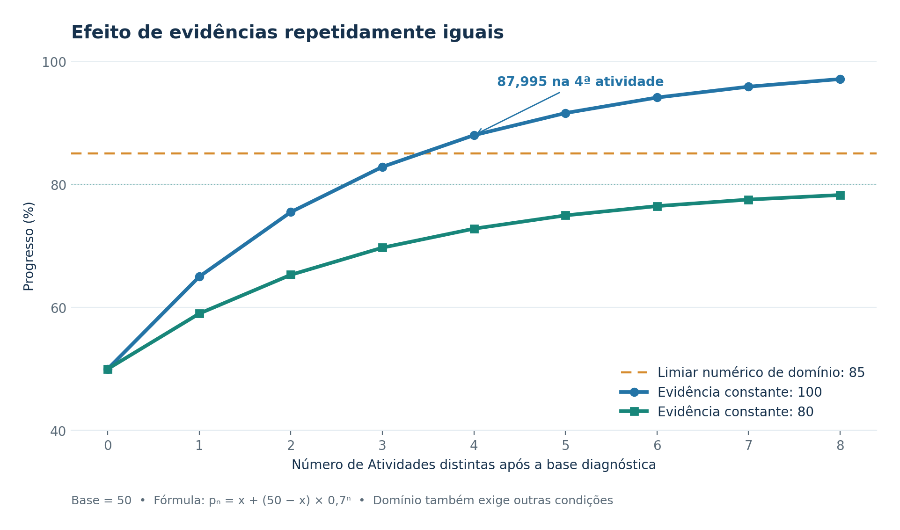

# Algoritmo adaptativo de Learning: regras, simulação e validação

**Estado da análise:** 28/09/2026. Este documento descreve a política de recomendação presente no diretório de trabalho nessa data. As três correções da auditoria estão locais e ainda não devem ser apresentadas como entregues em produção.

## 1. Finalidade e fontes

O algoritmo decide **qual Conceito estudar, qual dificuldade praticar e qual Atividade oficial oferecer a seguir** em cada experiência de Habilidade. Ele também calcula progresso e domínio. Não prevê a nota futura do aprendiz nem cria questões ou materiais.

A autoridade de produto é o [PRD canônico de Learning](https://joaogoliveiragarcia.atlassian.net/wiki/x/AYDzB), conteúdo `83066881`, versão 24, consultado em 28/09/2026, sobretudo RP-07 e RP-15–17. A [estrutura de módulos](modules.md) define as responsabilidades: Curriculum fornece conteúdo, ordem, mapeamentos e critérios de avaliação; Learning guarda tentativas, evidências, progresso e decisões individuais. A implementação examinada é [`AdaptiveLearningPolicy`](../apps/server/src/shifu/learning/core/domain/adaptive_learning_policy.py), com evidências em [testes da política](../apps/server/tests/learning/core/domain/test_adaptive_learning_policy.py), [simulação matemática](progress-mathematical-simulation.md) e [relatório de validação](learning-adaptive-algorithm-validation.md).

O [Spec histórico da entrega](features/learning/adaptive-recommendation/spec.md) registra a versão 17 do PRD. É evidência da entrega naquele momento, mas não substitui a versão 24 para explicar a intenção atual; em especial, sua descrição histórica de versionamento por experiência precisa ser conciliada com a regra atual de política global antes de qualquer nova implementação.

## 2. Vocabulário e dados de entrada

| Termo | Significado nesta política |
| --- | --- |
| **Habilidade** | Unidade do Curriculum associada a uma experiência de aprendizagem dentro de um Objetivo. A mesma Habilidade em dois Objetivos mantém históricos independentes. |
| **Competência** | Etapa ordenada da Habilidade; agrupa Conceitos e pode ser dominada. |
| **Conceito** | Menor unidade acompanhada pelo algoritmo. Recebe evidências das Atividades e pode ter pré-requisitos. |
| **Atividade** | Conteúdo avaliável já existente no Curriculum, com dificuldade, Conceitos cobertos, pré-requisitos e avaliador capaz de produzir evidência por Conceito. |
| **Material** | Conteúdo de apoio oficial e opcional; consultá-lo não altera progresso. |
| **Observação** | Resultado de uma tentativa para um Conceito em uma Atividade. Cada questão relevante tem nota de 0 a 100 ou resultado inconclusivo. |
| **Cobertura** | Evidência válida nas dificuldades fácil, média e difícil de cada Conceito. Não equivale a domínio. |

A política recebe o catálogo elegível, as observações históricas, a memória de domínio/liberação, o alvo anterior, o sinal de avaliação pendente e o instante atual. Sua função `evaluate` reconstrói os estados e devolve foco, alvo, motivo, dificuldade, Atividade e eventual Material. A avaliação de uma tentativa e a origem pedagógica do conteúdo são responsabilidades externas a essa função; sem rubrica confiável por Conceito, a Atividade não é candidata executável.

## 3. Como o progresso é calculado

### 3.1 Evidência por Conceito e base diagnóstica

A nota de uma observação válida é a média das notas de suas questões referentes ao Conceito:

$$
v_{a,c}=\frac{1}{q_{a,c}}\sum_{i=1}^{q_{a,c}}s_i,
$$

em que $q_{a,c}$ é a quantidade de questões avaliadas da Atividade $a$ para o Conceito $c$, e $s_i$ é a nota de cada questão. Se alguma dessas questões não tiver avaliação conclusiva, a observação é **inconclusiva**, não zero. A última observação válida de cada par `Atividade + Conceito` é a contribuição vigente; uma retentativa inconclusiva não apaga a última contribuição válida.

No diagnóstico, a base de cada Conceito é a média das **médias por dificuldade que têm evidência válida**. Se $D_c$ é o conjunto de dificuldades com observações válidas e $\bar v_{c,d}$ é a média das observações diagnósticas do Conceito $c$ na dificuldade $d$:

$$
b_c=\frac{1}{|D_c|}\sum_{d\in D_c}\bar v_{c,d}.
$$

Sem dificuldades válidas, $b_c$ permanece desconhecida; não se divide por zero.

Uma dificuldade ausente não entra na conta como zero e deixa a cobertura incompleta. Exemplo: $50$ fácil, $50$ médio e difícil inconclusivo dão base parcial $(50+50)/2=50$; se o difícil for uma evidência válida $0$, a base é $(50+50+0)/3=33{,}333\ldots$ e há cobertura nas três dificuldades. A base diagnóstica fica fixa depois que a aprendizagem começa.

### 3.2 Aprendizagem e retentativas

As contribuições de **Atividades de aprendizagem distintas** entram na ordem do primeiro envio. Para a $k$-ésima contribuição válida $x_k$, o progresso $p_k$ é:

$$
p_k=0{,}7p_{k-1}+0{,}3x_k,\qquad p_0=b_c.
$$

Se não existe base, a primeira evidência válida estabelece o progresso inicial. Refazer A substitui a contribuição vigente de A em sua posição original; a sequência é recalculada desde a base. Portanto, repetir a mesma Atividade não cria uma contribuição adicional nem aumenta artificialmente a diversidade. A nota de uma retentativa pode fazer o progresso subir **ou descer**. Se a nova avaliação for inconclusiva, o valor anterior permanece para o cálculo e uma verificação é aberta.

Exemplo: com base $50$, A=$0$ e B=$100$, o resultado é $0{,}7(0{,}7\cdot50+0{,}3\cdot0)+0{,}3\cdot100=54{,}5$. Refazendo A com $10$, mantendo B=$100$, resulta em $0{,}7(0{,}7\cdot50+0{,}3\cdot10)+0{,}3\cdot100=56{,}6$ — ainda são duas contribuições de aprendizagem, não três.

[Versão vetorial do gráfico de retentativa](assets/learning-adaptive/retentativa-substituicao.svg).

### 3.3 Competência, domínio e regressão

A média parcial da Competência usa os Conceitos com progresso conhecido. Para o conjunto $K$ desses Conceitos, ela é $P_{\mathrm{parcial}}=\sum_{c\in K}p_c/|K|$. Se $K$ estiver vazio, o valor é desconhecido. O **progresso oficial completo** só existe quando todos os seus Conceitos têm progresso e cobertura válida nas três dificuldades. A indicação de estado segue as faixas: abaixo de $40$ (aprendizagem), de $40$ a menos de $70$ (desenvolvimento) e a partir de $70$ (proficiente). O estado **dominado** exige, além de cobertura completa:

1. média da Competência de pelo menos `85`;
2. cada Conceito com progresso de pelo menos `70`;
3. pelo menos duas Atividades distintas por Conceito;
4. confirmação difícil válida de pelo menos `80` por Conceito;
5. nenhuma verificação de evidência pendente.

O domínio adquirido é preservado enquanto uma possível regressão é verificada. As causas monitoradas são Conceito abaixo de `60`, média abaixo de `75` ou perda da confirmação difícil. A perda de domínio requer que a **mesma causa ativa** seja confirmada em duas Atividades de aprendizagem distintas, posteriores ao domínio e relevantes para a causa. Uma única nota ruim não desfaz o domínio. Conteúdo já liberado não volta a ser bloqueado. Após a conclusão da Habilidade, revisão pode ser feita sem alterar o progresso oficial concluído.

## 4. Como a próxima recomendação é escolhida

1. **Foco:** segue a ordem curricular das Competências liberadas e ainda não dominadas, ou das que precisam de verificação. Em diagnóstico inicial limitado, a política também prioriza Competências com Conceitos conhecidos abaixo de `70` e pode liberar provisoriamente a próxima etapa quando os resultados conhecidos atingem `70` sem verificação; isso não dispensa as condições de domínio.
2. **Alvo:** dentro da Competência, prioriza verificação/regressão, falta de evidência ou diversidade, progresso baixo, confirmação difícil e consolidação. Em diagnóstico limitado, Conceitos conhecidos abaixo de `70` vêm antes da cobertura restante. O alvo anterior pode ser mantido entre candidatos de mesma prioridade se ainda houver ação viável. Na regressão da média, a busca procura o Conceito de menor progresso que tenha ação relevante viável.
3. **Pré-requisitos:** se o alvo ou sua Atividade exigem Conceitos ainda frágeis, a recomendação recua para um desses pré-requisitos. Um ciclo ou ausência de ação viável é exposto como lacuna; o sistema não fabrica conteúdo.
4. **Dificuldade:** primeiro procura a menor dificuldade sem evidência válida. Com cobertura, usa fácil abaixo de `40`, média de `40` a menos de `70` e difícil a partir de `70`. Duas Atividades distintas com evidências vigentes de pelo menos `80` em fácil permitem subir para média; duas em média permitem difícil. Atividades com retentativa inconclusiva não contam para essa permissão adicional enquanto a evidência é verificada. Quando falta confirmação difícil, a candidata precisa ser difícil.
5. **Atividade:** considera somente itens oficiais disponíveis, com avaliação executável para o Conceito e pré-requisitos satisfeitos. Na dificuldade preferida, a ordem favorece atividade ainda sem contribuição válida, evita repetição imediata e então compara ganho hipotético, concentração de questões no alvo, recência, número de tentativas e posição curricular. Se não houver candidata útil nessa dificuldade, a consolidação pode procurar dificuldades até ela. Para prática, consolidação e regressão, escolhe o **maior ganho positivo hipotético**; um refazer pode superar uma Atividade nova. Empates usam a evidência vigente menor, a ordem curricular e o ID.
6. **Material:** pode acompanhar a Atividade no primeiro contato, quando o progresso é inferior a `40` ou após duas falhas recentes em Atividades distintas. É opcional e não vale como evidência de domínio.

O “ganho” é calculado simulando uma nota **100** na candidata, mantendo as regras de substituição e ordem do histórico. É uma medida de oportunidade máxima para ordenar opções; **não** é uma previsão de que o aprendiz tirará 100 nem de que aprenderá mais. Se a avaliação atual está pendente, `evaluate` não emite nova recomendação. Quando faltam Atividades ou avaliação confiável, devolve uma lacuna explícita; não garante uma Atividade em toda situação.

## 5. Exemplo matemático para apresentação

Hipótese: uma Competência com um Conceito, diagnóstico válido `50` em cada dificuldade e cinco Atividades **hipotéticas e distintas** disponíveis no catálogo. As notas abaixo são evidências desse Conceito, não necessariamente notas globais das Atividades.

| Etapa | Evidência | Progresso após a etapa | Próxima dificuldade indicada |
| --- | ---: | ---: | --- |
| Diagnóstico | fácil 50, média 50, difícil 50 | 50 | média |
| M1 | média 80 | 59 | média |
| M2 | média 90 | 68,3 | difícil: duas médias distintas ≥ 80 |
| H1 | difícil 100 | 77,81 | difícil |
| H2 | difícil 100 | 84,467 | difícil, se houver candidata útil |
| H3 | difícil 100 | 89,1269 | domínio; próxima Competência, se houver |

[Versão vetorial do gráfico de evolução](assets/learning-adaptive/evolucao-progresso.svg).

Após H2, uma nova contribuição $x$ alcança o limiar numérico de $85$ quando:

$$
0{,}7p+0{,}3x\geq85
\quad\Longleftrightarrow\quad
x\geq\frac{85-0{,}7p}{0{,}3}.
$$

Com $p=84{,}467$, o mínimo é $x\geq86{,}243\ldots$. H3=$100$ satisfaz isso e, neste cenário, as demais condições de domínio também estão presentes. Com base $b$ e $n$ Atividades distintas com nota constante $x$, a recorrência tem solução:

$$
p_n=x+(b-x)(0{,}7)^n.
$$

De $b=50$ e $x=100$, quatro contribuições levam a $87{,}995$; com $x=80$, o progresso se aproxima de $80$ e nunca chega a $85$ apenas por repetir esse padrão.

[Versão vetorial do gráfico de cenários constantes](assets/learning-adaptive/cenarios-nota-constante.svg).

Esta é uma **projeção condicional** das regras: não foram cadastradas M1–H3, executadas tentativas nem estimadas notas reais de aprendizes. A [simulação completa](progress-mathematical-simulation.md) mostra as contas e premissas passo a passo.

## 6. Testes, auditoria e resultado observado

Os testes de domínio verificam, entre outros casos, média das questões por Conceito, diferença entre zero e inconclusivo, base fixa, retentativas, diversidade, promoção de dificuldade, domínio, regressão, pré-requisitos, lacunas e seleção de Atividade. A auditoria de 28/09/2026 reproduziu três divergências frente à regra de seleção e acrescentou testes de regressão:

| Divergência encontrada | Correção no diretório de trabalho |
| --- | --- |
| Na consolidação, uma Atividade nova podia vencer uma retentativa com ganho hipotético maior. | Comparar o maior ganho positivo entre candidatas de consolidação e reutilizar o ganho calculado durante a seleção. |
| Na regressão da média, o Conceito de menor progresso podia bloquear a recomendação mesmo sem ação viável, apesar de outro Conceito empatado ter Atividade disponível. | Buscar o primeiro alvo viável na ordem de prioridade. |
| Uma evidência sob verificação inconclusiva ainda podia contar para a permissão de subir a dificuldade. | Suspender essa evidência do critério de duas Atividades fortes até a verificação. |

No último registro de verificação, executado em `apps/server`, **130/130 testes de `tests/learning/core` passaram**, incluindo **19 testes da política**. `uv run poe check:lint`, `uv run poe check:types` e `uv run poe check:architecture` também passaram. A simulação principal e a retentativa foram recalculadas de forma independente com `Decimal`. Os testes focados validam essas regras e os três desvios corrigidos; não demonstram cobertura de todos os históricos possíveis nem o comportamento de produção com banco e catálogo reais. Comandos e cenários reproduzíveis estão no [relatório de validação](learning-adaptive-algorithm-validation.md). A [avaliação da entrega histórica](features/learning/adaptive-recommendation/evaluation.md) registra testes de integração e jornadas anteriores a esta auditoria; seus resultados não validam automaticamente as três correções locais posteriores.

## 7. Custo computacional e limites da eficiência

O benchmark artificial anterior às correções mediu apenas `evaluate` com dados em memória:

| Entrada artificial | Mediana observada |
| --- | ---: |
| 5 Atividades; 500 observações | 10,75 ms |
| 20 Atividades; 500 observações | 46,80 ms |
| 200 observações após domínio, com replay de regressão | 24,12 ms |

Essas medianas **não são medições da versão atual** nem incluem consultas ao banco, carregamento do histórico, serialização, concorrência ou latência percebida no navegador. Antes da correção, um caso de 20 Atividades calculava ganho hipotético 40 vezes para a mesma seleção; a política agora guarda cada ganho calculado durante essa seleção. Ainda há custo de recomputar estados sobre prefixos sucessivos na verificação de regressão, com crescimento potencial aproximadamente quadrático no histórico relevante. A leitura do detalhe de Competência carrega o histórico da experiência e calcula a política durante uma transação de leitura. Portanto, os números sustentam que o exemplo artificial executa em dezenas de milissegundos naquele ambiente, mas não estabelecem SLA nem provam escalabilidade.

Para avaliar eficiência de produto, a próxima medição deve incluir catálogo e banco representativos, tamanho do histórico, percentis de latência (como p95) e concorrência. Para avaliar **eficácia pedagógica**, seriam necessários resultados em tarefas novas, retenção depois de algum tempo e comparação controlada entre estratégias. Nenhuma dessas medições foi concluída no relatório atual; os pesos `0,7/0,3` e limiares são parâmetros da política do MVP, não parâmetros empiricamente otimizados.

## 8. O que afirmar na apresentação

> “O Shifu usa evidências válidas por Conceito para atualizar o progresso. O diagnóstico estabelece uma base; cada Atividade distinta de aprendizagem atualiza 70% do estado anterior e 30% da nova evidência. A recomendação considera cobertura, pré-requisitos, dificuldade, possibilidade real de avaliação e ganho hipotético. Simulamos matematicamente um percurso e testamos as principais regras. A auditoria encontrou três desvios de seleção, corrigidos e cobertos por testes locais. Ainda não medimos ganho de aprendizagem em usuários nem latência de ponta a ponta com carga real.”

Se perguntarem **de onde vêm materiais e Atividades**, a resposta técnica é: do catálogo oficial mantido pelo módulo Curriculum, com seus mapeamentos e rubricas. O recomendador apenas seleciona entre itens existentes e avaliáveis. Este documento e o código **não comprovam** quais livros, documentos, especialistas ou revisões pedagógicas fundamentaram cada item do catálogo; essa rastreabilidade de autoria e fontes precisa ser apresentada separadamente pela equipe responsável pelo conteúdo.
