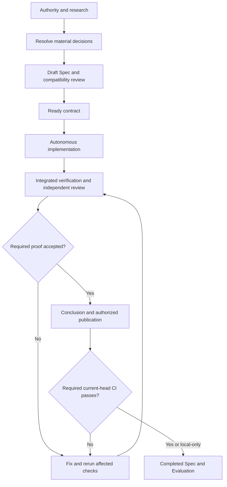

# Specification-driven development

Shifu uses SDD for changes to product behavior. Confluence owns product intent;
the repository Spec defines a bounded delivery contract against a known PRD
version. The agent organizes implementation and proves that contract using its
checkers. Evaluation records actual progress, evidence and delivery disposition.



## Applicability and authority

Create or revise a Spec when changing observable product behavior, domain rules,
public contracts, persistence semantics, cross-module events or user journeys.
Formatting, tooling upkeep, behavior-preserving refactoring and repairs covered
by an unchanged Spec may use direct maintenance. A discovered behavioral
choice requires contract reconciliation before the dependent work proceeds.

Before specifying a feature or implementing a contract in a fresh context:

1. read the nearest `AGENTS.md` files and this workflow;
2. resolve module ownership through [`modules.md`](modules.md) and system
   boundaries through [`architecture.md`](architecture.md);
3. use [`rules.md`](rules.md) to select and read the applicable Rule Pack;
4. inspect relevant manifests, tooling and infrastructure for actual commands;
5. read the complete canonical Confluence PRD through Atlassian Shifu MCP;
6. read applicable Jira, feature artifacts, designs and the user request.

Record the PRD URL, content ID, version, retrieval time and selected requirement
IDs in the Spec. Search excerpts cannot establish authority. Reuse complete
reads and repository facts already current in the same context; refresh affected
sources when scope expands, facts change or authority is uncertain. At conclusion,
verify source identity/version and reread changed content when reconciliation is
needed. A changed page version requires reconciliation; mark the Spec `stale`
until reconciled, and return it to `draft` if its contract changes.

| Module | Canonical PRD | Content ID |
| --- | --- | --- |
| Identity | [Confluence](https://joaogoliveiragarcia.atlassian.net/wiki/x/AYDyB) | `83001345` |
| Curriculum | [Confluence](https://joaogoliveiragarcia.atlassian.net/wiki/x/AQDzB) | `83034113` |
| Learning | [Confluence](https://joaogoliveiragarcia.atlassian.net/wiki/x/AYDzB) | `83066881` |
| Gamification | [Confluence](https://joaogoliveiragarcia.atlassian.net/wiki/x/AgDxB) | `82903042` |
| Intelligence | [Confluence](https://joaogoliveiragarcia.atlassian.net/wiki/x/AQD0B) | `83099649` |

| Authority | Governs |
| --- | --- |
| User request and decisions | Authorized outcome, scope and consequential choices. |
| Confluence PRD | Product outcomes, actors, rules and journeys. |
| Jira issue/report | Delivery scope and traceability. |
| Agent guidance, Architecture, Modules and Rules | Responsibilities, boundaries and conventions. |
| Design and saved references | Visual intent and permitted adaptations. |
| Tooling and manifests | Available commands, fixtures and execution schedule. |
| Spec | Selected behavior, technical commitments and required proof. |
| Evaluation | Actual progress, results, findings and delivery state. |
| Implementation | Evidence of current behavior, subject to governing authority. |

Before drafting, explain the proposed behavior, boundaries, runtime flow, failure
handling and verification. Compare viable approaches only for unresolved
consequential choices; scale discussion to risk. Apply the conversational
[grilling protocol](prompts/create-spec-prompt.md#grilling-protocol) in dependency
order. Resolve inspectable facts directly and never treat silence as approval.
Established decisions need no repeated confirmation. Record the selected approach
in the existing contract; no separate design or planning document is required.

A Spec selects delivery scope and testable interpretations; it does not copy the
PRD or create a second product backlog. Report conflicting sources. User-visible
behavior, permissions and scope cannot be silently changed to fit existing code
or make a test pass. Jira and Confluence writes require an explicit external
action request and follow `AGENTS.md`.

## Durable artifacts

```text
documentation/features/<module>/<feature>/
├── spec.md                 # contract and checkers
├── evaluation.md           # evidence, findings and current handoff
└── design/                 # saved references when material
    ├── handoff.md           # or an existing Spec-approved manifest.md
    └── references/
```

Use lowercase kebab-case module/feature slugs and the
[Spec](templates/sdd/spec.md) and [Evaluation](templates/sdd/evaluation.md)
templates. A materially different delivery slice gets a feature directory;
a bounded revision may live under `changes/<change-slug>/` when preserving an
original concluded contract is useful.

There is no separate `plan.md` or `create-plan` step. The agent handles execution
order, decomposition, dependencies and delegation in its working context.
Existing execution ledgers are preserved under `history/legacy-execution.md`
for audit only. Their phases, task trees and statuses are historical; they do
not gate resumed delivery. Resume from the current Spec, Evaluation and diff.

## Contract and checkers

Use exactly seven top-level sections in new Specs and structurally reconciled
active Specs:

| Section | Owns |
| --- | --- |
| Objective | Problem and intended outcome. |
| Scope | Included capabilities/actors and exclusions; full/partial/deferred RP scope. |
| Behavior Contract | Observable RF requirements, CA criteria and source traceability. |
| Technical Contract | Architecture Mapping and Runtime Flow. |
| Verification Contract | Automated, Manual and Visual checks and explicit pass conditions. |
| Documentation Alignment | Source/version metadata, selected Rules and required updates. |
| Revision History | Meaningful contract changes and reasons. |

Architecture Mapping uses `Action | Boundary | Element / Path | Required change`
with Create/Modify/Delete actions and actual affected Shifu layers. Describe
consequential public declarations in Python or TypeScript as appropriate, use-case
signatures, REST/schema compatibility, SQLAlchemy/Alembic invariants, widget/state
responsibilities, provider/composition wiring and event/job reliability where
affected. Reference existing declarations instead of copying unchanged contracts.
Include a scoped expected file tree only when paths clarify ownership, generated
outputs, registration or a consequential boundary; the mapping is sufficient
otherwise. Identify generated inputs and commands. Ordinary helper names and
internal decomposition remain implementation choices. Changes to those details
alone do not require a contract amendment or revision increment.

Runtime Flow explains interactions across those boundaries and relevant trusted
context, authorization, transactions, cache invalidation, side effects, failure,
recovery and concurrency guarantees. Use diagrams when they clarify the contract.

Verification defines one named check per distinct observable outcome, with exact
test paths/tools, commands, setup, input selection, CA mapping and pass condition.
Keep long commands/procedures outside tables. Mark absent tests as planned; never
invent executable selectors. Reference applicable baseline checks from Tooling and
Rules, including gates not directly mapped to a CA. Include explicit type, lint
and complexity check obligations/dispositions for the affected paths and consumer
projects under [Tooling](tooling.md#scoped-type-lint-and-complexity-checks). Keep
configured complexity lint distinct from quantitative metrics; missing required
tooling is blocked, not implicitly passed by other checks. Share source-backed setup for
readiness, actors/authentication, data relationships/initial state, isolated reruns
and cleanup. A service being up does not prove route/function registration or
an authenticated account's eligibility. No setup authorizes shared-data resets.

For design-backed UI, link a feature-local handoff/manifest identifying required
happy-path surfaces, states, viewports, references, criteria and accepted deviations.
Verify saved images exist and inspect them visually. Map affected widgets to
source-verified semantic tokens and actual primitive variants; keep preserved UI
outside the redesign scope. Use Pencil MCP only for encrypted `.pen` sources.
Implementation captures/traces belong in ignored browser/test output or CI
artifacts, linked from Evaluation rather than new feature-local evidence folders.

Use stable Shifu identifiers:

| Prefix | Meaning | Owner |
| --- | --- | --- |
| `RP-*` | Requisito de Produto | Confluence PRD |
| `JN-*` | Jornada | Confluence PRD |
| `RF-*` | Requisito Funcional | Spec |
| `CA-*` | Critério de Aceitação | Spec |
| `VM-*` | Validação Manual or Visual, with explicit type | Spec/Evaluation |
| `EV-*` | Evidência | Evaluation |
| `ACH-*` | Achado de revisão | Evaluation |
| `CI-*` | Quality gate automatizado | Spec/Evaluation |

Every RF maps to at least one RP; relevant JN IDs supply journey context.
Every CA maps to RF and concrete proof. Enumerated states, statuses, bounds or
transitions need explicit coverage; a sampled case proves only its sample.
Never invent product IDs, renumber existing identifiers or weaken checks to
make implementation pass. State an explicit non-applicable disposition when
appropriate. A command's exit code must be accompanied by evidence that the
intended tests actually ran; an empty selection or skipped suite is not a pass.

### Scale detail to delivery risk

A compact Spec covers one cohesive outcome with stable boundaries and low risk.
Keep all seven sections, but use brief scope, affected contracts and focused
checks; omit empty optional detail. A complete Spec adds the declarations,
consistency, migration, security and failure guarantees warranted by actual risk.
File count and section length do not determine completeness. Both modes retain
source traceability, observable acceptance and sufficient executable proof.

Mutation testing is a risk-based verification decision, not a blanket prerequisite
for every business-rule edit. Require targeted execution when it addresses a
concrete risk that warrants the additional proof; otherwise record the rationale
and the assertions that cover that risk. Runner availability alone must not
determine whether proof is necessary. Once a check is required, missing tooling
remains a blocker until the contract is explicitly reconciled; implementation
cannot downgrade it merely to reach readiness.

## Roles and lifecycle

The Orchestrator owns the Spec, Evaluation, shared decisions, integration and
official evidence. It may implement directly or delegate genuinely independent
scopes to bounded Builders. Builders change assigned code/tests and report
results without changing acceptance obligations. Ordinary planning and
coordination choices need no separate user approval or durable task ledger.

An independent Spec Reviewer checks architecture/module/Rule compatibility before
`ready`; keep the draft until blocking findings are resolved. That role returns
only for a material contract amendment, rechecking affected scope. For compact
Specs, keep that review bounded to the changed contracts and applicable Rules;
no extra report artifact, exhaustive file inventory or pre-implementation runtime
proof is required. An independent Implementation Reviewer assesses the integrated diff and acceptance proofs.
For design-backed UI, launch the Visual Reviewer in parallel on the same
candidate using existing required captures; add no third mandatory serial
review. Findings require concrete evidence and a mapped correction.

| Artifact | States |
| --- | --- |
| Spec | `draft` → `ready` → `implemented` → `completed`; `stale` during source reconciliation |
| Evaluation | `in_progress` → `ready` → `completed` |

Implementation progress lives in Evaluation while the ready contract remains
stable. `implemented` means the candidate has current accepted evidence and is
ready for conclusion. A correction reopens Evaluation; a changed contract
returns the Spec to `draft` and increments its revision after reconciliation.
Only the Orchestrator changes artifact statuses. Evaluation `ready` requires all
required proof to pass or have justified non-applicability, with no blocking
finding. Waived, failed, unavailable or stale required proof cannot yield readiness.
For authorized publication, completion additionally waits for applicable CI on
each current delivery PR head and resolution of blocking review conversations.
Local closure may complete without publication when it is not requested; record
that disposition explicitly rather than implying CI or publication occurred.

## Implementation and verification

Own the complete authorized implementation and verification loop. After every
correction, inspect all remaining check and finding obligations and continue with
the next actionable item. A follow-up about one check steers that work unless the
user explicitly narrows or cancels the objective. Handoff records an interruption
or genuine blocker; it does not replace executable remaining work.

Investigate local setup failures: service health/configuration, expired browser
state and source-defined fixtures/seed mismatches. Correct stale fixture source
within the contract and use disposable environments or isolated task-owned data.
Distinguish correcting seed source from applying a reset/reseed command; shared
data changes still require explicit authorization. Stop unfinished work only for
an explicit stop, unresolved material decision/authorization or an external
blocker after relevant diagnosis/recovery; finish independent work first.

1. Establish the ready contract; ask only about unresolved consequential
   product or technical choices. Resolve facts and routine choices directly.
2. Create/reconcile Evaluation and its current handoff. Implement within the
   contract, using focused unit/component and static checks for feedback.
   Record material findings and meaningful checkpoints, not every edit. Automated
   checks cover defined finite combinations; unbounded inputs use equivalence
   classes and boundaries. For changed business rules/correctness-critical logic,
   explicitly assess targeted mutation testing and document its disposition.
   If the contract requires it, specify scope, verified runner, pass conditions
   and treatment of surviving mutants. Unavailable execution remains blocked;
   ordinary tests/coverage cannot substitute. Do not install a runner incidentally.
3. Integrate all implementation scopes and generated artifacts. Perform any
   delivery-branch synchronization already authorized for conclusion before
   final integration validation. Preserve unrelated work and Git safety.
4. Run the Spec's affected server, browser and job integration selections against
   the integrated candidate, using exact files/scenarios and explicit CI-compatible
   fixtures. Select local tests only for scoped changes and directly affected
   consumers. Broaden only for demonstrated dependency impact or a concrete gap
   in that scope's proof; record the affected relationship and rationale. A full
   local suite requires scope spanning that suite or an explicit user request.
   Fix failures and rerun failed/affected selections until required checks pass.
   Required unavailable infrastructure remains a recorded blocker.
5. Execute required concise happy-path manual scenarios, capturing required
   visuals during those journeys. Automated tests cover negative, recovery,
   concurrency and unusual outcomes. Mocks cannot prove real authenticated,
   persisted or server-backed behavior. Stop task-started processes afterward.
6. Review code and required visuals independently in parallel. Reviewers use
   current checker results, inspect assertion coverage and identify missing
   evidence; they do not automatically start another integration run.
7. Fix in-contract findings autonomously. Rerun only invalidated checks and
   visual comparisons. Preserve passed evidence for unaffected behavior.
8. Conclude using accepted current evidence; do not repeat green suites merely
   because a role changes, a ledger is updated or conclusion starts.

A later implementation, fixture, configuration or source-contract change
reopens the checks whose claims/dependencies it affects. Record the changed
scope and retained evidence explicitly. A new commit hash alone does not
invalidate proof of unchanged behavior. A focused corrective pass does not turn
a historical failed full run into a passing full run or update its coverage
measurement. When an actual coverage command runs tests, avoid a duplicate
unchanged full test run. Additional broad reruns need a concrete
integration risk, affected shared dependency or discovered coverage gap.

## Evaluation and continuation

Use the [Evaluation template](templates/sdd/evaluation.md) with seven sections:
Current State, Progress, Check Results, Findings, Lessons Learned, Handoff and
Delivery. Progress records implementation separately from verification for every
CA, with its checks/evidence and remaining work. Check Results retains exact
commands/procedures, working directory, actual test selection, candidate/date,
environment/fixtures, observed results, artifact paths and limitations. Keep EV
IDs and failed/interrupted attempts; statuses are Pending, Passed, Failed, Blocked,
Stale and Not applicable. Baseline checks belong in the same record.

The Spec owns its revision; new Evaluation metadata does not duplicate it as
`spec_revision`. Result details identify the evaluated contract revision when
needed. Handoff records branch/candidate, completed/unfinished criteria, dirty
paths and ownership, task-started process sessions/ports, blockers and next action.
A continuing agent reconciles these facts with Git and the actual diff, then
chooses how to proceed without reconstructing a phase/task plan.

At conclusion, reconcile every selected RP through RF/CA to evidence, close
blocking findings, verify source metadata and record delivery disposition as
`implemented`, `partially_implemented`, `not_implemented` or `not_applicable`.
Preserve incomplete or waived evidence honestly; an explicit user waiver is
never a pass. Link Jira/PR when available without changing canonical product
requirements. Branches and commits retain the repository Jira-key convention.

## Legacy records and workflow sources

Concluded feature artifacts retain their historical contracts/results. On active
legacy continuation, reconcile sections and actual claims with the current
structure without blindly renumbering IDs or migrating old group passes into
individual passing checks. Preserve unique obligations and unresolved findings
from historical ledgers. Remove duplicated `spec_revision` metadata only after
reconciling its evidence with the Spec; retain historical revision scope in results.
Structural cleanup, status changes, reruns and conclusion do not increment the
Spec revision; behavior, consequential technical/design and verification changes do.

Canonical prompts live under `documentation/prompts/`; standalone templates live
under `documentation/templates/sdd/`. Change these authorities first, then run
`pnpm sync:commands` and, for role changes, `pnpm sync:agents`; inspect generated
outputs. Retired workflows must not remain in active generated registries.

Calibrate further workflow changes against an actual bounded delivery: can another
agent resume from Spec/Evaluation and the diff, reproduce required checks and
identify unmet acceptance without repeated clarification or broad reruns? Use
observed findings to justify revisions; no additional process ledger or gate is
required just to measure the workflow.

## Entry points

The [workflow prompts](prompts/) cover creation, implementation,
conclusion and feedback workflows. Prompts and generated skills inherit this
contract. Historical delivery records preserve their original facts; when
resuming, apply the current execution and evidence-reuse policy without
silently lowering product acceptance or required checker coverage.
