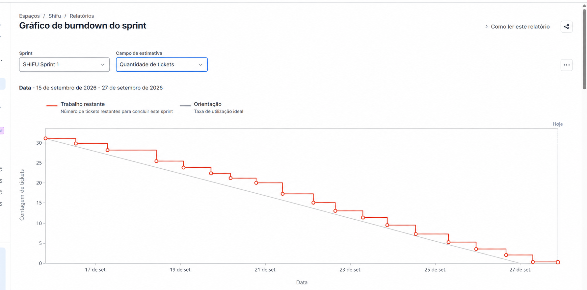

# Sprint 1 — Relatório de resultado

> **Período:** 15/09/2026 – 27/09/2026 (BRT)
> **Meta:** demonstrar o ciclo de aprendizagem de ponta a ponta: **Conta → Objetivo → Habilidade → Diagnóstico → Jornada inicial → Atividade → Resultado → Progresso**.

## Resumo executivo

O incremento da Sprint 1 cobre a fundação de conta, organização de Objetivos e Habilidades, conteúdo curricular, diagnóstico, recomendação inicial, prática, avaliação e visualização de progresso. A meta funcional registrada no backlog é um fluxo demonstrável com persistência real, usando Lógica de Programação como Habilidade de validação e sem depender de IA para concluir o caminho principal.

O solicitante confirmou que **todas as 11 User Stories e as 21 tasks foram concluídas**. Assim, o resultado funcional reportado é **32 de 32 tickets implementados (100%)**. No retrato do Jira consultado novamente em 27/09/2026, os estados operacionais ainda não refletem esse fechamento: **27 de 32** issues estão em `Concluído`, **4** em `Fazendo` e **1** em `Code Review`. As tabelas mantêm esses estados do Jira separados da conclusão funcional confirmada.

## Requisitos entregues

### Conta e sessão

- Cadastro, confirmação de e-mail, login, logout e recuperação de senha.
- Sessões associadas ao usuário e ações de encerramento de sessão.

### Objetivos e Habilidades

- Criação e edição manual de Objetivos.
- Inclusão e visualização de Habilidades independentes por Objetivo.
- Home de Objetivos, entrada para o Planejador e páginas do Objetivo em Lista e Grafo.
- Remoção de Habilidades e Objetivos com isolamento das experiências relacionadas.

### Currículo e aprendizagem

- Estrutura de domínio para Identity, Curriculum, Communication e Learning.
- Sequência de materiais e Atividades por Competência, páginas de detalhe e Material de apoio.
- Diagnóstico inicial por Habilidade, consolidação do ponto de partida e jornada recomendada.
- Atividades de escolha única, múltipla seleção e código; execução isolada de código e avaliação oficial.
- Progresso por Competência e resumo da Habilidade.

### Plataforma e operação

- Layout principal do web app, fluxos full-stack de Identity/Learning e rate limiting Redis.
- Workflows de CI e documentação de projeto e infraestrutura.

## User Stories comprometidas

As 11 histórias abaixo constam como compromisso da Sprint no [Backlog da Sprint 1 — Shifu](https://joaogoliveiragarcia.atlassian.net/wiki/spaces/Shifu/pages/84017153/Backlog+da+Sprint+1+Shifu). Os critérios estão resumidos a partir das descrições atuais do Jira.

| Chave | User Story | Épico | SP | Estado no Jira (consulta) |
| --- | --- | --- | ---: | --- |
| [SHIFU-31](https://joaogoliveiragarcia.atlassian.net/browse/SHIFU-31) | Cadastrar e confirmar conta | SHIFU-24 — Identidade e Conta | 5 | Concluído |
| [SHIFU-32](https://joaogoliveiragarcia.atlassian.net/browse/SHIFU-32) | Entrar, sair e recuperar senha esquecida | SHIFU-24 — Identidade e Conta | 5 | Fazendo |
| [SHIFU-34](https://joaogoliveiragarcia.atlassian.net/browse/SHIFU-34) | Criar e editar Objetivos manualmente | SHIFU-25 — Objetivos e Múltiplas Habilidades | 3 | Concluído |
| [SHIFU-35](https://joaogoliveiragarcia.atlassian.net/browse/SHIFU-35) | Adicionar e visualizar Habilidades independentes | SHIFU-25 — Objetivos e Múltiplas Habilidades | 3 | Concluído |
| [SHIFU-40](https://joaogoliveiragarcia.atlassian.net/browse/SHIFU-40) | Definir sequência curricular por Competência | SHIFU-27 — Currículo Completo | 3 | Concluído |
| [SHIFU-41](https://joaogoliveiragarcia.atlassian.net/browse/SHIFU-41) | Definir regras de avaliação e pesos | SHIFU-27 — Currículo Completo | 8 | Concluído |
| [SHIFU-16](https://joaogoliveiragarcia.atlassian.net/browse/SHIFU-16) | Realizar diagnóstico inicial por Habilidade | SHIFU-7 — Onboarding e Diagnóstico Inicial | 8 | Fazendo |
| [SHIFU-18](https://joaogoliveiragarcia.atlassian.net/browse/SHIFU-18) | Receber jornada inicial orientada pelo diagnóstico | SHIFU-9 — Jornada Inicial Orientada pelo Diagnóstico | 5 | Fazendo |
| [SHIFU-19](https://joaogoliveiragarcia.atlassian.net/browse/SHIFU-19) | Realizar Atividades práticas | SHIFU-10 — Atividades e Práticas | 5 | Concluído |
| [SHIFU-20](https://joaogoliveiragarcia.atlassian.net/browse/SHIFU-20) | Receber resultado oficial de uma Atividade | SHIFU-11 — Avaliação e Resultados | 8 | Concluído |
| [SHIFU-21](https://joaogoliveiragarcia.atlassian.net/browse/SHIFU-21) | Visualizar progresso por Competência e Habilidade | SHIFU-12 — Progresso | 5 | Concluído |

**Total comprometido:** 58 SP, alinhados à capacidade inicial de referência registrada para a Sprint. **Concluído no Jira:** 40 SP em 8 histórias; **18 SP** permanecem em três histórias com estado `Fazendo`.

## Critérios de aceitação por User Story

### SHIFU-31 — Cadastro e confirmação

- **Dado** que uma pessoa ainda não tem conta, **quando** informa nome, e-mail e senha válidos, **então** a conta é criada aguardando confirmação.
- **Dado** que o link de confirmação foi enviado, **quando** é usado dentro de 24 horas, **então** a conta é ativada; reenvio respeita o intervalo definido e invalida o link anterior.
- **Dado** que o e-mail já pertence a uma conta não excluída, **quando** há nova tentativa de cadastro, **então** a resposta não revela a existência nem o estado da conta.

### SHIFU-32 — Acesso e recuperação

- **Dado** que a conta está ativa, **quando** as credenciais são válidas, **então** as áreas protegidas são acessíveis; credenciais inválidas recebem resposta genérica.
- **Dado** que a pessoa esqueceu a senha, **quando** usa o link de recuperação dentro de uma hora, **então** define uma nova senha e os acessos antigos são encerrados.
- **Dado** que há sessões em mais de um dispositivo, **quando** a pessoa escolhe sair de todos, **então** todas as sessões são encerradas.

### SHIFU-34 — Objetivos manuais

- **Dado** que o usuário informa título e descrição, **quando** cria um Objetivo, **então** ele é salvo mesmo sem Habilidades.
- **Dado** que um Objetivo existente é editado, **quando** título ou descrição mudam, **então** Habilidades e progresso são preservados.
- **Dado** que o Objetivo está vazio, **quando** é visualizado, **então** há uma ação para adicionar Habilidade.

### SHIFU-35 — Habilidades no Objetivo

- **Dado** que existe um Objetivo, **quando** uma Habilidade do Currículo é adicionada, **então** uma experiência independente começa como não iniciada.
- **Dado** que a Habilidade já existe no Objetivo, **quando** há nova tentativa de inclusão, **então** a experiência existente é apresentada sem duplicação.
- **Dado** que o Currículo relaciona Habilidades, **quando** o Objetivo é mostrado, **então** essas relações servem como contexto e não como bloqueios de acesso.

### SHIFU-40 — Sequência curricular

- **Dado** que uma Competência possui materiais e Atividades, **quando** sua sequência é consultada, **então** a ordem editorial definida é retornada igualmente para todos.
- **Dado** que um material serve a mais de uma Competência, **quando** é referenciado, **então** o mesmo conteúdo é reaproveitado.
- **Dado** que há Atividades diagnósticas, **quando** a sequência de estudo é montada, **então** elas permanecem separadas das Atividades de aprendizagem.

### SHIFU-41 — Regras de avaliação

- **Dado** que uma Atividade de código foi cadastrada, **quando** sua avaliação é definida, **então** seus casos de teste ficam especificados.
- **Dado** que uma Atividade combina casos e critérios qualitativos de IA, **quando** os pesos são definidos, **então** a composição fecha em 100%.
- **Dado** que a questão é de escolha única, **quando** é avaliada, **então** aplica resultado binário; Learning permanece responsável por calcular e registrar o resultado oficial.

### SHIFU-16 — Diagnóstico inicial

- **Dado** que uma Habilidade ainda não foi iniciada, **quando** o usuário começa sua experiência, **então** é direcionado ao diagnóstico isolado daquela Habilidade no Objetivo.
- **Dado** que o diagnóstico é interrompido, **quando** o usuário retorna, **então** começa uma nova execução pela primeira Atividade e dados da execução interrompida não compõem o resultado.
- **Dado** que a pessoa tenta sair antes de concluir, **quando** confirma a saída, **então** é informada sobre a perda do avanço.
- **Dado** que a avaliação falha temporariamente, **quando** é reprocessada, **então** usa a mesma resposta enviada sem permitir edição ou nova chance.
- **Dado** que todas as questões foram respondidas, **quando** o resultado é consolidado, **então** cada Competência recebe ponto de partida e a Habilidade avança conforme as regras de Learning.
- **Dado** que o diagnóstico não foi concluído, **quando** o usuário tenta acessar conteúdo de aprendizagem, **então** o conteúdo permanece indisponível.

### SHIFU-18 — Jornada inicial

- **Dado** que o diagnóstico foi concluído, **quando** a Habilidade é acessada, **então** o usuário vê uma Competência em foco e uma Atividade recomendada.
- **Dado** que há mais de uma Competência que precisa de prática, **quando** o foco é escolhido, **então** considera o diagnóstico e a sequência oficial do Currículo.
- **Dado** que há uma Atividade disponível, **quando** a jornada é exibida, **então** ela pode ser iniciada diretamente; se não houver, o sistema explica a lacuna sem inventar conteúdo.
- **Dado** que o diagnóstico conclui a Habilidade, **quando** o resultado é mostrado, **então** não há prática obrigatória recomendada.

### SHIFU-19 — Prática

- **Dado** que uma Atividade está disponível, **quando** é aberta, **então** apresenta enunciado, instruções e formato de resposta do Currículo.
- **Dado** que a resposta é válida e enviada, **quando** o sistema recebe a submissão, **então** registra uma tentativa imutável para avaliação.
- **Dado** que uma resposta não foi enviada, **quando** o usuário sai da tela, **então** ela não vira tentativa oficial.
- **Dado** que a avaliação falha, **quando** a pessoa retorna, **então** a tentativa é preservada e pode ser reprocessada sem novo envio.
- **Dado** que a Atividade já tem resultado, **quando** é realizada novamente, **então** uma nova tentativa é criada sem alterar as anteriores.

### SHIFU-20 — Resultado oficial

- **Dado** que uma tentativa de escolha única foi enviada, **quando** é avaliada, **então** o resultado segue a alternativa oficial.
- **Dado** que uma solução de código foi enviada, **quando** é avaliada, **então** o resultado considera os casos de teste configurados.
- **Dado** que existem critérios qualitativos de IA, **quando** são processados, **então** Learning consolida um único resultado com os pesos definidos.
- **Dado** que parte da avaliação falha, **quando** a tentativa é consultada, **então** permanece pendente e não publica resultado parcial como definitivo.
- **Dado** que a avaliação oficial termina, **quando** o resultado é salvo, **então** pode atualizar progresso e emitir fatos autorizados para Gamification sem perder a autoridade de Learning.

### SHIFU-21 — Progresso

- **Dado** que há resultados oficiais, **quando** o usuário acessa o progresso, **então** vê o valor atual por Competência.
- **Dado** que uma nova avaliação termina, **quando** o progresso é recalculado, **então** tentativas repetidas não o inflam artificialmente.
- **Dado** que a Habilidade está em aprendizagem, **quando** seu resumo é consultado, **então** mostra progresso, foco atual e próximo passo disponível.
- **Dado** que ainda não existem avaliações suficientes, **quando** a Competência é exibida, **então** apresenta um estado inicial compreensível.
- **Dado** que o usuário consulta progresso pedagógico, **quando** também vê Gamification, **então** XP, nível e sequência permanecem separados do domínio.

## Tasks realizadas

O Jira contém 21 tasks técnicas/lógicas na Sprint. Todas foram reportadas como concluídas. A coluna de estado registra o Jira no momento da consulta; SP não foi preenchido no campo de estimativa consultado para essas tasks.

| Chave | Task | Responsável | Estado no Jira (consulta) |
| --- | --- | --- | --- |
| [SHIFU-56](https://joaogoliveiragarcia.atlassian.net/browse/SHIFU-56) | Criar documentação e arquivo de design do projeto | Thigz | Concluído |
| [SHIFU-57](https://joaogoliveiragarcia.atlassian.net/browse/SHIFU-57) | Configurar workflows de CI para cada aplicação | gabrielsoliveira1606 | Concluído |
| [SHIFU-58](https://joaogoliveiragarcia.atlassian.net/browse/SHIFU-58) | Implementar rate limiting Redis no Shifu Server | Kauan Fonseca | Concluído |
| [SHIFU-59](https://joaogoliveiragarcia.atlassian.net/browse/SHIFU-59) | Criar documentação da arquitetura de infraestrutura | gabrielsoliveira1606 | Concluído |
| [SHIFU-60](https://joaogoliveiragarcia.atlassian.net/browse/SHIFU-60) | Implementar Home de Objetivos e entrada do Planejador | Kauan Fonseca | Concluído |
| [SHIFU-61](https://joaogoliveiragarcia.atlassian.net/browse/SHIFU-61) | Implementar cadastro e confirmação de conta full-stack | gabrielsoliveira1606 | Concluído |
| [SHIFU-62](https://joaogoliveiragarcia.atlassian.net/browse/SHIFU-62) | Implementar login full-stack e criação de sessão | João Pedro Carvalho | Concluído |
| [SHIFU-63](https://joaogoliveiragarcia.atlassian.net/browse/SHIFU-63) | Implementar recuperação e redefinição de senha full-stack | gabrielsoliveira1606 | Code Review |
| [SHIFU-64](https://joaogoliveiragarcia.atlassian.net/browse/SHIFU-64) | Implementar página de Objetivo com Grafo e Lista | João Gabriel | Concluído |
| [SHIFU-65](https://joaogoliveiragarcia.atlassian.net/browse/SHIFU-65) | Implementar adição full-stack de Habilidade com bases sugeridas | Kauan Fonseca | Concluído |
| [SHIFU-66](https://joaogoliveiragarcia.atlassian.net/browse/SHIFU-66) | Implementar experiência full-stack da Habilidade em aprendizagem | Thigz | Concluído |
| [SHIFU-67](https://joaogoliveiragarcia.atlassian.net/browse/SHIFU-67) | Implementar remoção atômica de Objetivo e experiências | Kauan Fonseca | Concluído |
| [SHIFU-68](https://joaogoliveiragarcia.atlassian.net/browse/SHIFU-68) | Implementar remoção full-stack de Habilidade do Objetivo | João Gabriel | Concluído |
| [SHIFU-69](https://joaogoliveiragarcia.atlassian.net/browse/SHIFU-69) | Implementar menu da conta e logout da sessão atual | gabrielsoliveira1606 | Concluído |
| [SHIFU-70](https://joaogoliveiragarcia.atlassian.net/browse/SHIFU-70) | Implementar layout principal compartilhado do web app | João Pedro Carvalho | Concluído |
| [SHIFU-71](https://joaogoliveiragarcia.atlassian.net/browse/SHIFU-71) | Implementar objetos de domínio de Identity, Curriculum, Communication e Learning | João Pedro Carvalho | Concluído |
| [SHIFU-72](https://joaogoliveiragarcia.atlassian.net/browse/SHIFU-72) | Implementar experiência full-stack de detalhe da Competência | João Pedro Carvalho | Concluído |
| [SHIFU-73](https://joaogoliveiragarcia.atlassian.net/browse/SHIFU-73) | Implementar experiência full-stack de Material de apoio | Thigz | Concluído |
| [SHIFU-74](https://joaogoliveiragarcia.atlassian.net/browse/SHIFU-74) | Implementar questões de escolha única e múltipla seleção | João Pedro Carvalho | Concluído |
| [SHIFU-75](https://joaogoliveiragarcia.atlassian.net/browse/SHIFU-75) | Implementar questões de código em Atividades de aprendizagem | João Pedro Carvalho | Concluído |
| [SHIFU-77](https://joaogoliveiragarcia.atlassian.net/browse/SHIFU-77) | Implementar diagnóstico inicial completo por Habilidade | João Pedro Carvalho | Fazendo |

## Métricas de fechamento

| Métrica | Resultado observado |
| --- | ---: |
| Tickets na Sprint | 32 |
| Tickets implementados e concluídos, conforme confirmação do solicitante | 32 de 32 (100%) |
| User Stories concluídas, conforme confirmação do solicitante | 11 de 11 (100%) |
| Tasks técnicas/lógicas concluídas, conforme confirmação do solicitante | 21 de 21 (100%) |
| Tickets em `Concluído` no Jira | 27 de 32 (84,4%) |
| Tickets em `Fazendo` no Jira | 4 |
| Tickets em `Code Review` no Jira | 1 |
| User Stories | 11 |
| User Stories em `Concluído` no Jira | 8 de 11 |
| Tasks técnicas/lógicas em `Concluído` no Jira | 19 de 21 |
| Capacidade inicial de referência | 58 SP |
| Story Points comprometidos | 58 SP |
| Story Points implementados, conforme confirmação do solicitante | 58 SP |
| Story Points em histórias `Concluído` no Jira | 40 SP |
| Story Points em histórias ainda `Fazendo` no Jira | 18 SP |

## Gráfico Burndown

O gráfico do Jira usa **Quantidade de tickets** e mostra a curva de trabalho restante chegando a zero em 27/09/2026. A consulta direta às issues feita em 27/09 ainda mostra cinco tickets fora do estado `Concluído`; portanto, a evidência do burndown e os estados atuais das issues devem ser reconciliados ao sincronizar o fechamento no Jira.

## Riscos e observações para o fechamento

- Sincronizar os estados de SHIFU-16, SHIFU-18, SHIFU-32, SHIFU-63 e SHIFU-77 no Jira com a conclusão funcional confirmada e o fluxo de revisão.
- O resultado demonstrável definido no backlog deve ser validado ponta a ponta com persistência real: conta, Objetivo, Habilidade, diagnóstico, jornada, Atividade, resultado e progresso.
- A página [Backlogs — Evidência de Avaliação API](https://joaogoliveiragarcia.atlassian.net/wiki/spaces/Shifu/pages/85229570/Backlogs+Evid+ncia+de+Avalia+o+API) ainda contém campos de resultado da Sprint como “A preencher”.
- Esta página local resume os critérios atuais do Jira e não substitui os PRDs canônicos, as evidências de validação ou a atualização autorizada das páginas do Confluence.

## Fontes

- [Backlog da Sprint 1 — Shifu](https://joaogoliveiragarcia.atlassian.net/wiki/spaces/Shifu/pages/84017153/Backlog+da+Sprint+1+Shifu), versão 3, consultado em 27/09/2026.
- [Backlogs — Evidência de Avaliação API](https://joaogoliveiragarcia.atlassian.net/wiki/spaces/Shifu/pages/85229570/Backlogs+Evid+ncia+de+Avalia+o+API), versão 1, consultado em 27/09/2026.
- Jira: issues do projeto Shifu na Sprint 1 (`Sprint = 497`), consultadas em 27/09/2026.
